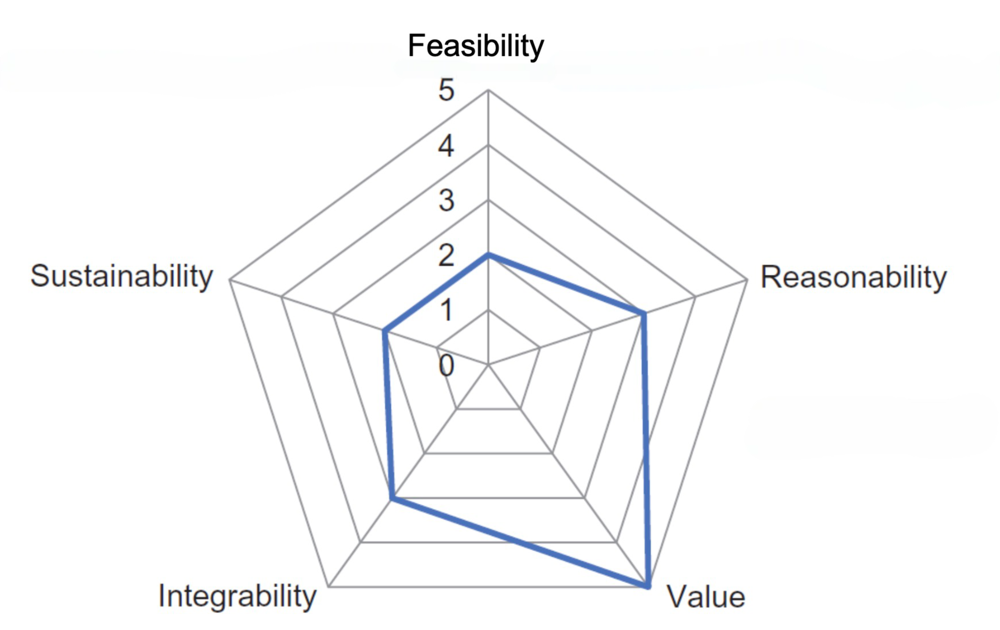

### Business Drivers
While many companies still are in the *first wave* of data management, there are some *buisness drivers* which drive a company to the *third wave*, or big data management.

These include:
* Increased data volumes being captured and stored.
* Rapid acceleration of data growth.
* Increased data volumes pushed into the network.
* Growing variation in types of data assets for analysis.
* Alternate and unsynchronized methods for facilitating data delivery.
* Rising demand for real-time integration of analytical results.

Let's look at these in more detail.

#### Increased data volumes being captured and stored
In recent years, amount of information created and replicated has grown tenfold in few years.

Such scale of this growth has surpassed the reasonable capacity of traditional relational database management systems,
or even typical hardware configurations supporting file-based data access.

#### Rapid acceleration of data growth
From 2005 to 2020, the digital universe has grown by a factor of **300**, from 130 **exa**bytes to 40 000 **exa**bytes (10^18 bytes).

The digital universe is about double every two years.

#### Increased data volumes pushed into the network
In 2016, annual global IP traffic was 1.3 zettabytes (10^21 bytes).

The increase is driven by:
* Increasing number of smartphones, tablets and other internet-connected devices.
* Growing community of internet users.
* Increased internet bandwidth and speed offered by telecommunications carriers.

#### Growing variation in types of data assets for analysis
Increasing popularity and importance of unstructured data (e.g. social media data that merges text, images, audio and video content).

To extract such data, enterprises must enhance their existing structured data management approaches to accommodate semantic text and content-stream analytics.

#### Alternate and unsynchronized methods for facilitating data delivery
Today, data publication and exchange is full of unpredictable peaks and valleys with data coming from a broad spectrum of connected sources.
E.g. websites, transaction processing systems, open data feeds, social media networks, etc.

This creates new pressures for rapid acquisition, absorption, analysis while retaining currency and consistency across different datasets

#### Rising demand for real-time integration of analytical results
There is a big growth of demand in companies where end-to-end business processes are augmented to fully integrate analytical models to optimize performance.

E.g. real-time fraud detection, real-time recommendation engines, real-time customer segmentation, etc.

### Big Data Application Areas
* Business intelligence (BI), querying, reporting, searching:
    - Searching, filtering, indexing, speeding up aggregation for reporting, trend analysis, search optimization, information retrieval.
* Improved performance for common data management operations:
    - Log storage, data storage and archiving, sorting, running joins, **e**xtraction / **t**ransformation / **l**oading (**ETL**), data conversion, duplicate analysis and elimination.

* Non-database applications:
    - Image processing, text processing, genome sequencing, protein sequencing, structure prediction, web crawling, monitoring work flow processes.

* Data mining and analytical applications:
    - Social network analysis, facial recognition, profile matching, text analytics, web mining, machine learning, information extraction, personalization, recommendation analysis, ad optimization, behavior analysis.

### Industries propelled by Big Data Analytics
* Public Sector Services.
* Healthcare contributions.
* Learning Services.
* Insurance Services.
* Industrialized and Natural Resources.
* Transportation Services.
* Banking Sectors and Fraud Detection

### Considerations before using Big Data Analytics
However, before a company can fully utilize big data analytics, it must consider the following:
* Feasibility
* Reasonability
* Value
* Integrability
* Sustainability

Let's look at these in more detail.

#### Feasibility
Is the enterprise *aligned* in a way that allows for new and emerging technologies to be brought into the organization, tested out, and vetted without overbearing bureaucracy?

What steps can be taken to create an environment that is *suited* to the introduction and assessment of innovative technologies?

#### Reasonability
Have you considered whether your organization faces business challenges whose resource requirements *exceed* the capability of the existing or planned environment?

Do you anticipate that the environment will *change* in the near-, medium- or long-term to be more data-centric and require augmentation of the resources necessary for analysis and reporting?

#### Value
Expectation that the resulting *quantifiable* value that can be enabled as a result of big data *warrants the resource and effort investment* in development and productionalization of the technology?

#### Integrability
It means *ability* for systems *integration*

Are there any constraints or impediments within the organization from a technical, social, political perspective that would prevent the big data technologies from being fully integrated as part of the operational architecture?

What steps need to be taken to evaluate the means by which big data can be integrated as part of the enterprise?

#### Sustainability
How would you plan to fund *continued* management and maintenance of a big data environment?

### Organizational Fitness
Trap of big data:
* It is *feasible* within the organization but does not necessarily mean it is *reasonable*.

Because of the above issues, the initial task should evaluate the organization’s fitness as a combination of the five factors mentioned, i.e. feasibility, reasonability, value, intergrability, and sustainability.

A framework is recommended for determining a score for each of these factors ranging from 0 (lowest) to 5 (highest) and presented in a radar chart.

### Adoption Criteria of Big Data Applications
Use Big Data Analytics for problem-solving when there is or are such phenomenon:
* Data throttling
    - As a result of data accessibility, data latency, data availability, bandwidth limits
* Computation-restricted throttling:
    - More powerful computational performance
* Large data volumes
* Significant data variety:
    * Unstructured data
* Benefits from data parallelization:
    - Because of reduced data dependencies
