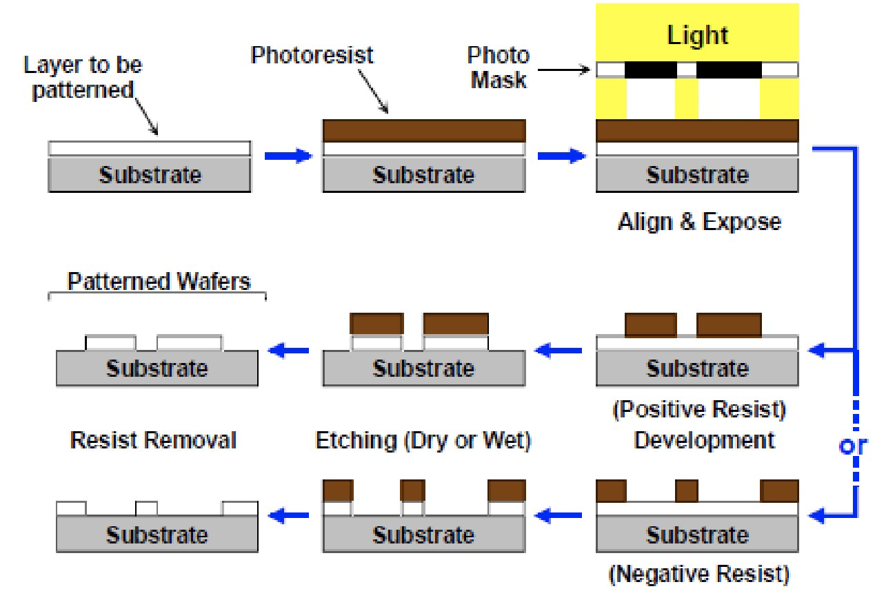
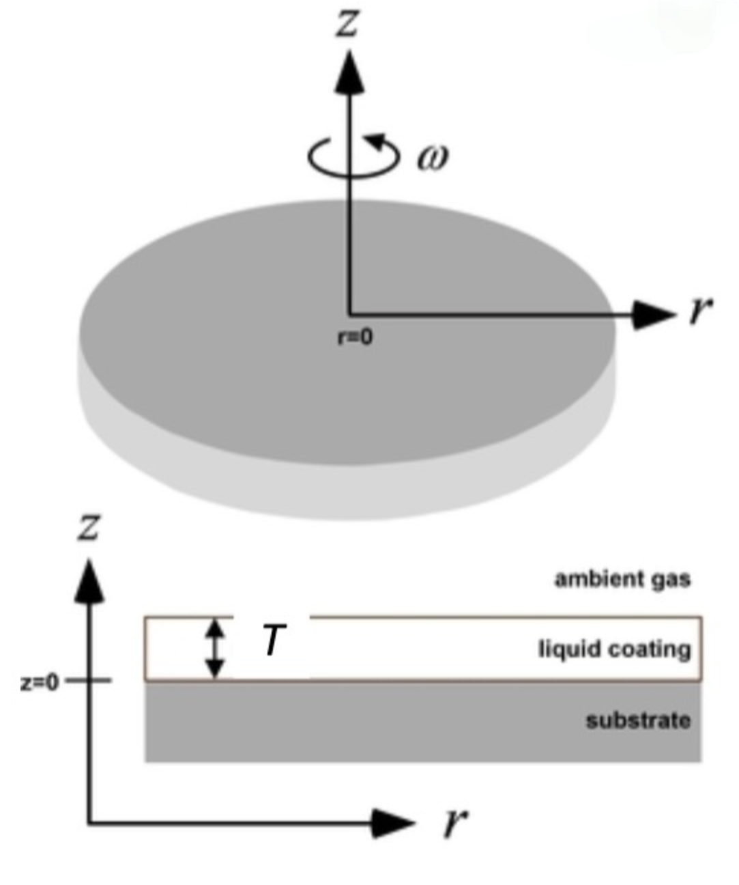

### History of Integrated Circuits (ICs)
* 1940s: Development of radio technology and long-distance telephony
    - Created demand of signal amplification.
* 1947: Point-contact transistor.
* 1949: Single-crystal silicon.
* 1960: Planar Process.
* 1960s: Metal-Oxide-Semiconductor Field-Effect Transistor (MOSFET).
* 1970s Microprocessors.
* 1980-2000: Constant miniaturization.
    - Large-Scale Integration (LSI), Very Large-Scale Integration (VLSI), Ultra Large-Scale Integration (ULSI)...

### Ultraviolet (UV) Exposure
The mask is the same size and scale as the printed wafer pattern, i.e. the reproduction ratio is 1:1.

#### Conventional Photoresis
Photoresists (PR) generally consist of 3 parts:
1. **Resin**:
    - Solid-type compound, providing mechanical properties.
2. **Solvent**:
    - Liquid-type chemicals for keeping the resin to a solution state.
3. **Photoactive Compound (PAC)**:
    - A photoactive compound to inhibit (negative PR) or promote (positive PR) the dissolution of the resin in the developer.
    Most positive resists are based on Diazoquinones (DQ).

#### Contrast Ration
To characterize the PR's ability to distinguish the light or dark,
$$
\gamma = \frac{1}{\log(E_f) - log(E_i)} = \frac{1}{\log\left(\frac{E_f}{E_i}\right)}
$$

where, $\gamma$ is the slope and $E = I \cdot t$. Typically, $\gamma$ is between 2 and 4.

#### Resist Polarity
* Positive Resist:
    - Light weakens resist, creates holes (dissolve PR without exposure).
* Negative Resist:
    - Light toughens resist, creates etch resistant masks.

    

#### Photolithography Process
* Substrate Cleaning (eg. RCA process).
    - To promote adhesion, reproducibility, etc.
* Spin Coating on Wafer
    - Adhesion promoting film (HMDS) for wafer priming (sometimes optional).
    - Photoresist coating.
* Soft Bake
    - Drive off excess solvent to set resist (and improve adhesion).
* Exposure
* Post Exposure Bake
    - Sometimes needed to redistribute photo-generated chemicals.
* Development
    - Use a chosen solvent as the 'developer' to remove:
        - UV-exposed regions for positive photoresist.
        - Unexposed regions for negative photoresist.
* Clean, Dry and Hard Bake
    - Remove residue and toughen resist (optional).

### Substrate Cleaning
It is very important to clean the substrate before any processing.
Contamination can destroy the device. A single defect in a circuit or MEMS structure can cause the whole chip to fail.
It will also lead to lower yield of chips with sufficient quality, and therefore higher costs per chip.
The equipment might be contaminated and removed from the production line, costing even more money.

#### Types of Contamination
* Particles:
    - Inorganic dust (metallic, silicon, glass, quartz, etc.).
    - Organic dust (dried skin, hair, clothing fibers, makeup, bacteria, etc.).
* Films
    - Residues (oil, grease, finger prints, incomplete etch, etc.).
    - Solvent residues (acetone, IPA, etc.), photoresist developer residue, inadequate rinsing, water stains, etc.
* Oxides
    - Grown by thermal, chemical, or electrochemical processes.

#### Contamination Sources
* Nature dusts
* Humans
    - **Cause most of the contamination**.
    - Dirt, oils, etc. tracked into labs on shoe soles.
    - Bodies continuously exfoliate skin, replace hair, etc.
    - Widespread use of makeup, perfume, hair gels, etc.
    - Use of mechanical tweezers.
    - Scratch and chip wafer edge and surface.
* Machines
    - Abrasion during automated wafer handling.
    - Mechanical mechanism wear and lubrication.
    - Aging plastic and rubber parts.

##### HEPA Filter
* **H**igh **E**fficiency **P**articulate **A**ir filter.
    - Most common type of clean room filter.
    - High efficiency, low pressure drop, good loading characteristics.
    - Uses glass fibers in a paper-like medium.
    - Are rated by their particle retention. By definition, will retain 99.97% of particles 0.3 microns in diameter.

#### Cleaning Methods
* Particulate Removal
    - Blow off using a spray of high pressure nitrogen.
    - Spray of deionized water (+ detergent if necessary).
* Organic Residue Removal
    - Contaminants that contain carbon, e.g. oil from fingerprints.
    - Can be removed using solvent baths such as alcohol or acetone, followed by rinsing with isopropanol and water.
* Inorganic Residue Removal
    - Contaminants that do not contain carbon.
    - A variety of solution can be used, sulfuric acid, sulfuric acid + hydrogen peroxide (Piranha cleaning).
    - Hydrofluoric (HF) acid is often used to remove the oxide.

### Spin Coating
Spin coating is a procedure used to apply uniform thin films to flat substrates.

#### Primer and Photoresist Application
Deposition methods:
* Spin on
    - Most common method.
    - Liquid is dispensed onto the center of the wafer.
    - Wafer is spun at high speed.
    - Centrifugal force spreads the liquid over the wafer.
* Spray on
    - Liquid is sprayed onto the wafer.
    - Wafer is spun at high speed.
    - Centrifugal force spreads the liquid over the wafer.
* Plate on
    - Liquid is poured onto the wafer.
    - Wafer is spun at high speed.
    - Centrifugal force spreads the liquid over the wafer.

#### Wafer Primer
A pre-resist coating to promote the adhesion of the resist to the substrate and reduce the amount of lateral etching or undercutting.

Intermolecular bonding with both the resist and the substrate surface onto which it is applied.

The most common primer is **HMDS (Hexamethyldisilazane)**. $\text{CH}_3$ group left outside which keep hydrophobic resisting wet etching.

#### Spin-coating
$$
T = \frac{KP^2}{\sqrt{\omega}}
$$

where, $T$ is the thickness of the film, $K$ is the spin coater constant, $P$ is the percentage of solids in the photoresist (relative to viscosity), and $\omega$ is the spin coater rpm/1000.

### Artifacts in Spin Coating
* Striations
    - Variations in resist thickness, radially out from center of wafer.
    - Due to non-uniform drying of solvent during spin coating.
- Streaks
    - Radial patterns caused by hard particles whose diameter are greater than the resist thickness.

### Artifacts in Exposure
Diffraction and over/under development lead to non-ideal cross-sections.

Mask defects can also cause defects in the final product.
Dust, scratches, and pinholes can all cause defects.

Standing waves in resits can cause non-uniformity in the resist thickness.

Front to back surface (substrate reflections in resists can create standing wave patterns that alter scallop the resist edges.

### Artifacts in Development
Quantify line & gap width, line and gap width may vary, but spatial period = layout.

Under/over development can cause non-ideal cross-sections.
