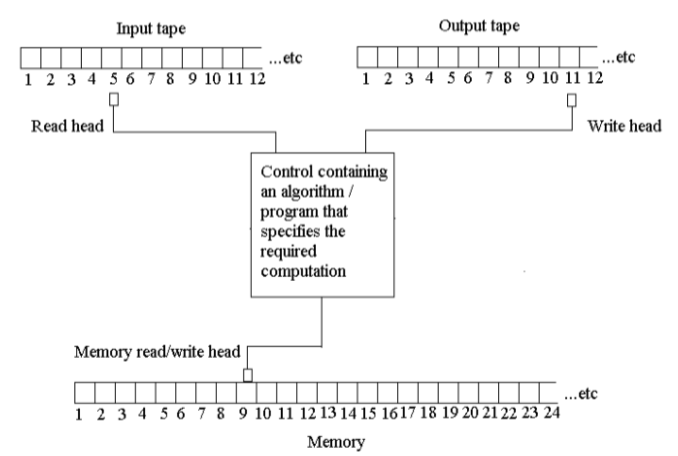
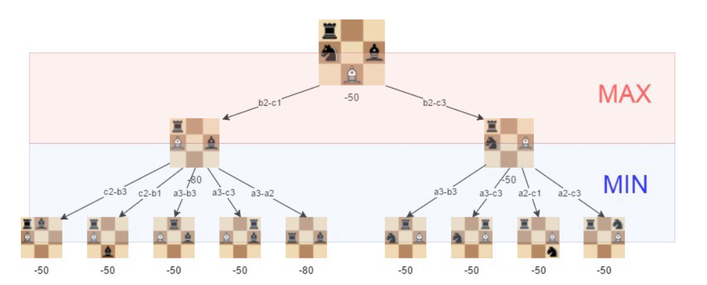

## Computer Science and early AI
Let's start with some history.

In 1936, Alan Turing published a paper called **"On Computable Numbers, with an Application to the Entscheidungsproblem"** @cite:turing1936.
This paper is considered the foundation of computer science.
In it, Turing describes a theoretical machine &mdash; which Turing called an "a-machine" &mdash; that can read, write, and move on an infinite tape.
This machine is now known as the **Turing machine**.

From this the main insight of computer science was born, the **Church-Turing thesis**.

:::note[Church-Turing Thesis]
Any function that can be computed by an algorithm can be computed by a Turing machine.
:::

The paper was well-received and Turing was invited to the United States to realize his machine.

Turing helped realize his machine, but he also published a very important paper in 1950 called **"Computing Machinery and Intelligence"** @cite:turing1950.

Turing introduced (the now famous) **Turing test**.
The test is a measure of a machine's ability to exhibit intelligent behavior equivalent to, or indistinguishable from, that of a human.

From this comes a very famous quote,

> "I believe that at the end of the century the use of words and general educated opinion will have altered so much that one will be able to speak of machines thinking without expecting to be contradicted" &mdash; Alan Turing *Computing Machinery and Intelligence (1950)*

While it is hard to say exactly when the field of AI was born, Turing definitely played a big part in its creation and development.

> "Every aspect of learning or any other feature of intelligence can in principle be so precisely described that a machine can be made to simulate it.
An attempt will be made to find how to make machines use language, form abstractions and concepts, solve kinds of problems now reserved for humans, and improve themselves.
We think that a significant advance can be made in one or more of these problems if a carefully selected group of scientists work on it together for a summer." &mdash; John McCarthy *Dartmouth Workshop (1956)*

AI was rapidly developed in the 1950s and 1960s.
It even had some early success, for example with games like chess, where the rules are clear and the number of possible moves is limited ::margin[Although enumerating all possible chess games was computationally infeasible at the time (and still is).].

However, AI had failure with much of the rest.

There are two cases which AI can hit,

1. The problem is hard to write rules and constraints for.
2. The problem can be written in rules and constraints, but it is infeasible to solve.

Consider the case as shown in @fig:dg, it is difficult to write rules for what a dog looks like.

In parallel to Turing, McCarthy and others efforts in AI, the field of **computer science** was also developing with the invention of the Turing machine.

**Basic computing** took off and solved basic problems with sophisticated technology (word processing, spreadsheets, networking, etc.).

Of course the need for **advanced computing** also grew.
A mix of human insight and data; prior knowledge (math, physics, etc.) to implement a solution reliant on data (simulation, optimization, etc.).

It is no surprise that the field of AI and computing slowly began to merge and find common problems to solve.
**Classical rule-based AI** relies on human insight to write rules and constraints and computer power to solve them.

From this a lot of other interdisciplinary fields emerged (e.g. **data science**, **machine learning-based AI**, etc.).

However, it is worth noting that, **data science** is a field that investigates to understand data and predict (new) data.
While AI is a field that works with systems that perform "intelligent" tasks.

Below are some traditionally seen "AI methods" @cite:russellnorvig2020,

* Problem-solving ($\approx$ search)
    - Search
    - Local search
    - Adversarial search (e.g., games)
    - Constraint satisfaction (CSP)
* Knowledge, reasoning, and planning
    - Propositional logic
    - First-order logic
    - Inference
    - Planning/acting
    - Knowledge representation
* Uncertain knowledge and reasoning
    - Probability distribution and Bayes theorem
    - Bayesian networks (= graphical models)
    - Inference
    - Markov chain and sequential decision-making
    - Utility theory
    - Game theory
* Learning
    - Learning from examples (decision trees, neural networks, support vector machines)
    - Learning logical models
    - Learning probabilistic models
    - Reinforcement learning
* Communicating, perceiving, and acting
    - Natural language processing (NLP)
    - Image recognition
    - Robotics

## Summary
When we talk about AI today, we often include *many different forms of advanced computing*.

Therefore, when **modelling** (AI) problems, we need to consider if advanced or basic computing is needed and how we should handle our data (statistical and data science approach or AI approach).
**Different applications require different approaches**.

> It all begins with creating models based on our data and problems.
