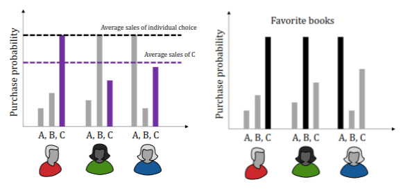
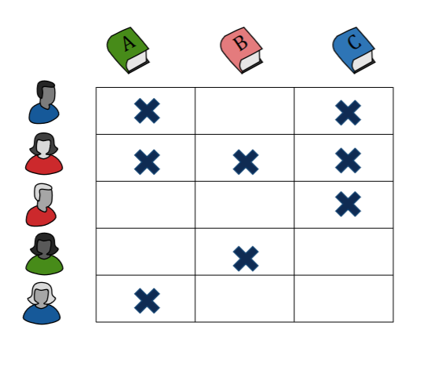

## Introduction
Recommender systems are used (all over the internet) to serve ads, suggest purchases, rank posts on social media and much more.

Imagine you're running a book web store (totally not an example of Amazon).
You have a catalogue of 100 000 books which we need to display to our users.

**Which books should you display in order to maximize sales?**

## The uniform strategy
A traditional strategy is to display books that sell well overall or the books that are on sale.

**On average**, these books are likely to sell, but not to every user.

Can we do better?

**Note**, if you can't interact with your users then this is the best strategy (probably).

## The personalized strategy
Recommender systems try to personalize the display policy, each user is assigned **their own** recommendations.

### Why is the individual preferable?
Say that the probability of buying a book (can be different books for different users) is 60%.
The average sales of any **single** book (probably) is lower than 60%.

But, how do we figure out users' preferences, and how do we distinguish between users?

To **distinguish** between users, we must know something about them.
We could **ask them directly** what they like, but this is not always a good indicator of what they *actually* like.

However, we can collect data **passively** and make our own judgment.

For example, a book web store needs to collect purchase logs (which is high-dimensional data, time, price, book, etc.).

Based on our logs, we can try to **predict** future purchases (given certain parameters).

**Recommender systems attempt to solve this problem**.

## Objectives & Proxies
Let's define our **objective**, our objective can look a lot different, depending on **who and why a recommender system is needed**.
But an objective should encapsulate **what we want to achieve** from our system, it should also be subject of evaluation, are we doing well?

### Delayed objectives
However, some objectives are **delayed** (long-term) and are hard(er) to optimize directly.

They are often hard to,

1. Specify &mdash; e.g., user engagement, how do we define engagement?.
2. Measure &mdash; e.g., user satisfaction, how do we measure satisfaction?.
3. Optimize &mdash; e.g., causation, profit is multivariate and hard to optimize.

Let's go back to our book web store example.

Let's think of a simple but feasible objective, as we have seen that just "maximizing profit" is too naive and hard to optimize (delayed objective).

We can reformulate our objective a bit, instead of maximizing for profit, we can maximize sales in certain categories/genres.
This is a much more achievable objective, and we can measure it directly (sales numbers).

## Proxies
But let's think a bit harder about the objective **maximizing profit**.

We can measure profit directly, but it is hard to understand the effect of recommendations on profit (causation).

So, let's reformulate, profit comes from subscriptions, which, again, we can measure directly.
But what is the effect of recommendations on subscriptions (causation again)?

Subscriptions may be related to users' engagement. Let's stop here for now, do you see how we have made **proxies** for our objective?

A common proxy for user engagement is **user ratings**.
We can assume that, if a user is likely to rate a product highly, they are more likely to engage with it.

> The length of service of subscribers is related to the number of movies they watch and enjoy.
If subscribers fail to find movies that interest and engage them, they tend to abandon the service.
Connecting subscribers to movies that they will love is therefore critical to both the subscribers and the company. @cite:bellkor2009

Ratings are easy to, **specify**, **measure**, and **optimize**.
How can we recommend products **that will be highly rated**?

We can abstract the problem, first **predict** the ratings, then pick highly rated products.

Recall our abstraction chain.

Maximize profit &rarr; Maximize engagement &rarr; Maximize ratings &rarr; Maximize predicted ratings.

## Learn to recommend
So, our baseline is to recommend the highest rated product overall.
Personalization builds on the idea that the best recommendation is not the same for all users.

Predicting which product will be highly rated by a specific user allows us to personalize our recommendations.

A prediction task is perfect for AI.

We look for a (personal $\theta$) mapping $f$ between our books $X$ and their corresponding ratings $Y$,

$$
f_{\theta}: X \rightarrow Y, \quad f_{\theta}(x) = ?
$$

We don't know this mapping, but we have data (purchase logs) that we can use to approximate $f(x)$ (using supervised machine learning).

From @fig:logs, we can observe which genre each user likes (binary in this case).

Now, let's let the users give ratings in the range $[0, 5]$.

For example,

:::table[Example user-book rating matrix.]{#user-book-ratings}
| Users | Book 1 | Book 2 | Book 3 | Book 4 | Book 5 |
|-------|--------|--------|--------|--------|--------|
| $Y_1$ | 5      | 5      | ?      | 0      | 0      |
| $Y_2$ | 5      | ?      | 4      | 0      | 0      |
| $Y_3$ | 0      | ?      | 0      | 5      | 5      |
| $Y_4$ | 0      | 0      | ?      | 4      | ?      |
:::

*$y_{i j}$ = Score for item $j$ by user $i$*

Assume we know something about our books,

:::table[Example book-feature matrix.]{#book-features}
| Features  | $X_1$ | $X_2$ | $X_3$ | $X_4$ | $X_5$ |
|-----------|----|----|----|----|----|
| Suspense  | 1  | 1  | 1  | 0  | 0  |
| Romance   | 0  | 0  | 1  | 1  | 1  |
:::

*$x_{i j}$ = Feature $j$ for item $i$*

What if we knew something about what users like? Let's call this matrix for $\Theta$,

:::table[Example user-preference matrix.]{#user-preferences}
|       | Suspense | Romance |
|-------|----------|---------|
| $\Theta_1$ | 5        | 0       |
| $\Theta_2$ | 4        | 0       |
| $\Theta_3$ | 0        | 5       |
| $\Theta_4$ | 0        | 4       |
:::

*$\theta_{i j}$ = User $i$'s preference for feature $j$*

### Formalizing recommender systems
Most recommender systems are based on user ratings $Y$, user preferences $\Theta$, and product features $X$.
Different systems make different assumptions about the relationship between these.

A common assumption is that $Y \sim f(X; \Theta)$ has a particular form.

:::example[A Linear Rating Model]
$$
Y = \Theta X,
$$

where $X \in \mathbb{R}^{d \times m}$, $\Theta \in \mathbb{R}^{n \times d}$, and $Y \in \mathbb{R}^{n \times m}$.
:::

If we assume a linear model &mdash; where each user has their own linear rating function &mdash; every book feature (e.g., genre) **contributes linearly** to rating.

$$
Y_{i j} = \sum_{k=1}^{d} \theta_{i k} x_{k j}
$$

Since this is a linear (regression) model, we can find the optimal parameters for each user by minimizing the squared error [^2],

$$
\underset{\theta_1, \ldots, \theta_n}{\min} \ \frac{1}{2} \sum_{j = 1}^m \sum_{i = 1}^n (\theta_i^T x_j - y_{i j})^2
$$

However, most users do not rate all products, therefore $Y$ has **missing data**, thus all $y_{i j}$ are not known.

Let $r(i, j) = 1$ that user $i$ rated product $j$ and $r(i, j) = 0$ otherwise, with this we can limit our objective to only rated products,

$$
\underset{\mathbf{\theta}}{\min} \ \frac{1}{2} \sum_{j = 1}^m \sum_{i: r(i, j) = 1} (\theta_i^T x_j - y_{i j})^2
$$

But, we have two problems with this approach,

1. **Non-uniform missingness**
    - In real-world data, most of $Y$ is missing and not even uniformly missing.
2. **High dimensionality**
    - We often have more products than user ratings, thus, separate linear models for each user **will overfit** if we have **more features** than ratings for that user.

#### Regularization
We can of course mitigate overfitting by adding a regularization term to our objective,

$$
\underset{\mathbf{\theta}}{\min} \ \frac{1}{2} \sum_{j = 1}^m \sum_{i: r(i, j) = 1} (\theta_i^T x_j - y_{i j})^2 + \lambda \sum_{i = 1}^m \theta_i^2.
$$

Here we have used the L2-norm as our regularization term [^3].
Note, we could of course also use the L1-norm as our regularization term.

### Limitations of content-based filtering and alternatives
However, we assumed that we have access (prior knowledge) to the features of our products.
Also, the fact that we **need enough ratings** for user $i$ to begin fitting for $\theta_i$.
Lastly, the fact that separate regressions ignore the fact that a lot of users behave similarly.

Thus, let's think about a different approach.
Instead of "similar products get similar ratings from users" &rarr; "users with similar histories give similar scores to the same products".

Thus, we go from user product and product feature data to only user product data needed.

But we can't do linear regression anymore. Let's do a quick dimensional analysis of $Y = \Theta X$.

$\Theta$ has many ($n$) rows (users), but few ($d$) columns (features).

$X$ has few ($d$) rows (features), but many ($m$) columns (products).

Thus, we can optimize over $\Theta$ and $X$ simultaneously, in a **matrix decomposition** manner,

$$
\underset{\Theta \in \mathbb{R}^{n \times d}, X \in \mathbb{R}^{d \times m}}{\min} \ \frac{1}{2} \sum_{j = 1}^m \sum_{i: r(i, j) = 1} (\theta_i^T x_j - y_{i j})^2 + \text{regularization}.
$$

[^2]: [Least Squares](https://en.wikipedia.org/wiki/Least_squares)
[^3]: [Regularization](https://en.wikipedia.org/wiki/Regularization_(mathematics))
