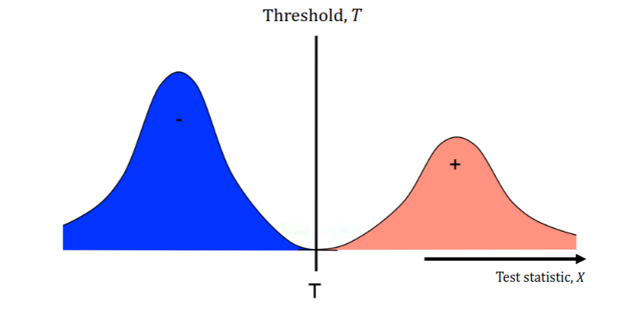
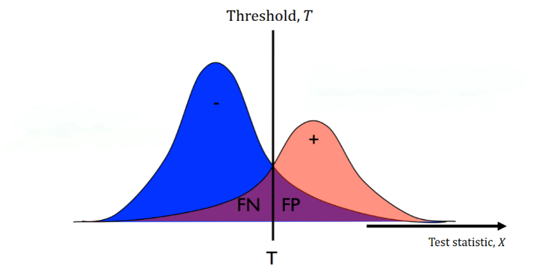

## Early AI: Expert Systems
Long before the current AI wave with deep learning, **knowledge-based expert systems** were dominant.
These systems use **logic** for **inference** based on their **knowledge base**.

Some examples of (medical) expert systems are Mycin (1970s) and INTERNIST-1 (1980s).
It wasn't until the 1990s &mdash; when Penny & Frost used neural networks for medical diagnosis &mdash; that the field of AI started to shift towards machine learning.

### Drawbacks of Early Methods
These expert systems rely on **manually** curated knowledge bases, which are **expensive** to create and **hard to maintain**.

Similarly, early probabilistic models were built on **known relations** between symptoms and diseases.
Thus, scaling very poorly.

The early neural networks simply suffered from the lack of training data (and therefore generalized poorly).

## What is Diagnostics?
Diagnosis refers to the task of finding out the **cause** of some phenomenon, e.g., the disease causing a symptom.
Typically, diagnosis refers to the **medical practice**, but you can generalize this to understand **causality** (to some extent) in general (software debugging, reasons for user churn, failure investigation, etc.).

By definition, diagnoses are based on **data** (i.e., symptoms of the patient).

Diagnostic **criteria** specify combinations of **signs, symptoms, and tests** that are used to determine the diagnosis.

## Testing
At the core of (automated) diagnostics are **tests**.

Tests also require data (that can have been collected **passively** or **actively**).
Diagnostic tests should **admit some** causes and **rule out others**.

### The Binary Test
The simplest form of tests is the **binary test**.

:::definition[Binary Test]
A binary test $(X, T)$ consists of a test statistic $X$ and a threshold $T$.

If $X \leq T$, the test result is **negative**.

If $X > T$, the test result is **positive**.
:::

:::note
This convention is arbitrary and can be reversed.
:::

### How Good is a Test?
But how do we determine how good a test is?

In @fig:t, we see that the test is perfect.
The threshold is set at the boundary between the two classes.

But, in reality and real-world data, our two distributions might not have an ideal boundary.
Thus, no matter how we set our threshold, we will have some **false positives** and **false negatives** (the purple areas in @fig:t2).

We have two terms that (numerically) describe these.

:::definition[Specificity & Sensitivity]
$$
\begin{align*}
\text{Specificity} &= \frac{\text{Correctly identified negatives}}{\text{Actual negatives}} \newline
\text{Sensitivity} &= \frac{\text{Correctly identified positives}}{\text{Actual positives}}.
\end{align*}
$$
:::

As you can see, as you increase the sensitivity, the specificity decreases and vice versa.
When dealing with metrics that are inversely proportional, we can often use the ROC curve to visualize the trade-off [^1].

### Model-based Tests
A **statistical test** aims to estimate the probability that the assigned label is the right one.
This could be as simple as a **thresholded measurement**, but this generalizes poorly to **multiple tests/symptoms**.

Given that a patient has a rash **and** is coughing, what is the probability that they have (or don't have) the flu?

## Naive Bayes

:::definition[Naive Bayes Model]
Let $D$ be the disease and $X_1, X_2, \ldots, X_n$ the symptoms.
The Naive Bayes model assumes that the symptoms are **conditionally independent** given the disease,
$$
P(X_i, X_j \mid D) = P(X_i \mid D) P(X_j \mid D), \quad \forall i \neq j.
$$
:::

So, given that the disease is $d$, knowing $X_1$ does not tell us anything about $X_2$.

The model specifies the **joint probability** of the symptoms and the disease,

$$
P(D, X_1, X_2, \ldots, X_n),
$$

which we can factorize as,

$$
P(D) P(X_1 | D) P(X_2 | D) \ldots P(X_n | D).
$$

Where the first term is the **prior** and the rest are the **likelihoods**.
Using Bayes' rule, we can write,

$$
\begin{align*}
P(D | X_1, X_2, \ldots, X_n) & = \frac{P(D) P(X_1 | D) P(X_2 | D) \ldots P(X_n | D)}{P(X_1, X_2, \ldots, X_n)} \newline
& = \frac{P(D) P(X_1 | D) P(X_2 | D) \ldots P(X_n | D)}{\sum_{d} P(D = d) P(X_1, X_2, \ldots, X_n | D = d)}.
\end{align*}
$$

We can exploit this to **successively refine** our hypothesis.

First, estimate $P(D | X_1)$, then measure $X_2$ and refine, and so on.

After the $j$-th observation, we have,

$$
P(D | X_1, X_2, \ldots, X_j) = P(D | X_1, X_2, \ldots, X_{j - 1}) \frac{P(X_j | D)}{\sum_{d} P(X_j | D = d) P^{j - 1}(D)}.
$$

### Benefits of the Naive Bayes Model
The probabilities of symptoms given diseases $P(X_j | D)$ can be estimated from data.
For **discrete** symptoms, it can even be done using a table.

The Naive Bayes formulation also naturally handles **missingness** in the measurements of symptoms $X_j$.

The model also generalizes well to **multiple symptoms**.

## Why not just predict $D$ from $X$?
But we made **no assumptions** on the form $P(X_j | D)$ or $P(D)$.
$P(X_j | D)$ could be highly complicated if $X_j$ is a complex and high-dimensional feature.

For example, if $X_1$ is an X-ray image, is it **better** to predict $X_1$ from $D$ or the other way around?
Estimating $P(D | X_1, X_2, \ldots, X_n)$ VS. $P(X_1, X_2, \ldots, X_n | D)$.

The answer will depend on the application and the data.

Trying to estimate $P(D | X_1, X_2, \ldots, X_n)$ directly is called **discriminative learning** [^2].

## Takeaways
Diagnostic tests will **almost never** have 100% accuracy.
When they don't, we must **trade off** specificity and sensitivity (how dangerous are false positives and false negatives?).

Consider the **costs** of these trade-offs.

## Why Machine Learning Now?
Simply, the data availability and computational power have increased with the years.
Along with the standardization of data formats and the development of machine learning algorithms, it was natural for the field to grow.

### But What Are the Opportunities?
Machine learning can improve the **consistency** of diagnostics.

Different doctors/pathologists/etc. disagree significantly in their interpretations of the same data.

Thus, it is natural for companies to try to make tools that aid in this process and ensure more consistent results.

However, predicted diagnoses are often **not enough**, it is necessary to justify outputs, e.g., using visualizations or explanations.

Just imagine if you had a black-box RoboDoc9000 that just told you that you're going to die within 24 hours without any explanation :).

Secondly, medical staff are incredibly **time-constrained**.
Thus, machine learning may be used to **speed up** diagnosis either by,

1. Making the diagnosis autonomously.
2. Point out abnormalities and having physicians confirm them.

Again, the latter is more likely to be accepted by the medical community.

Along with general quality of life help. Improving documentation and interfaces which they face daily.
Think of contextual auto-completion in your IDE, but for medical staff.

Lastly, machine learning is **not limited to known** explanations (in contrast to the early expert systems).
Features are learned from the data and can be used to make predictions.

However, **reproducibility** is a big issue. Success in the lab **does not imply** success in the wild.

## Takeaways
For AI and ML to have (big) impact in diagnostic it needs to be,

1. **Reproducible**.
2. **Implementable in clinical practice**.
3. **Efficient**.

AI and ML will (probably) not replace doctors, pathologists, etc., but it can **aid** them in their work.
Speed up their work and reduce their workload.

## Why is Medicine Special?
A correct diagnosis can mean the difference between **life and death**.
Along with the fact that every action **has a cost** (e.g., a false positive can lead to unnecessary surgery), it becomes very tricky.

[^1]: [ROC curve](https://en.wikipedia.org/wiki/Receiver_operating_characteristic)
[^2]: [Discriminative model](https://en.wikipedia.org/wiki/Discriminative_model)
