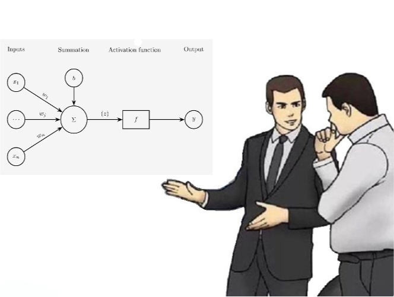

## Introduction
Vision is a very fundamental sense for humans.
When looking at a scene, our eye(s) work as an image acquisition device.
This "image" is then sent to our image interpretation system, the brain, for further processing, and then we finally yield a perception of the scene.

Similarly, in computer vision, we try to mimic this process.
Cameras are used as image acquisition devices, and computers are the image interpretation system.

## Image Data
Firstly, before we even can represent an image digitally, we need to form it.

A few components of the image formation process are,

1. Perspective projection.
2. Light scattering (when hitting a surface).
3. Lens optics.
4. Color filtering (e.g., Bayer color filter array [^1]).

Secondly, the **color space** of a picture is (usually) represented in **R**ed, **G**reen, and **B**lue (RGB) channels.
These can be (numerically) represented both as integers &mdash; e.g., `uint8` which yields the range $[0, 255]$ &mdash; or as floating-point numbers &mdash; e.g., `float32` which yields the range $[0, 1]$.

RGB is a linear color space (i.e., the color space is a linear combination of the three channels) and has single wavelength primaries (i.e., the three channels correspond to three different wavelengths of light).

There are other color spaces, such as **H**ue, **S**aturation, **V**alue (HSV), which are more intuitive for humans to understand [^2].

## Remote Sensing Data
Remote sensing is the science of acquiring information about an object without being in physical contact with it.

For example, satellite imagery is a form of remote sensing.
Satellite imagery has different spatial resolutions, (can have) various spectral bands, and different acquisition times (temporal resolution).

We will also do some **preprocessing** of the images.
This can include, corrections for lens distortion (e.g., radial distortion), histogram equalization (to enhance contrast), and radio- or geometric corrections (to align images to be true orthophotos [^3]).

There are more details, but this really is not my area of interest ::margin[Sorry [Mohammad](https://www.chalmers.se/en/persons/kakooei/) if you are reading this :\].].

Let's talk about more interesting stuff.
**Neural Networks**.

## Neural Networks
Let's start with a single neuron.

Recall logistic regression.

:::definition[Logistic Function]
The logistic function (or sigmoid function) is defined as,
$$
f(x) = \frac{1}{1 + e^{-x}}.
$$
:::

Here $f : \mathbb{R} \to (0, 1)$, so we can take in a continuous input and output a probability (quite powerful).

Thus, we can have as input,

$$
X = w_1 x_1 + w_2 x_2 + \ldots + w_m x_m + b.
$$

And then we can apply the logistic function to $X$ to get the output.

We call the $x_1, x_2, \ldots, x_m$ the **input features**, and the $w_1, w_2, \ldots, w_m$ the corresponding **weights**.

Now, let's stack em (for more on neural networks, see [this](/research/claudeslens/#neural-networks)).

Now, for the part I've been wanting to write about, **classical computer vision**.

## Classical Computer Vision
A very important topic in (classical) computer vision is **neighborhood information** and **neighborhood processes**.

For example, linear filtering can be defined as,

$$
G[i, j] = \frac{1}{(2k + 1)^2} \sum_{u = -k}^{k} \sum_{v = -k}^{k} F[i + u, j + v],
$$

where $F$ is the input image, $G$ is the output image, and $k$ is the kernel size.

Smoothing can be defined as,

$$
\begin{align*}
G[i, j] &= \sum_{u = -k}^{k} \sum_{v = -k}^{k} H[u, v] F[i + u, j + v] \newline
G &= H \ast F,
\end{align*}
$$

where $H$ is the kernel.

Another very important type of process is **derivatives**,

$$
\frac{\partial f}{\partial x} = \lim_{\varepsilon \to 0} \frac{f(x + \varepsilon, y) - f(x, y)}{\varepsilon}.
$$

For a discrete image $h$, we approximate the derivative by finite differences,

$$
\frac{\partial h}{\partial x} \approx h_{i+1, j} - h_{i, j},
$$

which corresponds to the (correlation) kernel,

$$
\mathcal{H} =
\begin{bmatrix}
0 & 0 & 0 \newline
1 & 0 & -1 \newline
0 & 0 & 0
\end{bmatrix}.
$$

With these matrices and performing partial derivatives in both $x$ and $y$ directions, we can have an **edge detector**.

[^1]: [Bayer color filter array](https://en.wikipedia.org/wiki/Bayer_filter)
[^2]: [HSV color space](https://en.wikipedia.org/wiki/HSL_and_HSV)
[^3]: [Orthophoto](https://en.wikipedia.org/wiki/Orthophoto)
