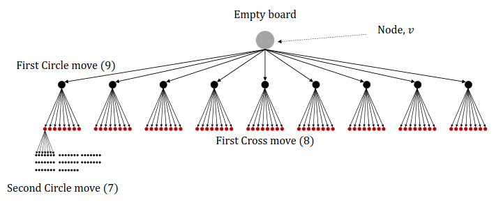

## Introduction
Games are a very human thing to play (and design).
So it is a very natural thing to approach them as systems that can be designed and analyzed.

One of the earliest examples is the mechanical Turk, a chess-playing machine that was actually a hoax [^1].

Then in the 1900s, we had the first computer programs that could play chess.
Most famously, IBM's Deep Blue that beat the world champion Garry Kasparov in 1997 [^2].

A more modern game-playing system is OpenAI Five, a team of five AI agents that can play the game Dota 2 [^3].

## Formalizing Games
But to approach games as systems, we first need to formalize them.
One of the most common games (and easiest to formalize) are **zero-sum games**.

:::definition[Zero-Sum Game]
A zero-sum game is a mathematical representation of a situation in which each participant's gain or loss of utility is exactly balanced by the losses or gains of the utility of the other participants.
:::

Or, in other (simpler) words, one player winning implies one player losing.

Games are inherently about **actions**, our goal is to select actions that improve our chances of winning.

To win, we need to account for good and bad features when selecting actions.

Think of Tic-Tac-Toe, to play **optimally**, we must pick the best **path**, but which is it?

We need to (formalize) and introduce **search trees**.

At some point in the tree, an **end state** is reached, we call these **terminal nodes**.

The **value** of a terminal node is the **utility** of the game, i.e., if it leads to a win, loss, or draw.

A search tree can be used to enumerate **possible futures**.
By identifying good futures (wins), we can **backtrack**, **which actions** do we have to take to reach that future?

However, **a plan is only a plan**, we can't control the opponent's actions, thus, the answer is also dependent on the opponent's actions.

Let's, for now, assume that our opponent has a **fixed, known policy** $\pi$.

Thus, for each position,

1. Compute the probability of reaching winning states.
    - Based on the probability of the future states.
2. Execute the action(s) with the highest success rate.

But, if our opponent is **adaptive**, i.e., **used to be** suboptimal but changes to being optimal, our probabilities will change.

### Minimax optimization
To guarantee success against the best possible opponent, we formulate the following strategy,

> **Minimize the maximum** success of your opponent (worst-case scenario).

Assume that we *knew* the best possible move and that our opponent *will* play that move.
Then we proceed as before, count future success rate of each action and act accordingly.

But what is the best move?

Let's formalize it, for our purposes, a decision process describes an **agent** taking **actions** $A_t$, according to a **policy** $\pi$ in **states** $S_t$, **observed through** $X_t$.
Which transitions according to the **dynamics** $p(S_t | S_{<t}, A_{<t})$.

We will often have a designated **reward** $R_t$, a function of $X_t$ that we want to optimize.

In two-player games, there are two agents with (potentially) **different** policies, $\pi$ (player) and $\mu$ (opponent).

$\bar{R}(\pi, \mu)$ denotes the **average reward** (e.g., win rate) of $\pi$ against $\mu$.

Minimax play for $\pi$ against $\mu$ **optimizes**,

$$
\underset{\pi}{\min} \ \underbrace{{\underset{\mu}{\max} \ \bar{R}(\pi, \mu)}}_{\text{Strongest Opponent}}.
$$

### Minimax Planning
In search trees, minimax planning select the next action at time $t$ by examining the **best path** $A_t, \ldots, A_T$ for the player and the best path $B_{t + 1}, \ldots, B_T$ for the opponent until end $T$,

$$
\underset{A_t, \ldots, A_T}{\min} \ \underset{B_{t + 1}, \ldots, B_T}{\max} \ \bar{R}(A, B).
$$

However, this is **computationally infeasible** for most games, as the search tree grows exponentially with the number of actions.
For Tic-Tac-Toe the total number of possible states (boards) < 20000, but for chess, it is $\approx 10^{120}$.

One strategy is to truncate at finite depth, that means, we limit ourselves to only looking $d$ steps ahead.
The drawback of this approach is, how do we value non-terminal nodes?

For humans, it is easy to see that some moves are better than others, but how do we **quantify** this?
In early systems, we actually used **human knowledge** to assign values to non-terminal nodes.

## Learning to Play
As mentioned, the two problems with large state space are,

1. It is infeasible to **explore** every state.
    - We can't look at every possible future (in a feasible time span).
2. It is infeasible to **store** the value of each state.
    - We can't store the value of every possible future (in a feasible memory space).

Let's tackle each problem.

### Exploration
One way to tackle the exploration problem is to **sample** the state space, i.e., we only try a subset of actions.
But how do we make sure we don't leave out good ones?

#### Monte Carlo Tree Search
Monte-Carlo methods deal with **random sampling**.

Instead of searching exhaustively, our search based on **experiments** with **randomly selected actions**.

Essentially, we try playing *something* and **remember** what happened.

The MCTS algorithm is based on four steps,

1. Selection
    - Finding **unexplored** nodes (state-action pairs that haven't been tried).
    - Based on **what we know so far**, traverse down until an **unexplored child node** is reached.
    - We use a **tree policy** for selection.
2. Expansion
    - Once we have selected node, we **expand** it.
    - We add a **new child node** to the tree.
    - Now we need to **evaluate** this new node.
3. Simulation/Rollout
    - We **simulate** the game from the new node.
    - Based on our **simulation policy** (usually a simple random policy), we continue playing until we hit a **terminal node**.
    - At the terminal node, we know the value!
4. Backpropagation
    - We **update** the value of the nodes we traversed.
    - We **backpropagate** the value of the terminal node to the root node.
    - Statistics of our nodes are updated, $N(v)$ - number of times visited, $Q(v)$ - total reward starting from $v$, also called **Q-value**.

#### Tree Policies
Just selecting nodes randomly is very inefficient, the **statistics** we collect can be used to improve our selection during MCTS (and thus the action we choose to play in the end).

How can we **balance** trying new things (exploration) and using our prior knowledge (exploitation)?

##### Greedy policies
A **greedy** policy selects the **best action** according to some metric.

For example, the highest average reward accumulated so far,

$$
A = \underset{a}{\arg \max} \ \frac{Q(v_a)}{N(v_a)}.
$$

However, this leads to **no exploration**, but this is good when $Q$ is a very good approximation of the value.

##### $\epsilon$-greedy policies
A $\epsilon$-greedy policy chooses the greedy action with probability $1 - \epsilon$ and a random action with probability $\epsilon$.

Trades off exploration and exploitation (a bit).

However, there's a problem, we may try an action **known to be bad**, by chance.

##### Upper Confidence Bounds (UCB)

:::definition[Upper Confidence Bound]
The UCB is a bound on the true $Q$-value for an action $a$ in node $v$,
$$
Q(v_a) \leq \hat{Q}_t(v_a) + \hat{U}_t(v_a),
$$

where $Q(v_a)$ is the true value, $\hat{Q}_t(v_a)$ is the estimated value, and $\hat{U}_t(v_a)$ is the uncertainty.
:::

We act greedily,

$$
a_t = \underset{a}{\arg \max} [\hat{Q}_t(v_a) + \hat{U}_t(v_a)].
$$

We can define $\hat{U}_t(v_a)$ as,

$$
\hat{U}_t(v_a) = c \sqrt{\frac{\log N(v)}{N(v_a)}},
$$

where $c$ is a hyperparameter that controls the balance between exploration and exploitation.
If you are wondering where this comes from, it is derived from the Hoeffding inequality [^4].

The application of UCB to search trees is called UCT (Upper Confidence Trees).
One variant is defined as (but there are many),

$$
\text{UCT}(v_i, v) = \frac{Q(v_i)}{N(v_i)} + c \sqrt{\frac{\log N(v)}{N(v_i)}}.
$$

MCTS is repeated until sufficient statistics have been gathered, each potential action $a$ has statistics $N(v_a)$ and $Q(v_a)$.

We now can **choose the action corresponding to the most visited state**.

## Function Approximation
Remember the second problem with large state spaces, we can't store the value of every possible future.

The problem of many/high-dimensional states is common in AI problems, e.g., image classification, speech recognition, etc.

Intuitively, the details of each state matter less, the more information there is.
A lot of states are **similar** to each other.

As humans, we recognize these similarities, and **disregard** irrelevant information.

A very natural thing from **machine learning** is function approximation, we can learn a function that approximates the $Q$-value.

During **backpropagation**, we don't just update counters $N,Q$, but also the parameters of neural nets predicting the $Q$-value.

Since we now don't need any human intervention or knowledge, **self-play** is possible.

## Markov Property
One last thing to mention is the **Markov property**.

In Chess, Go, Tic-Tac-Toe, the **history** of a game does not influence transitions, **states are Markovian**,

$$
p(S_t | S_1, \ldots, S_{t-1}, A_1, \ldots, A_{t-1}) = p(S_t | S_{t-1}, A_{t-1}).
$$

For example, if you move a chess piece from E2 to E4, nothing else happens.
The set of valid moves can be read of the board beforehand.

### Non-Markov (Long) Games
When Markovianity doesn't hold, **long** games becomes hard.

We have to **memorize/summarize** history to predict the future.
Although, this is starting to be addressed more by modern systems.

## Conclusion
Use machine learning where it helps!

It is a great tool at condensing information and extracting relevant patterns.

AlphaGO **combined** traditional MCTS with ML, and it **beat** the world champion [^5].

[^1]: [Wikipedia: Mechanical Turk](https://en.wikipedia.org/wiki/Mechanical_Turk)
[^2]: [Wikipedia: Deep Blue](https://en.wikipedia.org/wiki/Deep_Blue_(chess_computer))
[^3]: [OpenAI: OpenAI Five](https://openai.com/research/openai-five/)
[^4]: [Wikipedia: Hoeffding's inequality](https://en.wikipedia.org/wiki/Hoeffding%27s_inequality)
[^5]: [Wikipedia: AlphaGo](https://en.wikipedia.org/wiki/AlphaGo)
