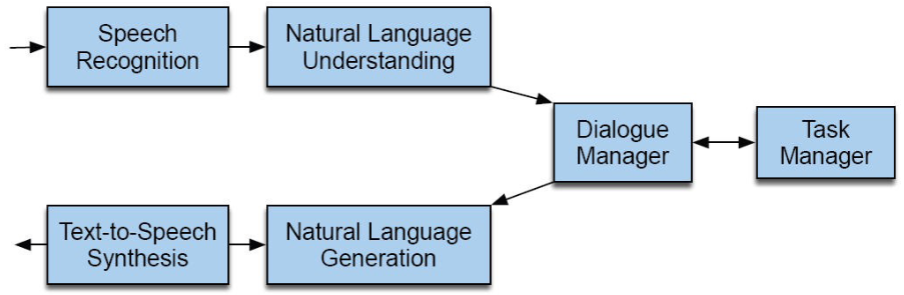

## Introduction
"Dia logos" means "through words"/"through language" in Greek.
Dialogue systems are systems that can interact with humans in **natural language** [^1].
They can be used for a variety of tasks, such as customer service, information retrieval, and entertainment.

Usually when we think of dialogue systems, we think of **chatbots** or **digital assistants**.
Chatbots are (more) for arbitrary conversations, while digital assistants are (more) for specific tasks.

Early systems were (as we have discussed before) **rule-based**, however, more modern systems use a combination of rules and machine learning based techniques.

## Properties of Human Conversation
A dialogue is a **sequence of turns**, in spoken dialogue it can be difficult to know when a turn ends.

> $C_1$: Hi, how are you? \
$A_1$: I'm good, thanks for asking. \
$C_2$: What have you been up to? \
$A_2$: Not much, just working on some school stuff.

### Speech Acts

:::definition[Speech Act]
A **speech act** is an utterance that has a function in communication.
:::

* **Constatives**:
    - Committing the speaker to something's being the case.
    - E.g., Answering, claiming, confirming, denying, disagreeing, stating, etc.

* **Directives**:
    - Attempts by the speaker to get the addressee to do something.
    - E.g., Advising, asking, forbidding, inviting, ordering, requesting, etc.

* **Commissives**:
    - Committing the speaker to some future course of action.
    - E.g., Promising, planning, vowing, betting, opposing, etc.

* **Acknowledgements**:
    - Express the speaker's attitude regarding the hearer with respect to some social action.
    - E.g., Apologizing, greeting, thanking, accepting an acknowledgment, etc.

Thus, a dialogue has a certain **structure**.
E.g., an answer follows a question, a greeting follows a greeting, etc.

We can break down a dialogue into **sub-dialogues**, where we may "classify" sub-dialogues respectively (e.g., clarification, grounding, etc.).

Also, an important feature is initiative, i.e., which participant is in control of the conversation.
We can have **user-initiative** (e.g., a user asking a question) or **system-initiative** (e.g., a system asking a question) or **mixed-initiative** (e.g., a user asking a question, and the system asking a follow-up question).

### Inference and implicature
One of the most challenging aspects of dialogue systems is **inference and implicature**.

> $A_1$: And, what day in May did you want to travel? \
$C_1$: Ok, uh, I need to be there for a conference that is from the 12th to the 15th.

Here, the system needs to infer that the user wants to travel between the 12th and the 15th of May.

> $A_1$: I am out of gas, where is the nearest gas station? \
$C_1$: There is a gas station around the corner.

Here, that the gas station is (hopefully) open is an **implicature**.

## Chatbots
As we defined earlier, chatbots are systems that can interact with humans in natural language.

One of the earliest chatbots was **ELIZA**, which was created in the 1960s [^2].
ELIZA was keyword based, i.e., would rank specific keywords higher and prefers responses based on those keywords.

**PARRY** was another chatbot, which was designed to simulate a paranoid patient [^3].

A (bit more) modern chatbot is **ALICE**, which is a "modern" version of ELIZA, and is based on AIML (Artificial Intelligence Markup Language) [^4].

However, with time **corpus-based** chatbots have become more popular.
These are chat bots that are based on **very large** datasets of **real conversations** (note, they are also possible with non-dialogue corpora, e.g., books, poems, etc.).

The response generation are not based on rules, but on **statistical models**.
A simple statistical model is the **n-gram model**, where we predict the next word based on the previous $n$ words.
We can also model it to use the user's last $n$ turns to predict the next turn.

Xiaoice is a chatbot developed by Microsoft, which is based on a **recurrent neural network** [^5].
More modern chatbots usually realize complex statistical models and functions with **neural networks**.

**Information retrieval**-based chatbots are also popular.

1. Return response to most similar user turn.

2. Return most similar response

where similarity can be based on **word vector** or **word embeddings** (e.g., Word2Vec, GloVe, etc. which use **cosine similarity** [^6]).

These are the state-of-the-art chatbots (**ML-based encoder-decoder models**).

## Dialogue System Architecture

Let's break down the architecture (see @fig:dsa).

1. **Natural Language Understanding (NLU)**:
    - This is where we **parse** the user's input.
    - We can use **intent classification** (e.g., what is the user trying to do), **entity recognition** (e.g., what are the important parts of the user's input), and **slot filling** (e.g., filling in the blanks).
    - We can use **rule-based** systems, **ML-based** systems, or **hybrid** systems.

2. **Dialogue Manager (DM)**:
    - This is where we **decide** what to do next. Otherwise the user must give all information in one statement (which is not a dialogue).
    - Commercial dialogue managers are mostly **rule-based**.
    - We can also use **state tracking** (e.g., keeping track of the conversation state), which can be **finite-state** based.
    - We can also have **frame-based/form-based** dialogue systems, where we ask the user for specific information.
    - A form with empty slots constrained to certain possible values, to each slot you can associate questions (and preconditions).

3. **Natural Language Generation (NLG)**:
    - This is where we **generate** the system's response.
    - Mostly **template-based** or **rule-based**.

[^1]: [Wikipedia, Natural language](https://en.wikipedia.org/wiki/Natural_language)
[^2]: [Wikipedia, ELIZA](https://en.wikipedia.org/wiki/ELIZA)
[^3]: [Wikipedia, PARRY](https://en.wikipedia.org/wiki/PARRY)
[^4]: [Wikipedia, Artificial Linguistic Internet Computer Entity](https://en.wikipedia.org/wiki/Artificial_Linguistic_Internet_Computer_Entity)
[^5]: [Wikipedia, Xiaoice](https://en.wikipedia.org/wiki/Xiaoice)
[^6]: [Wikipedia, Cosine similarity](https://en.wikipedia.org/wiki/Cosine_similarity)
