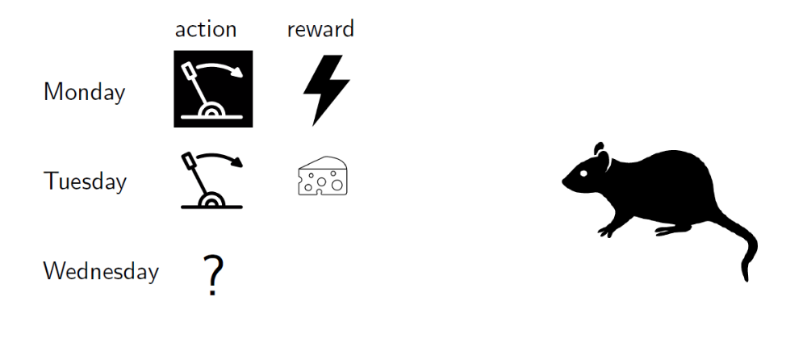
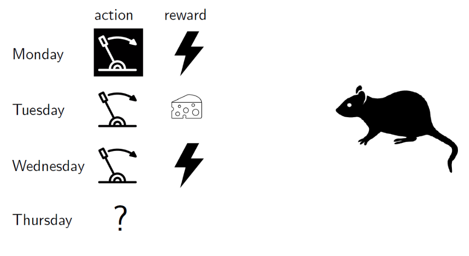

## Introduction to Multi-Armed Bandits
Multi-armed bandits [^1] are a simple but very powerful framework for sequential decision making over time under uncertainty.
We can also view them as a variant of online learning [^2], where the problem instances arrive sequentially in an online manner.

It is an interactive machine learning paradigm between an **agent** and the **environment**.
The task is to find a principled way to balance the tradeoff between **explotation** and **exploration**, which we will define later.

### Basic Example

We have put a rat in a cage with two levers, both of which are stochastic.
When our agent (rat) pulls a lever, it receives a reward drawn from a fixed but unknown distribution associated with that lever.
For simplicity, we have two possible rewards: 0 (electrical shock) and 1 (piece of cheese).

So given our current information, logically we would want to pull the lever that has given us the most cheese in the past.

Seems like we need to **explore** more to get more information about the levers.

This is just a na&iuml;ve example, we can have,

:::example[More Examples]
- News website: When a new users arrives,
  - A website picks an article header to show.
  - It observes whether the user clicks on this header.
  - Thus, the site's goal is to maximize the total number of clicks.
- Dynamic pricing: A store is selling a digital good, e.g., an app or a song. When a new customer arrives,
  - The store chooses a price offered to this customer.
  - The customer buys (or not) the good and leaves forever.
  - The store's goal is to maximize the total profit.
- Investment: Each morning,
  - You choose one stock to invest into and invest $1.
  - At the end of the day, you observe the change in value for each stock.
  - The goal is to maximize the total return.
:::

One important aspect of these problems is that the best long-term strategy may involve short-term sacrifices.
We want to gather (enough) information to make the best overall decisions.

## Basic Setup and Notation
Multi-armed bandit unifies these above examples (and many more).

In the basic version, our agent has $\color{blue}{K}$ possible actions to choose from, which are called $\color{blue}{\textbf{arms}}$, and our agent has $\color{green}{T}$ $\color{green}{\text{(time steps/epochs)}}$ rounds to make decisions.

During each $\color{green}{\text{round}}$, our agent $\color{red}{\text{chooses an arm}}$ and $\color{red}{\text{collects a reward for this arm}}$.

The reward is drawn independently from some distribution which is fixed (i.e., depends only on the chosen arm), but not known to our agent.

### Examples
:::table[Examples of bandit problems and their corresponding arms (actions) and rewards.]{#bandit-problem-examples}
| Example | Action | Reward |
|---------|--------|--------|
| News website | An article to display | 1 if clicked, 0 otherwise |
| Dynamic pricing | A price to offer | $p$ (profit) if sale, 0 otherwise |
| Investment | A stock to invest into | Change in value of the stock |
:::

## Explotation & Exploration
In this basic setup, our agent observes the reward for the chosen arm after each round, but not for the other arms that *could* have been chosen.

Therefore, our agent needs to **explore**, try out different arms to acquire more (and new) information.
Thus, we have a tradeoff between exploration and **explotation**, making (optimal) near-term decisions based on the available information.

Essentially, our agent strives to learn which arm(s) are the best while not spending too much time exploring (suboptimal arms).

## Concentration Inequalities
Before we proceed with more bandits, we need to introduce some mathematical background.

Consider $n$ random variables $X_1, X_2, \ldots, X_n$, that are mutually independent but not necessarily identically distributed.

Let $\bar{X}_n = \frac{X_1 + \ldots + X_n}{n}$ be their empirical mean with the expectation $\mu_n = \mathbb{E}[\bar{X}_n]$.

According to the Strong Law of Large Numbers [^3],

$$
P(\bar{X}_n \to \mu_n) = 1 \quad \text{with } n \to \infty.
$$

An interesting question is "how concentratred $\bar{X}_n$ is around $\mu_n$?"a

As we can see from the above figures, we need some kind of measurement to quantify the concentration of $\bar{X}_n$ around $\mu_n$.

In other words, is $\bar{X}_n - \mu_n$ small with high probability?

$$
P[|\bar{X}_n - \mu_n| < \epsilon] \geq 1 - \delta, \quad \text{for some small } \epsilon, \delta > 0
$$

To understand this, we will introduce confidence radius (and intervals).

For a fixed $n$, we consider the following high-probability event ::margin[This equation might seem arbitrary, but this comes from Hoeffding's Inequality, which we will cover soon.],

$$
\epsilon_{\alpha, \beta} \coloneqq |\bar{X}_n - \mu_n| \leq \sqrt{\frac{\alpha \beta \log(T)}{n}}, \quad \alpha > 0.
$$

Then, the following statement holds under various assumptions,

$$
\begin{equation}
\label{eq:confidence-event-probability}
P(\epsilon_{\alpha, \beta}) \geq 1 - 2 T^{-2\alpha}, \forall \alpha > 0.
\end{equation}
$$

In the above equations, $T$ is a fixed parameter, e.g., the time horizon in the multi-armed bandit problem.
The parameter $\alpha$ controls the failure probability, we will usually set this to 2.
$\beta$ depends on the problem assumptions (often fixed at 1).

We can thus define confidence radius as follows,

$$
r_n = \sqrt{\frac{\alpha \log(T)}{n}},
$$

and the confidence interval is $[\mu_n - r_n, \mu_n + r_n]$.

## Hoeffding's Inequality
:::theorem[Hoeffding's Inequality]
@eq:confidence-event-probability holds, with $\beta = 1$, if $X_1, \ldots, X_n \in [0, 1]$,
$$
P\left( |\bar{X}_n - \mu_n| \leq \sqrt{\frac{\alpha \log(T)}{n}}  \right) \geq 1 - 2 T^{-2\alpha}, \quad \alpha > 0.
$$
:::

The special case with $X_i \in \\{0, 1\\}$ is known as Chernoff Bounds

### Extensions of Hoeffding's Inequality
:::theorem[Extension of Hoeffding's Inequality]
@eq:confidence-event-probability holds, for appropriate $\beta$, in the following cases,
- Bounded intervals,
  - $X_i \in [l_i, u_i] \quad \forall i \in [n]$ and $\beta = \frac{1}{n} \sum_{i \in [n]} (u_i - l_i)^2$.
- Bounded variance,
  - $X_i \in [0, 1]$ and $\mathrm{Var}(X_i) \leq \frac{\beta}{8} \quad \forall i \in [n]$.
- Gaussians,
  - Each $X_i, i \in [n]$ is Gaussian with variance at most $\frac{\beta}{4}$.
:::

## Stochastic Bandits
We now will consider the basic stochastic bandits model, with the set of $K$ arms $\mathcal{A}$, with rewards being i.i.d.

FOr each arm/action $a$ there is a distribution $\mathcal{D}_a$ over reals, called **reward distribution**, which are initially unknown.

For simplicity, we will assume that our rewards are bounded in $[0, 1]$.

The thing of interest is the **mean reward vector** $\mu \in [0, 1]^K$, where $\mu(a) \coloneqq \mathbb{E}[\mathcal{D}_a]$ is the mean reward of arm $a$.

### Example
Consider a Bernoulli distribution, where the reward of each arm $a$ can be either 1 or 0 ("success" or failure", "heads or tails", etc.).

This reward distribution is fully specified by the mean reward, the probability of the successful outcome.

## Regret
We know that the best mean reward is $\mu^{\star} \coloneqq \underset{a \in \mathcal{A}}{\max} \mu(a)$.

We can define the **gap** of an arm $a$ as $\Delta(a) \coloneqq \mu^{\star} - \mu(a)$.

Thus, the **optimal arm** in an arm with $\mu(a) = \mu^{\star}$.

We usually use $a^{\star}$ to denote some optimal arm (note, this is not necessarily unique).

With these, we can define the **regret** (at round T),

$$
R(T) = \mu^{\star} \cdot T - \sum_{t=1}^T \mu(a_t)
$$

where $a_t$ is the arm chosen at round $t$, is a random quantity that depends on the randomness in rewards/agent.
Thus, $R(T)$ is a random variable that compares the agent's cumulative reward to the best arm benchmark $\mu^{\star} \cdot T$.

Since $R(T)$ is a random variable, we are interested about the **expected regret** $\mathbb{E}[R(T)]$.

## Explore-First Algorithm
We will now introduce our first (simple) algorithm to the bandit problem, called **Explore-First**.

This algorithm is based on a uniform exploration strategy, we dedicate an initial segment of rounds to exploration, and the remaining rounds to exploitation.

### Analysis of Explore-First
We will now analyze the expected regret of this algorithm.

Let $\bar{\mu}(a)$ be the average reward for each arm $a$ *after the exploration phase*.
Thus, $\bar{\mu}(a)$ is desired to be close to $\mu(a)$, i.e., $|\bar{\mu}(a) - \mu(a)|$ is small.

We can apply Hoeffding's Inequality (with $\alpha = 2, \beta = 1$) to get,

$$
\begin{equation}
\label{eq:clean-arm-event}
P(|\bar{\mu}(a) - \mu(a)| \leq r(a)) \geq 1 - 2 T^{-4}, \quad r(a) = \sqrt{\frac{4 \log(T)}{n}}.
\end{equation}
$$

The probability that the average will deviate from the true expectation is very small.

But let's analyze further, for this we will need to define **clean** and **bad** events.

## Clean & Bad Events ($K = 2$)
We define a **clean event** as the event where @eq:clean-arm-event holds for **all arms simultaneously**.
Thus, a **bad event** is the complement of a clean event (i.e., when @eq:clean-arm-event does not hold for at least one arm).

Let us start with a small example to understand this better.
Let $K = 2$ and $\mathcal{A} = \\{a, a^{\prime}\\}$.

By definition, the clean event will be,

$$
P(\text{clean}) = P(\text{clean}(a) \text{ and } \text{clean}(a^{\prime})).
$$

From @eq:clean-arm-event, we have,

$$
P(\text{clean}(a)) \geq 1 - 2 T^{-4},
$$

Thus,

$$
P(\text{bad}(a)) \leq 2 T^{-4}.
$$

By the union bound [^4], we have,

$$
\begin{align*}
P(\text{bad}) & = P(\text{bad}(a) \text{ or } \text{bad}(a^{\prime})) \newline
& \leq P(\text{bad}(a)) + P(\text{bad}(a^{\prime})) \leq 2 T^{-4} + 2 T^{-4} = 4 T^{-4}.
\end{align*}
$$

Which means,

$$
P(\text{clean}) = 1 - 4 T^{-4}.
$$

Further, let's now consider that the best arm is $a^{\star}$, and suppose our agent chooses the other arm $a \neq a^{\star}$ (otherwise, there would be no regret).

This means $\bar{\mu}(a) > \bar{\mu}(a^{\star})$ ::margin[This means that, after the exploration phase, the empirical mean of the wrong arm is larger, essentially our agent has not "converged" or found the optimal arm yet.].

$$
\mu(a) + r(a) \geq \bar{\mu}(a) > \bar{\mu}(a^{\star}) \geq \mu(a^{\star}) - r(a^{\star})
$$

From the clean event for both arms, we have,

$$
\begin{aligned}
&\text{(clean event for }a\text{)} && -r(a)\le \bar\mu(a)-\mu(a)\le r(a) \newline
& && \Rightarrow\ \bar\mu(a)\le \mu(a)+r(a) \newline
&\text{(choice in exploitation)} && \bar\mu(a)>\bar\mu(a^\star) \newline
&\text{(clean event for }a^\star\text{)} && -r(a^\star)\le \bar\mu(a^\star)-\mu(a^\star) \le r(a^\star) \newline
& && \Rightarrow\ \bar\mu(a^\star)\ge \mu(a^\star)-r(a^\star) \newline
&\text{combine all three} && \mu(a)+r(a)\ \ge\ \bar\mu(a)\ >\ \bar\mu(a^\star)\ \ge\ \mu(a^\star)-r(a^\star).
\end{aligned}
$$

Thus, we have,

$$
\mu(a^{\star}) - \mu(a) \leq r(a) + r(a^{\star}) = \mathcal{O}\left(\sqrt{\frac{\log(T)}{n}}\right).
$$

Which means that, for each round in the **exploitation phase** contributes at most $\mathcal{O}\left(\sqrt{\frac{\log(T)}{n}}\right)$ to the regret.

And each round in the **exploration phase** contributes at most 1 to the regret ::margin[This is because the rewards are bounded between 0 and 1 in our case, so always pulling a suboptimal arm can incur at most 1 regret per round.].

If we combine these two, we can formulate the upper bound of the expected regret as follows ::margin[This is not the general form, but for only 2 arms.]

$$
R(T) \leq \underbrace{N}_{\text{exploration}} + \underbrace{\mathcal{O}\left( \sqrt{\frac{\log(T)}{N}} \cdot (T - 2N) \right) }_{\text{exploitation}}
$$

$$
R(T) \leq N + \mathcal{O}\left( \sqrt{\frac{\log(T)}{N}} \cdot (T - 2N) \right) \leq N + \mathcal{O}\left( \sqrt{\frac{\log(T)}{N}} \cdot T \right)
$$

We can select any value for $N$, as long as it is known beforehand.
We can choose $N$ so as to (approximately) minimize the right-hand side.

$$
N = T^{2/3} \log(T)^{1/3} \implies R(T) = \mathcal{O}(T^{2/3} \log(T)^{1/3})
$$

We also need to consider the bad event as well,

$$
\begin{align*}
\mathbb{E}[R(T)] & = \mathbb{E}[R(T) \mid \text{clean}] \underbrace{P(\text{clean})}_{1 - 4 T^{-4} \leq \cdot \leq 1} + \mathbb{E}[R(T) \mid \text{bad}] \underbrace{P(\text{bad})}_{\leq 4 T^{-4}} \newline
& \leq \underbrace{\mathbb{E}[R(T) \mid \text{clean}]}_{\mathcal{O}(T^{2/3} \log(T)^{1/3})} + T \cdot \mathcal{O}(T^{-4}) \newline
& \leq \mathcal{O}(T^{2/3} \log(T)^{1/3})
\end{align*}
$$

## Clean & Bad Events ($K \geq 2$)
We can extend the above analysis to the case with $K \geq 2$ arms.

$$
\begin{align*}
P(\text{clean}) & = P(\forall a \text{clean}(a)) \newline
& = 1 - P(\text{bad})
\end{align*}
$$

$$
\begin{align*}
P(\text{bad}) & = P(\exists a \ \text{bad}(a)) \newline
\leq & \underbrace{\sum_{a \in \mathcal{A}} P(\text{bad}(a))}_{\text{union bound}} \newline
\leq & \underbrace{\frac{2K}{T^4}}_{\text{from Hoeffding's Inequality}} \leq \underbrace{\frac{2}{T^3}}_{K \leq T}
\end{align*}
$$

Thus, we have,

$$
P(\text{clean}) \geq 1 - \frac{2}{T^3}.
$$

Each round in the **exploration phase** contributes at most 1 (i.e., in total, $N(K - 1)$ for $K$ arms).

Each round in the **exploitation phase** contributes at most $\mathcal{O}\left(\sqrt{\frac{\log(T)}{N}}\right)$ to the regret.

Which means our upper bound of the expected regret is as follows,

$$
R(T) \leq \underbrace{NK}_{\text{exploration}} + \underbrace{\mathcal{O}\left( \sqrt{\frac{\log(T)}{N}} \cdot T \right) }_{\text{exploitation}}
$$

We again (approximately) minimize the right-hand side by choosing,

$$
N = \left(\frac{T}{K}\right)^{2/3} \mathcal{O}(\log(T)^{1/3}) \implies R(T) \leq \mathcal{O}(T^{2/3} (K \log(T))^{1/3})
$$

And considering the bad event as well, we have,

$$
\begin{align*}
\mathbb{E}[R(T)] & = \mathbb{E}[R(T) \mid \text{clean}] \underbrace{P(\text{clean})}_{1 - 2 T^{-3} \leq \cdot \leq 1} + \mathbb{E}[R(T) \mid \text{bad}] \underbrace{P(\text{bad})}_{\leq 2 T^{-3}} \newline
& \leq \underbrace{\mathbb{E}[R(T) \mid \text{clean}]}_{\mathcal{O}(T^{2/3} (K \log(T))^{1/3})} + T \cdot \mathcal{O}(T^{-3}) \newline
& \leq \mathcal{O}(T^{2/3} (K \log(T))^{1/3})
\end{align*}
$$

:::theorem[Expected Regret of Explore-First]
For $K$-armed stochastic bandits, the expected regret of the Explore-First algorithm is
$$
\mathbb{E}[R(T)] = \mathcal{O}(T^{2/3} (K \log(T))^{1/3}).
$$
:::

[^1]: [Multi-armed bandit - Wikipedia](https://en.wikipedia.org/wiki/Multi-armed_bandit)
[^2]: [Online machine learning - Wikipedia](https://en.wikipedia.org/wiki/Online_machine_learning)
[^3]: [Strong law of large numbers - Wikipedia](https://en.wikipedia.org/wiki/Strong_law_of_large_numbers)
[^4]: [Union bound - Wikipedia](https://en.wikipedia.org/wiki/Union_bound)
