## $\epsilon$-Greedy Algorithm
In the last part, we understood the background and the related tools for formulating and solving the multi-armed bandit problem.

We formulated and analyzed the Explore-First algorithm and found the upper bound on the regret to be $\mathbb{E}[R(T)] = \mathcal{O}(T^{2/3} (K \log(T))^{1/3}).$

However, the Explore-First algorithm has poor performance during the exploration phase.

So an idea is to spread exploration more uniformly over time.

:::summary[$\epsilon$-Greedy Algorithm]
- for each round $t = 1, 2, \ldots, T$ do
  - Toss a coin with success probability $\epsilon_t$;
  - if success then
    - explore: choose an arm uniformly at random from $[K]$;
  - else
    - exploit: choose the arm with the highest average reward so far (i.e., $\arg\max_{i \in [K]} \hat{\mu}_i(t)$).
- end
:::

### Greedy VS. $\epsilon$-Greedy
The advantage of the $\epsilon$-Greedy over a pure greedy approach depends on the task.

Suppose we are dealing with a large reward variance, say 10 instead of 1 (what we had assumed so far).
With noisier rewards, it will take more time to explore and find the optimal arm, thus, $\epsilon$-greedy becomes even more effective.

However, if the reward variance is very small or zero, then the greed method would be more effective, and in the case of zero, know the true value of each action after trying it once!

:::theorem[$\epsilon$-Greedy Regret Bound]
$\epsilon$-greedy algorithm with exploration probability $\epsilon_t = t^{-1/3} (K \log(K))^{1/3}$ achieves the regret bound,
$$
\mathbb{E}[R(T)] \leq t^{2/3} \mathcal{O}((K \log(K))^{1/3})
$$
for each round $t$.
:::

We will not prove this, but this becomes consistent with Explore-First for $t = T$.

## Adaptive Exploration
So far, both the exploration-first and $\epsilon$-greedy exploration schedules, do not depend on the *history* of the observed rewards.

Why would this be a good idea?

Suppose we have $K=3$, we could have these two scenarios,

$$
\begin{align*}
\mathbf{\mu} &= \{0.8, 0.75, 0.3\} \newline
\mathbf{\mu} &= \{0.8, 0.1, 0.05\}
\end{align*}
$$

In the first case, we need to explore more to distinguish between the first two arms, while in the second case, we can quickly identify the best arm (after a few trials).
But this is not captured by the previous algorithms.

### Formulating Adaptive Exploration
Let's formulate the setup for adaptive exploration.

For a fixed round $t$, let $n_t(a)$ be the number of samples drawn from arm $a$ in round $1, 2, \ldots, t$ and  $\bar{\mu}_t(a)$ be the average reward of arm $a$ so far.

The first thing we would like to try is to see if we can use the Hoeffding's inequality to construct confidence intervals around the empirical means,

$$
P(|\bar{\mu}_t(a) - \mu(a)| \leq r_t(a)) \geq 1 - 2 T^{-4} \quad \text{where} \quad r_t(a) = \sqrt{\frac{2 \log(T)}{n_t(a)}},
$$

However, $n_t(a)$ is a random variable, we will need a more careful argument.

### Reward Tape
We define the **reward tape** for arm $a$ as an $1 \times T$ table with each cell independently sampled from $\mathcal{D}_a$.

The reward tape encodes rewards the $j$-th time a given arm $a$ is chosen by our agent and its reward is taken from the $j$-th cell in this arm's reward type.

Thus, we can define the average reward of arm $a$ from the first $j$ times that arm $a$ is chosen.
We denote this by $\bar{v}_j(a)$.

Let's now try to apply Hoeffding's inequality.

Assume that $n_t(a) = j$ is fixed, then we can apply Hoeffding's inequality to get,

$$
\forall j \quad P(|\bar{v}_j(a) - \mu(a)| \leq r_t(a)) \geq 1 - 2 T^{-4}
$$

We can now take a union bound over all $j = 1, 2, \ldots, t$ to get,

$$
P(\forall j \leq t, |\bar{v}_j(a) - \mu(a)| \leq r_t(a)) \geq \underbrace{1 - 2 t T^{-4}}_{t \leq T} \geq 1 - 2 T^{-3}.
$$

Further, we can apply a second union bound over all arms $a \in [K]$ to get,

$$
P(\forall a \in [K], \forall j \leq t, |\bar{v}_j(a) - \mu(a)| \leq r_t(a)) \geq \underbrace{1 - 2 K T^{-3}}_{K \leq T} \geq 1 - 2 T^{-2}.
$$

Thus, the above equation implies the clean event,

$$
\mathcal{E} \coloneqq \{\forall a \in [K], \forall j \leq t, |\bar{v}_j(a) - \mu(a)| \leq r_t(a) \}
$$

:::lemma[Clean Event for Adaptive Exploration]
The clean event $\mathcal{E}$ holds with probability at least $1 - 2 T^{-2}$.
:::

## Upper and Lower Confidence Bounds
With adaptive exploration, we can now define the upper and lower confidence bounds for each arm $a$ at round $t$ as,

$$
\begin{align*}
\mathrm{UCB}_t(a) & = \bar{\mu}_t(a) + r_t(a) \newline
\mathrm{LCB}_t(a) & = \bar{\mu}_t(a) - r_t(a)
\end{align*}
$$

We call the interval $[\mathrm{LCB}_t(a), \mathrm{UCB}_t(a)]$ the confidence interval for arm $a$ at round $t$.

With this, we will now define a new algorithm, the successive elimination algorithm.

## Successive Elimination Algorithm ($K=2$)
We will first define the algorithm for $K=2$ arms, and then we will generalize it to $K > 2$ arms.

The idea is to alternate between the two arms until we find that one arm is much better than the other.
It might feel that the condition is a ill-posed question, but we will see that it is not.

:::summary[Successive Elimination Algorithm ($K=2$)]
Alternate two arms until $\mathrm{UCB}_t(a) < \mathrm{LCB}_t(a^{\prime})$ after some even round t;
Abandon arm $a$, and use arm $a^{\prime}$ for the rest of the rounds.
:::

For analysis, we will only assume the clean event (since $\mathbb{E}[R(T) \mid \text{bad}] P(\text{bad})$ is negligible).

With the clean event, the abandonded arm cannot be the best arm (by definition), i.e., no regret **after** the abandonment.

But how much regret do we accumulate **before** the abandonment?

Let $\hat{t}$ be the *last* round before abandonment.
Then, for any round $t \leq \hat{t}$, we have that the confidence intervals of the two arms still overlap,

$$
\Delta \coloneqq |\mu(a) - \mu(a^{\prime})| \leq 2 r_t(a) + 2 r_t(a^{\prime}),
$$

We have that $n_t(\cdot) \approx \frac{t}{2}$. Thus ::margin[This is by the Hoeffding Inequality under the clean event],

$$
\Delta \leq 2(r_t(a) + r_t(a^{\prime})) \leq 4 \sqrt{\frac{2 \log(T)}{\lfloor \frac{t}{2} \rfloor}} = \mathcal{O}\left(\sqrt{\frac{\log(T)}{t}}\right),
$$

Thus, the total regret accumulated till round $t$ is,
$$
R(t) = \Delta \cdot t \leq \mathcal{O}\left(\sqrt{\frac{\log(T)}{t}} \cdot t\right) = \mathcal{O}(\sqrt{t \log(T)}),
$$

Let's now also consider the bad event,

$$
\begin{align*}
\mathbb{E}[R(T)] & = \mathbb{E}[R(T) \mid \text{clean}] \underbrace{P(\text{clean})}_{1 - 2 T^{-2} \leq \cdot \leq 1} + \mathbb{E}[R(T) \mid \text{bad}] \underbrace{P(\text{bad})}_{\leq 2 T^{-2}} \newline
& \leq \underbrace{\mathbb{E}[R(T) \mid \text{clean}]}_{\mathcal{O}(\sqrt{T \log(T)})} + t \cdot \mathcal{O}(T^{-2}) \newline
& \leq \mathcal{O}(\sqrt{t \log(T)})
\end{align*}
$$

:::lemma[Successive Elimination Regret Bound ($K=2$)]
For $K=2$ arms, the successive elimination algorithm achieves the regret bound,
$$
\mathbb{E}[R(T)] \leq \mathcal{O}(\sqrt{t \log(T)})
$$
for each round $t \leq T$.
:::

:::note
For $t \leq \hat{t}$ this upper bound holds, as shown.

For $t > \hat{t}$, the regret is zero, since we always pull the optimal arm (by the clean event), and thus, $\mathbb{E}[R(t)] \leq \mathcal{O}(\sqrt{\hat{t} \log(T)})$.

However, to unify the notation, we can still write $\mathbb{E}[R(t)] \leq \mathcal{O}(\sqrt{t \log(T)})$ since $\mathcal{O}(\sqrt{\hat{t} \log(T)}) \leq \mathcal{O}(\sqrt{t \log(T)})$ for $t > \hat{t}$.
:::
