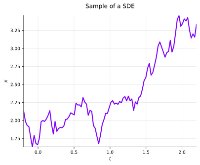
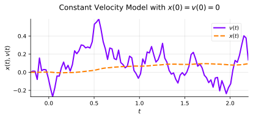
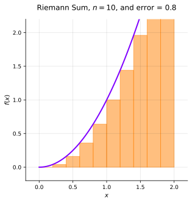
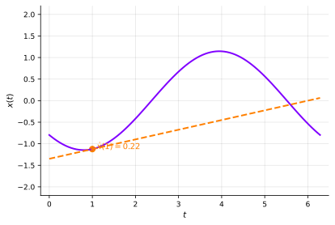
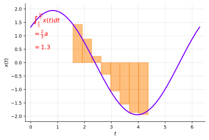

## Introduction
Most SDEs take the form,

$$
\begin{equation}
\label{eq:sde-definition}
dx(t) = \underbrace{f(x(t), t) \ dt}_{\text{drift}} + \underbrace{L(x(t), t) \ d\beta(t)}_{\text{diffusion}},
\end{equation}
$$

where $x(t)$ is a stochastic process and $\beta(t)$ is Brownian motion [^1].

The SDE in @eq:sde-definition is shorthand for the (Itô, teaser!) integral equation,

$$
x(t) - x(t_0) = \int_{t_0}^{t} f(x(s), s) \ ds + \int_{t_0}^{t} L(x(s), s) \ d\beta(s).
$$

Suppose $f(x, t) = 2, L(x, t) = 0$, $\Rightarrow \frac{dx}{dt} = 2$.

We also assume that $x(0) \sim \mathcal{N}(0, 2)$. See @fig:sde-only-drift.

:::definition[Definition: Brownian motion -- &nbsp; $\beta(t)$]
1. Any increment $\Delta \beta = \beta(t^{\prime}) - \beta(t) \sim \mathcal{N}(0, (t^{\prime} - t) Q).$ (Often $Q = 1$).
2. Increments are independent unless intervals overlap.
3. $\beta(0) = 0$.
:::

Suppose $f(x, t) = 0, L(x, t) = 2$, $\Rightarrow dx(t) = 2 \ d \beta(t)$.

We also assume that $x(0) \sim \mathcal{N}(0, 1)$. See @fig:sde-only-diffusion.

To sample $x(t)$, we can draw $x(0) \sim p(x(0))$ and then repeat,

$$
\begin{equation}
\label{eq:euler-maruyama-step}
x(t + \Delta t) = x(t) + f(x(t), t) \Delta t + L(x(t), t)z, \quad z \sim \mathcal{N}(0, \Delta t).
\end{equation}
$$

We can use @eq:euler-maruyama-step to sample from,
$$
d x(t) = 0.5x \ dt + d \beta(t),
$$

which corresponds to $f(x, t) = 0.5x$ and $L(x, t) = 1$. See @fig:sde-example.

#### Motivation and Dynamic Models
SDEs are commonly used to model object dynamics (cars, airplanes, etc).

Often, time-discretized versions are used for filtering, smoothing, and prediction.

##### Constant Velocity Models (Scalar Example)
Suppose $\mathbf{x}(t) = \begin{bmatrix} x(t) & v(t) \end{bmatrix}^T$ represents the position and velocity of an object.

According to the constant velocity model,

$$
\begin{align*}
d \mathbf{x}(t) & =
\begin{bmatrix}
0 & 1 \newline
0 & 0
\end{bmatrix} \mathbf{x}(t) \ dt +
\begin{bmatrix}
0 \newline
q
\end{bmatrix} d \beta(t), \newline
\Leftrightarrow & =
\begin{bmatrix}
v(t) \ dt \newline
0
\end{bmatrix} +
\begin{bmatrix}
0 \newline
q \ d \beta(t)
\end{bmatrix}.
\end{align*}
$$

The position follows the velocity, whereas the velocity is a Brownian motion.

The **Ornstein-Uhlenbeck** process [^2],

$$
dv(t) = -\theta v(t) \ dt + \sigma \ d \beta(t),
$$

is used in several fields, e.g., in physics to model particles moving with friction.

The **Black-Scholes equation** [^3] is widely used in finacne to model the value of "financial instruments".

A basic version of this equation is,

$$
d \ s(t) = \mu s(t) \ dt + \sigma s(t) \ d \beta(t),
$$

where $s(t)$ is the stock price.

The stochastic **Lotka-Volterra** [^4] model describes the predator-prey dynamics,

$$
\begin{align*}
dx(t) & = x(t)(a - b y(t)) \ dt + \sigma_1 x(t) \ d \beta_1(t), \newline
dy(t) & = y(t)(-c + d x(t)) \ dt + \sigma_2 y(t) \ d \beta_2(t).
\end{align*}
$$

Here, $x(t)$ and $y(t)$ are the prey and the predator populations, respectively, and $\beta_1(t)$ and $\beta_2(t)$ are independent Brownian motions.

Diffusion can be used as a (deep) generative model as well (and this is what we are mostly interested in).

The basic idea is,

* Recursively remove structure from data (make it noisier!).
* Train network to **remove** noise and **obtain structure again**.
* Generate (new) data by feeding noise to the trained network.

The forward process is generally an SDE,
$$
d x(t) = f(x, t) \ dt + L(t) \ d \beta(t).
$$

We are going to get a solid understanding of theoretical results used to train and perform inference in these models.

Image generation is arguably the most well-known application. A few other examples are,

* Besides bridging noise and data distributions we can bridge, e.g., low- and high-resolution images.
* Molecular and drug design, e.g., protein structures.
* Sequential data, e.g., human pose sequences and financial data.
* Motion planning and reinforcement learning with diffusion policies.

### The Engineering Approach: White Noise
Recall that we study SDEs on the form,

$$
\begin{align*}
dx(t) & = f(x(t), t) \ dt + L(x(t), t) \ d \beta(t), \newline
x(t) - x(t_0) & = \int_{t_0}^t f(x(s), s) \ ds + \int_{t_0}^t L(x(s), s) \ d \beta(s).
\end{align*}
$$

In engineering literature, the notation $d \beta(t)$ is uncommon in integrals.

Imagine for a second that if $\beta(t)$ were differentiable (it isn't!), we could introduce $w(t) = \frac{d \beta(t)}{dt}$,

$$
\begin{align*}
\frac{dx(t)}{dt} & = f(x, t) + L(x, t) \ w(t), \newline
x(t_1) - x(t_0) & = \int_{t_0}^{t_1} f(x(s), s) \ ds + \int_{t_0}^{t_1} L(x(s), s) w(s) \ ds,
\end{align*}
$$

where $w(t)$ is **white noise**.

In engineering literature, this is the standard form to express SDEs.

However, what is white noise? We know that $\beta(t)$ has independent increments.

It is common to assume that $w(t)$ is a Gaussian process with,

$$
\begin{align*}
\mathbb{E}[w(t)] & = 0, \newline
\mathrm{Cov}(w(t), w(t + \tau)) & = \delta(\tau).
\end{align*}
$$

However, if we naively use these assumptions to derive, e.g., $\mathbb{E}[X(t)]$ and $\mathrm{Cov}(x(t))$, we get the wrong expression for $\mathrm{Cov}(x(t))$.

> "The white Gaussian process is mathematical fiction". - [AH Jazwinski](https://www.sciencedirect.com/bookseries/mathematics-in-science-and-engineering/vol/64/suppl/C).

We'll take the (more) mathematical approach and express SDEs using $d \beta(t)$ and learn about Itô calculus [^5] to enable us to derive the **correct** expressions.

## Basic Results on Random Variables
Formally, we can introduce a probability space with,
- A probability (or sample) space $\Omega$, whose elements $\omega \in \Omega$ are called sample points,
- A $\sigma$-algebra $\mathcal{F}$ [^6], and,
- A probability measure [^7] $Pr(F)$ for $F \in \mathcal{F}$.

A random variable is then a function $x(\omega)$.

We'll occasionally use the notation $x(\omega)$, but generally characterize random variables using,

- $Pr[x]$, a probability mass function, for **discrete** random variables,
- $p(x)$, a probability density function, for **continuous** random variables.

Some (very) basic concepts from probability theory,
- Expected values: $\mathbb{E}[f(x)]$ = $\int f(x) p(x) \ dx$,
- Variance: $\mathrm{Var}(x) = \mathbb{E}[(x - \mathbb{E}[x])^2]$,
- Covariance: $\mathrm{Cov}(\mathbf{x}) = \mathbb{E}[(\mathbf{x} - \mathbb{E}[\mathbf{x}])(\mathbf{x} - \mathbb{E}[\mathbf{x}])^T]$,
- Jointly distributed random variables $p(x, y)$, and,
    - Conditional distributions $p(x | y) = \frac{p(x, y)}{p(y)}$,
    - Law of total probability (marginalization) $p(x) = \int p(x, y) \ dy$,
    - Independent variables $p(x, y) = p(x) p(y)$.
    - Law of iterated/total expectations $\mathbb{E}[x] = \mathbb{E}[\mathbb{E}[x | y]]$.

Gaussian random variables are key to SDEs. A Gaussian (normal) random variable $\mathbf{x} \sim \mathcal{N}(\mathbf{\mu}, \mathbf{P})$ has density,

$$
p(\mathbf{x}) = \frac{\exp\left(-\frac{1}{2}(\mathbf{x} - \mathbf{\mu})^T \mathbf{P}^{-1} (\mathbf{x} - \mathbf{\mu})\right)}{|2\pi \mathbf{P}|^{1/2}}.
$$

The most important property of Gaussian random variables is that any linear combination of Gaussian random variables is also Gaussian.

If $\mathbf{x_1} \sim \mathcal{N}(\mathbf{\mu_1}, \mathbf{P_1})$ and $\mathbf{x_2} \sim \mathcal{N}(\mathbf{\mu_2}, \mathbf{P_2})$, and $\mathbf{A_1}$, $\mathbf{A_2}$, and $\mathbf{b}$ are constants, then,

$$
\begin{align*}
\mathbf{x} & = \mathbf{A_1} \mathbf{x_1} + \mathbf{A_2} \mathbf{x_2} + \mathbf{b} \sim \mathcal{N}(\mathbf{\mu}, \mathbf{P}), \newline
\mathbf{\mu} & = \mathbf{A_1} \mathbf{\mu_1} + \mathbf{A_2} \mathbf{\mu_2} + \mathbf{b}, \newline
\mathbf{P} & = \mathbf{A_1} \mathbf{P_1} \mathbf{A_1}^T + \mathbf{A_2} \mathbf{P_2} \mathbf{A_2}^T.
\end{align*}
$$

## Introduction to Stochastic Processes
SDEs describe a **class** of stochastic processes (SDEs cannot describe all stochastic processes).

:::definition[Definition: Stochastic process]
A stochastic process is a family of (jointly distributed) random variables $\{x(t)\}_{t \in T}$.
:::

Processes described by SDEs have continuous states $x$ and parameters $t$.

For a given time, $t$, we have stochastic variables, $x(t)$.
Note that we do not separate the notation for the stochastic/random variable and its realization.

Often, we also use a shorthand for its density, $p(x, t) = p(x(t))$ and allow our notation for the argument to specify the density that we evaluate.

## Convergence, Integrals and Mean Square Calculus
- **Convergence** is an essential concept in real analysis.
- **Continuity**: A function $f(x)$ is continuous at $a$ if $\lim_{x \to a} f(x) = f(a)$.
- **Derivative**: If it exists, the derivative of $f$ at $x$ is,

$$
f^{\prime}(x) \triangleq \lim_{h \to 0} \frac{f(x + h) - f(x)}{h}.
$$

- Riemann integrals:

Let $P(t)$ be a partition of $[a, b]$,

$$
a = t_0 < t_1 < \ldots < t_n = b,
$$

and let its norm be $|P| = \underset{i}{\max}(t_{i + 1} - t_i)$.

- If the limit exists, the Riemann integral is,

$$
\int_{a}^{b} f(t) \ dt \triangleq \lim_{\substack{n \to \infty \newline |P| \to 0}} \sum_{i = 0}^{n - 1} (t_{i + 1} - t_i) f(t_i^{\star}),
$$

for any $t_i^{\star} \in [t_i, t_{i + 1}]$.

How is convergence defined?

A deterministic sequence $x_n \in \mathbb{R}$ converges to $a$ if $\forall \epsilon > 0, \exists N$,

$$
\Vert x_n - a \Vert_2 < \epsilon, \quad \forall n > N.
$$

That is, for sufficiently large $n$, $x_n$ is roughly $a$.

How should one define convergence for a sequence of random variables?

A few (decently) intuitive ways are,

The sequence of random variables $x_n$ is said to converge to $x$,
- with probability 1 (almost surely) if,

$$
Pr[\lim_{n \to \infty} x_n(\omega) = x(\omega)] = 1.
$$

- in **mean square** if,

$$
\lim_{n \to \infty} \mathbb{E}[(x_n - x)^2] = 0.
$$
-  in **probability** if for all $\epsilon > 0$,

$$
\lim_{n \to \infty} Pr[\Vert x_n(\omega) - x(\omega) \Vert >= \epsilon] = 0,
$$

- in **distribution** if for all $A \subset \mathbb{R}^n$,

$$
\lim_{n \to \infty} Pr[x_n \in A] = Pr[x \in A].
$$

The "weakest" of these is convergence in distribution, and the "strongest" is convergence almost surely.

:::warning[Convergence in distribution]
Suppose $x, x_1, x_2, \ldots$ are independent and identically distributed, $\mathcal{N}(0, 1)$.

The random sequence only converges in distribution,

$$
\lim_{n \to \infty} Pr[x_n \leq x] = Pr[x \leq x].
$$
:::

:::warning[Convergence in almost surely, mean square, and in probability]
Suppose $x, y_1, y_2, \ldots$ are independent and identically distributed, $\mathcal{N}(0, 1)$.

The random sequence $x_n = x + \frac{y_n}{n}$ converges to $x_n$ in all senses.
:::

### Continuous and Differentiable Random Variables
:::definition[Definition: Continuous random functions (in mean square sense)]
The random function is continuous **in mean square** at $t$ if,

$$
\underset{h \to 0}{\text{l.i.m}} \ x(t + h) = x(t),
$$

where $\text{l.i.m}$ is *limits in mean square*.
:::

:::definition[Definition: Differentiable random functions (in mean square sense)]
The mean square derivative is,

$$
\dot{x}(t) \triangleq \underset{h \to 0}{\text{l.i.m}} \frac{x(t + h) - x(t)}{h},
$$

if the limit exists.
:::

Consider $x(t) = a \ sin(t + \phi)$ where $a \sim \text{unif}[1, 2]$ and $\phi \sim \text{unif}[0, 2\pi]$.

The random function is **differentiable**.
Note that the derivative is itself random.

See @fig:random-diff for a visualization of the random function and its derivative at $x = 1$.

:::definition[Definition: Mean square Riemann integrals]
Riemann integrals:
As before, let $P(t)$ be a partition of $[a, b]$,

$$
a = t_0 < t_1 < \ldots < t_n = b
$$

and let its norm be $|P| = \underset{i}{\max}(t_{i+1} - t_i)$.
If the limit exists, the mean square Riemann integral is,

$$
\int_{a}^{b} x(t) \ dt \triangleq \underset{\substack{n \to \infty \newline |P| \to 0}}{\text{l.i.m}} \sum_{i=0}^{n-1} (t_{i+1} - t_i) x(t^{\star}_i),
$$

for any $t^{\star}_i \in [t_i, t_{i+1}]$.
:::

For $x(t) = a \ sin(t + \phi)$, consider the integral,

$$
\int_{\frac{\pi}{2}}^{\frac{3\pi}{2}} x(t) \ dt.
$$

Note, the integral is a random variable.

## Summary
Most SDEs take the form,

$$
\begin{equation}
\label{eq:sde-differential}
dx(t) = \underbrace{f(x(t), t) \ dt}_{\text{drift}} + \underbrace{L(x(t), t) \ d\beta(t)}_{\text{diffusion}},
\end{equation}
$$

where $x(t)$ is a stochastic process and $\beta(t)$ is a Brownian motion.

SDEs describe a class of stochastic processes useful in many areas (economics, physics, etc).
Where we specifically (will) focus on (deep) generative models.

We can use mean square convergence to define convergence, derivates, and Riemann integrals for stochastic processes.

@eq:sde-differential is shorthand for,

$$
x(t) - x(t_0) = \int_{t_0}^t f(x(s), s) \ ds + \int_{t_0}^t L(x(s), s) \ d\beta(s).
$$

**Note**, we can use mean square Riemann integrals to define $\int_{t_0}^{t} f(x(s), s) \ ds$ but not $\int_{t_0}^{t} L(x(s), s) \ d\beta(s)$.

We need Itô calc for that ;).

[^1]: [Wikipedia, Brownian Motion](https://en.wikipedia.org/wiki/Brownian_motion)
[^2]: [Wikipedia, Ornstein-Uhlenbeck Process](https://en.wikipedia.org/wiki/Ornstein%E2%80%93Uhlenbeck_process)
[^3]: [Wikipedia, Black-Scholes Model](https://en.wikipedia.org/wiki/Black%E2%80%93Scholes_model)
[^4]: [Wikipedia, Lotka-Volterra equations](https://en.wikipedia.org/wiki/Lotka%E2%80%93Volterra_equations)
[^5]: [Wikipedia, Itô calculus](https://en.wikipedia.org/wiki/It%C3%B4_calculus)
[^6]: [Wikipedia, $\sigma$-algebra](https://en.wikipedia.org/wiki/%CE%A3-algebra)
[^7]: [Wikipedia, Probability Measure](https://en.wikipedia.org/wiki/Probability_measure)
