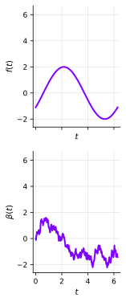
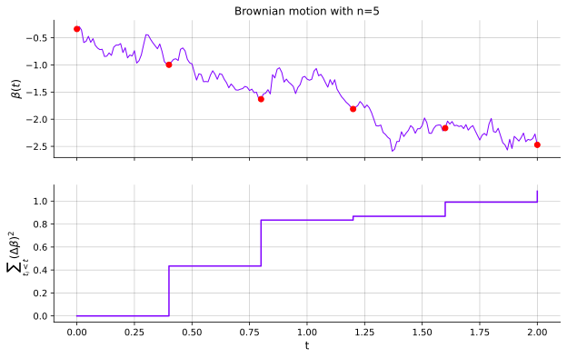

## Introduction
Recall that we study SDEs of the form,

$$
\begin{align*}
dx(t) & = \underbrace{f(x(t), t) \ dt}_{\text{drift}} + \underbrace{L(x(t), t) \ d\beta(t)}_{\text{diffusion}}, \newline
x(t) - x(t_0) & = \underbrace{\int_{t_0}^t f(x(s), s) \ ds}_{\text{mean square Riemann integral}} + \underbrace{\int_{t_0}^t L(x(s), s) \ d\beta(s)}_{\text{Itô integral}}.
\end{align*}
$$

where $x(t)$ is a stochastic process and $\beta(t)$ is a Brownian motion.

Today we'll understand why the second integral will be solved with the **Itô integral** and not the (mean square) Riemann integral.

To understand this, let's firstly study Brownian motion and its properties.

## Brownian Motion
Recall the definition of Brownian motion,

:::definition[Definition: Brownian motion -- &nbsp; $\beta(t)$]
1. Any increment $\Delta \beta(t) = \beta(t^{\prime}) - \beta(t) \sim \mathcal{N}(0, (t^{\prime} - t))$.
2. Increments are independent unless intervals overlap.
3. $\beta(0) = 0$.
:::

We can see that the variance grows linearly with time, we can argue for this given independent and stationary intervals.

For an interval $[t_0, t_1, t_2]$ with $t_0 < t_1 < t_2$, we have

$$
\beta(t_2) - \beta(t_0) = \underbrace{\underbrace{\beta(t_2) - \beta(t_1)}_{\sim \mathcal{N}(0, (t_2 - t_1))} + \underbrace{\beta(t_1) - \beta(t_0)}_{\sim \mathcal{N}(0, (t_1 - t_0))}}_{\sim \mathcal{N}(0, (t_2 - t_0))},
$$

which matches assumption (1) of Brownian motion.

In fact, the linear variance in (1) follows *from* stationary independent increments.

### Is $\beta(t)$ a continuous?
Let's investigate if $\beta(t)$ is continuous.

As we have seen previously, we can show that a random sequence is continuous (in mean square) if,

$$
\begin{align*}
\underset{h \to 0}{\text{l.i.m}} \ \beta(t + h) & = \beta(t), \newline
\lim_{h \to 0} \mathbb{E}[\Vert \beta(t + h) - \beta(t) \Vert^2] & = 0.
\end{align*}
$$

By the definition of Brownian motion (and assumption (1)), we have

$$
\begin{align*}
\lim_{h \to 0} \mathbb{E}[\Vert \underbrace{\beta(t + h) - \beta(t)}_{\sim \mathcal{N}(0, |h|)} \Vert^2] & = \newline
\lim_{h \to 0} |h| & = 0 \quad \square
\end{align*}
$$

Hence, $\beta(t)$ is continuous.

### Is $\beta(t)$ differentiable?
Is there a random variable $\dot{\beta}(t)$,

$$
\underset{h \to 0}{\text{l.i.m}} \ \frac{\beta(t + h) - \beta(t)}{h} = \dot{\beta}(t),
$$

which is equivalent to,

$$
\lim_{h \to 0} \mathbb{E}\left[\left\Vert \underbrace{\frac{\beta(t + h) - \beta(t)}{h}}_{\mathcal{N}(0, \frac{1}{|h|})} - \dot{\beta}(t) \right\Vert^2\right] = 0.
$$

Since $\frac{\beta(t + h) - \beta(t)}{h} \sim \mathcal{N}(0, \frac{1}{|h|})$, has a variance that grows with $|h|$, we can see that the limit does not exist (goes to $\infty$ as $h \to 0$).

Instead, $\beta(t)$ is like a fractal as $h \to 0$ the variance grows to $\infty$.

### Properties of Brownian motion
Let's summarize the properties of Brownian motion,

:::note[Continuous but non-differentiable]
* Brownian motion is (in mean square) continuous. It is also everywhere continuous with probability 1 (almost surely).
* Brownian motion is mean square non-differentiable. It is also nowhere differentiable with probability 1 (almost surely).
* A standard Brownian motion $(Q = 1)$ is often called a Wiener process [^1].
* Brownian motion is a martingale [^2], $\mathbb{E}[x(t + \tau) | x(t)] = x(t)$ for $\tau > 0$.
* Brownian motion has independent and stationary increments and is the most famous Lévy process [^3].
* It is Markovian, i.e., $p(x(t_i) | x(t_1), \ldots, x(t_{i-1})) = p(x(t_i) | x(t_{i-1}))$ if $t_j > t_{j_1}$ for all $j$.
* It is non-monotonic on all intervals, and it is a fractal.
:::

## Brownian motion and Riemann integral
A quick technical note, the Riemann-**Stieltjes** integral is defined as,

$$
\int_{t_0}^{t_1} f(t) \ d\beta(t) = \lim_{n \to \infty} \sum_{i=0}^{n-1} f(t_i) (\beta(t_{i+1}) - \beta(t_i)),
$$

you can see that the only difference is that the $(t_{i+1} - t_i)$ term is replaced with $(\beta(t_{i+1}) - \beta(t_i))$.

So, why isn't $\int_{t_0}^{t} L(x(s), s) \ d \beta(s)$ a Riemann-Stieltjes integral?

Let's first recall the definition of the Riemann integral,
:::definition[Definition: Riemann integral]
If the limit exists, and is the same for any $t^{\star}_i \in [t_i, t_{i+1}]$, the Riemann integral is defined as,
$$
\int_{a}^{b} f(t) \ dt \triangleq \lim_{\substack{n \to \infty \newline |P| \to 0}} \sum_{i=0}^{n-1} (t_{i+1} - t_i) f(t^{\star}_i).
$$
:::

Suppose the limit exists for an arbitrary $t^{\star}_i \in [t_i, t_{i+1}]$, do we get the same limit for $\forall t^{\star}_i \in [t_i, t_{i+1}]$?

Recall that $P(t)$ is a partition of $[a, b]: a = t_0 < t_1 < \ldots < t_n = b$.

We assume that $t_{i + 1} = \frac{b - a}{n}$ for all $i \Rightarrow |P| = \underset{i}{\max}(t_{i + 1} - t_i) = \frac{b - a}{n}$.

### Left and Right Riemann sum
Let's now investigate if the left and right Riemann sums have identical limits,

$$
L(n) = \sum_{i=0}^{n-1} \underbrace{(t_{i + 1} - t_i)}_{= \frac{b - a}{n}} f(t_i) \quad \text{and} \quad R(n) = \sum_{i=0}^{n-1} \underbrace{(t_{i + 1} - t_i)}_{= \frac{b - a}{n}} f(t_{i + 1}).
$$

We'll investigate three different examples, starting with the (trivial) case.

#### Example 1: $f(t) = t$
Consider the case when $f(t) = t$, we'll denote $(t_{i + 1} - t_i) = \frac{b - a}{n} = \Delta t$,

$$
\begin{align*}
L(n) & = \sum_{i=0}^{n-1} \Delta t \cdot t_i, \newline
R(n) & = \sum_{i=0}^{n-1} \Delta t \cdot t_{i + 1}, \newline
R(n) - L(n) & = \sum_{i=0}^{n-1} \Delta t \cdot \underbrace{(t_{i + 1} - t_i)}_{= \Delta t} \newline
& = \sum_{i=0}^{n-1} \Delta t^2 \newline
& = n \cdot \Delta t^2 \newline
& = \frac{(b - a)^2}{n} = \mathcal{O}\left(\frac{1}{n}\right).
\end{align*}
$$

Thus, as $n \to \infty$, $R(n) - L(n) \to 0$.

#### Example 2: $\int t \ d\beta(t)$
Consider the Riemann(-Stieltjes) sum,

$$
\sum_{i=0}^{n-1} f(t^{\star}_i)(\beta(t_{i + 1}) - \beta(t_i)).
$$

Since we now have a random sequence, we need to take the limit in mean square, or in other words, is $\underset{n \to \infty}{\text{l.i.m}} \ R(n) - L(n) = 0$?

Again, we let $\Delta \beta_i = \beta(t_{i + 1}) - \beta(t_i) \sim \mathcal{N}(0, \Delta t)$, and we have,

$$
\begin{align*}
R(n) - L(n) & = \sum_{i=0}^{n-1} \underbrace{\Delta \beta_i}_{\sim \mathcal{N}(0, \Delta t)} \cdot \underbrace{(t_{i + 1} - t_i)}_{\Delta t} \newline
& = \sum_{i=0}^{n-1} \underbrace{\Delta \beta_i \cdot \Delta t}_{\sim \mathcal{N}(0, \Delta t^3)} \newline
& = \underbrace{n \cdot \Delta \beta_i \cdot \Delta t}_{\sim \mathcal{N}(0, n \Delta t^3)} = \mathcal{O}\left(\frac{1}{n^2}\right).
\end{align*}
$$

Thus, as $n \to \infty$, $R(n) - L(n) \to 0$ and it is mean square Riemann(-Stieltjes) integrable.

#### Example 3: $\int \beta(t) \ d\beta(t)$
Finally, let's consider the case when $f(t) = \beta(t)$, we compare,

$$
\begin{align*}
L(n) & = \sum_{i=0}^{n-1} \beta(t_i) \Delta \beta_i, \newline
R(n) & = \sum_{i=0}^{n-1} \beta(t_{i + 1}) \Delta \beta_i, \newline
\end{align*}
$$

where $\Delta \beta_i = \beta(t_{i + 1}) - \beta(t_i) \sim \mathcal{N}(0, \Delta t)$.

Is $\underset{n \to \infty}{\text{l.i.m}} \ R(n) - L(n) = 0$?

We have,
$$
\begin{align*}
R(n) - L(n) & = \sum_{i=0}^{n-1} \Delta \beta_i \cdot \underbrace{(\beta(t_{i + 1}) - \beta(t_i))}_{\Delta \beta_i} \newline
& = \sum_{i=0}^{n-1} \Delta \beta_i^2 \newline
& \Rightarrow \mathbb{E}[R(n) - L(n)] = \sum_{i=0}^{n-1} \mathbb{E}[\Delta \beta_i^2] \newline
& \Rightarrow \mathrm{Var}(\Delta \beta_i) = \mathbb{E}[\Delta \beta_i - \underbrace{\mathbb{E}[\Delta \beta_i]}_{= 0}]^2 \newline
& \Rightarrow \mathbb{E}[\Delta \beta_i^2] = \mathrm{Var}(\Delta \beta_i) = \Delta t \newline
& \Rightarrow \mathbb{E}[R(n) - L(n)] = n \cdot \Delta t = \boxed{b - a}.
\end{align*}
$$

Thus, as $n \to \infty$, $R(n) - L(n) \to b - a$ and it is not mean square Riemann(-Stieltjes) integrable.

## Itô integral
Riemann(-Stieltjes) sums cannot define $\int \beta(t) \ d\beta(t)$ since the limit depends on $t^{\star}_i$.

Instead, we define the Itô integral as,
:::definition[Definition: Itô integrals]
We define the Itô integral (of the diffusion term) as,
$$
\int_{t_0}^{t} L(x(s), s) \ d\beta(s) = \underset{\substack{n \to \infty \newline |P| \to 0}}{\text{l.i.m}} \sum_{i=0}^{n-1} L(x(t_i), t_i) (\beta(t_{i + 1}) - \beta(t_i)).
$$
:::

The difference compared to using Riemann(-Stieltjes) sums is that $t^{\star}_i = t_i$.

We finally have our definition of our SDEs,

$$
x(t) - x(t_0) = \underbrace{\int_{t_0}^t f(x(s), s) \ ds}_{\text{mean square Riemann integral}} + \underbrace{\int_{t_0}^t L(x(s), s) \ d\beta(s)}_{\text{Itô integral}}.
$$

## The Euler-Maruyama method
It is generally intractable to exactly simulate a process $x(t)$ described by an SDE,

$$
\begin{equation}
\label{eq:euler-maruyama-sde}
dx(t) = f(x(t), t) \ dt + L(x(t), t) \ d\beta(t).
\end{equation}
$$

The Euler-Maruyama method corresponds to the approximation,

$$
dx(t) \approx f(x(t_i), t_i) \ dt + L(x(t_i), t_i) \ d\beta(t), \quad \forall t_i \in [t_i, t_{i + 1}].
$$

:::definition[Definition: The Euler-Maruyama method]
To simulate $x(t)$ from @eq:euler-maruyama-sde, draw $x(t_0) \sim p(x(t_0))$ and repeat for $i = 0, \ldots$,
1. Sample the Brownian motion, $\Delta \beta_i \sim \mathcal{N}(0, \Delta t)$.
2. Predict the mean, $\hat{x}(t_{i + 1}) = x(t_i) + (t_{i + 1} - t_i) f(x(t_i), t_i)$.
3. Sample the new state, $x(t_{i + 1}) = \hat{x}(t_{i + 1}) + L(x(t_i), t_i) \Delta \beta_i$.
:::

## Second-Order Stochastic Integrals
We can also define the **second-order** stochastic integrals,

$$
\int_{a}^{b} g(t) (d \beta(t))^2 \triangleq \underset{\substack{n \to \infty \newline |P| \to 0}}{\text{l.i.m}} \sum_{i=0}^{n-1} g(t_i) (\beta(t_{i + 1}) - \beta(t_i))^2.
$$

If we set $g(t) = 1$ and standard $P$, we get,

$$
\begin{equation}
\label{eq:quadratic-brownian-variation}
\sum_{i=0}^{n-1} (\beta(t_{i + 1}) - \beta(t_i))^2,
\end{equation}
$$

Which we know has an expected value of $b - a$.

Now, let $z_i = \beta(t_{i + 1}) - \beta(t_i) \sim \mathcal{N}(0, \Delta t)$.

@eq:quadratic-brownian-variation is $\Vert z \Vert^2$, $\mathbb{E}[\Vert z \Vert^2] = b - a$, and $\dim(z) = n$.

In a more abstract sense, as $n \to \infty$, samples from $z$ **concentrates close to the surface of a sphere**.

This is known as **concentration of measure** [^4], a key result in many fields.

:::note[Theorem on second-order stochastic integrals (scalar case)]
Under suitable regularity conditions (e.g., g(t) is independent of future increments $\Delta \beta$),
$$
\int_{a}^{b} g(t) (d \beta(t))^2 = \int_{a}^{b} g(t) dt.
$$
:::

In this context, we can simply replace (d$\beta(t)$)$^2$ by $dt$ and the Brownian motion does not introduce extra stochasticity.

## Summary
* Brownian motion can be defined by,
:::definition[Definition: Brownian motion -- &nbsp; $\beta(t)$]
1. Any increment $\Delta \beta(t) = \beta(t^{\prime}) - \beta(t) \sim \mathcal{N}(0, (t^{\prime} - t))$.
2. Increments are independent unless intervals overlap.
3. $\beta(0) = 0$.
:::

* We have seen that $\beta(t)$ is continuous but non-differentiable.

* Riemann(-Stieltjes) sums cannot be used to integrate, e.g., $\int \beta(t) \ d\beta(t)$.

* Instead, we normally use the **Itô integral**,
$$
\int_{t_0}^{t} L(x(s), s) \ d\beta(s) \triangleq \underset{\substack{n \to \infty \newline |P| \to 0}}{\text{l.i.m}}\sum_{i=0}^{n-1} L(x(t_i), t_i) (\beta(t_{i + 1}) - \beta(t_i)).
$$

* The second-order stochastic integrals satisfy,
$$
\int_{a}^{b} g(t) (d \beta(t))^2 = \int_{a}^{b} g(t) dt.
$$

* The Euler-Maruyama method is a simple sampling strategy, can be derived from,
$$
dx(t) \approx f(x(t_i), t_i) \ dt + L(x(t_i), t_i) \ d\beta(t), \quad \forall t_i \in [t_i, t_{i + 1}].
$$

[^1]: [Wikipedia: Wiener process](https://en.wikipedia.org/wiki/Wiener_process)
[^2]: [Wikipedia: Martingale](https://en.wikipedia.org/wiki/Martingale_(probability_theory))
[^3]: [Wikipedia: Lévy process](https://en.wikipedia.org/wiki/L%C3%A9vy_process)
[^4]: [Wikipedia: Concentration of measure](https://en.wikipedia.org/wiki/Concentration_of_measure)
