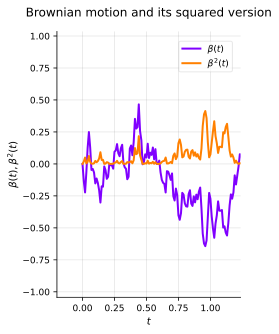

## Introduction
Recall that we study SDEs of the form,

$$
\begin{align*}
dx(t) & = \underbrace{f(x(t), t) \ dt}_{\text{drift}} + \underbrace{L(x(t), t) \ d\beta(t)}_{\text{diffusion}}, \newline
x(t) - x(t_0) & = \underbrace{\int_{t_0}^{t} f(x(s), s) \ ds}_{\text{mean square Riemann Integral}} + \underbrace{\int_{t_0}^{t} L(x(s), s) \ d\beta(s)}_{\text{Itô Integral}},
\end{align*}
$$

where $x(t)$ is a stochastic process and $\beta(t)$ is a Brownian motion.

We define the Itô integral (of the diffusion term) as,

$$
\int_{t_0}^{t} L(x(s), s) \ d\beta(s) = \underset{\substack{n \to \infty \newline |P| \to 0}}{\text{l.i.m}} \sum_{i=0}^{n-1} L(x(t_i), t_i) (\beta(t_{i + 1}) - \beta(t_i)).
$$

Under suitable regularity conditions (e.g., $f$ and $L$ Lipschitz [^1]), the above SDE has a solution $x(t)$.

:::note[Properties of SDEs]
* The solution $x(t)$ is a unique and continuous stochastic process, in the mean square sense.
* In short, $x(t)$ inherits properties of the Brownian motion and is generally **not** mean square **differentiable**.
:::

## The Classical Chain Rule
Suppose $x(t)$ satisfies the ordinary differential equation (ODE),

$$
\frac{dx(t)}{dt} = f(x(t)),
$$

:::definition[Definition: The Chain Rule]
If $\phi(x)$ is a differentiable function, then,
$$
\frac{d \phi(x(t))}{dt} = \underbrace{\frac{d \phi(x(t))}{dx}}_{\phi^{\prime}(x(t))} \underbrace{\frac{d x(t)}{dt}}_{x^{\prime}(t)} = \phi^{\prime}(x) f(x(t)).
$$
:::

### Integral Form of the Chain Rule
Suppose $x(t)$ satisfies the (same) ODE,

$$
\begin{align*}
dx(t) & = f(x(t)) \ dt, \newline
x(t) - x(t_0) & = \int_{t_0}^{t} f(x(s)) \ ds.
\end{align*}
$$

:::definition[Definition: The Chain Rule]
If $\phi(x)$ is a differentiable function, then,
$$
\begin{align*}
\phi(x(t)) - \phi(x(0)) & = \int_{0}^{t} \frac{d \phi(x(s))}{ds} \ ds = \int_{0}^{t} \phi^{\prime}(x(s)) dx(s) \newline
& = \int_{0}^{t} \phi^{\prime}(x(s)) f(x(s)) \ ds \newline
d \phi(x(t)) & = \phi^{\prime}(x(t)) \ dx(t) = \phi^{\prime}(x(t)) f(x(t)) \ dt.
\end{align*}
$$
:::

### Derivation of the Integral Form
Consider a partition, $a = t_0 < t_1 < \ldots < t_n = b$ such that $t_{i+1} - t_i = \Delta t = \frac{b - a}{n} $ for $i = 1, 2, \ldots, n$.

It follows that,

$$
\phi(x(b)) - \phi(x(a)) = \sum_{i=0}^{n-1} \phi(x(t_{i + 1})) - \phi(x(t_i)).
$$

We have $n$ terms and $\Delta t = \frac{b - a}{n} \Rightarrow \mathcal{O}(\Delta t^2)$ can be ignored as $n \to \infty$.

Using $dx(t) = f(x(t)) dt$ (the ODE) and its Taylor expansion, we get,

$$
\begin{align*}
x(t_{i + 1}) & = x(t_i) + f(x(t_i)) \Delta t + \mathcal{O}(\Delta t^2), \newline
\phi(x(t_{i + 1})) & = \phi(x(t_i)) + \phi^{\prime}(x(t_i))(x(t_{i + 1}) - x(t_i)) + \mathcal{O}(\Delta t^2).
\end{align*}
$$

Thus, we conclude that,
$$
\phi(x(b)) - \phi(x(a)) = \sum_{i=0}^{n-1} \phi^{\prime}(x(t_i)) f(x(t_i)) \Delta t  = \int_{a}^{b} \phi^{\prime}(x(t)) f(x(t)) \ dt.
$$

Recall that the ODE $dx(t) = f(x(t)) \ dt$ and that all $\mathcal{O}(\Delta t^2)$ terms can be ignored, as $n \to \infty$,

$$
\begin{align*}
d\phi(x(t)) & = \phi^{\prime}(x(t)) \ dx(t) + \frac{1}{2} \phi^{\prime \prime}(x(t)) (dx(t))^2 + \mathcal{O}((dx(t))^3) \newline
& = \phi^{\prime}(x(t)) \ dx(t) \newline
& = \phi^{\prime}(x(t)) f(x(t)) \ dt.
\end{align*}
$$

### Solving ODEs
The chain rule is useful in various contexts, but we note that it yields **a new ODE**,

$$
\begin{align*}
dx(t) & = f(x(t)) \ dt, \newline
d\phi(x(t)) & = \phi^{\prime}(x(t)) \ dx(t) \newline
& = \phi^{\prime}(x(t)) f(x(t)) \ dt.
\end{align*}
$$

We can use this to solve ODEs.

:::note[Example]
Solving $dx(t) = -cx(t) \ dt$ where $x(0) = 1$.

We introduce $\phi(x(t)) = \log x(t)$. The chain rule implies,
$$
d\phi(x(t)) = \frac{dx(t)}{x(t)} = -c \ dt.
$$
This implies that $\phi(x(t)) = -ct$ and hence,
$$
x(t) = \exp(-ct).
$$
:::

## Itô Stochastic Calculus
Suppose $x(t)$ is described (in the Itô sense) by the SDE,

$$
dx(t) = f(x(t), t) \ dt + L(x(t), t) \ d\beta(t).
$$

The "chain rule" for $\phi(x(t))$ is called the **Itô formula**.

To present a short derivation, we recall that,

$$
\int_{a}^{b} g(t) \ (d\beta(t))^2 = \int_{a}^{b} g(t) \ dt.
$$

It is also easy to verify that all other higher-order terms vanish, e.g.,

$$
\int_{a}^{b} g(t) \ dt \ d\beta(t) = 0.
$$

### The Itô Formula
**The Itô formula** can thus be formally derived as,

$$
\begin{align*}
d \phi(x(t)) & = \phi^{\prime}(x(t)) \ dx(t) + \frac{1}{2} \phi^{\prime \prime}(x(t)) (dx(t))^2 + \mathcal{O}((dx(t))^3) \newline
& = \phi^{\prime}(x(t)) \left( f(x(t), t) \ dt + L(x(t), t) \ d\beta(t) \right) + \frac{1}{2} \phi^{\prime \prime}(x(t)) (L(x(t), t))^2 dt
\end{align*}
$$

The Itô formula can be generalized to vector-valued states and $\phi, f$ and $L$ may all be time-dependent.

Let's present a scalar version where $\phi$ depends on state and time, i.e., $\phi(x(t), t)$.

:::definition[Definition: The Itô formula]
Suppose $x(t)$ is a scalar Itô process that obeys the SDE,
$$
dx(t) = f(x(t), t) \ dt + L(x(t), t) \ d\beta(t).
$$
The scalar function $\phi(x(t), t)$ can then be described by the SDE,
$$
d \phi(x(t), t) = \frac{\partial \phi}{\partial t} dt + \frac{\partial \phi}{\partial x} dx(t) + \frac{1}{2} \frac{\partial^2 \phi}{\partial x^2} L(x(t))^2 dt.
$$
:::

We can use this to solve SDEs.

:::note[Example]
Solving $dx(t) = -cx(t) \ dt + x(t) \ d\beta(t)$ where $x(0) = 1$.

We introduce $\phi(x(t), t) = \log x(t) + ct$. The Itô formula implies,
$$
d \phi(x(t), t) = \frac{dx(t)}{x(t)} - \frac{(dx(t))^2}{2 (x(t))^2} = -c \ dt + d\beta(t) - \frac{1}{2} dt.
$$
This implies that $\phi(x(t), t) = -(c + \frac{1}{2}) t + \beta(t)$ and hence,
$$
x(t) = \exp\left(-\left(c + \frac{1}{2}\right) t + \beta(t)\right).
$$
:::

### A Toy Example
:::note[Example]
Squared Brownian Motion

Suppose x(0) = 0 and $dx(t) = d\beta(t)$ such that $x(t) = \beta(t)$.
For $\phi(x(t)) = x^2(t)$, the Itô formula specifies that,
$$
d \phi(x(t)) = 2 x(t) \ dx(t) + (dx(t))^2 = 2 \beta(t) d\beta(t) + dt.
$$
$$
\Rightarrow \int_{0}^{t} d \phi(x(s)) = \beta^2(t) = \int_{0}^{t} 2 \beta(s) d\beta(s) + t.
$$
**Note**, for differentiable functions we get,
$$
\int_{0}^{t} f(s) df(s) = \int_{0}^{t} f(s) f^{\prime}(s) ds = \frac{1}{2} \int_{0}^{t} \frac{d f^2(s)}{ds} ds = \frac{f^2(t) - f^2(0)}{2},
$$
:::

whereas the Itô formula yields and extra $t$ term.

Starting from the SDE $(x(t) = \beta(t))$,
$$
dx(t) = d\beta(t),
$$

we have derived an SDE for $\phi(x(t)) = \beta^2(t)$,
$$
d(\Beta^2(t)) = 2 \beta(t) d\beta(t) + t.
$$

To verify the result, let us use the definition of the Itô integrals,

:::note[Example: Squared Brownian Motion]
The Itô formula implies that,
$$
\begin{equation}
\label{eq:ito-formula-squared-brownian-motion}
\int_{a}^{b} d \beta^2(t) = \int_{a}^{b} 2 \beta(t) d\beta(t) + \int_{a}^{b} dt.
\end{equation}
$$
Using a partition, $a = t_0 < t_1 < \ldots < t_n = b$, the first integral is,
$$
\begin{align*}
\sum_{i=0}^{n-1} \underbrace{(\beta^2(t_{i + 1}) - \beta^2(t_i))}_{a^2 - b^2} & = \sum_{i=0}^{n-1} (\beta(t_{i + 1}) + \beta(t_i)) (\beta(t_{i + 1}) - \beta(t_i)) \newline
& = \sum_{i=0}^{n-1} 2 \beta(t_i) (\beta(t_{i + 1}) - \beta(t_i)) + (\beta(t_{i + 1}) - \beta(t_i))^2,
\end{align*}
$$
:::

This converges (in mean square) to the right-hand side of @eq:ito-formula-squared-brownian-motion as $n \to \infty$.

We can also visualize the nonlinear function $\phi(x(t))$ as a function of $x(t)$.

:::note[Example: Squared Brownian Motion (cont'd)]
We visualize $\beta^2(t)$ as a function of $\beta(t)$.

Sum of the previous two integrals is the second-order Taylor expansion with respect to $\beta(t_{i + 1})$.

The quadratic term converges in mean square to $b - a = t$ as $n \to \infty$.
:::

### Vector Version
Consider a multi-dimensional SDE,

$$
d\mathbf{x}(t) = \mathbf{f}(\mathbf{x}(t), t) \ dt + \mathbf{L}(\mathbf{x}(t), t) d\beta(t),
$$

where $\mathbf{x}$ and $\mathbf{f}$ are $n \times 1$, $\mathbf{L}$ is $n \times m$ and $\beta(t)$ is $m \times 1$ with independent Brownian elements.

It follows that,

$$
d \phi(\mathbf{x}(t), t) = \frac{\partial \phi(\mathbf{x}(t), t)}{\partial t} dt + \sum_i \frac{\partial \phi(\mathbf{x}(t), t)}{\partial x_i(t)} dx_i(t) \newline + \frac{1}{2} \sum_{i,j} \frac{\partial^2 \phi(\mathbf{x}(t), t)}{\partial x_i(t) \partial x_j(t)} dx_i(t) d x_j(t).
$$

All higher-order terms vanish expect $(d\beta(t))^2 = dt$.

We can express the relation on a more compact form,

$$
\begin{align*}
d \phi(\mathbf{x}(t), t) & = \frac{\partial \phi(\mathbf{x}(t), t)}{\partial t} dt + \sum_i \frac{\partial \phi(\mathbf{x}(t), t)}{\partial x_i(t)} dx_i(t) \newline & + \frac{1}{2} \sum_{i,j} \frac{\partial^2 \phi(\mathbf{x}(t), t)}{\partial x_i(t) \partial x_j(t)} dx_i(t) d x_j(t) \newline
& = \frac{\partial \phi}{\partial t} dt + (\nabla_{\mathbf{x}} \phi)^T d\mathbf{x}(t) + \frac{1}{2} d\mathbf{x}(t)^T \nabla_{\mathbf{x}} \nabla_{\mathbf{x}}^T \phi \ d\mathbf{x}(t).
\end{align*}
$$

Using the expression for the SDE,
$$
\begin{align*}
d \phi(\mathbf{x}(t), t) & = \frac{\partial \phi}{\partial t} dt + (\nabla_{\mathbf{x}} \phi)^T d \mathbf{x}(t) + \frac{1}{2} d \beta^T \mathbf{L}^T \nabla_{\mathbf{x}} \nabla_{\mathbf{x}}^T \phi \mathbf{L} \ d\beta \newline
& = \frac{\partial \phi}{\partial t} dt + (\nabla_{\mathbf{x}} \phi)^T d \mathbf{x}(t) + \frac{1}{2} tr \{\mathbf{L}^T \nabla_{\mathbf{x}} \nabla_{\mathbf{x}}^T \phi \mathbf{L} \} dt
\end{align*}
$$

:::definition[Definition: The Itô formula for vector states]
Consider a multi-dimensional SDE,
$$
d\mathbf{x}(t) = \mathbf{f}(\mathbf{x}(t), t) \ dt + \mathbf{L}(\mathbf{x}(t), t) \ d\beta(t).
$$
where $\mathbf{x}$ and $\mathbf{f}$ are $n \times 1$, $\mathbf{L}$ is $n \times m$ and $\beta(t)$ is $m \times 1$ with independent Brownian elements.
Under suitable regularity, the scalar function $\phi(\mathbf{x}(t), t)$ satisfies,
$$
d \phi(\mathbf{x}(t), t) = \frac{\partial \phi}{\partial t} dt + (\nabla_{\mathbf{x}} \phi)^T d \mathbf{x}(t) + \frac{1}{2} tr \{\mathbf{L}^T \nabla_{\mathbf{x}} \nabla_{\mathbf{x}}^T \phi \mathbf{L} \} dt.
$$
:::

## Stratonovich SDEs
Most SDEs are described using Itô integrals,
$$
\int_{a}^{b} L(x(t)) \ d\beta(t) \triangleq \underset{n \to \infty}{\text{l.i.m}} \sum_{i=0}^{n-1} L(x(t_i)) (\beta(t_{i + 1}) - \beta(t_i)),
$$

but it is not the only option.

:::definition[Definition: The Stratonovich Integral]
The stochastic integral of Stratonovich is defined as,
$$
\int_{a}^{b} L(x(t)) \circ d\beta(t) = \underset{n \to \infty}{\text{l.i.m}} \sum_{i=0}^{n-1} \frac{L(x(t_{i + 1})) + L(x(t_i))}{2} (\beta(t_{i + 1}) - \beta(t_i)).
$$
:::

One advantage of Stratonovich is that the chain rule holds!

### Stratonovich VS. Itô
:::note[Converting SDEs]
The Stratonovich SDE,
$$
dx(t) = f(x(t)) \ dt + L(x(t)) \circ d\beta(t),
$$
is equivalent to the Itô SDE,
$$
dx(t) = \left( f(x(t)) + \frac{1}{2} L^{\prime}(x(t)) L(x(t)) \right) dt + L(x(t)) \ d\beta(t).
$$
:::

Hence, we can use results from Itô SDEs (e.g., Euler-Maruyama or the Itô formula) also on Stratonovich SDEs.
We will always assume Itô SDEs, but for completeness, one can write, e.g., "in the Itô sense" or "in the Stratonovich sense".

### Sketch of Proof
Consider the Stratonovich SDE,
$$
dx(t) = f(x(t)) \ dt + L(x(t)) \circ d\beta(t).
$$

The conversion to an Itô SDE follows from $(\Delta \beta_i \triangleq \beta(t_{i + 1} - \beta(t_i))$,

$$
\begin{align*}
\int L(x(t)) \circ d\beta(t) & = \underset{n \to \infty}{\text{l.i.m}} \sum_{i=0}^{n-1} \frac{L(x(t_{i + 1})) + L(x(t_i))}{2} \Delta \beta_i \newline
\text{\{Taylor Expansion\}} & = \underset{n \to \infty}{\text{l.i.m}} \sum_{i=0}^{n-1} \left( L(x(t_i)) + \frac{1}{2} L^{\prime}(x(t_i))(x(t_{i + 1}) - x(t_i)) \right) \Delta \beta_i \newline
& = \underset{n \to \infty}{\text{l.i.m}} \sum_{i=0}^{n-1} L(x(t_i)) \Delta \beta_i + \frac{1}{2} L^{\prime}(x(t_i)) L(x(t_i)) \Delta \beta_i^2
\end{align*}
$$

## Summary
:::definition[Definition: The Itô formula]
Suppose $x(t)$ is a scalar Itô process that obeys the SDE,
$$
dx(t) = f(x(t), t) \ dt + L(x(t), t) \ d\beta(t).
$$
The scalar function $\phi(x(t), t)$ can then be described by the SDE,
$$
d \phi(x(t), t) = \frac{\partial \phi}{\partial t} dt + \frac{\partial \phi}{\partial x} dx(t) + \frac{1}{2} \frac{\partial^2 \phi}{\partial x^2} L(x(t))^2 dt.
$$
The Itô formula is essential for understanding and working with SDEs.
:::

[^1]: [Wikipedia, Lipschitz function](https://en.wikipedia.org/wiki/Lipschitz_continuity)
