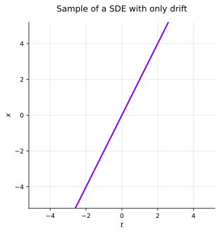
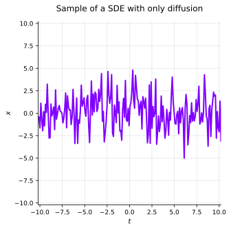

## SDEs and Probability Distributions
As always, we study SDEs of the form,

$$
dx(t) = \underbrace{f(x(t), t) \ dt}_{\text{drift}} + \underbrace{L(x(t), t) \ d\beta(t)}_{\text{diffusion}},
$$

where $x(t)$ is a stochastic process and $\beta(t)$ is a Brownian motion.

At each time $t$, the state $x(t)$ is a random variable with its own probability distribution $p(x(t), t)$.
Typically, $x(t_0) \sim p(x(t_0), t_0) = p_{\text{init}}(x(t_0))$.

How does $p(x(t), t)$ evolve over time $t \geq t_0$?

### SDE with only drift

Suppose $f(x(t), t) = 2, L(x(t), t) = 0 \Rightarrow \frac{dx}{dt} = 2.$

We also assume that $x(t_0 = 0) \sim \mathcal{N}(0, 1)$.

Intuitively, for this SDE (or ODE in this case), the probability distribution of $x(t)$ is just,

$$
x(t) \sim \mathcal{N}(2t, 1).
$$

But, more formally we know that,

$$
\begin{align*}
x(t) & = \underbrace{x(0)}_{\mathcal{N}(0, 1)} + 2t \newline
& \Rightarrow x(t) \sim \mathcal{N}(2t, 1) \newline
\end{align*}
$$

### SDE with only diffusion

Suppose $f(x(t), t) = 0, L(x(t), t) = 2 \Rightarrow dx = 2 d\beta(t)$.

We also assume that $x(t_0 = 0) \sim \mathcal{N}(0, 1)$.

Thus,

$$
\begin{align*}
x(t) & = \underbrace{x(0)}_{\mathcal{N}(0, 1)} + \underbrace{2 \beta(t)}_{\mathcal{N}(0, 4t)} \newline
& \Rightarrow x(t) \sim \mathcal{N}(0, 1 + 4t)
\end{align*}
$$

### Connection to (Deep) Diffusion Models
So, we have seen that (simple) SDEs and their probability distributions **evolve over time**.
This is the key idea behind diffusion models.

Suppose $x(0) \sim p(x(0), 0) = p_{\text{init}}(x(0))$ where $p_{\text{init}}$ is a simple distribution like a Gaussian.
We would like $x(1) \sim p(x(1), 1) = p_{\text{data}}(x(1))$ where $p_{\text{data}}$ is some complicated data distribution.

Can we and how do we construct such an SDE? If it is possible, then we can sample from $p_{\text{init}}$, run it through the SDE and obtain a sample from $p_{\text{data}}$!

## Fokker-Planck-Kolmogorov Equation
The Fokker-Planck-Kolmogorov equation describes the evolution of the probability distribution of a stochastic process over time,

:::definition[Definition: Fokker-Planck-Kolmogorov Equation in $\ \mathbb{R}^d$]
The probability density $p(\mathbf{x}, t)$ of the solution of the SDE,
$$
d\mathbf{x}(t) = \mathbf{f}(\mathbf{x}(t), t) \ dt + \mathbf{L}(\mathbf{x}(t), t) \ d \beta(t),
$$
solves the partial differential equation,
$$
\frac{\partial p(\mathbf{x}, t)}{\partial t} = - \sum_i \frac{\partial}{\partial x_i} [f_i(\mathbf{x}, t) p(\mathbf{x}, t)] + \frac{1}{2} \sum_{i,j} \frac{\partial^2}{\partial x_i \partial x_j} \left[ [\mathbf{L}(\mathbf{x}, t) \mathbf{L}^T(\mathbf{x}, t)]_{ij} p(\mathbf{x}, t) \right].
$$
:::

In physics literature, this is often called the **Fokker-Planck equation**, while in stochastics, it is called the **forward Kolmogorov equation**.

:::definition[Definition: Fokker-Planck-Kolmogorov Equation in $\ \mathbb{R}$]
The probability density $p(x, t)$ of the solution of the SDE,
$$
dx(t) = f(x(t), t) \ dt + L(x(t), t) \ d\beta(t),
$$
solves the partial differential equation,
$$
\frac{\partial p(x, t)}{\partial t} = - \frac{\partial}{\partial x} [f(x, t) p(x, t)] + \frac{1}{2} \frac{\partial^2}{\partial x^2} \left[ L(x, t)^2 p(x, t) \right].
$$
:::

### Example: Diffusione
Let's consider the SDE,
$$
dx(t) = d \beta(t),
$$

Using the Fokker-Planck-Kolmogorov equation, we can derive the corresponding PDE,
$$
\frac{\partial p(x, t)}{\partial t} = \frac{1}{2} \frac{\partial^2}{\partial x^2} p(x, t).
$$

This is known as the **diffusion** or **heat** equation.

## Fokker-Planck-Kolmogorov PDE Proof
We will prove the Fokker-Planck-Kolmogorov PDE, but let's first understand some useful results that we'll use.

:::note[Integration by parts]
$$
\int_{a}^{b} u^{\prime}(x) v(x) \ dx = [u(x) v(x)]_{a}^{b} - \int_{a}^{b} u(x) v^{\prime}(x) \ dx
$$
:::

In higher dimensions it is known as the **divergence theorem** or **Gauss's theorem**.
(This is nothing new, just a friendly reminder.)

:::note[The Itô Formula]
Suppose $x(t)$ is a scalar Itô process that obeys the SDE,
$$
dx(t) = f(x(t), t) \ dt + L(x(t), t) \ d\beta(t),
$$
The scalar function $\phi(x)$ (with no explicit dependence on $t$) can then be described by the SDE,
$$
d\phi(x) = \frac{\partial \phi}{\partial x} dx + \frac{1}{2} \frac{\partial^2 \phi}{\partial x^2} L(x, t)^2 \ dt
$$
:::

Taking the expectation and dividing by $dt$ gives,
$$
\frac{d \mathbb{E}[\phi]}{dt} = \mathbb{E}\left[ \frac{\partial \phi}{\partial x} f(x, t)\right] + \frac{1}{2} \mathbb{E}\left[ \frac{\partial^2 \phi}{\partial x^2} L(x, t)^2 \right]
$$

Now, let's prove the Fokker-Planck-Kolmogorov PDE.

By Itô's formula, we have,

$$
d \phi(x) = \phi^{\prime}(x) \ dx + \frac{1}{2} \phi^{\prime \prime}(x) L(x, t)^2 \ dt
$$

Substituting $dx$ into the above equation gives,

$$
\begin{align*}
d \phi(x) & = \phi^{\prime}(x) f(x, t) \ dt + \phi^{\prime}(x) L(x, t) \ d\beta(t) + \frac{1}{2} \phi^{\prime \prime}(x) L(x, t)^2 \ dt \newline
d \phi(x) & = \left[f(x, t) \phi^{\prime}(x) + \frac{1}{2} L(x, t)^2 \phi^{\prime \prime}(x) \right] dt + \underbrace{L(x, t) \phi^{\prime}(x) d\beta(t)}_{\mathbb{E}[ \cdot ] = 0} \newline
\end{align*}
$$

If we take the expectation of both sides, we get,

$$
\frac{d}{dt} \mathbb{E}[\phi] = \mathbb{E}\left[f(x, t) \phi^{\prime}(x)\right] + \frac{1}{2} \mathbb{E}\left[L(x, t)^2 \phi^{\prime \prime}(x)\right]
$$

By using the density representation of the expectation, we can write,

$$
\frac{d}{dt} \int \phi(x) p(x, t) \ dx = \int f(x, t) \phi^{\prime}(x) p(x, t) \ dx + \frac{1}{2} \int L(x, t)^2 \phi^{\prime \prime}(x) p(x, t) \ dx.
$$

Let's rewrite our right-hand side terms.

### First term: $\int f(x, t) \phi^\prime (x) p(x, t) \ dx$
By letting,

$$
u(x) = f(x, t) p(x, t), \quad v(x) = \phi^\prime (x),
$$

and using integration by parts, we have,

$$
\int f(x, t) \phi^{\prime}(x) p(x, t) \ dx = [f(x, t) p(x, t) \phi(x)] - \int \phi(x) \frac{\partial}{\partial x} [f(x, t) p(x, t)] \ dx,
$$

we'll assume that the first term vanishes at the boundaries, thus,

$$
\int f(x, t) \phi^{\prime}(x) p(x, t) \ dx = - \int \phi(x) \frac{\partial}{\partial x} [f(x, t) p(x, t)] \ dx.
$$

### Second term: $\int L(x, t)^2 \phi^{\prime\prime} (x) p(x, t) \ dx$
Here we'll need to use integration by parts twice. First, we have,

$$
u_1(x) = L(x, t)^2 p(x, t), \quad v_1(x) = \phi^\prime (x),
$$

Then we have,

$$
\int L(x, t)^2 \phi^{\prime \prime}(x) p(x, t) \ dx = [L(x, t)^2 p(x, t) \phi^\prime (x)] - \int \phi^\prime (x) \frac{\partial}{\partial x} [L(x, t)^2 p(x, t)] \ dx,
$$

Again, we'll assume that the first term vanishes at the boundaries, thus,

$$
\int L(x, t)^2 \phi^{\prime \prime}(x) p(x, t) \ dx = - \int \phi^\prime (x) \frac{\partial}{\partial x} [L(x, t)^2 p(x, t)] \ dx.
$$

Now, for the second integration by parts, we have,

$$
u_2(x) = \frac{\partial}{\partial x} [L(x, t)^2 p(x, t)], \quad v_2(x) = \phi(x),
$$

and we can write,

$$
\int \phi^\prime (x) \frac{\partial}{\partial x} [L(x, t)^2 p(x, t)] \ dx = [\phi(x) \frac{\partial}{\partial x} [L(x, t)^2 p(x, t)]] - \int \phi(x) \frac{\partial^2}{\partial x^2} [L(x, t)^2 p(x, t)] \ dx,
$$

and again, we'll assume that the first term vanishes at the boundaries, thus,

$$
\int \phi^\prime (x) \frac{\partial}{\partial x} [L(x, t)^2 p(x, t)] \ dx = - \int \phi(x) \frac{\partial^2}{\partial x^2} [L(x, t)^2 p(x, t)] \ dx.
$$

Now, we can combine the two terms to get,
$$
\begin{align*}
\int L(x, t)^2 \phi^{\prime \prime}(x) p(x, t) \ dx & = -\left[- \int \phi(x) \frac{\partial^2}{\partial x^2} [L(x, t)^2 p(x, t)] \ dx \right] \newline
& = \int \phi(x) \frac{\partial^2}{\partial x^2} [L(x, t)^2 p(x, t)] \ dx.
\end{align*}
$$

### Putting it all together
Now, we can combine the two terms to get,
$$
\begin{align*}
\frac{d}{dt} \int \phi(x) p(x, t) \ dx & = - \int \phi(x) \frac{\partial}{\partial x} [f(x, t) p(x, t)] \ dx + \int \phi(x) \frac{\partial^2}{\partial x^2} [L(x, t)^2 p(x, t)] \ dx \newline
& = \int \phi(x) \left[- \frac{\partial}{\partial x} [f(x, t) p(x, t)] + \frac{1}{2} \frac{\partial^2}{\partial x^2} [L(x, t)^2 p(x, t)] \right] \ dx.
\end{align*}
$$

We can rewrite the left-hand side as,

$$
\frac{d}{dt} \int \phi(x) p(x, t) \ dx = \int \phi(x) \frac{\partial}{\partial t} p(x, t) \ dx.
$$

since our $\phi(x)$ does not depend on $t$.

Now we can rewrite the entire equation as,

$$
\int \phi(x) \left[\frac{\partial}{\partial t} p(x, t) + \frac{\partial}{\partial x} [f(x, t) p(x, t)] - \frac{1}{2} \frac{\partial^2}{\partial x^2} [L(x, t)^2 p(x, t)] \right] \ dx = 0.
$$

But, our $\phi(x)$ is arbitrary, therefore the term in the brackets must be zero, i.e.,

$$
\boxed{
\frac{\partial}{\partial t} p(x, t) = - \frac{\partial}{\partial x} [f(x, t) p(x, t)] + \frac{1}{2} \frac{\partial^2}{\partial x^2} [L(x, t)^2 p(x, t)].
}
$$

which is precisely the Fokker-Planck-Kolmogorov equation!

### Example: Benes SDE
The Fokker-Planck-Kolmogorov PDE for the SDE,

$$
dx(t) = \tanh(x(t)) \ dt + d \beta(t),
$$

can be written as,

$$
\begin{align*}
\frac{\partial p(x, t)}{\partial t} & = -\frac{\partial}{\partial x} [\tanh(x) p(x, t)] + \frac{1}{2} \frac{\partial^2}{\partial x^2} [p(x, t)] \newline
& = -(\tanh^2(x) - 1) p(x, t) - \tanh(x) \frac{\partial p(x, t)}{\partial x} + \frac{1}{2} \frac{\partial^2 p(x, t)}{\partial x^2}.
\end{align*}
$$

## Mean and Covariance of an SDE
Let's now try to derive the mean and covariance of an SDE, using the Fokker-Planck-Kolmogorov equation.

### Mean of an SDE
Recall,

:::note[The Itô Formula]
Suppose $x(t)$ is a scalar Itô process that obeys the SDE,
$$
dx(t) = f(x(t), t) \ dt + L(x(t), t) \ d\beta(t),
$$
The scalar function $\phi(x)$ (with no explicit dependence on $t$) can then be described by the SDE,
$$
d\phi(x) = \frac{\partial \phi}{\partial x} dx + \frac{1}{2} \frac{\partial^2 \phi}{\partial x^2} L(x, t)^2 \ dt
$$
:::

Taking the expectation and dividing by $dt$ gives,
$$
\frac{d \mathbb{E}[\phi]}{dt} = \mathbb{E}\left[ \frac{\partial \phi}{\partial x} f(x, t)\right] + \frac{1}{2} \mathbb{E}\left[ \frac{\partial^2 \phi}{\partial x^2} L(x, t)^2 \right]
$$

Now, if $\phi(x, t)$ (explicit dependence on $t$), we instead have,

$$
\frac{d \mathbb{E}[\phi]}{dt} = \mathbb{E}\left[\frac{\partial \phi}{\partial t} \right] + \mathbb{E}\left[ \frac{\partial \phi}{\partial x} f(x, t)\right] + \frac{1}{2} \mathbb{E}\left[ \frac{\partial^2 \phi}{\partial x^2} L(x, t)^2 \right]
$$

To derive the evolution of the **mean** $m(t) = \mathbb{E}[x]$, we can pick,

$$
\phi(x, t) = x
$$

Then we have,
$$
\begin{align*}
\mathbb{E}\left[\frac{\partial \phi}{\partial t} \right] & = 0 \quad \text{(no explicit dependence on $t$)} \newline
\mathbb{E}\left[ \frac{\partial \phi}{\partial x}\right] & = 1 \newline
\mathbb{E}\left[ \frac{\partial^2 \phi}{\partial x^2} \right] & = 0 \newline
\end{align*}
$$

Plugging these back into the equation gives,

$$
\frac{d m(t)}{dt} = \mathbb{E}\left[ f(x, t) \right]
$$

Similarly, for a vector version of $\mathbf{x} \in \mathbb{R}^d$ is given by,

$$
\frac{d \mathbf{m}}{dt} = \mathbb{E}\left[ \mathbf{f}(\mathbf{x}, t) \right]
$$

### Covariance of an SDE
To derive the evolution of the **covariance** $p(t) = \mathbb{E}[(x - m(t))^2]$, we can pick,

$$
\phi(x, t) = (x - m(t))^2
$$

Then we have,

$$
\begin{align*}
\mathbb{E}\left[\frac{\partial \phi}{\partial t} \right] & = 2 (x - m(t)) \frac{d m(t)}{dt} \quad \text{(using chain rule)} \newline
\mathbb{E}\left[ \frac{\partial \phi}{\partial x}\right] & = 2 (x - m(t)) \newline
\mathbb{E}\left[ \frac{\partial^2 \phi}{\partial x^2} \right] & = 2 \newline
\end{align*}
$$

Plugging these back into the equation gives,

$$
\frac{d}{dt} \mathbb{E}\left[(x - m(t))^2\right] = \mathbb{E}\left[-2(x - m(t)) \frac{\partial m(t)}{\partial t}\right] + \mathbb{E}\left[2(x - m(t)) f(x, t)\right] + \frac{1}{2} \mathbb{E}\left[2 L(x, t)^2\right]
$$

Which can be simplified to,
$$
\frac{d p(t)}{dt} = -2 \frac{d m(t)}{dt} \mathbb{E}\left[(x - m(t))\right] + 2 \mathbb{E}\left[(x - m(t)) f(x, t)\right] + \mathbb{E}\left[L(x, t)^2\right]
$$

By definition $m(t) = \mathbb{E}[x]$, thus $\mathbb{E}\left[(x - m(t))\right] = 0$ and we can simplify the equation to,

$$
\frac{d p(t)}{dt} = 2 \mathbb{E}\left[(x - m(t)) f(x, t)\right] + \mathbb{E}\left[L(x, t)^2\right]
$$

Similarly, for a vector version of $\mathbf{x} \in \mathbb{R}^d$ is given by,

$$
\frac{d \mathbf{p}}{dt} = \mathbb{E}\left[(\mathbf{x} - \mathbf{m}(t)) \mathbf{f}^T\right] + \mathbb{E}\left[\mathbf{f}(\mathbf{x}, t) \mathbf{f}^T\right] + \mathbb{E}\left[\mathbf{L}(\mathbf{x}, t) \mathbf{L}^T(\mathbf{x}, t)\right]
$$

### Example: Ornstein-Uhlenbeck Process

Consider the SDE,

$$
dx(t) = -\lambda x(t) \ dt + \sigma \ d\beta(t), \quad x(0) = 0,
$$

where $\lambda > 0$ and Brownian $\beta$ with diffusion/std. deviation $\sigma$.

We have (from our previous derivation),

$$
\begin{align*}
\mathbb{E}[f(x, t)] & = -\lambda \mathbb{E}[x(t)] = -\lambda m(t) \newline
\mathbb{E}[f(x)(x - m(t))] & = \mathbb{E}[-\lambda x(t)(x - m(t))] = -\lambda \mathbb{E}[(x - m(t))^2] = -\lambda p(t).
\end{align*}
$$

This results in the ODEs,

$$
\begin{align*}
\frac{d m(t)}{dt} & = -\lambda m(t), \quad m(0) = 0 \newline
\frac{d p(t)}{dt} & = -2 \lambda p(t) + \sigma^2, \quad p(0) = 0.
\end{align*}
$$

As the solution $x(t)$ is a Gaussian process, this characterizes the whole distribution since Gaussian processes are fully characterized by their first two moments (mean and covariance).

In summary, the mean and covariance are governed by,

$$
\begin{align*}
\frac{d \mathbf{m}}{dt} & = \mathbb{E}\left[\mathbf{f}(\mathbf{x}, t) \right] \newline
\frac{d \mathbf{P}}{dt} & = \mathbb{E}\left[(\mathbf{x} - \mathbf{m}(t)) \mathbf{f}^T\right] + \mathbb{E}\left[\mathbf{f}(\mathbf{x}, t) \mathbf{f}^T\right] + \mathbb{E}\left[\mathbf{L}(\mathbf{x}, t) \mathbf{L}^T(\mathbf{x}, t)\right]
\end{align*}
$$

Note that the expectations are with respect to the density $p(\mathbf{x}, t)$!

To solve these ODEs, in general, we need to know $p(\mathbf{x}, t)$, which is not always possible.

In the linear-Gaussian case, the first two moments characterize the solution.

## Backward Kolmogorov Equation
Let the transition probability function be denoted,

$$
p(x(\tau) | x(t)) = p_{x(\tau) | x(t)}(y, \tau; x, t) = p(y, \tau | x, t) \text{ with } \tau \geq t.
$$

Then, one can similarly derive the **Kolmogorov backward equation**,

:::definition[Definition: Kolmogorov backward equation]
$$
-\frac{\partial p(y, \tau; x, t)}{\partial \tau} = f(y, \tau) \frac{\partial p(y, \tau; x, t)}{\partial y} + \frac{1}{2} L(y, \tau)^2 \frac{\partial^2 p(y, \tau; x, t)}{\partial y^2}
$$
:::

If the end conditions are known for some $T, p(x, T)$, then one can compute the transition probability for times before $T$.

This is the key to generative modeling via de-noising diffusion processes [^1].

Consider the Itô process,

$$
dx(t) = f(x(t), t) \ dt + L(x(t), t) \ d\beta(t),
$$

Then, there exists a reverse Itô process of the form [^2],
$$
dx(t) = \bar{f}(x(t), t) \ dt + \bar{L}(x(t), t) \ d\bar{\beta}(t),
$$

defined in some region $t \leq T$.

$x(T)$ is a random variable independent of $\bar{\beta}$ and the above is shorthand for,

$$
x(T) - x(t) = \int_{t}^{T} \bar{f}(x(s), s) \ ds + \int_{t}^{T} \bar{L}(x(s), s) \ d\bar{\beta}(s),
$$

Lastly, consider the Itô process of the probabilistic de-noising diffusion model,

$$
d\mathbf{x}(t) = \mathbf{f}(\mathbf{x}(t), t) \ dt + \sigma(t) \ d\beta(t),
$$

Then, the reverse Itô process is given by [^2],

$$
d\mathbf{x}(t) = \left[\mathbf{f}(\mathbf{x}(t), t) - \sigma(t)^2 \nabla_{\mathbf{x}} \log p(\mathbf{x}(t), t)\right] dt + \sigma(t) d\bar{\beta}(t),
$$

The quantity,

$$
\nabla_{\mathbf{x}} \log p(\mathbf{x}(t), t)
$$

is known as the **score function** and is the basis for **score-based generative models**.

### Summary
* The **probability density function** $p(x, t)$ of an SDE evolves according to the **Fokker-Planck-Kolmogorov equation**.
* There are two forms of the Fokker-Planck-Kolmogorov equation,
    * **Forward Kolmogorov equation** (Fokker-Planck equation) &mdash; evolves the density forward in time.
    * **Backward Kolmogorov equation** &mdash; evolves transition probabilities backward in time.
* The **mean** $m(t)$ and **covariance** $p(t)$ satisfy ODEs, but these typically depend on the full distribution $p(x, t)$.
* In **linear-Gaussian** cases, the mean and covariance are sufficient &mdash; they full determine the solution.
* These tools are foundational for **diffusion-based generative models**, filtering theory, and stochastic control.

[^1]: [Denoising Diffusion Probabilistic Models](https://arxiv.org/abs/2006.11239) by Ho et al.
[^2]: [Reverse-Time Diffusion Equation Models](https://core.ac.uk/download/pdf/82826666.pdf) by Anderson.
