## Introduction
In this part we'll introduce Doob's $h$-transform and Girsanov's theorem.

Recall our definition of the SDE,

$$
dx(t) = \underbrace{f(x(t), t) \ dt}_{\text{drift}} + \underbrace{L(x(t), t) \ d\beta(t)}_{\text{diffusion}},
$$

By the end of this, we'll have a tool in our toolbox to transform this SDE into a new SDE with the following form,

$$
\begin{equation}
\label{eq:h-transform-sde}
dx(t) = f(x(t), t) \ dt + L^2(x(t), t) \nabla \log h(x(t), t) \ dt + L(x(t), t) \ d\beta(t),
\end{equation}
$$

and we'll already propose that,

$$
dx(t) = \frac{v - x(t)}{T - t} dt + d\beta(t), t \leq T,
$$

is already a special case of @eq:h-transform-sde. For clarity, we read the above SDE as, as we move towards time $T$, we'll get closer to the point $v$.

So, essentially, we're taking a Brownian motion and forcing it to a point $v$ at time $T$.

## Recap: Density and Bayes' Rule
Let's firstly recap what we know about densities and Bayes' rule.

If we have a random value $x$, we say that $x$ has a density $p_x$ if,

$$
P(x \in A) = \int_A p_x(x) \ dx,
$$

or in a sloppier notation,

$$
p_x(x) = \frac{P(x \in A)}{dx}.
$$

We say $(x,y)$ has a joint density $p_{x,y}$ if,

$$
P(x \in A, y \in B) = \int_A \int_B p_{x,y}(x,y) \ dy \ dx,
$$

Further, Bayes' rule states that,
$$
P(A | B) = \frac{P(A \cap B)}{P(B)}.
$$

We say that $(x,y)$ has a **conditional density** $p_{y|x}$ if,

$$
P(y \in A | x \in B) = \frac{P_{x, y}(x, y)}{p_x(x)} = \frac{p_{x,y}(x,y)}{\int p_{x, y}(x, y) dy},
$$

where we in the second step used **marginalization** to get the denominator.

One can also write Bayes' rule in terms of conditionals,

$$
P(A | B) = \frac{P(A) P(B | A)}{P(B)},
$$

or in terms of densities,

$$
P(x \in A | y \in B) = \frac{p_x(x) p_{y|x}(y | x)}{p_y(y)}.
$$

## Transition Density
Now, let's try to formulate what we'll call **transition density**.

If $x(t)$, for $t \geq 0$ is a **Markov process** [^1],

$$
p(x(t) | x(s)) = \frac{P(x(t) \in dy | x(s) = x)}{dy} \biggr\rvert_{\substack{y = x(t) \newline x = x(s)}}
$$

or in words, the conditional density of $x(t)$ given $x(s) = x$.

Now, think of this in the general case, since it is Markov, we now that,

$$
\begin{align*}
& P(x(t_0), x(t_1), \ldots, x(t_n)), \text{ joint of } n \text{ random variables} \newline
& = P(x(t_0)) P(x(t_1) | x(t_0)) \ldots P(x(t_n) | x(t_{n-1})).
\end{align*}
$$

### Champan-Kolmogorov
We'll make use of a equation called **Chapman-Kolmogorov** equation [^2] which states,

$$
P(x(t) | x(s)) = \int P(x(t) | x(u)) P(x(u) | x(s)) \ dx(u), \quad s < u < t,
$$

We will not prove or further discuss this equation, but it is important to know that it exists.

### Example: Transition Density of a Brownian Motion
Let's now try to apply what we've learned so far to a Brownian motion.

:::tip[Example: Transition density of a Brownian motion]
So, we have,
:::

$$
P(\beta(t) | \beta(s)) = \frac{1}{\sqrt{2 \pi (t - s)}} \exp\left(-\frac{(\beta(t) - \beta(s))^2}{2(t - s)}\right),
$$

and if we visualize this.

## Doob's $h$-transform (for transition densities)
Let's first start with an example and see how we can solve it.

:::tip[Example: Doob's $h$-transform on transition densities]
What is the **transition density** of $\beta(\cdot)$ (which one reads as, at any arbitrary time), given that $\beta(T) = v$?
We'll done this **transition density** with $p^\star$, so we have,
$$
p^\star(\beta(t) | \beta(s)) = \frac{P(\beta(t) \in dy | \beta(s) = x, \beta(T) = v)}{dy} \biggr\rvert_{y = \beta(t)}
$$
Which we can write as,
$$
\begin{equation}
\label{eq:brownian-bridge-density}
= \frac{P(\beta(s)) P(\beta(t) | \beta(s)) h(\beta(t), t)}{\int P(\beta(s)) P(\beta(t) | \beta(s)) h(\beta(t), t) d \beta(t)},
\end{equation}
$$
where
$$
h(s, x) = \frac{P(\beta(T) \in dy | \beta(s) = x)}{dy} \biggr\rvert_{y = v}
$$
:::

Now, you may already see that, if $h(s, x)$ is Gaussian, then maybe $\nabla \log h(s, x) \implies \frac{v - x}{T - s}$.

By the Chapman-Kolmogorov equation, we can write,

$$
\frac{P(\beta(t) | \beta(s)) h(\beta(t), t)}{h(\beta(s), s)},
$$

which is precisely what we'll call **Doob's $h$-transform**.

## Infinitesimal generator
Imagine we have an arbitrary function $g$ that maps,

$$
g \mapsto f \cdot g^\prime + \frac{1}{2} L^2 \cdot g^{\prime \prime},
$$

or in full notation,

$$
g(x) \mapsto f(x) \cdot g^{\prime}(x) + \frac{1}{2} L^2(x) \cdot g^{\prime \prime}(x),
$$

We'll call this mapping/operator $Ag$.

The operator $A$ is called "infinitesimal generator" of the process $x(t), t \geq 0$ with drift $f$ and diffusion $L$.

Let's write down Itô's formula with $A$.a

Informally,

$$
\frac{\left[ \mathbb{E}\left[ g(x) | x(s) = x \right] - g(x) \right] }{t - s} \xrightarrow{t \to s} (Ag)(x),
$$

note that $\mathbb{E}[g(x) | x(s) = x] = g(x)$

:::danger[Remark]
Note that $h(\beta(s), s)$ is a Martingale [^3], because,
$$
h(\beta(s), s) = \int P(\beta(t) | \beta(s)) h(\beta(t), t) d \beta(t),
$$
or in other words, the drift term in Itô's formula disappears.
Hence, $(Ag)(x) + \frac{\partial}{\partial s} h(s, x) = 0$.
:::

So, $h$ solves the **backward Kolmogorov equation**!

Recall that @eq:brownian-bridge-density holds for $x(t)$ in,

$$
dx(t) = \underbrace{f(x(t), t) \ dt}_{\text{drift}} + \underbrace{L(x(t), t) \ d\beta(t)}_{\text{diffusion}},
$$

where $\beta(s)$ is replaced by $x(s)$.

## Time derivative of $A$
Idea: Compute the time derivative of the conditional expectation,

$$
\mathbb{E}[g(x(t)) | x(s) = x, x(T) = v],
$$

We'll call the new $A$ operator $A^\star$.

$$
\begin{align*}
(\frac{\partial}{\partial s} g + A^\star g)(x) & = \lim_{t \to s} \frac{\mathbb{E}[g(x(t)) | x(s) = x, x(T) = v] - g(x)}{t - s} \newline
& = \lim_{t \to s} \frac{\mathbb{E}[g(x(t)) - g(x(s)) | x(s) = x, x(T) = v]}{t - s} \newline
& = \lim_{t \to s} \int g(x(t)) - g(x(s)) p^\star(x(t) | x(s)) \ dx(t) \newline
& = \lim_{t \to s} \int \left[ g(x(t)) - g(x(s)) \right] \frac{h(x(t), t)}{h(x(s), s)} p(x(t) | x(s)) \ dx(t) \newline
& = \lim_{t \to s} \frac{\mathbb{E}[[g(x(t)) - g(x(s))] h(x(t), t) | x(s) = x]}{h(x(s), s)} \newline
& = \frac{1}{h(s, x)} \left( \left( \frac{\partial}{\partial s} + A \right) (h g) \right)(s, x).
\end{align*}
$$

This holds in general for Markov processes.

Thus, we have,

$$
\begin{align*}
A^\star g & = \frac{1}{h} A(h g) = \ldots = Ag + L^2 \frac{\nabla h}{h} \cdot g^\prime \newline
& = (f + L^2 \nabla \log h) g^\prime + \frac{1}{2} L^2 g^{\prime \prime} \newline
\end{align*}
$$

The $h$-transformed process has drift $f + L^2 \nabla \log h$ and diffusion $L^2$.

## Girsanov's theorem
Girsanov's theorem states that, if we have a process $x(t)$ with drift $f$ and diffusion $L$, then the $h$-transformed process $x^\star(t)$ is defined as,

$$
dx^\star(t) = f(x^\star(t), t) \ dt + L^2(x^\star(t), t) \nabla \log h(x^\star(t), t) \ dt + L(x^\star(t), t) \ d\beta(t),
$$

and the original process $x(t)$ is defined as,

$$
dx(t) = f(x(t), t) \ dt + L(x(t), t) \ d\beta(t),
$$

Further, $\mathrm{Law}(x^\star(t))$ has density,

$$
\int \frac{P(x(0)) P(x(t) | x(0)) h(x(t), t)}{h(x(0), 0)} \ dx(0),
$$

Let's say now that, if we choose a smart $h$, we can determine the density of $x^\star(t)$,

$$
\int \frac{P(x(0)) P(x(t) | x(0)) h(x(t), t)}{h(x(0), 0)} \ dx(0) = \pi(x(t)).
$$

That is what we'll do in the next part ;).

Also, note that $\mathrm{Law}(x(t))$ has density,

$$
\int P(x(0)) P(x(t) | x(0)) \ dx(0).
$$

[^1]: [Wikipedia: Markov process](https://en.wikipedia.org/wiki/Markov_process)
[^2]: [Wikipedia: Chapman-Kolmogorov equation](https://en.wikipedia.org/wiki/Chapman%E2%80%93Kolmogorov_equation)
[^3]: [Wikipedia: Martingale](https://en.wikipedia.org/wiki/Martingale_(probability_theory))
