## Introduction to Stochastic Processes
In this part, we will define what a stochastic process.
We will further recap some basic probability theory concepts that are essential for understanding stochastic processes.

In @fig:stochastic-vs-deterministic-processes, we can see that some models make exact predictions (deterministic processes), while others provide predictions with uncertainty (stochastic processes).
In most cases, it is more realistic to model systems as stochastic processes, as they often involve inherent randomness and uncertainty.

:::note
We will use the terminology stochastic models and probabilistic models interchangeably.
:::

:::definition[Stochastic Process]
A stochastic process is a collection of random variables, $\{X_t, t \in \mathcal{I} \}$.

The set $\mathcal{I}$ is the index set of the process. $\mathcal{I}$ most often represents a set of specific times.

The random variables $X_t$ are defined on a common state space $\mathcal{S}$. This set represents the possible values the random variables $X_t$ can take.

Finally, these sets can be discrete or continuous and simple (e.g., $\mathcal{I} = \{1, 2, 3\}$) or more complex (e.g., vectors of real numbers).
:::

## Motivation for Probabilistic Models
One thing we need to consider is, what do we want to do with these models? What is the point?
While it is an open question, a easy answer is that we want to set up a model, based on some general knowledge, and make new predictions from the model.

1. You have data.
2. You want to find a model so that the data could reasonably be produced by the model.
3. You want to use this model for predictions of future observations.

Using data in this way is called (statistical) inference.

:::definition[Frequentist VS. Bayesian Inference]
There are two main paradigms for statistical inference: frequentist inference and Bayesian inference.

In classical (frequentist) inference,

1. We use contextual knowledge to find a model with some unknown parameters. The model relates observed data to future predictions.

2. Find an estimate for the parameters, using estimators that have desirable properties.

3. Plug the estimates into the model and make predictions.

In Bayesian inference,

1. We use contextual knowledge to find a model with some uncertain parameters. The model relates observed data to future predictions.

2. Find the conditional probability for future predictions given the value of the observed data.
:::

## The Markov Property
::::definition[Markov Property]
A process fulfills the Markov property if, for any $t_0 \in \mathcal{I}$, whenever $X_{t_0}$ is known, $X_t$ (with $t > t_0$) is independent of the values for $X_s$ for all $s < t_0$.
:::note
Most of the stochastic processes that we will deal with will have the Markov property.
:::
::::

## Probability Theory Recap
:::intuition[Random Variable]
A random variable is a variable which has possible values in some state space $\mathcal{S}$, together with probabilities assigned to values and sets of values in the state space.

We separate between discrete and continuous random variables.

For discrete random variables, we assign a probability to each single value in the state space.

For continuous random variables, we assign probabilities to intervals of values in the state space.
:::

::::definition[Measurable Subsets]
It turns out to be impossible to define a concept with reasonable properties that assigns a "size" to all subsets of for example $\mathbb{R}^N$.
Instead, we need to restrict the concept of "size" to "measurable" sets.

Let $S$ be any set. A sigma-algebra $\Omega$ on $S$ is a set of subsets of $S$ such that,

1. $\Omega$ includes $S$.

2. If $A \in \Omega$, then the complement $A^c \coloneqq S \setminus A$ is also in $\Omega$.

3. If $A_1, A_2, \ldots \in \Omega$, then the union $\bigcup_{i=1}^{\infty} A_i$ is also in $\Omega$.

Measurable sets are those that are in an appropriately defined sigma-algebra.

:::note
In $\mathbb{R}^N$, one generally uses the Borel subsets [^1]

What is most important, when $S$ is finite or countable, all subsets will be measurable. When $S$ is some interval of real numbers, there will exist subsets that are not measurable, but we will not be concerned with those.
:::
::::

:::definition[Probability Measure and Random Variables]
A probability (measure) is a real function $P(\cdot)$ defined on the measureable subsets $A \subseteq S$, satisfying,

1. $0 \leq P(A) \leq 1$ for all measurable subsets $A \subseteq S$.

2. $P(S) = 1$.

3. For any countable collection of disjoint measurable subsets $A_1, A_2, \ldots$, we have $P\left( \bigcup_{i=1}^{\infty} A_i \right) = \sum_{i=1}^{\infty} P(A_i)$.

These are called the Kolmogorov axioms for probability [^2].

Measurable subsets $S$ are called events, and $P(S)$ is the probability of the event $S$ occurring.

Thus, a random variable $X$ with state space $\mathcal{S}$ is a real-valued (measurable) function on $S$ together with a probability measure $P(\cdot)$ defined on the measurable subsets of $\mathcal{S}$.
:::

:::recall[Conditional Probability and Independence]
Given the events $A$ and $B$, the conditional probability of $A$ given $B$ is defined as,
$$
P(A \mid B) = \frac{P(A \cap B)}{P(B)}
$$
The events $A$ and $B$ are independent if $P(A \cap B) = P(A) P(B)$, or equivalently, if $P(A \mid B) = P(A)$.

The law of total probability states that if $B_1, B_2, \ldots, B_n$ is a sequence of events that partitions S. Then,
$$
P(A) = \sum_{i=1}^{n} P(A \cap B_i) = \sum_{i=1}^{n} P(A \mid B_i) P(B_i)
$$
Thus, Bayes' law follow directly from the definition of conditional probability and the law of total probability,
$$
P(B \mid A) = \frac{P(A \mid B) P(B)}{P(A)}
$$
:::

:::notation[The generic &nbsp; $\pi$-notation]
We will use the generic $\pi$-notation as a shorthand. We write $\pi(x)$ for $P(X = x)$, $\pi(x, y)$ for $P(X = x, Y = y)$, and $\pi(x \mid y)$ for $P(X = x \mid Y = y)$.
:::

:::definition[Conditional Densities for Continuous Distributions]
For a continuous random variable $X$, we will write its density function as $\pi(x)$, extending the generic $\pi$-notation.
If we have a joint distribution for continuous random variables $X$ and $Y$, we write the joint density as $\pi(x, y)$.

Thus, we get formulas like,
$$
\int \pi(x) \ dx = 1 \quad \text{and} \quad \int \pi(x, y) \ dy = \pi(x)
$$
We can define the conditional density as,
$$
\pi(x \mid y) = \frac{\pi(x, y)}{\pi(y)}
$$
:::

:::recall[Expectation and Conditional Expectation]
Recall, the expectation of a discrete random variable is,
$$
\mathbb{E}[Y] = \sum_{y} y \ \pi(y)
$$
and of a continuous random variable is,
$$
\mathbb{E}[Y] = \int y \ \pi(y) \ dy
$$
The conditional expectation in the discrete case is,
$$
\mathbb{E}[Y \mid X = x] = \sum_{y} y \ \pi(y \mid x)
$$
and in the continuous case is,
$$
\mathbb{E}[Y \mid X = x] = \int y \ \pi(y \mid x) \ dy
$$
:::

:::definition[Law of Total Expectation]
If $X$ is a discrete random variable, we get that,
$$
\mathbb{E}[Y] = \sum_{x} \mathbb{E}[Y \mid X = x] \ \pi(x)
$$
If $X$ is a continuous random variable, we get that,
$$
\mathbb{E}[Y] = \int \mathbb{E}[Y \mid X = x] \ \pi(x) \ dx
$$
In both cases, this can be written as,
$$
\mathbb{E}[Y] = \mathbb{E}[\mathbb{E}[Y \mid X]]
$$
:::

:::definition[Law of Total Variance]
Recall that, by definition,
$$
\mathrm{Var}(Y) \coloneqq \mathbb{E}\left[(Y - \mathbb{E}[Y])^2\right] = \mathbb{E}[Y^2] - (\mathbb{E}[Y])^2
$$
Similarly, we have for the conditional variance,
$$
\mathrm{Var}(Y \mid X) \coloneqq \mathbb{E}_{Y \mid X = x}\left[(Y - \mathbb{E}[Y \mid X])^2 \mid X\right]
$$
With these definitions, we can state the law of total variance as,
$$
\mathrm{Var}(Y) = \mathbb{E}[\mathrm{Var}(Y \mid X)] + \mathrm{Var}(\mathbb{E}[Y \mid X])
$$
:::

[^1]: [Wikipedia: Borel set](https://en.wikipedia.org/wiki/Borel_set)
[^2]: [Wikipedia: Axioms of probability](https://en.wikipedia.org/wiki/Axioms_of_probability)
