## Introduction
In this part, we will continue our study of continuous-time Markov chains.
This time we will look at global balance equations, local balance equations (time-reversible chains), and touch at some applications of continuous-time Markov chains.

## Balance Equations
:::definition[Global Balance Equations]
Let $v = (v_1, v_2, \ldots, v_n)$ be the stationary distribution of a continuous-time Markov chain with generator matrix $Q$.
At $v$, the flow into a state must be equal to the flow out of the state, by the definition of stationary distribution.
Which are exactly the equations we get from $v Q = 0$,
$$
(v_1, v_2, \ldots, v_n)
\begin{bmatrix}
 -q_1 & q_{12} & \cdots & q_{1n} \newline
 q_{21} & -q_2 & \cdots & q_{2n} \newline
 \vdots & \vdots & \ddots & \vdots \newline
 q_{n1} & q_{n2} & \cdots & -q_n \newline
\end{bmatrix}
$$
Thus, because $vQ = 0$, for each state $j$ we have,
$$
\sum_{i \neq j} v_i q_{ij} = v_j q_j.
$$
This is called the global balance equations.

One can generalize this to: If $A$ is a set of states, then the long term rates of movement into and out of $A$ are the same,
$$
\sum_{i \in A} \sum_{j \notin A} v_i q_{ij} = \sum_{i \notin A} \sum_{j \in A} v_i q_{ij}.
$$
:::

::::definition[Local Balance Equations and Time-Reversible Chains]
A stronger condition than global balance is local balance. The flow between every pair of states is balanced.

Formally, an irreducible continuous-time Markov chain with stationary distribution $v$ is said to be time-reversible if, for all states $i$ and $j$,
$$
v_i q_{ij} = v_j q_{ji}.
$$
:::note
The rate of observed changes from $i$ to $j$ is the same as the rate of observed change from $j$ to $i$.
Thus, this is also called time-reversibility, as the process looks the same when observed backward in time.

Further, If a probability vector $v$ satisfies the local balance equations, then it is a stationary distribution of the chain.
:::
::::

## Markov Processes and Trees
:::definition[Markov Process on a Tree]
Firstly, a tree is a connected (undirected) graph with no cycles.
Thus, a transition graph gives rise to an undirected graph by connecting all nodes between which there is some rate of transition.
Further, assume that the transition graph of an irreducible continuous-time Markov chain is (or gives rise to) a tree.

In a tree, any edge between two states divides all states into two groups (disjoint sets), each on each side of the edge.
Thus, the flow must be balanced between across each edge.

In this scenario, the global balance condition then implies the local balance condition over this edge.
:::

## Birth-and-Death Processes
::::definition[Birth-and-Death Process]
A birth-and-death process is a continuous-time Markov chain where the state space is the set of non-negative integers and transitions only occur to neighboring states.
The process is necessarily time-reversible, as the transition graph is a tree (in fact a line, if we further assume irreducibility).

We denote the births from $i$ to $i + 1$ with $\lambda_i$, and the rate of deaths from $i$ to $i - 1$ with $\mu_i$.
Thus, the generator matrix has the form,
$$
Q =
\begin{bmatrix}
-\lambda_0 & \lambda_0 & 0 & 0 & \cdots \newline
\mu_1 & -(\lambda_1 + \mu_1) & \lambda_1 & 0 & \cdots \newline
0 & \mu_2 & -(\lambda_2 + \mu_2) & \lambda_2 & \cdots \newline
0 & 0 & \mu_3 & -(\lambda_3 + \mu_3) & \cdots \newline
\vdots & \vdots & \vdots & \vdots & \ddots \newline
\end{bmatrix}
$$
where $\lambda_i, \mu_i > 0$ for all $i \geq 0$.

Provided that $\sum_{k = 1}^{\infty} \prod_{i = 1}^{k} \frac{\lambda_{i - 1}}{\mu_{i}} < \infty$, (i.e., the stationary distribution exists), the stationary distribution is given by,
$$
\begin{align*}
v_k & = v_0 \prod_{i = 1}^{k} \frac{\lambda_{i - 1}}{\mu_i}, \newline
v_0 & = \left(1 + \sum_{k = 1}^{\infty} \prod_{i = 1}^{k} \frac{\lambda_{i - 1}}{\mu_i}\right)^{-1}. \newline
\end{align*}
$$
:::proof[Stationary Distribution of Birth-and-Death Processes]
Using the local balance equations, we have,
$$
\begin{align*}
v_k \lambda_k & = v_{k + 1} \mu_{k + 1}, \newline
\end{align*}
$$
which gives,
$$
\begin{align*}
v_{k + 1} & = v_k \frac{\lambda_k}{\mu_{k + 1}} \newline
& = v_0 \prod_{i = 1}^{k + 1} \frac{\lambda_{i - 1}}{\mu_i}. \newline
\end{align*}
$$
Further, as $v$ is a probability vector, we have,
$$
\begin{align*}
1 & = \sum_{k = 0}^{\infty} v_k \newline
& = v_0 \left(1 + \sum_{k = 1}^{\infty} \prod_{i = 1}^{k} \frac{\lambda_{i - 1}}{\mu_i}\right). \newline
& \Rightarrow v_0 = \left(1 + \sum_{k = 1}^{\infty} \prod_{i = 1}^{k} \frac{\lambda_{i - 1}}{\mu_i}\right)^{-1}. \newline
\end{align*}
$$
Thus, the proof is complete. $_\blacksquare$
:::

:::example[Simplest Birth-and-Death Process]
The simplest example of a birth-and-death process is when $\lambda_i = \lambda$ and $\mu_i = \mu$ for all $i \geq 0$.
In this case, the stationary distribution is given by,
$$
\begin{align*}
v_k & = v_0 \left(\frac{\lambda}{\mu}\right)^k = v_0 \left(\frac{\lambda}{\mu}\right)^k, \newline
v_0 & = \left(\sum_{k = 0}^{\infty} \left(\frac{\lambda}{\mu}\right)^k\right)^{-1} = \frac{1}{1 + \frac{\lambda}{\mu} + \left(\frac{\lambda}{\mu}\right)^2 + \ldots} = \frac{1}{\frac{1}{1 - \frac{\lambda}{\mu}}} = 1 - \frac{\lambda}{\mu}.
\end{align*}
$$
Which is a geometric distribution with parameter $1 - \frac{\lambda}{\mu}$, $\mathrm{Geometric}\left(1 - \frac{\lambda}{\mu}\right)$.
Thus, the long-term average value of $X_t$ is,
$$
E[X_t] \coloneqq \frac{\frac{\lambda}{\mu}}{1 - \frac{\lambda}{\mu}} = \frac{\lambda}{\mu - \lambda}.
$$
:::
::::

