## Introduction to Bayesian Inference
In this part, we will introduce and discuss the idea of Bayesian inference, which is predicting from conditional stochastic models.
Further, we will introduce and discuss a practical example of conjugacy in Bayesian inference.
Lastly, we will briefly discuss the computations of predictive distributions and Bayesian inference in a discrete setting, or with numerical integration.

## Bayesian Inference
:::example[Throwing a Die]
If you are throwing a fair six-sided dice, your stochastic model would be that each outcome has a probability of $\frac{1}{6}$.
New observations would be independent of old observations, i.e., to make predictions, you do not need (new) data.

Assume instead the dice may be biased in some unknown way.
A way to make predictions would be to first acquire data, i.e., record how often each outcome occurs, and use that information when predicting. Thus, outcomes would be dependent.
Further, you would use a more complex stochastic model that reasonably models the dependency.

Given a sequence $\mathcal{D} \coloneqq \{1, 5, 6, 1, 3, 1, 1, 2, 1, 5\}$, the probability for $1$ in the next throw is then computed as,
$$
P(1 \mid \mathcal{D}) = \frac{P(\mathcal{D} \mid 1) P(1)}{P(\mathcal{D})}
$$
Now imagine a scenario when dealing with a biased coin. The prior used is that $\theta$, the probability of heads, is either $0.7$ or $0.5$, with equal probability.
:::

:::intuition[Reformulation using the underlying parameter &nbsp; $\theta$]
A more common approach is to define the model in terms of a parameter $\theta$, so that all observations are independent given the parameter.

In our dice example, $\theta$ is a discrete random variable, the possible values are $0.7$ and $0.3$,
$$
\pi(\theta = 0.7) = \pi(\theta = 0.5) = 0.5
$$
Let $y$ be the count of heads in the first $n$ throws, and $y_{\text{new}}$ is the count of heads in the next throw,
$$
y \mid \theta \sim \mathrm{Binomial}(n, \theta), \quad y_{\text{new}} \mid \theta \sim \mathrm{Bernoulli}(1, \theta)
$$
We then have a complete model expressed with,
$$
\pi(y_{\text{new}}, y, \theta) = \pi(y_{\text{new}} \mid y, \theta) \pi(y \mid \theta) \pi(\theta)
$$
satisfying,
$$
\pi(y_{\text{new}} \mid y, \theta) = \pi(y_{\text{new}} \mid \theta)
$$
and there is a standard way we can formulate Bayesian inference.
:::

::::definition[Bayesian Inference in Models with a Parameter]
Let $y$ denote our observed data, and let $y_{\text{new}}$ denote what we want to predict, and let $\theta$ denote the parameter of our model.
Assume the stochastic model can be written as,
$$
\pi(y_{\text{new}}, y, \theta) = \pi(y_{\text{new}} \mid y, \theta) \pi(y \mid \theta) \pi(\theta) = \pi(y_{\text{new}} \mid \theta) \pi(y \mid \theta) \pi(\theta)
$$
Then, we can always use the fact that $\pi(y_{\text{new}} \mid y) = \sum_{\theta} \pi(y_{\text{new}} \mid \theta) \pi(\theta \mid y)$, or,
$$
\pi(y_{\text{new}} \mid y) = \int \pi(y_{\text{new}} \mid \theta) \pi(\theta \mid y) \ d\theta
$$
where we can use Bayes',
$$
\pi(\theta \mid y) = \frac{\pi(y \mid \theta) \pi(\theta)}{\pi(y)}
$$
:::example[Continuing the Biased Coin Example]
In our example above, we get,
$$
\pi(\theta \mid y) = \frac{\theta^{y} (1 - \theta)^{n - y}}{0.3^{y} 0.7^{n - y} + 0.7^{y} 0.3^{n - y}}
$$
and,
$$
\pi(y_{\text{new}} = \text{H} \mid \theta) = \theta
$$
so we get,
$$
\pi(y_{\text{new}} = \text{H} \mid y) = \frac{0.3^{y + 1} 0.7^{n - y} + 0.7^{y + 1} 0.3^{n - y}}{0.3^{y} 0.7^{n - y} + 0.7^{y} 0.3^{n - y}}
$$
:::
::::

:::notation[General Terminology in Bayesian Inference]
The probability distribution for the parameter $\theta$,
$$
\pi(\theta)
$$
is called the prior distribution.

The probability distribution for the data $y$ given the parameter $\theta$,
$$
\pi(y \mid \theta)
$$
is called the likelihood.

Lastly, the probability distribution for the parameter $\theta$ given the data $y$,
$$
\pi(\theta \mid y)
$$
is called the posterior distribution.
:::

## Conjugate Priors
::::example[Finding the posterior for &nbsp; $\theta$ &nbsp; using a uniform prior]
Assume now that our prior for $\theta$ is the uniform distribution on $[0, 1]$,
The conditional model $\pi(y \mid \theta)$ (posterior of $\theta$) can be computed with Bayes' formula,
$$
\begin{align*}
\pi(\theta \mid y) & = \frac{\pi(y \mid \theta)\pi(\theta)}{\pi(y)} \newline
& = \frac{\pi(y \mid \theta) \pi(\theta)}{\int_{0}^{1} \pi(y \mid \theta) \pi(\theta) \ d \theta} \newline
& = \frac{\mathrm{Binomial}(y; n, \theta)}{\int_{0}^{1} \mathrm{Binomial}(y; n, \theta) \ d \theta} \newline
& = \frac{\theta^y (1 - \theta)^{n -y}}{\int_{0}^{1} \theta^y (1 - \theta)^{n - y} \ d \theta}
\end{align*}
$$
:::recall[The Beta Distribution]
$\theta$ has a Beta distribution on $[0, 1]$, with parameters $\alpha$ and $\Beta$, if its density has the form,
$$
\pi(\theta \mid \alpha, \Beta) = \frac{1}{B(\alpha, \Beta)} \theta^{\alpha - 1} (1 - \theta)^{\Beta - 1}
$$
where $B(\alpha, \Beta)$ is the Beta function defined as,
$$
B(\alpha, \Beta) \coloneqq \frac{\Gamma(\alpha) \Gamma(\Beta)}{\Gamma(\alpha + \Beta)},
$$
where $\Gamma(t)$ is the Gamma function defined as,
$$
\Gamma(t) \coloneqq \int_{0}^{\infty} x^{t - 1} e^{-x} \ dx
$$
Recall that for positive integers, $\Gamma(n) = (n - 1)! = 1 \cdot 2 \cdot 3 \cdots (n - 1)$.
:::

Thus, our posterior becomes $\Beta(y + 1, n - y + 1)$.
As $\pi(y_{\text{new}} = \text{H} \mid \theta) = \int_{\theta} \theta \ \pi(\theta \mid y) \ d\theta$, the prediction is the expectation of this Beta distribution,
::::

:::definition[Conjugate Priors]
Given a likelihood model $\pi(x \mid \theta)$.
A conjugate family of priors to this likelihood is a parametric family of distributions for $\theta$ so that if the prior is in this family, the posterior of the form $\theta \mid  x$ is also in the family.
:::

:::example[Poisson-Gamma Conjugacy]
Assume $\pi(x \mid \theta) = \mathrm{Poisson}(x; \theta)$, i.e.,
$$
\pi(x \mid \theta) = e^{-\theta} \frac{\theta^x}{x!}.
$$
Then, $\pi(\theta \mid \alpha, \Beta) = \mathrm{Gamma}(\theta; \alpha, \Beta)$ where $\alpha, \Beta$ are positive parameters, is a conjugate family. Recall that,
$$
\mathrm{\Gamma}(\theta; \alpha, \Beta) = \frac{\Beta^{\alpha}}{\Gamma(\alpha)} \theta^{\alpha - 1} \exp(-\Beta \theta).
$$
Moreover, we have the posterior,
$$
\pi(\theta \mid x) = \mathrm{Gamma}(\theta; \alpha + x, \Beta + 1).
$$
We make repeated observations of a $\mathrm{Poisson}(\theta)$ distributed variable for some $\theta > 0$.
The observed value are $\{x_1 = 20, x_2 = 24, x_3 = 23\}$. What is the posterior distribution for $\theta$ given this data?

Firstly, we need to choose a prior for $\theta$. We will use $\pi(\theta) \propto_{\theta} \frac{1}{\theta}$ ::margin[Note that this is an improper prior; it is a "density" that does not integrate to 1. However, using such improper priors is possible in Bayesian statistics.]
We get the following posterior after observing $x_1$,
$$
\theta \mid x_1 \sim \mathrm{Gamma}(20, 1).
$$
Using this as our new prior, we get the following posterior after observing $x_2$,
$$
\theta \mid x_1, x_2 \sim \mathrm{Gamma}(20+24, 1+1) = \mathrm{Gamma}(44, 2).
$$
Lastly, using this as our new prior, we get the following posterior after observing $x_3$,
$$
\theta \mid x_1, x_2, x_3 \sim \mathrm{Gamma}(44+23, 2+1) = \mathrm{Gamma}(67, 3).
$$
:::

## Predictive Distribution
:::example[Poisson-Gamma Predictive Distribution]
We have seen that, if $k \mid \theta \sim \mathrm{Poisson}(\theta)$ and $\theta \sim \mathrm{Gamma}(\alpha, \Beta)$, then the posterior is $\theta \mid k \sim \mathrm{Gamma}(\alpha + k, \Beta + 1)$.
Direct computation gives the prior predictive distribution as,
$$
\begin{align*}
\pi(k) & = \frac{\pi(k \mid \theta)\pi(\theta)}{\pi(\theta \mid k)} \newline
& = \frac{\Beta^{\alpha}\Gamma(\alpha + k)}{(\Beta + 1)^{\alpha + k} \Gamma(\alpha) k!} \newline
\end{align*}
$$
Note that the positive integer $k$ has a negative binomial distribution with parameters $r$ and $p$ if its probability mass function is,
$$
\pi(k; r, p) = \binom{k + r - 1}{k} (1 - p)^r p^k = \frac{\Gamma(k + r)}{k! \Gamma(r)} (1 - p)^r p^k.
$$
We get that the prior predictive is negative binomial with parameters $\alpha$ and $\frac{1}{\Beta + 1}$.
Further, note that we can get the posterior predictive by simply replacing the $\alpha$ and $\Beta$ of the prior with their corresponding posterior values.
:::

## Bayesian Inference in Discrete Settings
Finally, a word on Bayesian inference in discrete settings.

If the sample space $\theta$ is finite, Bayesian inference is quite easy.
- The prior distribution $\pi(\theta)$ is represented by a vector.
- The posterior distribution $\pi(\theta \mid y)$ is obtained by termwise multiplication of the vectors $\pi(y \mid \theta)$ and $\pi(\theta)$, followed by normalization.
- The prediction $\pi(y_{\text{new}} \mid y) = \int_{\theta} \pi(y_{\text{new}} \mid \theta) \pi(\theta \mid y) \ d\theta$ simplifies to taking the sum of the termwise product of the vectors $\pi(y_{\text{new}} \mid \theta)$ and $\pi(\theta \mid y)$.

Finally, the prediction we want to make can be expressed as a quotient of integrals,
$$
\begin{align*}
\pi(y_{\text{new}} \mid y) & = \int_{\theta} \pi(y_{\text{new}} \mid \theta) \pi(\theta \mid y) \ d\theta \newline
& = \int_{\theta} \pi(y_{\text{new}} \mid \theta) \frac{\pi(y \mid \theta) \pi(\theta)}{\int_{\theta} \pi(y \mid \theta) \pi(\theta) \ d\theta} \ d\theta \newline
& = \frac{\int_{\theta} \pi(y_{\text{new}} \mid \theta) \pi(y \mid \theta) \pi(\theta) \ d\theta}{\int_{\theta} \pi(y \mid \theta) \pi(\theta) \ d\theta} \newline
\end{align*}
$$

We can compute these integrals using numerical integration, works well as long as the dimension of $\theta$ is not too high and our functions are well-behaved.
