## Introduction
In this part, we will define some basics of probability theory that are essential for understanding advanced probabilistic machine learning.

Firstly, some notation.

:::notation
- Vectors: Bold lowercase, e.g., $\mathbf{x}$
- Matrices: Bold uppercase, e.g., $\mathbf{X}$
- Random variables, vectors, and matrices: Sansserif font, e.g., $\mathsf{X}$, $\mathsf{\mathbf{x}}$, $\mathsf{\mathbf{X}}$
- Sets: Calligraphic font, e.g., $\mathcal{X}$
:::

:::definition[Discrete Random Variable]
Probability mass function, $p_{\mathsf{x}}(x) = p(x)$, with,
$$
0 \leq p(x) \leq 1, \quad \sum_{x \in \mathcal{X}} p(x) = 1
$$
The joint distribution of two discrete random variables $\mathsf{x}$ and $\mathsf{y}$ is defined as,
$$
p_{\mathsf{x},\mathsf{y}}(x, y) = p(x, y)
$$
The conditional distribution of $\mathsf{x}$ given $\mathsf{y}$ is defined as,
$$
p_{\mathsf{x} \mid \mathsf{y}}(x \mid y) = p(x \mid y)
$$
The marginal probability distribution of $\mathsf{x}$ can be found from the joint distribution as,
$$
p(x) = \sum_{y \in \mathcal{Y}} p(x, y)
$$
In general,
$$
p(x_1, \ldots, x_{i - 1}, x_{i + 1}, \ldots, x_n) = \sum_{x_i \in \mathcal{X}_i} p(x_1, \ldots, x_n)
$$
Lastly, Bayes' theorem states that,
$$
p(x \mid y) \coloneqq \frac{p(y \mid x) p(x)}{p(y)}
$$
:::

:::definition[Continuous Random Variable]
Probability density function: Describes the probability of the value of a continuous random variable $\mathsf{x}$ falling within a given interval.

The probability that $\mathsf{x}$ falls within the interval $[a, b]$ is,
$$
p(a \leq \mathsf{x} \leq b) = \int_{a}^{b} p(x) \ dx
$$
Moroever, the following properties (must) hold,
$$
p(x) \geq 0, \quad \int_{-\infty}^{\infty} p(x) \ dx = 1
$$
Marginalizatio of $p(x, y)$ with respect to $y$ gives,
$$
p(x) = \int_y p(x, y) \ dy
$$
:::

:::recall[Expectation, Variance, and Covariance]
The expectation (or, the average value of $f(x)$ under probability distribution $p(x)$) is defined as,
$$
\begin{align*}
\mathbb{E}_{\mathsf{x}}[f(\mathsf{x})] & \coloneqq \mathbb{E}[f(\mathsf{x})] = \sum_x p(x) f(x) \quad \text{(discrete case)} \newline
\mathbb{E}_{\mathsf{x}}[f(\mathsf{x})] & \coloneqq \mathbb{E}[f(\mathsf{x})] = \int p(x) f(x) \ dx \quad \text{(continuous case)}
\end{align*}
$$
The sample mean, given $N$ points $\{x_i\}$ drawn from $p(x)$, is defined as,
$$
\mathbb{E}[f(\mathsf{x})] \simeq \frac{1}{N} \sum_{i=1}^{N} f(x_i)
$$
with,
$$
\lim_{N \to \infty} \frac{1}{N} \sum_{i=1}^{N} f(x_i) = \mathbb{E}[f(\mathsf{x})]
$$
For expectations of functions of several variables, we will keep the subscript to indicate the variable averaged over, e.g.,
$$
\mathbb{E}_{\mathsf{x}}[f(\mathsf{x}, \mathsf{y})] \quad \text{or} \quad \mathbb{E}_{\mathsf{x} \sim p(x)}[f(\mathsf{x}, \mathsf{y})]
$$
Further, the conditional expectation is defined as,
$$
\mathbb{E}_{\mathsf{x} \sim p(x \mid y)}[f(\mathsf{x} \mid y)] \coloneqq \sum_x p(x \mid y) f(x \mid y)
$$
The variance (how much variability there is in $f(x)$ around its expected value) is defined as,
$$
\mathrm{Var}[f(\mathsf{x})] \coloneqq \mathbb{E}[(f(\mathsf{x}) - \mathbb{E}[f(\mathsf{x})])^2]
$$
Thus, the variance of $\mathsf{x}$ is,
$$
\mathrm{Var}[\mathsf{x}] = \mathbb{E}[\mathsf{x}^2] - (\mathbb{E}[\mathsf{x}])^2
$$
Finally, the covariance of $\mathsf{x}$ and $\mathsf{y}$ (the extent to which $\mathsf{x}$ and $\mathsf{y}$ vary together) is defined as,
$$
\begin{align*}
\mathrm{Cov}[\mathsf{x}, \mathsf{y}] & \coloneqq \mathbb{E}_{\mathsf{x}, \mathsf{y}}[(\mathsf{x} - \mathbb{E}[\mathsf{x}])(\mathsf{y} - \mathbb{E}[\mathsf{y}])] \newline
& = \mathbb{E}_{\mathsf{x}, \mathsf{y}}[\mathsf{x} \mathsf{y}] - \mathbb{E}[\mathsf{x}] \mathbb{E}[\mathsf{y}]
\end{align*}
$$
The covariance of two random vectors is defined as,
$$
\mathrm{Cov}[\mathsf{\mathbf{x}}, \mathsf{\mathbf{y}}] \coloneqq \mathbb{E}_{\mathsf{\mathbf{x}}, \mathsf{\mathbf{y}}}[(\mathsf{\mathbf{x}} - \mathbb{E}[\mathsf{\mathbf{x}}])(\mathsf{\mathbf{y}^T} - \mathbb{E}[\mathsf{\mathbf{y}^T}])]
$$
:::

## Probabilities: Frequentist VS. Bayesian
In the frequentist interpretation, the relative frequency of occurrence of an outcome after repeating an experiment a large number of times defines the probability of that outcome,
$$
p \coloneqq \lim_{N \to \infty} \frac{k}{N}
$$

Only repeatable random events have probabilities in this interpretation!

However, in the Bayesian interpretation, it quantifies the uncertainty of events happening.
The probability is a measure of the belief or confidence regarding the occurrence of an event. The prior belief about an event will likely change when new information is revealed.

::::example
Assume that 90% of people with Kreuzfeld-Jacob (KJ) disease [^1] ate hamburgers.
The probability of an individual to have KJ is one in 100,000.

Assuming half of the population eat hamburgers, what is the probability that a hamburger eater will have KJ disease?

Firstly, we define the events having KJ disease as $KJ$ and eating hamburgers as $H$.

Thus, we want to know $p(KJ = \text{yes} \mid H = \text{yes})$.

Consider the following population of one million people.

:::table[Hamburger consumption and KJ disease in a population of one million.]{#hamburger-kj-population}
| | $H = \text{yes}$ | $H = \text{no}$ |
|---|---|---|
| $KJ = \text{yes}$ | 9 | 1 |
| $KJ = \text{no}$ | 499,991 | 499,999 |
:::

From the table we see that,
$$
\begin{align*}
p(KJ = \text{yes}) & = 10^6 \times \frac{1}{10^5} = 10 \newline
p(H = \text{yes} \mid KJ = \text{yes}) & = \frac{9}{10} = 0.9 \newline
p(H = \text{yes}) & = 50\% \implies 500,000 \text{ people}
\end{align*}
$$
Now,
$$
\begin{align*}
p(KJ = \text{yes} \mid H = \text{yes}) & = \frac{p(H = \text{yes} \mid KJ = \text{yes}) \ p(KJ = \text{yes})}{p(H = \text{yes})} \newline
& = \frac{0.9 \times 10}{500,000} = 0.000018 = 1.8 \times 10^{-5}
\end{align*}
$$
::::

:::intuition[Bayesian Approach]
In the Bayesian approach, we start with our hypothesis $\mathsf{x}$ (e.g., patient has a disease or not) and our data $\mathsf{y}$ (e.g., test result or patient symptoms).
$$
p(\mathsf{x} \mid \mathsf{y}) = \frac{p(\mathsf{y} \mid \mathsf{x}) p(\mathsf{x})}{p(\mathsf{y})}
$$
We call $p(\mathsf{x})$ our prior belief in the hypothesis before looking at any data.
$p(\mathsf{y} \mid \mathsf{x})$ is the likelihood of the data if the hypothesis is true.
$p(\mathsf{y})$ is called the marginal likelihood (commoness of the data).
Finally, $p(\mathsf{x} \mid \mathsf{y})$ is our posterior belief in the hypothesis after seeing the data.

Consider the following setup. Let $\mathcal{D} \coloneqq \{\mathbf{x}_1, \ldots, \mathbf{x}_N\}$ be our observed variables (the data) and $\boldsymbol{\theta} \coloneqq (\theta_1, \ldots, \theta_M)$ be our latent variables (the parameters we want to learn/find).
In probabilistic modeling, we treat both observed and latent variables as random variables.

Can we model a relationship between $\mathcal{D}$ and $\boldsymbol{\theta}$ via $p(\mathcal{D} \mid \boldsymbol{\theta})$?

Many inference problems are of the form,
$$
p(\boldsymbol{\theta} \mid \mathcal{D}) = \frac{p(\mathcal{D} \mid \boldsymbol{\theta}) p(\boldsymbol{\theta})}{p(\mathcal{D})}
$$
Seeing quantities as functions of $\boldsymbol{\theta}$, $p(\mathcal{D})$ can be viewed as a normaliziation constant and we can rewrite the equation as,
$$
p(\boldsymbol{\theta} \mid \mathcal{D}) \propto p(\mathcal{D} \mid \boldsymbol{\theta}) p(\boldsymbol{\theta})
$$
Most probable a posterior (maximum a posterior, MAP) setting,
$$
\boldsymbol{\theta}^{\star}_{\text{MAP}} = \underset{\boldsymbol{\theta}}{\arg \max} \ p(\boldsymbol{\theta} \mid \mathcal{D}).
$$
If $p(\boldsymbol{\theta})$ is constant (i.e., uniform prior), then the MAP estimate reduces to the maximum likelihood (ML) estimate,
$$
\boldsymbol{\theta}^{\star}_{\text{ML}} = \underset{\boldsymbol{\theta}}{\arg \max} \ p(\mathcal{D} \mid \boldsymbol{\theta}).
$$
:::

:::example[Tossing a Biased Coin]
Imagine we have a random variable $\mathsf{x} \in \{0, 1\}$ representing the outcome of tossing a (biased) coin flip (0 = tails, 1 = heads) with unknown bias $\mu \in [0, 1]$ (i.e., the probability of getting heads).
$$
p(\mathsf{x} = 1) = \mu, \quad p(\mathsf{x} = 0) = 1 - \mu
$$
Thus, the goal is, given a data set $\mathcal{D} = \{x_1, \ldots, x_N\}$ estimate $\mu$, i.e., the probability that a toss will result in heads, $p(\mu \mid \mathcal{D})$.

By applying Bayes' theorem, we have,
$$
p(\mu \mid \mathcal{D}) = \frac{p(\mathcal{D} \mid \mu) p(\mu)}{p(\mathcal{D})} \propto p(\mathcal{D} \mid \mu) p(\mu)
$$
We note that a single coin toss corresponds to a Bernoulli random variable,
$$
p(\mathsf{x} \mid \mu) = \mathrm{Bern}(\mathsf{x}; \mu) = \mu^{\mathsf{x}} (1 - \mu)^{1 - \mathsf{x}}
$$
with,
$$
\begin{align*}
\mathbb{E}[\mathsf{x}] & = \mu \newline
\mathrm{Var}[\mathsf{x}] & = \mu (1 - \mu)
\end{align*}
$$
Thus, for $N$ independent coin tosses,
$$
\begin{align*}
p(\mathcal{D} \mid \mu) & = \prod_{i=1}^{N} p(x_i \mid \mu) \newline
& = \prod_{i=1}^{N} \mu^{x_i} (1 - \mu)^{1 - x_i} \newline
& = \mu^{\sum_{i=1}^{N} x_i} (1 - \mu)^{N - \sum_{i=1}^{N} x_i} \newline
& = \mu^{h} (1 - \mu)^{N - h}
\end{align*}
$$
where $h$ is the number of heads observed in the data set $\mathcal{D}$. To be explicit, how we went from a product to a sum is by taking the logarithm of the product,

Now, in the frequentist approach, we can estimate $\mu$ by maximizing $p(\mathcal{D} \mid \mu)$, i.e., the maximum likelihood estimate ::margin[or, equivalently, maximizing the log-likelihood, since $\log(\cdot)$ is a monotonic function and does not change the location of the maximum],
$$
\begin{align*}
\log p(\mathcal{D} \mid \mu) & = \sum_{i=1}^{N} \log p(x_i \mid \mu) \newline
& = \sum_{i=1}^{N} \log \left( \mu^{x_i} (1 - \mu)^{1 - x_i} \right) \newline
& = \sum_{i=1}^{N} \left( x_i \log \mu + (1 - x_i) \log(1 - \mu) \right) \newline
& = \sum_{i=1}^{N} x_i \log \mu + \sum_{i=1}^{N} (1 - x_i) \log(1 - \mu) \newline
\end{align*}
$$
By differentiating and equating to zero, we obtian the ML estimator,
$$
\mu^{\star}_{\text{ML}} = \frac{1}{N} \sum_{i=1}^{N} x_i = \frac{h}{N}
$$
i.e., the fraction of heads observed in the data set.

In the Bayesian approach,
$$
p(\mu \mid \mathcal{D}) \coloneqq \frac{p(\mathcal{D} \mid \mu) p(\mu)}{p(\mathcal{D})} \propto p(\mathcal{D} \mid \mu) p(\mu)
$$
with $p(\mathcal{D} \mid \mu) = \mu^{h} (1 - \mu)^{N - h}$ as before.

In this setting, we need to specify a prior for $p(\mu)$!

Assume $\mu \in \{0.1, 0.5, 0.8\}$ with,
$$
p(\mu = 0.1) = 0.15, \quad p(\mu = 0.5) = 0.80, \quad p(\mu = 0.8) = 0.05
$$
for $N = 10$ and 2 heads and 8 tails observed, i.e., $h = 2$,
$$
p(\mu = 0.1 \mid \mathcal{D}) = 0.4525, \quad p(\mu = 0.5 \mid \mathcal{D}) = 0.5475, \quad p(\mu = 0.8 \mid \mathcal{D}) = 0.00001
$$
for $N = 100$ with 20 heads and 80 tails observed, i.e., $h = 20$,
$$
p(\mu = 0.1 \mid \mathcal{D}) = 0.99999807, \quad p(\mu = 0.5 \mid \mathcal{D}) = 1.93 \times 10^{-6}, \quad p(\mu = 0.8 \mid \mathcal{D}) = 2.13 \times 10^{-35}
$$
As we can see, as we gather more data, the influence of the prior diminishes and the posterior is dominated by the likelihood.

Now, if we now consider a continuum of parameters?

A flat (uniform) prior $p(\mu) = k$,
$$
\int p(\mu) \ d\mu = 1 \implies \int_0^1 p(\mu) \ d\mu = k = 1
$$
Since,
$$
p(\mu \mid \mathcal{D}) \propto p(\mathcal{D} \mid \mu) p(\mu) = \mu^{h} (1 - \mu)^{N - h} \cdot 1 = \mu^{h} (1 - \mu)^{N - h}
$$
We want $p(\mu \mid \mathcal{D})$ to be a distribution,
$$
p(\mu \mid \mathcal{D}) = \frac{1}{c} p(\mathcal{D} \mid \mu) p(\mu) = \frac{1}{c} \mu^{h} (1 - \mu)^{N - h}
$$
where the constant $c$ is obtained as,
$$
c = \int_0^1 \mu^{h} (1 - \mu)^{N - h} \ d\mu \equiv \mathrm{B}(h + 1, N - h + 1)
$$
which is the Beta distribution normalization constant.

The beta function is defined as,
$$
\mathrm{B}(\alpha, \beta) = \int_0^1 \mu^{\alpha - 1} (1 - \mu)^{\beta - 1} \ dt
$$
and the corresponding beta distribution is defined as,
$$
\begin{align*}
\mathrm{Beta}(\mu; \alpha, \beta) & = \frac{1}{\mathrm{B}(\alpha, \beta)} \mu^{\alpha - 1} (1 - \mu)^{\beta - 1} \newline
& = \frac{\Gamma(\alpha + \beta)}{\Gamma(\alpha) \Gamma(\beta)} \mu^{\alpha - 1} (1 - \mu)^{\beta - 1}
\end{align*}
$$
where $\Gamma(\cdot)$ is the gamma function [^2].

Further, we can see that, if a prior is proportional to powers of $\mu$ and $(1 - \mu)$, then the posterior distribution will have the same functional form as the prior!

A conjugate prior (posterior will be of same functional form as prior),
$$
p(\mu) = \mathrm{Beta}(\mu; \alpha, \beta) = \frac{\Gamma(\alpha + \beta)}{\Gamma(\alpha) \Gamma(\beta)} \mu^{\alpha - 1} (1 - \mu)^{\beta - 1}
$$
Then,
$$
\begin{align*}
p(\mu \mid \mathcal{D}) & \propto p(\mathcal{D} \mid \mu) p(\mu) \newline
& \propto \mu^{h} (1 - \mu)^{N - h} \cdot \mu^{a - 1} (1 - \mu)^{b - 1} \newline
& = \mu^{h + a - 1} (1 - \mu)^{N - h + b - 1}
\end{align*}
$$
Thus, the posterior is also a beta distribution!
$$
p(\mu \mid \mathcal{D}) = \mathrm{Beta}(\mu; a^{\prime}, b^{\prime})
$$
where $a^{\prime} = h + a$ and $b^{\prime} = N - h + b$.
If we do now know anything about the coin, we can choose a uniform prior,

However, our posterior can act as a prior if we subseqently observe additional data, i.e., sequential inference.

:::

## Summary
:::summary
We conclude this by (re)stating the definition of probabilistic machine learning.
- We treat models and its parameters as random variables.
- Learning does not provide a single model, but a distribution of likely models.
- Can incorporate prior knowledge on model and parameters.
:::

[^1]: [Wikipedia: Creutzfeldt–Jakob disease](https://en.wikipedia.org/wiki/Creutzfeldt%E2%80%93Jakob_disease)
[^2]: [Wikipedia: Gamma function](https://en.wikipedia.org/wiki/Gamma_function)
