## Introduction
In this part, we will explore Bayesian linear regression, a probabilistic approach to linear regression that incorporates uncertainty in the model parameters.
Firstly, we will recap supervised machine learning, inference, and the problem setting for linear regression.

## Supervised Machine Learning
:::definition[Supervised Machine Learning]
Given a training set $\mathcal{D} = \{(\mathbf{x}_i, y_i)\}_{i=1}^{N}$, where $\mathbf{x}_i$ are free variables (features, covariates, domain points, explanatory variables, etc.) and $y_i$ are the target variables, dependant on $\mathbf{x}_i$ (dependent variables, labels, responses, etc.), the goal of supervised machine learning is to identify an algorithm to predict the label $y$ for a new (yet unseen) input $\mathbf{x}$.
In other words, learning a model from label data and predicting outputs of new data based on the learned model.w

However, this task is impossible if there is no information about the mechanism relating $\mathbf{x}$ and $y$.
Thus, we may assume that $\mathbf{x}$ and $y$ are related via a function $y = \tilde{f}(\mathbf{x})$.

Thus, the goal is to find the best possible approximation of $\tilde{f}(\mathbf{x})$, $f(\mathbf{x})$ (prediction model), and predict the outcome $y$ for $\mathbf{x}$ as $\hat{y} = f(\mathbf{x})$.

Again, in more general temrs, we want to identify a predictive algorithm that minimizes the error in the prediction of a new label $y$ for an unobserved input $\mathbf{x}$ (generalization loss).

As we discussed last time, we have two main approaches, the frequentist and the Bayesian approach.
We will rephrase the supervised machine learning problem as a Bayesian inference problem.
:::

### The Inference Problem
:::definition[The Inference Problem]
From learning, we know that we need to treat $\mathbf{x}$ and $y$ as random variables. Thus, our objective is predict $y$ given the (random) observation of $\mathbf{x}$ under the assumption that the joint distribution $p(\mathbf{x}, y)$ is known.

We define the loss function $\ell(y, \hat{y})$ as the cost (loss or risk) incurred when the correct value is $y$ while the estimated value is $\hat{y}$.
For example, the quadratic loss function is defined as,
$$
\ell(y, \hat{y}) \coloneqq (y - \hat{y})^2.
$$
We say there is a optimal prediction $\hat{y}^{\star}(\mathbf{x})$ that minimizes the generalization loss (or, generalization error),
$$
L_p(\hat{y}) \coloneqq \mathbb{E}_{\mathsf{\mathbf{x}}, \mathsf{y} \sim p(\mathbf{x}, y)}[\ell(\mathsf{y}, \hat{y}(\mathsf{\mathbf{x}}))].
$$
The solution is "simply",
$$
\begin{align*}
\hat{y}^{\star}(\mathbf{x}) & = \underset{\hat{y}}{\arg\min} \ L_p(\hat{y}) \newline
& = \underset{\hat{y}}{\arg\min} \ \mathbb{E}_{\mathsf{x}, \mathsf{y} \sim p(\mathbf{x}, y)}[\ell(\mathsf{y}, \hat{y}(\mathsf{\mathbf{x}}))] \newline
& = \underset{\hat{y}}{\arg\min} \ \mathbb{E}_{\mathsf{x} \sim p(\mathbf{x})} \left[ \mathbb{E}_{\mathsf{y} \sim p(y \mid \mathsf{\mathbf{x}})}[\ell(\mathsf{y}, \hat{y}(\mathsf{\mathbf{x}}))] \right] \newline
& = \underset{\hat{y}}{\arg\min} \ \mathbb{E}_{\mathsf{y} \sim p(y \mid \mathbf{x})}[\ell(\mathsf{y}, \hat{y}(\mathbf{x}))]
\end{align*}
$$
Thus, the optimal prediction is a function of $p(y \mid \mathbf{x})$ and the loss function $\ell(y, \hat{y})$.

For the loss function, $\ell(y, \hat{y}) = (y - \hat{y})^2$,
$$
\hat{y}^{\star}(\mathbf{x}) = \mathbb{E}_{\mathsf{y} \sim \mathbf{x}}[\mathsf{y} \mid \mathbf{x}]
$$
i.e., the optimal prediction is the conditional mean of $y$ given $\mathbf{x}$.

However, in most scenarios, the joint distribution $p(\mathbf{x}, y)$ is unknown.

Finally, let's restate the supervised machine learning problem as an inference problem.

The goal is to obtain a predictor $\hat{y}(\mathbf{x})$ that performs close to optimal predictor $\hat{y}^{\star}(\mathbf{x})$ based only on the training set $\mathcal{D}$ (without knowledge of $p(\mathbf{x}, y)$).
Where closeness is measured as,
$$
L_p(\hat{y}) - L_p(\hat{y}^{\star}).
$$
where $L_p(\hat{y})$ is the generalization loss of the trained predictor $\hat{y}(\mathbf{x})$ and $L_p(\hat{y}^{\star})$ is the minimum generalization loss (optimal predictor).
:::

### Frequentist Approach
:::intuition[Frequentist Approach]
Our training data points $(\mathbf{x}_i, \mathsf{y}_i) \in \mathcal{D}$ are i.i.d random variables drawn from a true (but unknown) distribution $p(\mathbf{x}, y)$,
$$
(\mathbf{x}_i, \mathsf{y}_i) \sim_{\text{i.i.d}} p(\mathbf{x}, y), \quad i = 1, \ldots, N.
$$
Since $p(\mathbf{x}, y)$ is unknown, we cannot find the optimal predictor via,
$$
\hat{y}^{\star}(\mathbf{x}) = \underset{\hat{y}}{\arg\min} \ \mathbb{E}_{\mathsf{y} \mid \mathbf{x}}[\ell(\mathsf{y}, \hat{y}) \mid \mathbf{x}].
$$
The solution however, is to separate learning inference. If we can learn an approximation of $p(y \mid \mathbf{x})$ based on $\mathcal{D}(p_{\mathcal{D}}(y \mid \mathbf{x}))$, and use it in,
$$
\hat{y}^{\star}(\mathbf{x}) = \underset{\hat{y}}{\arg\min} \ \mathbb{E}_{\mathsf{y} \mid \mathbf{x}}[\ell(\mathsf{y}, \hat{y}) \mid \mathbf{x}].
$$
we can obtain,
$$
\hat{y}_{\mathcal{D}}(\mathbf{x}) = \underset{\hat{y}}{\arg\min} \ \mathbb{E}_{\mathsf{y} \sim p_{\mathcal{D}}(y \mid \mathbf{x})}[\ell(\mathsf{y}, \hat{y}) \mid \mathbf{x}].
$$
Further, we can perform direct inference via empirical risk minimization (ERM). If we directly learn an approximation of the optimal decision rule ($\hat{y}_{\mathcal{D}}(\cdot)$) by minimizing an empirical estimate of the generalization loss,
$$
\hat{y}_{\mathcal{D}} \coloneqq \underset{\hat{y}}{\arg\min} \ L_{\mathcal{D}}(\hat{y}) = \underset{\hat{y}}{\arg\min} \ \frac{1}{N} \sum_{i=1}^{N} \ell(\mathsf{y}_i, \hat{y}(\mathbf{x}_i)).
$$
But, how do we learn an approximation of $p_{\mathcal{D}}(y \mid \mathbf{x})$ of $p(\mathsf{y} \mid \mathbf{x})$ based on $\mathcal{D}$?
If we can select a family of parametric probabilistic models (i.e., hypothesis classes), we can learn the model parameters to fit $\mathcal{D}$.
:::

## Linear Regression: Problem Setting
::::definition[Linear Regression Problem Setting]
In linear regression, we are interested in values of a fucntion $y(\mathbf{x}): \mathbb{R}^d \to \mathbb{R}$, where $\mathbf{x} = (x_1, \ldots, x_d)^T$.
We have some observations of this mapping, precisely $\mathcal{D} = \{(\mathbf{x}_i, y_i)\}_{i=1}^{N}$.

Thus, the goal is to predict $y$ for a new input $\mathbf{x}$, i.e., learn an accurate prediction function $\hat{y}(\mathbf{x})$ (also called regression function) from $\mathcal{D}$.
Further, in linear regression, we assume that the relationship between $\mathbf{x}$ and $y$ is linear,
$$
\begin{align*}
t(\mathbf{x}) & = w_0 + w_1 x_1 + \ldots + w_d x_d \newline
& = \mu(\mathbf{x}, \mathbf{w})
\end{align*}
$$
We can extend this to a setting where we allow linear combinations of fixed nonlinear functions of the input variables,
$$
\mu(\mathbf{x}, \mathbf{w}) = w_0 + \sum_{j=1}^{M-1} w_j \phi_j(\mathbf{x})
$$
where $\phi_j(\mathbf{x})$ are basis functions, $w_0$ is called the bias (allows for any fixed offset).
Further, conveniently, we define the dummy basis function $\phi_0(\mathbf{x}) \coloneqq 1$ so that,
$$
\mu(\mathbf{x}, \mathbf{w}) = \sum_{j=0}^{M-1} w_j \phi_j(\mathbf{x}) = \mathbf{w}^T \boldsymbol{\phi}(\mathbf{x})
$$
where $\mathbf{w} = (w_0, w_1, \ldots, w_{M-1})^T$ and $\boldsymbol{\phi}(\mathbf{x}) = (\phi_0(\mathbf{x}), \phi_1(\mathbf{x}), \ldots, \phi_{M-1}(\mathbf{x}))^T$.
:::example[Basis Functions]
Some common basis functions are,

- Polynomial Linear Regression,
$$
\mu(x, \mathbf{w}) = \sum_{j=0}^{M} w_j x^j = \mathbf{w}^T \boldsymbol{\phi}(x),
$$
where $\mathbf{w} = (w_0, w_1, \ldots, w_{M-1})^T$ and $\boldsymbol{\phi}(x) = (1, x, x^2, \ldots, x^M)^T$.

- Gaussian Basis Functions,
$$
\phi_j(x) = \exp \left( -\frac{(x - \alpha_j)^2}{2 s^2} \right).
$$

- Sigmoidal Basis Functions,
$$
\phi_j(x) = \sigma \left( \frac{x - \alpha_j}{s} \right),
$$
where,
$$
\sigma(a) = \frac{1}{1 + \exp(-a)}.
$$
:::
::::

### Probabilistic Modeling
:::intuition[Probabilistic Modeling]
We can (again) further extend our framework by expressing our uncertainty over the value of $\mu(\mathbf{x}, \mathbf{w})$ as,
$$
y(\mathbf{x}, \mathbf{w}) = \mathbf{w}^T \boldsymbol{\phi}(\mathbf{x}) + \epsilon = \mu(\mathbf{x}, \mathbf{w}) + \epsilon, \quad \epsilon \sim \mathcal{N}(0, \beta^{-1}).
$$
Thus, given $\mathbf{x}$, $y$ can be modeled by a probabilistic model,
$$
\mathsf{y} \mid \mathbf{x} = \mathbf{x} \sim \mathcal{N}(\mu(\mathbf{x}, \mathbf{w}), \beta^{-1}),
$$
or, equivalently,
$$
p(\mathsf{y} \mid \mathbf{x}, \mathbf{w}, \beta) = p(\mathsf{y} \mid \mathbf{x}, \boldsymbol{\theta}) = \mathcal{N}(\mathsf{y} \mid \mu(\mathbf{x}, \mathbf{w}), \beta^{-1}),
$$
where $\boldsymbol{\theta} = (\mathbf{w}, \beta)$.
:::

### Discriminative VS. Generative Probabilistic Models
In machine learning, there is a concept of discriminative and generative models [^1] [^2].

::::definition[Discriminative Models]
In discriminative models, our posterior (predictive) distribution $p(y \mid \mathbf{x})$ is assumed to belong to a hypothesis class parameterized by $\boldsymbol{\theta}$, i.e., $p(y \mid \mathbf{x}, \boldsymbol{\theta})$.
We learn the parameters $\boldsymbol{\theta}$ directly from the training data $\mathcal{D}$.

Thus, once the model is learned, we can compute,
$$
\hat{y}_{\mathcal{D}}(\mathbf{x}) = \underset{\hat{y}}{\arg\min} \ \mathbb{E}_{\mathsf{y} \sim p_{\mathcal{D}}(y \mid \mathbf{x})}[\ell(\mathsf{y}, \hat{y}) \mid \mathbf{x}].
$$
:::example[Linear Regression]
We first learn $\boldsymbol{\theta} = (\mathbf{w}, \beta)$ based on $\mathcal{D}$.
Then, we can find the optimal prediction for a new input $\mathbf{x}$ as (under a quadratic loss function),
$$
\hat{y}_{\mathcal{D}}(\mathbf{x}) = \mathbb{E}_{\mathsf{y} \sim p(y \mid \mathbf{x}, \boldsymbol{\theta}^{\star}_{\mathcal{D}})}[\mathsf{y} \mid \mathbf{x}]
$$
i.e.,
$$
\hat{y}_{\mathcal{D}}(\mathbf{x}) = \mu(\mathbf{x}, \mathbf{w}^{\star}_{\mathcal{D}})
$$
:::
::::

::::definition[Generative Models]
In generative models, we see the models $p(\mathbf{x}, y)$ as being part of a parametric family $p(\mathbf{x}, y \mid \boldsymbol{\theta})$.
This means we from these models, can find $p(\mathbf{x})$.

This is the generative ascpet of these models. We have the capacity to generate a realization of $\mathbf{x}$ by using the marginal $p(\mathbf{x} \mid \boldsymbol{\theta})$.
Thus, once the model is learned, we can obtain $p(y \mid \mathbf{x}, \boldsymbol{\theta})$ via Bayes' theorem and computing,
$$
\hat{y}_{\mathcal{D}}(\mathbf{x}) = \underset{\hat{y}}{\arg\min} \ \mathbb{E}_{\mathsf{y} \sim p_{\mathcal{D}}(y \mid \mathbf{x})}[\ell(\mathsf{y}, \hat{y}) \mid \mathbf{x}].
$$
:::note
By making stronger assumptions, it (might) lead to more (significant) biases.
However, in this setting we also have the ability to deal with missing data or latent variables (semi-supervised learning).
:::
::::

## Learning the Model Parameters
We have clearly defined our problem setting and the overall goal.
However, we have not stated how we actually learn/estimate the model parameters.
As we discussed in the last part, we have two main approaches, the frequentist and the Bayesian approach.

### Maximum Likelihood Estimation
::::intuition[Maximum Likelihood Estimation]
From what we have seen so far, we have stated that our models can be from a hypothesis class $p(y \mid \mathbf{x}, \boldsymbol{\theta}) = \mathcal{N}(\mu(\mathbf{x}, \mathbf{w}), \beta^{-1})$.
For example, this can define the polynomial degree $M$ (i.e., edfines the capacity of the class).

While a specific model $p(y \mid \mathbf{x}, \boldsymbol{\theta})$ is defined by the selection of the parameters $\boldsymbol{\theta} = (\mathbf{w}, \beta)$ (learned from $\mathcal{D}$).

As we discussed in the last part, one approach is Maximum Likelihood (ML) learning. Select $\boldsymbol{\theta}$ such that $\mathcal{D}$ has maximum probability of being observed,
$$
\begin{align*}
p(y_{\mathcal{D}} \mid x_{\mathcal{D}}, \mathbf{w}, \beta) & = \prod_{i=1}^{N} p(y_i \mid \mathbf{x}_i, \mathbf{w}, \beta) \newline
& = \prod_{i=1}^{N} \mathcal{N}(y_i \mid \mu(\mathbf{x}_i, \mathbf{w}), \beta^{-1})
\end{align*}
$$
We know that maximizing the likelihood is equivalent to maximizing the log-likelihood ::margin[since $\log(\cdot)$ is a monotonic function and does not change the location of the maximum],
$$
\begin{align*}
\log p(y_{\mathcal{D}} \mid x_{\mathcal{D}}, \mathbf{w}, \beta) & = \sum_{i=1}^{N} \log \ p(y_i \mid \mathbf{x}_i, \mathbf{w}, \beta) \newline
& = -\frac{\beta}{2} \sum_{i=1}^{N} (y_i - \mu(\mathbf{x}_i, \mathbf{w}))^2 + \frac{N}{2} \log \frac{\beta}{2 \pi}
\end{align*}
$$
The ML criterion (cross-entropy or log-loss) is then,
$$
\begin{align*}
(\mathbf{w}_{\text{ML}}, \beta_{\text{ML}}) & = \underset{\mathbf{w}, \beta}{\arg\max} \ p(y_{\mathcal{D}} \mid x_{\mathcal{D}}, \mathbf{w}, \beta) \newline
& = \underset{\mathbf{w}, \beta}{\arg\max} \ \frac{1}{N} \log p(y_{\mathcal{D}} \mid x_{\mathcal{D}}, \mathbf{w}, \beta) \newline
& = \underset{\mathbf{w}, \beta}{\arg\min} \ -\frac{1}{N} \log p(y_{\mathcal{D}} \mid x_{\mathcal{D}}, \mathbf{w}, \beta) \newline
& = \underset{\mathbf{w}, \beta}{\arg\min} \ \frac{\beta}{2N} \sum_{i=1}^{N} (y_i - \mu(\mathbf{x}_i, \mathbf{w}))^2 - \frac{1}{2} \log \frac{\beta}{2 \pi}
\end{align*}
$$
:::note
If we are only interested in learning the mean,
$$
\begin{align*}
\mathbf{w}_{\text{ML}} & = \underset{\mathbf{w}}{\arg\min} \ \frac{\beta}{2N} \sum_{i=1}^{N} (y_i - \mu(\mathbf{x}_i, \mathbf{w}))^2 \newline
& = \underset{\mathbf{w}}{\arg\min} \ \frac{1}{N} \sum_{i=1}^{N} (y_i - \mu(\mathbf{x}_i, \mathbf{w}))^2 \newline
& = \underset{\mathbf{w}}{\arg\min} \ L_{\mathcal{D}}(\mathbf{w})
\end{align*}
$$
Thus, the criterion coincides with the direct inference via the empirical risk minimization if we parametrize the predictor as $\hat{y}(\mathbf{x}) = \mu(\mathbf{x}, \mathbf{w})$.
Further, minimizing $L_{\mathcal{D}}(\mathbf{w})$ can be solved in closed form $\mathbf{w}_{\text{ML}} = (\boldsymbol{\Phi}^T \boldsymbol{\Phi})^{-1} \boldsymbol{\Phi}^T \mathbf{y}$, where $\boldsymbol{\Phi} = (\phi(\mathbf{x}_1), \ldots, \phi(\mathbf{x}_N))^T$.
:::
::::

### Training, Generalization Loss, Bias, and Estimation Error
As the number of data points increases, overfitting is avoided. When $\mathcal{D}$ is big compared to the number of parameters in $\boldsymbol{\theta}$,
$$
L_{\mathcal{D}}(\mathbf{w}) \simeq L_p(\mathbf{w}).
$$

Thus, for large $N$,
$$
\mathbf{w}_{\text{ML}} \Rightarrow \mathbf{w}^{\star} = \underset{\mathbf{w}}{\arg\min} \ L_p(\mathbf{w}).
$$

:::definition[Estimation Error and Bias]
$$
L_p(\mathbf{w}_{\text{ML}}) = L_p(\hat{y}^{\star}) + \underbrace{(L_p(\mathbf{w}^{\star}) - L_p(\hat{y}^{\star}))}_{\text{Bias}} + \underbrace{(L_p(\mathbf{w}_{\text{ML}}) - L_p(\mathbf{w}^{\star}))}_{\text{Estimation Error}}.
$$
where $L_p(\hat{y}^{\star})$ is generalization loss of the optimal predictor (minimum loss achievable), $L_p(\mathbf{w}^{\star})$ is the generalization loss for optimal $\mathbf{w}$ for the given hypothesis class (e.g., fixing $M$).

The bias (approximation error) is caused by our choice of the hypothesis class (model misspecification) and the estimation error (generalization gap) is caused byt the fact that $N$ is not large enough.
:::

### Learning and Validation
So, we would like to choose a model (hyperparameters and parameters) such that the generalization error $L_p(\hat{y}) = \mathbb{E}_{\mathbf{x}, \mathsf{y} \sim p(\mathbf{x}, y)}[\ell(\mathsf{y}, \hat{y}(\mathbf{x}))]$ is minimized.
However, it depends on $p(\mathbf{x}, y)$, which is unknown.

:::intuition[Validation]
We can divide our available data into three sets.
- Training set $\mathcal{D}$ to fit the model parameters.

- Validation set $\mathcal{V}$ to choose hypothesis class via evaluation of approximation of the generalization error,
$$
L_p(\mathbf{w}) \approx \frac{1}{N_{\mathcal{V}}} \sum_{i=1}^{N_{\mathcal{V}}} \ell(\mathsf{y}_i, \mu(\mathbf{x}_i, \mathbf{w})),
$$
for the selected hypothesis class, retrain $\mathbf{w}$ based on $\mathcal{D} \cup \mathcal{V}$.

- Test set $\mathcal{T}$ to produce the estimate generalization error obtained with the final model.

However, there is a pitfall with this approach, parts of the available data are not used for training!
Validation is suitable when we have plently of data.
However, when data is scarce, we can use cross-validation (CV) techniques.
:::

:::algorithm[$k$-Fold Cross-Validation]
1. Randomly partition data points into $k$ partitions (folds)

2. For each $\kappa \in \{1, \ldots, k\}$, train model over all other $k -1$ partitions.

3. Compute generalization error on the $\kappa$-th partition,

4. Generalization error estimated as average over all partitions.

5. Choose hypothesis class that minimizes the estimate of the generalization error in Step 4.
:::

## Maximum A Posteriori Learning
::::intuition[Maximum A Posteriori Learning]
In the Bayesian approach, we instead treat the parameters $\mathbf{w}$ as unknown random variables (instead of unknown but deterministic quantities).
MAP enables a finer control of the bias and estimation error.

The key idea is to leverage prior information available on the behavior of parameters in the absence, or presence, of overfitting.
:::note
A large value of $\Vert \mathbf{w} \Vert_1$ a manifestation of overfitting $\Rightarrow$ introduce a prior on $\mathbf{w}$ that gives lower probability to larger values,
$$
\mathbf{w} \sim \mathcal{N}(0, \alpha^{-1} \mathbf{I}).
$$
i.e., $p(\mathbf{w}) = \mathcal{N}(\mathbf{w} \mid 0, \alpha^{-1} \mathbf{I}) = \left(\frac{\alpha}{2 \pi}\right)^{(M + 1) / 2} \exp \left(- \frac{\alpha}{2} \mathbf{w}^T \mathbf{w} \right)$
:::
::::

### How do we choose the prior distribution?
But, how do we choose the prior distribution?
A common approach is to choose a conjugate prior (if present) to the likelihood function.

For example, exponential of a quadratic function of $\mathbf{w} \Rightarrow$ Conjugate given by a Gaussian distribution of the form,
$$
p(\mathbf{w}) = \mathcal{N}(\mathbf{w} \mid \mathbf{m}_0, \mathbf{S}_0).
$$

## Maximum A Posteriori Learning: Continued
::::definition[MAP Criterion]
$$
\begin{align*}
(\mathbf{w}_{\text{MAP}}, \beta) & = \underset{\mathbf{w}, \beta}{\arg\max} \ p(y_{\mathcal{D}}, \mathbf{w} \mid x_{\mathcal{D}}, \beta) \newline
& = \underset{\mathbf{w}, \beta}{\arg\max} \ p(\mathbf{w}) \prod_{i=1}^{N} p(y_i \mid \mathbf{x}_i, \mathbf{w}, \beta) \newline
\end{align*}
$$
or, equivalently,
$$
(\mathbf{w}_{\text{MAP}}, \beta) = \underset{\mathbf{w}, \beta}{\arg\min} -\sum_{i=1}^{N} \log p(y_i \mid \mathbf{x}_i, \mathbf{w}, \beta) - \log p(\mathbf{w}).
$$
If $\beta$ is a known constant,
$$
\mathbf{w}_{\text{MAP}} = \underset{\mathbf{w}}{\arg\min} \ -\sum_{i=1}^{N} \log p(y_i \mid \mathbf{x}_i, \mathbf{w}, \beta) - \log p(\mathbf{w}).
$$
:::note
MAP is equivalent to maximizing the posterior distribution of $\mathbf{w}$ given the available data.
:::
::::

::::example[MAP Learning with Gaussian Prior]
Assuming $\mathbf{w} \sim \mathcal{N}(0, \alpha^{-1} \mathbf{I})$, i.e., $p(\mathbf{w}) = \mathcal{N}(\mathbf{w} \mid 0, \alpha^{-1} \mathbf{I}) = \left(\frac{\alpha}{2 \pi}\right)^{(M + 1) / 2} \exp \left(- \frac{\alpha}{2} \mathbf{w}^T \mathbf{w} \right)$,
$$
\begin{align*}
\mathbf{w}_{\text{MAP}} & = \underset{\mathbf{w}}{\arg\min} \ -\sum_{i=1}^{N} \log p(y_i \mid \mathbf{x}_i, \mathbf{w}, \beta) - \log p(\mathbf{w}) \newline
& = \underset{\mathbf{w}}{\arg\min} - \left( -\frac{\beta}{2} \sum_{i=1}^{N} \left(\mu(\mathbf{x}_i, \mathbf{w}) - y_i \right)^2 + \frac{N}{2} \log \frac{\beta}{2 \pi} \right) - \log p(\mathbf{w}) \newline
& = \underset{\mathbf{w}}{\arg\min} \ \frac{\beta}{2} \sum_{i=1}^{N} \left(\mu(\mathbf{x}_i, \mathbf{w}) - y_i \right)^2 - \log p(\mathbf{w}) \newline
& = \underset{\mathbf{w}}{\arg\min} \ \frac{1}{N} \sum_{i=1}^{N} \left(\mu(\mathbf{x}_i, \mathbf{w}) - y_i \right)^2 - \frac{2}{N \beta} \log p(\mathbf{w}) \newline
& = \underset{\mathbf{w}}{\arg\min} \ \frac{1}{N} \sum_{i=1}^{N} \left(\mu(\mathbf{x}_i, \mathbf{w}) - y_i \right)^2 + \frac{\alpha}{\beta} \mathbf{w}^T \mathbf{w} \newline
& = \underset{\mathbf{w}}{\arg\min} \ L_{\mathcal{D}}(\mathbf{w}) + \frac{\lambda}{N} \Vert \mathbf{w} \Vert^2 \Rightarrow \mathbf{w}_{\text{MAP}} = (\lambda \mathbf{I} + \boldsymbol{\Phi}^T \boldsymbol{\Phi})^{-1} \boldsymbol{\Phi}^T \mathbf{y}_{\mathcal{D}}
\end{align*}
$$
:::note
Note that, as $N \to \infty$, the influence of the prior diminishes, and MAP converges to ML.
The MAP criterion (also called ridge regression [^3]), modifies the ML criterion by adding the quadratic (or Tikhonov) regularization function $R(\mathbf{w}) = \Vert \mathbf{w} \Vert^2$.
:::

Thus, consider $p(\mathbf{w} \mid \hat{y}_{\mathcal{D}}, x_{\mathcal{D}}, \beta)$. Due to conjugate Gaussian prior distribution, the posterior also Gaussian,
$$
p(\mathbf{w} \mid y_{\mathcal{D}}, x_{\mathcal{D}}, \beta) = \mathcal{N}(\mathbf{w} \mid \mathbf{m}_N, \mathbf{S}_N),
$$
where,
$$
\begin{align*}
\mathbf{m}_N & = \mathbf{S}_N (\mathbf{S}_0^{-1} \mathbf{m}_0 + \beta \boldsymbol{\Phi}^T \mathbf{y}_{\mathcal{D}}) \newline
\mathbf{S}_N^{-1} & = \mathbf{S}_0^{-1} + \beta \boldsymbol{\Phi}^T \boldsymbol{\Phi} \newline
\end{align*}
$$
We assume $\mathbf{w} \sim \mathcal{N}(0, \alpha^{-1} \mathbf{I})$,
$$
\begin{align*}
\mathbf{m}_N & = \beta \mathbf{S}_N \boldsymbol{\Phi}^T \mathbf{y}_{\mathcal{D}} \newline
\mathbf{S}_N^{-1} & = \alpha \mathbf{I} + \beta \boldsymbol{\Phi}^T \boldsymbol{\Phi} \newline
\end{align*}
$$
::::

:::intuition[Bayes' Theorem for Prediction]
Applying Bayes',
$$
\begin{align*}
p(\mathbf{w} \mid y_{\mathcal{D}}, x_{\mathcal{D}}, \beta) & = \frac{p(y_{\mathcal{D}} \mid x_{\mathcal{D}}, \mathbf{w}, \beta) p(\mathbf{w})}{p(y_{\mathcal{D}} \mid x_{\mathcal{D}}, \beta)} \newline
& \propto p(y_{\mathcal{D}} \mid x_{\mathcal{D}}, \mathbf{w}, \beta) p(\mathbf{w}) \newline
& = p(\mathbf{w}) \prod_{i=1}^{N} p(y_i \mid \mathbf{x}_i, \mathbf{w}, \beta)
\end{align*}
$$
- $p(\mathbf{w})$ is our knowledge about $\mathbf{w}$ before observing any data.

- $p(y_{\mathcal{D}} \mid \mathbf{w})$ is how likely the observed data is for a particular parameter value.

- $p(\mathbf{w} \mid y_{\mathcal{D}})$ knowledge about $\mathbf{w}$ from the observed data and the model.
:::

:::summary[Bayesian Linear Regression]
In this part, we have seen that the frequentist approach, aims at identifying a specific value for $\boldsymbol{\theta}$ of a probabilistic model to derive a predictor,
$$
\hat{y}^{\star}(\mathbf{x}) = \underset{\hat{y}}{\arg\min} \ \mathbb{E}_{\mathsf{y} \mid \mathbf{x}}[\ell(\mathsf{y}, \hat{y}) \mid \mathbf{x}].
$$
- ML: Chooses $\boldsymbol{\theta}$ that maximizes probability of training data.

- MAP: Includes also prior information about parameter vector.
In contrast, the Bayesian approach assumes that $\boldsymbol{\theta}$ is jointly distributed with data $\Rightarrow$ Does not commit to a single value of $\boldsymbol{\theta}$ but considers explanations provided by all possible values of $\boldsymbol{\theta}$, each weighted according to data-dependent belief.

Bayesian Linear Regression Model,
$$
y(\mathbf{x}, \mathbf{w}) = \mathbf{w}^T \boldsymbol{\phi}(\mathbf{x}) + \epsilon = \mu(\mathbf{x}, \mathbf{w}) + \epsilon, \quad \epsilon \sim \mathcal{N}(0, \beta^{-1}) \newline
$$
where $\mathbf{w} \sim p(\mathbf{w})$

Probabilistic Model,
$$
\begin{align*}
p(\mathsf{y} \mid \mathbf{x}, \mathbf{w}, \beta) & = \prod_{i=1}^{N} \mathcal{N}(\mathsf{y} \mid \mu(\mathbf{x}, \mathbf{w}), \beta^{-1}) \quad \text{likelihood} \newline
p(\mathbf{w}) & = \mathcal{N}(\mathbf{w} \mid \mathbf{0}, \mathbf{S}_0) \quad \text{prior} \newline
\end{align*}
$$
Thus, the end goal is making predictions of $y$ for new values of $\mathbf{x}$ $\Rightarrow$ We can directly evalute the posterior distribution $p(y \mid y_{\mathcal{D}}, x_{\mathcal{D}}, \mathbf{x}, \beta)$.
A fully Bayesian solution returns the entire posterior $p(y \mid \mathcal{D}, \mathbf{x}, \beta)$ $\Rightarrow$ which provides more information about unobserved label $y$.

Finally, one last note on predictive distribution.
We obtain,
$$
p(y \mid \mathcal{D}, \mathbf{x}, \beta) = \int \underbrace{p(\mathbf{w} \mid \mathcal{D}, \beta)}_{\text{posterior dist. of } \mathbf{w}} p(y \mid \mathbf{x}, \mathbf{w}, \beta) \ d\mathbf{w}.
$$
With the Bayesian approach, $p(y \mid \mathbf{x}, \mathbf{w}, \beta)$ is associated with each value of $\mathbf{w}$ weighted by the posterior belief,
$$
p(\mathbf{w} \mid \mathcal{D}, \beta) = \frac{p(\mathbf{w}) p(y_{\mathcal{D}} \mid x_{\mathcal{D}}, \mathbf{w}, \beta)}{p(y_{\mathcal{D}} \mid x_{\mathcal{D}}, \beta)}.
$$
Computing $p(\mathbf{w} \mid \mathcal{D}, \beta)$ and $p(y \mid \mathcal{D}, \mathbf{x}, \beta)$ is difficult.

For our Bayesian linear regression problem with $\mathbf{w} \sim \mathcal{N}(0, \alpha^{-1} \mathbf{I})$,
$$
\begin{align*}
p(y \mid \mathbf{x}, \mathbf{w}, \beta) & = \mathcal{N}(y \mid \mu(\mathbf{x}, \mathbf{w}), \beta^{-1}) \newline
p(\mathbf{w} \mid \mathcal{D}, \beta) & = \mathcal{N}(\mathbf{w} \mid \mathbf{m}_N, \mathbf{S}_N) \newline
\end{align*}
$$
where $\mathbf{m}_N$ and $\mathbf{S}_N$ are defined as before.

Thus, we can obtain,
$$
p(y \mid \mathcal{x}, \mathcal{D}, \beta) = \mathcal{N}(y \mid \mu(\mathbf{x}, \mathbf{w}_{\text{MAP}}), \sigma^2_N(\mathbf{x})),
$$
where,
$$
\begin{align*}
\mu(\mathbf{x}, \mathbf{w}_{\text{MAP}}) & = \mathbf{w}_{\text{MAP}}^T \boldsymbol{\phi}(\mathbf{x}) = \mathbf{m}_N^T \boldsymbol{\phi}(\mathbf{x}) \newline
\sigma^2_N(\mathbf{x}) & = \frac{1}{\beta} + \frac{1}{\beta} \left( \boldsymbol{\phi}(\mathbf{x})^T \left( \alpha \mathbf{I} + \boldsymbol{\Phi}^T \boldsymbol{\Phi} \right)^{-1} \boldsymbol{\phi}(\mathbf{x}) \right) \newline
\end{align*}
$$
:::

[^1]: [Wikipedia: Discriminative model](https://en.wikipedia.org/wiki/Discriminative_model)
[^2]: [Wikipedia: Generative model](https://en.wikipedia.org/wiki/Generative_model)
[^3]: [Ridge Regression](https://en.wikipedia.org/wiki/Ridge_regression)
