## Introduction
In this part we will introduce linear models for classification including logistic regression, linear discriminant analysis (LDA), and quadratic discriminant analysis (QDA).

## The Classification Problem
:::intuition[Classification Problem]
In classification, the goal is, given a training set $\mathcal{D} \coloneqq \{(\mathbf{x}_1, y_1=, \ldots, (\mathbf{x}_N , y_N)\}$, with $y_i \in \{C_1, \ldots, C_k\}$, assign (classify) a new example $\mathbf{x}$ to one of the classes $C_i$.
Usually, for convenience $y_i \in \{1, \ldots, K\}$.

More mathematically, we can think of it as dividing the input space into decision regions $\mathcal{R}_i, i \in [K]$ (points in $\mathcal{R}_i$ are assigned to class $C_i$).
Thus, for linear models, the decision boundaries (surfaces) are linear functions of $\mathbf{x}$ (i.e., $(d - 1)$-dimensional hyperplanes).
:::

:::intuition[Modeling Approaches]
There are three main approaches to modeling classification problems.

Discriminative Deterministic Models: Model directly the deterministic mapping between $\mathbf{x}$ and $y$ via a parametrized function $\mu(\mathbf{x}, \mathbf{w})$ (discriminant function).

However, a more powerful approach is to model $p(C_k \mid \mathbf{x})$ in an inference stage, then use this distribution to make optimal decisions.

Discriminative Probabilistic Models: Model $p(C_k \mid \mathbf{x})$ via a parametrized model.

Generative Probabilistic Models: Model $p(\mathbf{x}, y)$ specifying $p(y)$ ($p(C_k)$) and $p(\mathbf{x} \mid y)$ ($p(\mathbf{x} \mid C_k)$). Then,
$$
p(C_k \mid \mathbf{x}) = \frac{p(\mathbf{x} \mid C_k) p(C_k)}{p(\mathbf{x})}
$$
:::

::::intuition[Generalized Linear Models and Activation Functions]
Recall, in the linear regression setting, $\mu(\mathbf{x}, \mathbf{w})$ is a linear function of $\mathbf{w}$, where in the simplest case we had $\mu(\mathbf{x}, \mathbf{w}) = \mathbf{w}^T \mathbf{x} + w_0$.
However, in classification, we need to ensure that the output is a discrete range or the posterior probabilities (i.e., $[0, 1]$ and sum to one).
Thus, generalized linear models are models where $\mu(\mathbf{x}, \mathbf{w}) = a(\mathbf{w}^T \mathbf{x})$, where $a(\cdot)$ is an activation function that maps the output of the linear function to the desired range.

For example, in binary classification, using a discriminative deterministic model, the simplest form would be,
$$
\hat{y}(\mathbf{x}, \mathbf{w}) = \mathrm{sign}(\mathbf{w}^T \mathbf{x} + w_0)
$$
where $\mathrm{sign}(\cdot)$ is the sign function, i.e.,
$$
\begin{cases}
\mathbf{x} \in C_1, & \text{if } \mu(\mathbf{x}, \mathbf{w}) \geq 0 \newline
\mathbf{x} \in C_2, & \text{if } \mu(\mathbf{x}, \mathbf{w}) < 0
\end{cases}
$$
In the more general multi-class setting, a single $K$-class discriminant with $K$ linear functions,
$$
\mu_k(\mathbf{x}) = \mathbf{w}_k^T \mathbf{x} + w_{k, 0}
$$
and thus,
$$
\hat{y}(\mathbf{x}, \mathbf{W}) = \underset{k}{\arg\max} \ \mu_k(\mathbf{x})
$$
:::note
One can interpret $\mu_k(\mathbf{x})$ as $p(y = k \mid \mathbf{x})$.
Further, the decision boundary between $C_k$ and $C_j$ is given by the hyperplane,
$$
\{\mathbf{x} : (\mathbf{w}_k - \mathbf{w}_j)^T \mathbf{x} + (w_{k, 0} - w_{j, 0}) = 0\}
$$
:::
::::

## Linear (Probabilistic) Models for Classification
As we have discussed, discriminative probabilistic models aim at modeling $p(C_k \mid \mathbf{x})$ directly.
Which are potentially more powerful than deterministic models since it allows us to model sources of uncertainty in the label assignment to input variables.

We will consider linear decision boundaries (in the input space) but also applying a nonlinear transformation $\boldsymbol{\phi} = (\phi_0, \ldots, \phi_M)$ to $\mathbf{x}$, then work with $\boldsymbol{\phi}(\mathbf{x})$ instead of $\mathbf{x}$.
For clarity, decision boundaries linear in the feature space $\boldsymbol{\phi}(\mathbf{x})$ are also called linear models, but they are nonlinear in the input space $\mathbf{x}$.

Thus, inspired by the linear regression model, we consider $p(\mathsf{y} = C_1 \mid \mathbf{x})$ of the form,

$$
p(\mathsf{y} = C_1 \mid \mathbf{x}, \mathbf{w}) = f(\mathbf{w}^T \mathbf{x}), \quad 0 \leq f(\cdot) \leq 1
$$

A popular choice is the logit (or logistic sigmoid) function,

$$
f(x) = \frac{\exp(x)}{1 + \exp(x)} = \frac{1}{1 + \exp(-x)} \eqqcolon \sigma(x)
$$

::::example[Logistic Regression for Binary Classification]
In the binary classification setting, one can derive,
$$
\begin{align*}
p(\mathsf{y} = C_1 \mid \boldsymbol{\phi}, \mathbf{x}, \mathbf{w}) & = p(\mathsf{y} = C_1 \mid \boldsymbol{\phi}(\mathbf{x}), \mathbf{w}) \newline
& = \frac{\exp(\mathbf{w}^T \boldsymbol{\phi}(\mathbf{x}))}{1 + \exp(\mathbf{w}^T \boldsymbol{\phi}(\mathbf{x}))} \newline
& = \frac{1}{1 + \exp(-\mathbf{w}^T \boldsymbol{\phi}(\mathbf{x}))} \eqqcolon \sigma(\mathbf{w}^T \boldsymbol{\phi}(\mathbf{x})) \newline
\end{align*}
$$
For an $M$-dimensional feature space $\boldsymbol{\phi}$, i.e., $M$ adjustable parameters.

Thus, for inference, the misclassification error is minimized by,
$$
\begin{cases}
\mathbf{x} \in C_1, & \text{if } p(C_1 \mid \boldsymbol{\phi}(\mathbf{x}), \mathbf{w}) > \frac{1}{2} \newline
\mathbf{x} \in C_2, & \text{if } p(C_1 \mid \boldsymbol{\phi}(\mathbf{x}), \mathbf{w}) < \frac{1}{2}
\end{cases}
$$
Or equivalently,
$$
\begin{cases}
\mathbf{x} \in C_1, & \text{if } \mathbf{w}^T \boldsymbol{\phi}(\mathbf{x}) > 0 \newline
\mathbf{x} \in C_2, & \text{if } \mathbf{w}^T \boldsymbol{\phi}(\mathbf{x}) < 0
\end{cases}
$$
Thus, the decision boundary is given by the hyperplane $\mathbf{w}^T \boldsymbol{\phi}(\mathbf{x}) = 0$.

As previously, for learning we use ML learning,
$$
\mathbf{w}^{\star} = \underset{\mathbf{w}}{\arg\max} \ p(y_{\mathcal{D}} \mid x_{\mathcal{D}}, \mathbf{w})
$$
where the likelihood function is defined as,
$$
\begin{align*}
p(y_{\mathcal{D}} \mid x_{\mathcal{D}}, \mathbf{w}) & \coloneqq \prod_{i=1}^{N} p(y_i \mid \mathbf{x}_i, \mathbf{w}) = \prod_{i=1}^{N} p(y_i \mid \boldsymbol{\phi}(\mathbf{x}_i), \mathbf{w}) \newline
& = \prod_{i=1}^{N} p(\mathsf{y} = C_1 \mid \boldsymbol{\phi}(\mathbf{x}_i), \mathbf{w})^{y_i} (1 - p(\mathsf{y} = C_1 \mid \boldsymbol{\phi}(\mathbf{x}_i), \mathbf{w}))^{1 - y_i} \newline
\end{align*}
$$
Since $log(\cdot)$ is a monotonic function, we can equivalently maximize the log-likelihood, which will yield us the negative log-likelihood,
$$
-\log(p(y_{\mathcal{D}} \mid x_{\mathcal{D}}, \mathbf{w})) = -\sum_{i=1}^{N} \left(y_i \log p(\mathsf{y} = C_1 \mid \boldsymbol{\phi}(\mathbf{x}_i), \mathbf{w}) + (1 - y_i) \log (1 - p(\mathsf{y} = C_1 \mid \boldsymbol{\phi}(\mathbf{x}_i), \mathbf{w})) \right)
$$
Thus, the ML estimate is given by,
$$
\begin{align*}
\mathbf{w}^{\star} & = \underset{\mathbf{w}}{\arg\min} \ -\log(p(y_{\mathcal{D}} \mid x_{\mathcal{D}}, \mathbf{w})) \newline
& = \underset{\mathbf{w}}{\arg\min} \ -\sum_{i=1}^{N} \left(y_i \log(p(\mathsf{y} = C_1 \mid \boldsymbol{\phi}(\mathbf{x}_i), \mathbf{w})) + (1 - y_i) \log(1 - p(\mathsf{y} = C_1 \mid \boldsymbol{\phi}(\mathbf{x}_i), \mathbf{w})) \right) \newline
\end{align*}
$$
Which is the cross-entropy loss function.

However, this has no closed-form solution, but NLL has unique minimum unless classes are perfectly separated by a hyperplane.
The NLL function is also concave and the derivatives and Hessian can easily be computed $\Rightarrow$ We can use iterative optimization methods such as gradient descent or Newton-Raphson to find $\mathbf{w}^{\star}$.
:::recall[Maximum A Posteriori Learning]
ML can lead to overfitting when too many parameters are used compared to training examples. That is, a large value of $\Vert \mathbf{w} \Vert$ a manifestation of overfitting.
By introducing a prior on $\mathbf{w}$ that gives lower probability to larger values, e.g., $\mathbf{w} \sim \mathcal{N}(0, \alpha^{-1} \mathbf{I})$, we can use MAP learning to mitigate overfitting.
Further, recall that the MAP criterion is defined as,
$$
\mathbf{w}_{\text{MAP}} \coloneqq \underset{\mathbf{w}}{\arg\max} \ L_{\mathcal{D}}(\mathbf{w}) + \frac{\lambda}{N} \Vert \mathbf{w} \Vert^2.
$$
:::

:::note
Note that ML learning will only return a single $\mathbf{w}$. Thus, to deal with uncertainty in estimating $\mathbf{w}$, we need to determine the posterior distribution $p(\mathbf{w} \mid \mathcal{D})$.
:::
::::

## Bayesian Logistic Regression
:::intuition[Bayesian Logistic Regression]
We want to compute the full posterior $p(\mathbf{w} \mid \mathcal{D})$. However, exact Bayesian inference for logistic regression is not possible, as exact evaluation of $p(\mathbf{w} \mid \mathcal{D})$ is intractable.
$$
\begin{align*}
p(\mathbf{w} \mid \mathcal{D}) & \propto p(\mathbf{w}) p(y_{\mathcal{D}} \mid x_{\mathcal{D}}, \mathbf{w}) \newline
& = p(\mathbf{w}) \prod_{i=1}^{N} p(y_i \mid \boldsymbol{\phi}(\mathbf{x}_i), \mathbf{w}) \newline
\end{align*}
$$
Thus, this is more complex than normal linear regression models (cannot integrate exactly over $\mathbf{w}$ since posterior is not Gaussian).
Thus, we need to introduce some approximations such as Laplace approximation.
:::

::::definition[The Laplace Approximation]
The Laplace approximation aimds to find a Gaussian approximation to a posterior distribution.
In the case of a single continuous random variable $\mathsf{z}$,
$$
p(z) = \frac{1}{Z} f(z)
$$
where $Z$ (unknown) is the normalization constant ($Z = \int f(z) \ dz$).
Thus, the goal is to find a Gaussian approximation $q(z)$ centered on a mode of $p(z)$.

1. Find a mode of $p(z)$ (i.e., $p'(z_0) = 0$)
:::note
Since the logarithm of a Gaussian is a quadratic function, we can equivalently find the mode of $\log p(z)$.
:::

2. Taylor series expansion of $\log f(z)$ around $z_0$ up to second order,
$$
\begin{align*}
\log f(z) & \approx \log f(z_0) + (z - z_0) \frac{d}{dz} \log f(z) \bigg|_{z = z_0} + (z - z_0)^2 \frac{1}{2} \frac{d^2}{dz^2} \log f(z) \bigg|_{z = z_0} \newline
& = \log f(z_0) + (z - z_0)^2 \frac{1}{2} \frac{{d^2}}{dz^2} \log f(z) \bigg|_{z = z_0} \newline
& = \log f(z_0) - \frac{1}{2} A(z - z_0)^2 \newline
\end{align*}
$$
where $A = -\frac{d^2}{dz^2} \log f(z) \big|_{z = z_0}$.
Thus, we obtain,
$$
f(z) \approx f(z_0) \exp \left(-\frac{A}{2} (z - z_0)^2 \right)
$$
and the normalized distribution as,
$$
\begin{align*}
q(z) & = \left(\frac{A}{2 \pi}\right)^{1/2} \exp \left(-\frac{A}{2} (z - z_0)^2 \right) \newline
& = \mathcal{N}(z \mid z_0, A^{-1}) \newline
\end{align*}
$$

In higher dimensions, $p(\mathbf{z}) = \frac{1}{Z} f(\mathbf{z})$.

1. We find a mode of $p(\mathbf{z})$ (i.e., $\nabla f(\mathbf{z} = 0)$).

2. Taylor series expansion of $\log f(\mathbf{z})$ around centered on mode $z_0$,
$$
\log f(\mathbf{z}) \approx \log f(\mathbf{z}_0) - \frac{1}{2} (\mathbf{z} - \mathbf{z}_0)^T \mathbf{A} (\mathbf{z} - \mathbf{z}_0)
$$
with $\mathbf{A}$ the $d \times d$ Hessian matrix (evaluated at $\mathbf{z} = \mathbf{z}_0$),
$$
\mathbf{A} = -\nabla \nabla \log f(\mathbf{z}) \bigg|_{\mathbf{z} = \mathbf{z}_0} =
\begin{bmatrix}
\frac{\partial^2 \log f(\mathbf{z})}{\partial z_1^2} & \cdots & \frac{\partial^2 \log f(\mathbf{z})}{\partial z_1 \partial z_d} \newline
\vdots & \ddots & \vdots \newline
\frac{\partial^2 \log f(\mathbf{z})}{\partial z_d \partial z_1} & \cdots & \frac{\partial^2 \log f(\mathbf{z})}{\partial z_d^2} \newline
\end{bmatrix}
$$
Thus, we obtain,
$$
f(\mathbf{z}) \approx f(\mathbf{z}_0) \exp \left(-\frac{1}{2} (\mathbf{z} - \mathbf{z}_0)^T \mathbf{A} (\mathbf{z} - \mathbf{z}_0) \right)
$$
and the normalized distribution as,
$$
\begin{align*}
q(\mathbf{z}) & = \frac{|\mathbf{A}|^{1/2}}{(2 \pi)^{d/2}} \exp \left(-\frac{1}{2} (\mathbf{z} - \mathbf{z}_0)^T \mathbf{A} (\mathbf{z} - \mathbf{z}_0) \right) \newline
& = \mathcal{N}(\mathbf{z} \mid \mathbf{z}_0, \mathbf{A}^{-1}) \newline
\end{align*}
$$
::::

::::intuition[Bayesian Logistic Regression (Continued)]
Thus, we can use a Laplace approximation, but we also need to select a prior for $\mathbf{w} \Rightarrow$ a Gaussian prior,
$$
p(\mathbf{w}) = \mathcal{N}(\mathbf{w} \mid \mathbf{m}_0, \mathbf{S}_0) \quad \left(\mathcal{N}(\mathbf{w} \mid 0, \alpha^{-1} \mathbf{I})\right)
$$
Thus, we again, define the log-likelihood and proceed as follows,

1. We maximize $p(\mathbf{w} \mid \mathcal{D})$ (MAP solution $\mathbf{w}_{\text{MAP}}$) $\Rightarrow$ defines the mean of the Gaussian.

2. Covariance is given by,
$$
\mathbf{S}_N^{-1} = -\nabla \nabla \log p(\mathbf{w} \mid \mathcal{D}) = \mathbf{S}_0^{-1} + \sum_{i=1}^{N} y_i (1 - y_i) \boldsymbol{\phi}(\mathbf{x}_i) \boldsymbol{\phi}(\mathbf{x}_i)^T
$$
Thus, the Laplace approximation of $p(\mathbf{w} \mid \mathcal{D})$ is given by,
$$
q(\mathbf{w}) = \mathcal{N}(\mathbf{w} \mid \mathbf{w}_{\text{MAP}}, \mathbf{S}_N)
$$
Ultimately, we want to predict $y$ $\Rightarrow$ Want to learn a posterior predictive distribution $p(y \mid \mathbf{D}, \mathbf{x}) = p(y \mid \mathbf{D}, \boldsymbol{\phi}(\mathbf{x}))$.
$$
p(y \mid \mathcal{D}, \mathbf{x}) = \int \underbrace{p(\mathbf{w} \mid \mathcal{D})}_{\text{posterior dist. of } \mathbf{w}} p(y \mid \mathbf{x}, \mathbf{w}) \ d\mathbf{w}.
$$
Since $p(y \mid \mathbf{x}, \mathbf{w})$ is associated with each value of $\mathbf{w}$ weighted by the posterior belief,
$$
p(\mathbf{w} \mid \mathcal{D}) = \frac{p(\mathbf{w}) p(y_{\mathcal{D}} \mid x_{\mathcal{D}}, \mathbf{w})}{p(y_{\mathcal{D}} \mid x_{\mathcal{D}})}.
$$
Given $\boldsymbol{\phi}$ (or $\mathbf{x}$), we can forecast $y$ via the predictive distribution.
:::definition[Predictive Distribution]
The predictive distribution for class $C_1$, $p(y = C_1 \mid \mathcal{D}, \boldsymbol{\phi})$ is given by,
$$
p(y = C_1 \mid \mathcal{D}, \boldsymbol{\phi}) = \int p(C_1 \mid \boldsymbol{\phi}, \mathbf{w}) p(\mathbf{w} \mid \mathcal{D}) \ d\mathbf{w}.
$$
Since $p(\mathsf{y} = C_1 \mid \boldsymbol{\phi}, \mathbf{w}) = \sigma(\mathbf{w}^T \boldsymbol{\phi})$ and $p(\mathbf{w} \mid \mathcal{D}) \approx q(\mathbf{w}) = \mathcal{N}(\mathbf{w} \mid \mathbf{w}_{\text{MAP}}, \mathbf{S}_N)$, we obtain,
$$
\begin{align*}
p(C_1 \mid \mathcal{D}, \boldsymbol{\phi}) & \approx \int \sigma(\mathbf{w}^T \boldsymbol{\phi}) q(\mathbf{w}) \ d\mathbf{w} \newline
& = \int \sigma(a) \mathcal{N}(a \mid \mu_a, \sigma_a^2) \ da \newline
\end{align*}
$$
where,
$$
\begin{align*}
a & = \mathbf{w}^T \boldsymbol{\phi} \newline
\mu_a & = \mathbb{E}[a] = \mathbf{w}_{\text{MAP}}^T \boldsymbol{\phi} \newline
\sigma_a^2 & = \mathrm{Var}[a] = \boldsymbol{\phi}^T \mathbf{S}_N \boldsymbol{\phi} \newline
\end{align*}
$$
However, this integral cannot be evaluated analytically. But we can exploit that $\sigma(a)$ is similar to the probit function $\Phi(a)$ (CDF of standard normal distribution) to obtain an approximation,
$$
\Phi(a) \coloneqq \int_{-\infty}^{a} \mathcal{N}(x \mid 0, 1) \ dx
$$
$\sigma(a)$ is well approximated by $\Phi(\lambda a)$ with $\lambda = \sqrt{\pi / 8}$,
$$
\int \Phi(\lambda a) \mathcal{N}(a \mid \mu, \sigma^2) \ da = \Phi \left( \frac{\mu}{\left(\lambda^{-2} + \sigma^2\right)^{1/2}} \right)
$$
Thus,
$$
\begin{align*}
p(C_1 \mid \mathcal{D}, \boldsymbol{\phi}) & \approx \int \sigma(a) \mathcal{N}(a \mid \mu_a, \sigma_a^2) \ da \newline
& \approx \Phi \left( \frac{\mu_a}{\left(\lambda^{-2} + \sigma_a^2\right)^{1/2}} \right) \newline
& \approx \sigma \left( \frac{\mu_a}{\left(1 + \frac{\pi \sigma_a^2}{8}\right)^{1/2}} \right) \newline
\end{align*}
$$
:::
::::

## Multi-Class Classification
:::intuition[Multi-Class Logistic Regression]
In multi-class classification with $K$ classes, we can generalize logistic regression using the softmax function,
$$
p(\mathsf{y} = i \mid \mathsf{\mathbf{x}} = \mathbf{x}) = \frac{\exp(\mathbf{w}_i^T \mathbf{x})}{\sum_{j=1}^{K} \exp(\mathbf{w}_j^T \mathbf{x})}
$$
:::

## Generative Probabilistic Models for Classification
:::intuition[Generative Probabilistic Models for Classification]
As we have discussed, making more assumptions about the data by considering distribution of covariates $\mathbf{x}$, we may suffer from bias when our model is incorrectly selected.
The capability to capture properties of $\mathbf{x}$ can improve learning if $p(\mathbf{x} \mid y)$ has significant structure.

Since different models for $p(\mathbf{x} \mid C_i)$ lead to different generative models, generative models are typically defined by assuming,
$$
\mathbf{x} \mid \mathsf{y} = y \sim \mathrm{exponential}(\eta_y)
$$
i.e., the exponential family,
$$
p(\mathbf{x} \mid \boldsymbol{\eta}) = \frac{1}{Z(\boldsymbol{\eta})} h(\mathbf{x}) \exp(\boldsymbol{\eta}^T \mathbf{u}(\mathbf{x}))
$$

For example, Gaussian Discriminant Analysis (GDA), the class-conditional density is modeled by a multivariate Gaussian.
:::

::::definition[Linear Discriminant Analysis (LDA)]
in LDA, the principle is that $\mathbf{x} \in \mathbb{R}^d$ is Gaussian distributed for each class $C_k$, with covariance matrix $\mathbf{\Sigma}_k = \mathbf{\Sigma}$ (shared across classes),
$$
\mathbf{x} \mid \mathsf{y} = C_k \sim \mathcal{N}(\mathbf{x} \mid \boldsymbol{\mu}_k, \mathbf{\Sigma})
$$
or, equivalently,
$$
p(\mathbf{x} \mid \mathsf{y} = C_k) = \frac{1}{(2 \pi)^{d/2} |\mathbf{\Sigma}|^{1/2}} \exp \left( -\frac{1}{2} (\mathbf{x} - \boldsymbol{\mu}_k)^T \mathbf{\Sigma}^{-1} (\mathbf{x} - \boldsymbol{\mu}_k) \right)
$$
Thus, fitting an LDA model to data is equivalent to estimating the class means $\boldsymbol{\mu}_k$, the shared covariance matrix $\mathbf{\Sigma}$, and the class priors $p(C_k)$.
As the name suggests, LDA gives rise to linear decision boundaries between classes.
:::example[LDA Decision Boundary in the Two-Class Case]
$$
\begin{align*}
\log \frac{p(\mathsf{y} = C_i \mid \mathbf{x})}{p(\mathsf{y} = C_j \mid \mathbf{x})} & = \log \frac{p(\mathbf{x} \mid C_i) p(\mathsf{y} = C_i)}{p(\mathbf{x} \mid C_j) p(\mathsf{y} = C_j)} \newline
& = \log \frac{p(\mathbf{x} \mid C_i)}{p(\mathbf{x} \mid C_j)} + \log \frac{p(\mathsf{y} = C_i)}{p(\mathsf{y} = C_j)} \newline
& = -\frac{1}{2} \boldsymbol{\mu}_i^T \mathbf{\Sigma}^{-1} \boldsymbol{\mu}_i + \frac{1}{2} \boldsymbol{\mu}_j^T \mathbf{\Sigma}^{-1} \boldsymbol{\mu}_j + \mathbf{x}^T \mathbf{\Sigma}^{-1} (\boldsymbol{\mu}_i - \boldsymbol{\mu}_j) + \log \frac{p(\mathsf{y} = C_i)}{p(\mathsf{y} = C_j)} \newline
& = w_0 + \mathbf{w}^T \mathbf{x} \newline
\end{align*}
$$
where,
$$
\begin{align*}
\mathbf{w} & = \mathbf{\Sigma}^{-1} (\boldsymbol{\mu}_i - \boldsymbol{\mu}_j) \newline
w_0 & = -\frac{1}{2} \boldsymbol{\mu}_i^T \mathbf{\Sigma}^{-1} \boldsymbol{\mu}_i + \frac{1}{2} \boldsymbol{\mu}_j^T \mathbf{\Sigma}^{-1} \boldsymbol{\mu}_j + \log \frac{p(\mathsf{y} = C_i)}{p(\mathsf{y} = C_j)} \newline
\end{align*}
$$
Thus, the decision boundaries are points for which $p(\mathsf{y} = C_i \mid \mathbf{x}) = p(\mathsf{y} = C_j \mid \mathbf{x})$ $\Rightarrow$ $\{\mathbf{x} : w_0 + \mathbf{w}^T \mathbf{x} = 0\}$, which is a hyperplane.
:::
::::

:::definition[Quadratic Discriminant Analysis (QDA)]
In QDA, the principle is that $\mathbf{x} \in \mathbb{R}^d$ is Gaussian distributed for each class $C_k$, with covariance matrix $\mathbf{\Sigma}_k$ (different across classes),
$$
\mathbf{x} \mid \mathsf{y} = C_k \sim \mathcal{N}(\mathbf{x} \mid \boldsymbol{\mu}_k, \mathbf{\Sigma}_k)
$$
or, equivalently,
$$
p(\mathbf{x} \mid \mathsf{y} = C_k) = \frac{1}{(2 \pi)^{d/2} |\mathbf{\Sigma}_k|^{1/2}} \exp \left( -\frac{1}{2} (\mathbf{x} - \boldsymbol{\mu}_k)^T \mathbf{\Sigma}_k^{-1} (\mathbf{x} - \boldsymbol{\mu}_k) \right)
$$
Thus, the discriminant functions are,
$$
\log \frac{p(\mathsf{y} = C_i \mid \mathbf{x})}{p(\mathsf{y} = C_j \mid \mathbf{x})} = -\frac{1}{2} \log |\mathbf{\Sigma}_i| - \frac{1}{2} (\mathbf{x} - \boldsymbol{\mu}_i)^T \mathbf{\Sigma}_i^{-1} (\mathbf{x} - \boldsymbol{\mu}_i) + \log \frac{p(C_i)}{p(C_j)}
$$
The decision boundaries are quadratic functions of $\mathbf{x}$ (since covariance matrices differ across classes).
:::

:::intuition[GDA Learning]
In the two-class case, we need to fit model and determine values $(\boldsymbol{\mu}_1, \boldsymbol{\mu}_2, \mathbf{\Sigma}, \mathbf{\pi})$,
$$
(\boldsymbol{\mu}_1^{\star}, \boldsymbol{\mu}_2^{\star}, \mathbf{\Sigma}^{\star}, \pi^{\star}) = \underset{(\boldsymbol{\mu}_1, \boldsymbol{\mu}_2, \mathbf{\Sigma}, \pi)}{\arg\max} \ p(\mathcal{D} \mid \boldsymbol{\mu}_1, \boldsymbol{\mu}_2, \mathbf{\Sigma}, \pi)
$$
I will not show all the derivations (I've already done this once), but the ML estimates are given by,
$$
\begin{align*}
\pi^{\star} & = \frac{N_1}{N} \newline
\boldsymbol{\mu}_1^{\star} & = \frac{1}{N_1} \sum_{i=1}^{N} y_i \mathbf{x}_i \newline
\boldsymbol{\mu}_2^{\star} & = \frac{1}{N_2} \sum_{i=1}^{N} (1 - y_i) \mathbf{x}_i \newline
\mathbf{\Sigma}^{\star} & = \frac{N_1}{N} \mathbf{S}_1 + \frac{N_2}{N} \mathbf{S}_2 \newline
\end{align*}
$$
where,
$$
\begin{align*}
N_1 & = \sum_{i=1}^{N} y_i \newline
N_2 & = \sum_{i=1}^{N} (1 - y_i) \newline
\mathbf{S}_1 & = \frac{1}{N_1} \sum_{i=1; \newline y_i = C_1}^{N} (\mathbf{x}_i - \boldsymbol{\mu}_1)(\mathbf{x}_i - \boldsymbol{\mu}_1)^T \newline
\mathbf{S}_2 & = \frac{1}{N_2} \sum_{i=1; \newline y_i = C_2}^{N} (\mathbf{x}_i - \boldsymbol{\mu}_2)(\mathbf{x}_i - \boldsymbol{\mu}_2)^T \newline
\end{align*}
$$
and in the mutli-class case,
$$
\begin{align*}
\pi_k^{\star} & = \frac{N_k}{N} \newline
\boldsymbol{\mu}_k^{\star} & = \frac{1}{N_k} \sum_{i=1}^{N} \mathbb{I}(y_i = C_k) \mathbf{x}_i \newline
\mathbf{\Sigma}^{\star} & = \sum_{k=1}^{K} \frac{N_k}{N} \mathbf{S}_k \newline
\end{align*}
$$
:::

:::note[GDA]
Two alternative ways to realize quadratic decision boundaries are:
1. Apply QDA in the original $d$-dimensional space $\mathbf{x} = (x_1, \ldots, x_d)$.

2. Apply LDA in an augmented spasce of dimension $d^2 + 1$, $\mathbf{x}^{\prime} = (x_1, \ldots, x_d, x_1^2, \ldots, x_d^2, x_1 x_2, \ldots, x_{d-1} x_d)$.
Since, linear functions in the augmented space corresponds to quadratic functions in the original $d$-dimensional space.
:::
