## Introduction
In this part, we will introduce Bayesian networks, which are probabilistic graphical models that represent a set of variables and their conditional dependencies via a directed acyclic graph (DAG). Bayesian networks are powerful tools for modeling complex systems and reasoning under uncertainty.
We will discuss some fundamental theory and their applications.

## Graphical Models
:::intuition[Graphical Models]
Graphical models are a powerful framework to represent and learn structured probability models.

The main idea behind graphical models is that they capture a way in which a joint distribution can be factorized into product of factors, each depending only on a subset of variables.
They are generally useful for, visualizing the structure of a probabilistic model, encoding structural information (i.e., dependencies) about involved random variables, and provide structure in computations, i.e., provide graph-based algorithms for computations, inference, and prediction.

There are three main types of graphical models,
1. Bayesian Networks (or Bayes nets) which are DAGs ::margin[Directed Acyclic Graphs (DAGs) are graphs with directed edges and no cycles.]. They represent a set of random variables and their conditional dependence structure.

2. Markov Random Fields which are undirected graphs. They represent a set of random variables and their Markov structure (i.e., conditional independence structure).

3. Factor Graphs. Which are more convenient for the purposes of inference and learning.
:::

### Bayesian Networks
:::definition[Bayesian Networks]
In a Bayesian network, we have two types of elements.
1. Nodes represents the random variables and more specifically, an empty node is an unobserved variable, while a shaded node is an observed variable.

2. Edges represents the relationships between the random variables.

Further, the bayesian netowrk encodes a factorization of a join distribution.

Assume we have $K$ random variables $\{\mathsf{x}_1, \mathsf{x}_2, \ldots, \mathsf{x}_K\}$ with join probability distribution $p(\mathsf{x}_1, \mathsf{x}_2, \ldots, \mathsf{x}_K)$, we know by the chain rule of probability that,
$$
\begin{align*}
p(\mathsf{x}_1, \mathsf{x}_2, \ldots, \mathsf{x}_K) & = p(\mathsf{x}_1) p(\mathsf{x}_2 \mid \mathsf{x}_1) p(\mathsf{x}_3 \mid \mathsf{x}_1, \mathsf{x}_2) \cdots p(\mathsf{x}_K \mid \mathsf{x}_1, \mathsf{x}_2, \ldots, \mathsf{x}_{K-1}) \newline
& = \prod_{i=1}^{K} p(\mathsf{x}_i \mid p(\mathsf{x}_i)) \newline
\end{align*}
$$
To build a Bayesian network we need,
1. Introduce a node for each $\mathsf{x}$ and associate the node with $p(\mathsf{x} \mid \cdot)$.

2. For each $p(\mathsf{x} \mid \cdot)$, draw a directed edge to node $\mathsf{x}$ from nodes corresponding to RVs on which the distribution is conditioned.

3. Edge from node $\mathsf{x}$ to node $\tilde{\mathsf{x}}$, $\mathsf{x}$ parent of $\tilde{\mathsf{x}}$, $\tilde{\mathsf{x}}$ child of $\mathsf{x}$.
:::

:::example[Bayesian Network Example]
Consider the network in @fig:bayesian-network, the corresponding joint distribution is given by,
$$
p(x_1, x_2, x_3, x_4, x_5) = p(x_1) p(x_2) p(x_3 \mid x_1) p(x_4 \mid x_1, x_3) p(x_5 \mid x_2, x_3, x_4)
$$
:::

::::definition[Bayesian Networks (Continued)]
A Bayesian network is a directed acyclic graph (DAG) whose nodes represents random variables $\{\mathsf{x}_1, \mathsf{x}_2, \ldots, \mathsf{x}_K\}$ with an associated joint distribution that factorizes as,
$$
p(\mathsf{x}_1, \mathsf{x}_2, \ldots, \mathsf{x}_K) = \prod_{k = 1}^{K} p(\mathsf{x}_k \mid \mathsf{x}_{\mathcal{P}(\mathsf{x}_k)}),
$$
where $\mathcal{P}(\mathsf{x}_k)$ denotes the set of parents of node $\mathsf{x}_k$ in the graph.

:::note
Note that $\mathsf{x}_{\mathcal{P}(\mathsf{x}_k)}$ accounts for statistical dependence of $\mathsf{x}_k$ with all the preceding variables $\{\mathsf{x}_1, \ldots, \mathsf{x}_{k-1}\}$ according to selected order.
The corresponding Bayesian network encodes,
$$
\mathsf{x}_k \perp \{\mathsf{x}_1, \ldots, \mathsf{x}_{k-1}\} \setminus \mathcal{P}(\mathsf{x}_k) \mid \mathsf{x}_{\mathcal{P}(\mathsf{x}_k)}
$$
:::
::::

:::example[Bayesian Polynomial Regression]
Consider the joint distribution condtioned on input data and model parameters,
$$
p(y_{\mathcal{D}}, \mathbf{w} \mid x_{\mathcal{D}}, \alpha, \sigma^2) = p(\mathbf{w} \mid \alpha) \prod_{i=1}^{N} p(y_i \mid \mathbf{x}_i, \mathbf{w}, \sigma^2)
$$
:::

### Causal Relationships
:::intuition[Causal Relationships]
Bayesian networks are especially useful for modeling causal relationships between variables.

If we can identify causal relationships among random variables, this must mean there is a natural order on variables, i.e., random variables that appear later caused by a subset of preceding variables.

Causing random variables for random variable $\mathsf{x}_k$ are included in $\mathcal{P}(\mathsf{x}_k)$.
Which means conditioning on $\mathsf{x}_{\mathcal{P}(\mathsf{x}_k)}$, $\mathsf{x}_k$ is independent of all other preceding variables.
:::

:::intuition[Ancestral Sampling]
However, we usually have a problem when dealing with causal relationships, i.e., obtaining marginals is not a trivial task.

But we can approximate exact distribution by an empirical one built from samples and perfect task for Bayesian networks.
:::

:::algorithm[Ancestral Sampling]
Assume,
$$
p(\mathsf{x}_1, \mathsf{x}_2, \ldots, \mathsf{x}_K) = \prod_{k = 1}^{K} p(\mathsf{x}_k \mid \mathsf{x}_{\mathcal{P}(\mathsf{x}_k)}),
$$
i.e., ordered variables $\{\mathsf{x}_1, \mathsf{x}_2, \ldots, \mathsf{x}_K\}$, with no arrow from any node to any lower numbered node.

1. Draw sample for $\mathsf{x}_1$ from $p(\mathsf{x}_1)$.

2. Draw sample for $\mathsf{x}_2$ from $p(\mathsf{x}_2 \mid \mathsf{x}_1)$.

3. $\ldots$

4. Draw sample for $\mathsf{x}_K$ from $p(\mathsf{x}_K \mid \mathsf{x}_{\mathcal{P}(\mathsf{x}_K)})$.

Thus, we have obtained a sample from the joint distribution.

To sample from a marginal distribution we,

- Take sampled values for required nodes and ignore those remaining ones.

- $p(\mathsf{x}_2, \mathsf{x}_4)$: sample from $p(\mathsf{x}_1, \ldots, \mathsf{x}_K)$, retain $\hat{\mathsf{x}}_2$ and $\hat{\mathsf{x}}_4$ and discard $\{\hat{\mathsf{x}}_{j \neq 2,4}\}$.
:::

:::definition[Conditional Independence]
We know from classical probability theory that two random variables $a$ and $b$ are conditionally independent given a third random variable $c$ if,
$$
p(a, b \mid c) = p(a \mid c) p(b \mid c)
$$
When dealing with graphical models, we denote conditional independence as,
$$
a \perp b \mid c
$$
This can also be written as,
$$
p(a \mid b, c) = \frac{p(a, b, c)}{p(b, c)} = \frac{p(a, b \mid c)}{p(b \mid c)} = \frac{p(a \mid c) p(b \mid c)}{p(b \mid c)} = p(a \mid c)
$$
:::

:::intuition[Types of Connections]
Observe @fig:conditional-independence, in the case of a tail-to-tail connection,
$$
p(a, b \mid c) = \frac{p(a, b, c)}{p(c)} = \frac{p(a \mid c) p(b \mid c) p(c)}{p(c)} = p(a \mid c) p(b \mid c) \implies a \perp b \mid c
$$
i.e., $a$ and $b$ are independent if node in between is observed.

In the case of a head-to-tail connection,
$$
p(a, b \mid c) = \frac{p(a, b, c)}{p(c)} = \frac{p(a) p(c \mid a) p(b \mid c)}{p(c)} = p(a \mid c) p(b \mid c) \implies a \perp b \mid c
$$
i.e., $a$ and $b$ are independent if node in between is observed.

In the case of a head-to-head connection,
$$
p(a, b) = \int p(a, b, c) \ dc = \int p(c \mid a, b) p(a) p(b) \ dc = p(a) p(b) \implies a \perp b \mid \emptyset
$$
i.e., $a$ and $b$ are independent if node in between and any of its descendants are not observed.
:::

### $d$-Separation

:::intuition[d-Separation]
This leads to asking a more general question.
Are $a$ and $b$ conditionally independent given $c$? (see @fig:d-separation)

Or, in more general, isa given subset of variables $\mathcal{A}$ independent of another set $\mathcal{B}$ conditioned on a third subset $\mathcal{C}$? ($\mathsf{x}_{\mathcal{A}} \perp \mathsf{x}_{\mathcal{B}} \mid \mathsf{x}_{\mathcal{C}}$)
Thus, the goal is to determine independencies directly from the directed acyclic graph.

We can define the concept of $d$-separation as. If all paths from any node in $\mathcal{A}$ to any node in $\mathcal{B}$ given the nodes in $\mathcal{C}$ are blocked, then $\mathcal{A} \perp \mathcal{B} \mid \mathcal{C}$.

Or more formally as.

Let $G$ be a directed graph and $\mathcal{A}$, $\mathcal{B}$, and $\mathcal{C}$ disjoint sets of nodes. Then, if all paths from any node in $\mathcal{A}$ to any node in $\mathcal{B}$ given the nodes in $\mathcal{C}$ are blocked, $\mathcal{A}$ and $\mathcal{B}$ are said to be $d$-separated by $\mathcal{C}$ and $\mathcal{A} \perp \mathcal{B} \mid \mathcal{C}$.

A path between $\mathcal{A}$ and $\mathcal{B}$ is blocked if the path includes either,
- A head-to-tail or tail-to-tail node which is in $\mathcal{C}$, or,

- A head-to-head node, and neither the node nor any of its descendants in $\mathcal{C}$.
:::

So, to answer our question to @fig:d-separation.

Path from $a$ to $b$ are not blocked by $f$, since a tail-to-tail node and $f$ is unobserved.

Path not blocked by $e$, as a head-to-head node with an observed descendant.

Thus, $a \perp b \mid f$ does not hold from the DAG.

Are $a$ and $b$ conditionally independent given $f$?

Path from $a$ to $b$ are blocked by $f$, since a tail-to-tail node and $f$ is observed.
Path blocked by $e$, as a head-to-head node and neither the node nor any of its descendants are observed.

Hence, $a \perp b \mid f$ holds from the DAG.

:::note[Markov Blanket]
In a directed graphical model, a node is conditionally independent of all other nodes given its parents, children and co-parnets.

The Markov blanket of node $\mathsf{x}_i$ is the minimal set of nodes that isolates $\mathsf{x}_i$ from the rest of the graph.
:::

:::note[Structured Learning]
What if the Bayesian network is not known? (i.e., we do not know the structure of the graph)

Bayesian networks can be learned from data without a pre-specified structure.

- Different algorithms can be employed to learn network structure by analyzing the data and inferring most likely graph structure that best fits observed dependencies.

- Once structure and parameters are learned, the Bayesian network can be used for prediction.
:::
