# Introduction
In this part, we will introduce Markov Random Fields (MRF), which are probabilistic graphical models that represent a set of variables and their conditional dependencies via an undirected graph.
MRFs are powerful tools for modeling complex systems and reasoning under uncertainty.
We will discuss some fundamental theory and their applications.

## Markov Random Fields
:::intuition[Markov Random Fields]
In many real world phenomena, it is hard to determine the exact directionality of interaction between random variables, thus, Bayesian networks might not be the best choice to model such systems.

Instead, Markov Random Fields (MRFs) are described by undirected graphs and they also encode a factorization (a set of conditional independence relationships).

MRFs are often useful for modeling mutual relationships of compatibility among variables and in imaging and spatial applications.
:::

::::recall[Conditional Independence]
MRFs (also) allow to graphically assess conditional independence properties by simple separation
:::definition[Separation]
Let $\mathcal{A}, \mathcal{B}$, and $\mathcal{C}$ be three disjoint sets.
Then, $\mathcal{A} \perp \mathcal{B} \mid \mathcal{C}$ if every path from any node in set $\mathcal{A}$ to any node in set $\mathcal{B}$ passes through at least one node in $\mathcal{C}$ (i.e., all paths are blocked by $\mathcal{C}$) (See @fig:mrf-conditional-independence for an example).
:::
::::

### Factorization Properties
::::definition[MRF Factorization]
 The goal in MRFs is to express $p(\mathbf{x})$ as a product of functions defined over local sets of variables.
:::definition[Clique]
A clique is a fully connected subset of nodes in an undirected graph.
:::

:::definition[Maximal Clique]
A maximal clique is a clique for which it is not possible to add any additional node without it ceasing to be a clique.
:::

Thus, an MRF is an undirected graph whose vertices represent random variables associated to a joint probability distribution that factorizes as product of potential functions corresponding to the maximal cliques of the graph,
$$
p(\mathbf{x}) = \frac{1}{Z} \prod_{c} \psi_c(\mathbf{\mathsf{x}}_c)
$$
where $c$ is the index of a maximal clique, $\mathbf{\mathsf{x}}_c$ is the set of random variables in clique $c$, $\psi_c(\cdot)$ is the potential function associated to clique $c$, and $Z$ is a normalization constant called the partition function,
$$
Z = \sum_{\mathbf{\mathsf{x}}} \prod_c \psi_c(\mathbf{\mathsf{x}}_c)
$$
::::

:::example[MRF Factorization Example]
Consider the MRF in @fig:mrf-factor-example1, the corresponding joint distribution is given by,
$$
\begin{align*}
p(\mathbf{x}) & = \frac{1}{Z} \prod_c \psi_c(\mathbf{\mathsf{x}}_c) \newline
& = \frac{1}{Z} \psi_1(x_1, x_2, x_3) \psi_2(x_3, x_4, x_5) \psi_3(x_5, x_6)
\end{align*}
$$
:::

::::definition[MRF Factorization (Continued)]
A few notes on the factorization, considering $\psi_c(\mathbf{\mathsf{x}}_c) \geq 0$, ensures $p(\mathbf{x}) \geq 0$.
In general, $\psi_c(\mathbf{\mathsf{x}}_c)$ are not probability distributions, thus, they do not necessarily integrate (or sum) to one.
:::note[Potential Functions]
The motivation for $\psi_c(\cdot)$ is they represent which configurations of local variables are preferred to others.

$\psi_c(\mathbf{\mathsf{x}}_c)$ encodes the compatibility of the values $\mathbf{\mathsf{x}}_c$ in each clique (larger $psi_c(\mathbf{\mathsf{x}}_c) \implies$ configurations $\mathbf{\mathsf{x}}_c$ more likely to occur).
Lastly, all variables in clique $\mathbf{\mathsf{x}}_c$ can play same role in defining the value of $\psi_c(\mathbf{\mathsf{x}}_c)$.
:::
::::

### Connection between Factorization and Conditional Independence
::::intuition[Factorization and Conditional Independence]
So we have seen that MRFs allow us to easily assess the conditional independence properties (graph separation) and a factorization of the joint distribution.

But how do we connect conditional independence and factorization?

For the graph to represent conditional independence, $\psi_c(\mathbf{\mathsf{x}}_c) > 0$

Let $\mathcal{U}_I$ be the set of distributions $p(\mathbf{x})$ consistent with conditional independencies encoded by the graph structure.
Let $\mathcal{U}_F$ be the set of distributions $p(\mathbf{x})$ that factorize as,
$$
p(\mathbf{x}) = \frac{1}{Z} \prod_c \psi_c(\mathbf{\mathsf{x}}_c)
$$
:::theorem[Hammersley-Clifford Theorem]
If $p(\mathbf{x}) > 0$, then $\mathcal{U}_I = \mathcal{U}_F$.
This means that for positive distributions, the set of distributions that factorize over the cliques of the graph is exactly the set of distributions that satisfy the conditional independencies encoded by the graph structure.
:::

But how do we ensure that $\psi_c(\mathbf{\mathsf{x}}_c) > 0$?
::::

### The Gibbs Distribution and Energy-Based Models
::::definition[Gibbs Distribution]
If we parameterize $\psi_c(\mathbf{\mathsf{x}}_c)$ using an energy-based form (Boltzmann (or in this case Gibbs) distribution),
$$
\psi_c(\mathbf{\mathsf{x}}_c) = \exp(-E_c(\mathbf{\mathsf{x}}_c))
$$
Thus,
$$
\begin{align*}
p(\mathbf{x}) & = \frac{1}{Z} \prod_c \psi_c(\mathbf{\mathsf{x}}_c) \newline
& = \frac{1}{Z} \prod_c \exp(-E_c(\mathbf{\mathsf{x}}_c)) \newline
& = \frac{1}{Z} \exp\left(-\sum_c E_c(\mathbf{\mathsf{x}}_c)\right) \newline
& = \frac{1}{Z} \exp(-E(\mathbf{x})) \newline
\end{align*}
$$
The total energy of state $\mathbf{x}$ is obtained by adding energies of each maximal clique.
:::note
For explicitness, low energy is associated with high probability states ::margin[This is a common concept in physics where systems tend to settle in low-energy configurations.].
:::
::::

### Applications of MRFs
:::::example[Image Denoising with MRFs]
Given a noisy image ($\mathbf{y}$), recover the original noise-free image ($\mathbf{x}$).

We can encode images using an array representing numerical values of pixles.
Pixels take on values $+1, -1, x_i \in \{+1, -1\}$ (black and white).
$\{y_i\}$ are the distorted version of $\{x_i\}$.

For graphical models we need to make some assumptions.

1. Neighboring (noiseless) pixels are strongly correlated (i.e., similar in value).

2. Noise acts independently on each pixel.

3. If the noise level is low, there should be a strong correlation between $x_i$ and $y_i$.

Further, there are two types of cliques $$\{x_i, x_j\}$$ and $$\{x_i, y_i\}$$, i.e., neighboring pixels and corresponding noisy pixels.
Thus, factorization can be written as,
$$
p(\mathbf{x}, \mathbf{y}) = \frac{1}{Z} \prod_{i \sim j} \psi_{i, j}(x_i, x_j) \prod_i \psi_i(x_i, y_i)
$$
We will assume that $\mathsf{x}_i, \mathsf{y}_i \in \{+1, -1\}$ ([Ising model](https://en.wikipedia.org/wiki/Ising_model)) ::margin[The Ising model is a mathematical model used in statistical mechanics to describe ferromagnetism in materials.]

The cliques $\{x_i, y_i\}$ and its corresponding energy $E(x_i, y_i)$ expresses the correlation between $\mathsf{x}_i$ and $\mathsf{y}_i$,
$$
E(x_i, y_i) = -\eta x_i, y_i, \quad \eta > 0 \quad \implies \psi_i(x_i, y_i) = \exp(\eta x_i y_i)
$$
The cliques $\{x_i, x_j\}$,
$$
E(x_i, x_j) = -\beta x_i x_j, \quad \beta > 0 \quad \implies \psi_{i, j}(x_i, x_j) = \exp(\beta x_i x_j)
$$
Further, an energy term $hx_i$ is often added for each pixel $i$ of $\mathbf{x}$ to biasing the model towawrd pixel values of a particular color (black or white),
$$
p(\mathbf{x}, \mathbf{y}) = \frac{1}{Z} \prod_i \psi_i(x_i) \prod_{i \sim j} \psi_{i, j}(x_i, x_j) \prod_i \psi_i(x_i, y_i)
$$
where $\psi_i(x_i) = \exp(-E(x_i)) = \exp(-h x_i)$.
Thus, equivalently,
$$
p(\mathbf{x}, \mathbf{y}) = \frac{1}{Z} \exp\left(-h \sum_i x_i + \beta \sum_{i, j} x_i x_j + \eta \sum_i x_i y_i\right)
$$
Thus, connecting back to our original goal, this corresponds to maximizing,
$$
p(\mathbf{x} \mid \mathbf{y}) \propto \exp\left(-h \sum_i x_i + \beta \sum_{i, j} x_i x_j + \eta \sum_i x_i y_i\right) = \exp(-E(\mathbf{x} \mid \mathbf{y}))
$$
::::note
- If $h = 0$, the prior probabilities of the two states of $x_i$ are equal, i.e., no bias toward black or white.
- If $\beta = 0$, there is no correlation between neighboring pixels &rarr; most probable solution is $x_i = y_i \forall i$ (i.e., noisy image).
- The objective can be solved iteratively (iterated conditional modes)
:::algorithm[Iterated Conditional Modes]
Initialization: $x_i = y_i \forall i$.

- For $j = 1, \ldots, N$ (for each pixel)
  - Evaluate total energy for states $x_j = +1$ and $x_j = -1$ keeping all other variables fixed.
  - Set $x_j$ to the state with lower energy.
- Repeat until convergence or stopping criterion met.
:::
::::
:::::

### Summary of MRF
:::summary[Markov Random Fields]
- MRFs are useful for modeling mutual relationships of compatibility among variables and in imaging and spatial applications.

However, some pitfalls around,
$$
p(\mathbf{x}) = \frac{1}{Z} \prod_c \psi_c(\mathbf{\mathsf{x}}_c)
$$
- It is difficult to evaluate the joint distribution and sample from it.
- (Often) computing $Z$ is intractable for large systems.
- Ancestral sampling is not possible with MRFs (Why? Because there is no directionality in the graph structure).
:::

## From Bayesian Networks to Markov Random Fields
:::intuition[Bayesian Networks vs MRFs]
Bayesian networks and MRFs encode different types of statistical dependencies.
A Bayesian network captures statistical dependencies while a MRF captures the mutal compatibility among variables.

Thus, independencies captured by a Bayesian network cannot always be captured by a MRF.

The Bayesian network with factorization,
$$
p(\mathbf{x}) = \prod_{k=1}^{K} p(\mathsf{x}_k \mid \mathsf{x}_{\mathcal{P}(\mathsf{x}_k)})
$$
Defining,
$$
\psi_k(\mathsf{x}_k, \mathsf{x}_{\mathcal{P}(\mathsf{x}_k)}) = p(\mathsf{x}_k \mid \mathsf{x}_{\mathcal{P}(\mathsf{x}_k)})
$$
we can obtain,
$$
p(\mathbf{x}) = \frac{1}{Z} \prod_{k=1}^{K} \psi_k(\mathsf{x}_k, \mathsf{x}_{\mathcal{P}(\mathsf{x}_k)})
$$
Thus, to convert a Bayesian network to a MRF, we connect all pairs of parents by an undirected edge and make all edges undirected.
:::

See @fig:bayesian-network-and-mrf, the resulting MRF may not account for all independencies encoded by the Bayesian network.
