## Introduction
In this part, we will introduce Monte Carlo methods for (approximate) inference.

## Problem Setting
:::recall[Bayesian (Probabilistic) Machine Learning]
We have considered problems of the form,
$$
p(\boldsymbol{\theta} \mid \mathcal{D}) \coloneqq \frac{p(\mathcal{D} \mid \boldsymbol{\theta} p(\boldsymbol{\theta}}{p(\mathcal{D})}
$$
where $\mathcal{D}$ is our (observed) data and $\boldsymbol{\theta}$ are our parameters of some model explaining the data.

The goal is to find $p(\boldsymbol{\theta} \mid \mathcal{D})$, in some cases it can be found exactly (conjugate priors) and we have seen that the complexity can be alleviated when $p(\mathcal{D}, \boldsymbol{\theta})$ are defined by specific classes of probabilistic graphical models (Bayesian network, Markov random fields, factor graphs).

But what if $p(\mathcal{\theta} \mid \mathcal{D})$ is intractable?
:::

:::example[A "simple" example]
Consider @fig:simple-example, where,
$$
\begin{align*}
p(x_1) & = \mathcal{U}(x_1; [a_1, b_1]) \newline
p(x_2 \mid x_1) & = \mathcal{N}(x_1; x_1, \sigma_2^2) \newline
p(x_3 \mid x_2) & = \mathcal{N}(x_3; x_2, \sigma_3^2) \newline
p(x_4 \mid x_3) & = \mathcal{U}(x_4; [x_3 - a_4, x_3 + a_4]) \newline
p(x_5 \mid x_4) & = \mathcal{U}(x_5; [x_4 - a_5, x_4 + a_5]) \newline
p(x_6 \mid x_5) & = \mathcal{N}(x_6; x_5, \sigma_6^2) \newline
\end{align*}
$$
Thus, the marginal,
$$
\begin{align*}
p(x_1 \mid x_6) & = \frac{p(x_1, x_6)}{p(x_6)} \newline
& = \int \dots \int \frac{p(x_1, x_2, x_3, x_4, x_5, x_6)}{p(x_6)} \ dx_2 \ dx_3 \ dx_4 \ dx_5 \newline
& = \int \dots \int \frac{p(x_1) p(x_2 \mid x_1) p(x_3 \mid x_2) p(x_4 \mid x_3) p(x_5 \mid x_4) p(x_6 \mid x_5)}{p(x_6)} \ dx_2 \ dx_3 \ dx_4 \ dx_5 \newline
\end{align*}
$$
Thus, we need a way to find approximations of such integrals.
:::

## Approximate Inference and Monte Carlo Methods
:::intuition[Approximate Inference]
When exact inference is intractable, we can resort to approximate inference methods.
We will focus on stochastic methods, i.e., Monte Carlo methods, but there are deterministic approximate inference methods as well.

For example, variational inference and expectation propagation.
:::

:::intuition[Monte Carlo Methods]
Originally developed by Von Neumann and Ulam while working on the Manhattan Project in the 1940s [^1], Monte Carlo methods are a broad class of computational algorithms that rely on repeated random sampling to obtain numerical results.

It is widely used in practice in:
- Reinforcement Learning: Estimating value functions and policies.
- Bayesian Neural Networks: Approximating posterior distributions over weights.
- Stochastic Generative Models (e.g., diffusion models): Rely on sampling-based methods.
- Extensively used in physics simulations, finance, computer graphics, and many other fields.
:::

::::intuition[Problem Setting and Monte Carlo Inference]
We want to generate samples $\boldsymbol{\theta}^{(\tau)}$ from a posterior $\boldsymbol{\theta}^{(\tau)} \sim p(\boldsymbol{\theta} \mid \mathcal{D})$, and use them to compute any quantity of interest, e.g., $p(\theta_1 \mid \mathcal{D})$.
Additionally, with the property that, we can achieve any desired level of accuracy by generating "enough" samples.

However, our main issue is; How do we efficiently generate samples from a probability distribution, particularly in high-dimensions?
:::notation
We will use the notation, $p(\mathbf{z})$ is a probability density, thus, in the learning case, $\mathbf{z} = \boldsymbol{\theta}$ and $p(\mathbf{z}) = p(\boldsymbol{\theta} \mid \mathcal{D})$.
:::

We will focus on evaluating expectations, why?
Computing expectations is at the heart of Bayesian inference, if we are making predictions,
$$
\begin{align*}
p(y \mid \mathcal{D}) & = \int p(y \mid \boldsymbol{\theta}, \mathcal{D}) p(\boldsymbol{\theta} \mid \mathcal{D}) \ d\boldsymbol{\theta} \newline
& = \mathbb{E}_{\boldsymbol{\theta} \sim p(\boldsymbol{\theta} \mid \mathcal{D})} [p(y \mid \boldsymbol{\theta}, \mathcal{D})] \newline
\end{align*}
$$
Or, if we are interested in computing the marginals,
$$
\begin{align*}
p(x_i) & = \int p(\mathbf{x}) \ d\tilde{\mathbf{x}} \quad \tilde{\mathbf{x}} = (x_1, \ldots, x_{i-1}, x_{i+1}, \ldots, x_n) \newline
& = \int p(x_i \mid \tilde{\mathbf{x}}) p(\tilde{\mathbf{x}}) \ d\tilde{\mathbf{x}} \newline
& = \mathbb{E}_{\tilde{\mathbf{x}} \sim p(\tilde{\mathbf{x}})} [p(x_i \mid \tilde{\mathbf{x}})] \newline
\end{align*}
$$
Thus, our goal is to find the expectation of a function $f(\mathbf{z})$ with respect to a probability density $p(\mathbf{z})$.

Thus, by replacing ensemble averages with empirical averages over randomly generated samples, we can approximate expectations.
::::

:::definition[Monte Carlo Methods]
The basic formulation of Monte Carlo methods is,
1. Draw $M$ i.i.d. samples $\mathbf{z}^{(m)} \sim p(\mathbf{z})$ from $p(\mathbf{z})$.

2. $\mathbb{E}[\mathbf{z}]$ is approximated by the empirical average,
$$
\mathbb{E}[\mathbf{z}] \approx \frac{1}{M} \sum_{m = 1}^M \mathbf{z}^{(m)} = (\bar{z}_1, \ldots, \bar{z}_d)^T
$$
with,
$$
\bar{z}_j = \frac{1}{M} \sum_{m = 1}^M z_j^{(m)}, \quad j = 1, \ldots, K, \quad \mathbf{z}_j^{(m)} \sim p(\mathbf{z}_j)
$$
3. $\mathbb{E}[f(\mathbf{z})]$ is approximated by,
$$
\mathbb{E}_{\mathbf{z} \sim p(\mathbf{z})}[f(\mathbf{z})] = \int f(\mathbf{z}) p(\mathbf{z}) \ d\mathbf{z} \approx \frac{1}{M} \sum_{m = 1}^M f(\mathbf{z}^{(m)})
$$
But how do we sample from $p(\mathbf{z})$?
In graphical models, we have seen ancestral sampling and other methods.
:::

::::intuition[Importance Sampling]
In many cases, sampling directly from $p(\mathbf{z})$ is not possible.
Instead, for distributions $p(\mathbf{z})$ from which it is difficult to sample (but we can evaluate), resort to a simpler distribution $q(\mathbf{z})$ (proposal distribution) from which sampling is easy.
$$
\mathbb{E}_{f(\mathbf{z})} = \int f(\mathbf{z}) p(\mathbf{z}) \ d\mathbf{z}
$$
The expectation can be expressed as an ensemble average over random variables $\mathbf{z} \sim q(\mathbf{z})$,
$$
\begin{align*}
\mathbb{E}_{f(\mathbf{z})} & = \int f(\mathbf{z}) p(\mathbf{z}) \ d\mathbf{z} \newline
& = \int f(\mathbf{z}) \frac{p(\mathbf{z})}{q(\mathbf{z})} q(\mathbf{z}) \ d\mathbf{z} \newline
& = \mathbb{E}_{\mathbf{z} \sim q(\mathbf{z})} \left[f(\mathbf{z}) \frac{p(\mathbf{z})}{q(\mathbf{z})}\right] \newline
\end{align*}
$$
if support of $q(\mathbf{z})$ contains that of $p(\mathbf{z})$.
:::algorithm[Importance Sampling]
1. Generate $M$ i.i.d. samples $\mathbf{z}^{(m)} \sim q(\mathbf{z})$

2. Compute the empirical approximation,
$$
\mathbb{E}_{f(\mathbf{z})} \approx \frac{1}{M} \sum_{m = 1}^M \frac{p(\mathbf{z}^{(m)})}{q(\mathbf{z}^{(m)})} f(\mathbf{z}^{(m)})
$$
Thus, we express the expectation in the form of a finite sum over samples $\{\mathbf{z}^{(m)}\}$ drawn from the proposal distribution $q(\mathbf{z})$.
One can also define $\omega_m \coloneqq \frac{p(\mathbf{z}^{(m)})}{q(\mathbf{z}^{(m)})}$ as the importance weight of sample $\mathbf{z}^{(m)}$.
:::

Sometimes, $p(\mathbf{z})$ can only be evaluated up to a normalizing constant,
$$
p(\mathbf{z}) = \frac{\tilde{p}(\mathbf{z})}{Z},
$$
with $\tilde{p}(\mathbf{z})$ is easy to evaluate but $Z = \int \tilde{p}(\mathbf{z}) \ d\mathbf{z}$ is intractable or unknown.
$$
\begin{align*}
\mathbb{E}_{f(\mathbf{z})} & = \frac{1}{Z} \mathbb{E}_{\mathbf{z} \sim q(\mathbf{z})} \left[f(\mathbf{z}) \frac{\tilde{p}(\mathbf{z})}{q(\mathbf{z})}\right] \newline
& \approx \frac{1}{Z} \frac{1}{M} \sum_{m = 1}^M \frac{\tilde{p}(\mathbf{z}^{(m)})}{q(\mathbf{z}^{(m)})} f(\mathbf{z}^{(m)}) \newline
& = \frac{1}{Z} \sum_{m = 1}^M \omega_m f(\mathbf{z}^{(m)}) \newline
\end{align*}
$$
Thus, $Z$ can be approximated as,
$$
\begin{align*}
Z & = \int \tilde{p}(\mathbf{z}) \ d\mathbf{z} \newline
& = \int \frac{\tilde{p}(\mathbf{z})}{q(\mathbf{z})} q(\mathbf{z}) \ d\mathbf{z} \newline
& = \mathbb{E}_{\mathbf{z} \sim q(\mathbf{z})} \left[\frac{\tilde{p}(\mathbf{z})}{q(\mathbf{z})}\right] \newline
& \approx \frac{1}{M} \sum_{m = 1}^M \frac{\tilde{p}(\mathbf{z}^{(m)})}{q(\mathbf{z}^{(m)})} \newline
& = \frac{1}{M} \sum_{m = 1}^M \omega_m \newline
\end{align*}
$$
:::note
- How well our importance sampling will work depends on how well $q(\mathbf{z})$ matches $p(\mathbf{z})$.
- Requires evaluation of $p(\mathbf{z})$ (but not necessarily sampling from it).
- Weights more regions where $p(\mathbf{z})$ and $|f(\mathbf{z})|$ are large.
- Method can be very efficient (need less samples) than sampling from $p(\mathbf{z})$.
:::
::::

### Markov Chain Monte Carlo (MCMC)
::::intuition[Markov Chain Monte Carlo (MCMC)]
However, importance sampling may perform poorly in high-dimensional spaces, as it becomes increasingly difficult to find a proposal distribution $q(\mathbf{z})$ that adequately covers the support of $p(\mathbf{z})$.
An alternative approach is to use Markov Chain Monte Carlo (MCMC) methods, which generate samples by constructing a Markov chain that has the desired distribution as its equilibrium distribution.
:::recall[Markov Chains]
A Markov chain is a sequence of random variables $\mathbf{z}^{(1)}, \ldots, \mathbf{z}^{(T)}$ form a first-order Markov chain if,
$$
p(\mathbf{z}^{(\tau + 1)} \mid \mathbf{z}^{(1)}, \ldots, \mathbf{z}^{(\tau)}) = p(\mathbf{z}^{(\tau + 1)} \mid \mathbf{z}^{(\tau)})
$$
Hence,
$$
p(\mathbf{z}^{(1)}, \ldots, \mathbf{z}^{(T)}) = p(\mathbf{z}^{(1)}) \prod_{\tau = 1}^{T - 1} p(\mathbf{z}^{(\tau + 1)} \mid \mathbf{z}^{(\tau)})
$$
Further, a homogeneous Markov chain is a Markov chain where the transition probabilities are independent of time $T_\tau(\mathbf{z}^{(\tau + 1)}, \mathbf{z}^{(\tau)}) = T(\mathbf{z}^{\prime}, \mathbf{z})$.
:::

The marginal probability is defined as,
$$
p(\mathbf{z}^{(m + 1)}) \coloneqq \sum_{\mathbf{z}^{(\tau)}} p(\mathbf{z}^{(m + 1)} \mid \mathbf{z}^{(\tau)}) p(\mathbf{z}^{(\tau)})
$$
A stationary Markov chain is one where the state distribution, i.e., joint distribution of $\mathbf{z}^{(\tau)}$, does not change over time, $p(\mathbf{z}^{(\tau + 1)}) = p(\mathbf{z}^{(\tau)})$.

Let $\boldsymbol{\pi} = (\pi_1, \ldots, \pi_T)$ be a probability distribution. $\boldsymbol{\pi}$ is stationary if,
$$
\boldsymbol{\pi} = \boldsymbol{\pi} T
$$
For a homogeneous Markov chain with transition probabilities $T(\mathbf{z}^{\prime}, \mathbf{z})$, $p^{\star}(\mathbf{z})$ is stationary if,
$$
p^{\star}(\mathbf{z}) = \sum_{\mathbf{z}^{\prime}} T(\mathbf{z}, \mathbf{z}^{\prime}) p^{\star}(\mathbf{z}^{\prime})
$$
Thus, the idea is to construct a Markov chain whose stationary distribution is the desired target (posterior) distribution $p(\mathbf{z})$, then we use the constructed Markov chain to sample from its stationary distribution.

One can also think of the problem as; For a given $p(\mathbf{z})$, find a transition $p(\mathbf{z}^{\prime} \mid \mathbf{z})$ which has $p(\mathbf{z})$ as its stationary distribution, i.e., for $\tau \to \infty$, $p(\mathbf{z}^{(\tau)})$ converges to $p(\mathbf{z})$ (irrespective of the choice of $p(\mathbf{z}^{(1)})$, (ergodicity)).

Note that, for every $p(\mathbf{z})$, more than one $p(\mathbf{z}^{\prime} \mid \mathbf{z})$ may exist with $p(\mathbf{z})$ as its stationary distribution.
Thus, different MCMC algorithms differ in how they construct such transition probabilities.
::::

### Gibbs Sampling
:::::intuition[Gibbs Sampling]
In Gibbs sampling, we sample each variable in turn, conditioned on values of all other variables, i.e., given joint sample $\mathbf{z}^{(\tau)}$, generate new sample $\mathbf{z}^{(\tau + 1)}$ by sampling each component in turn.

Let $\mathsf{z}_1, \ldots, \mathsf{z}_M$ with joint distribution $p(\mathbf{z}) = (z_1, \ldots, z_M)$,
$$
p(\mathbf{z}) = p(z_i, \mid z_1, \ldots, z_{i - 1}, z_{i + 1}, \ldots, z_M) p(z_1, \ldots, z_{i - 1}, z_{i + 1}, \ldots, z_M)
$$
Suppose we can easily sample from,
$$
p(z_i \mid z_1, \ldots, z_{i - 1}, z_{i + 1}, \ldots, z_M) \triangleq p(z_i \mid \mathbf{z}_{\backslash i})
$$
At each step $\tau$ we replace value of one variable $\mathsf{\mathbf{z}}_i$ by a value drawn from $p(z_i \mid \mathbf{z}_{\backslash i}^{(\tau)})$.
::::algorithm[Gibbs Sampling]
- Initialization: $\{z_i : i = 1, \ldots, M\}$ to some initial values $\{z_i^{(1)}\}$.
- For $\tau = 1, 2, \ldots, T$ repeat:
  - Sample $z_i^{(\tau + 1)} \sim p(z_1 \mid z_2^{(\tau)}, z_3^{(\tau)}, \ldots, z_M^{(\tau)})$
  - Sample $z_2^{(\tau + 1)} \sim p(z_2 \mid z_1^{(\tau + 1)}, z_3^{(\tau)}, \ldots, z_M^{(\tau)})$
  - $\ldots$
  - Sample $z_M^{(\tau + 1)} \sim p(z_M \mid z_1^{(\tau + 1)}, z_2^{(\tau + 1)}, \ldots, z_{M - 1}^{(\tau + 1)})$

After the procedure reaches stationarity, the marginal density of any subset of variables can be approximated by a density estimate applied to sample values.
:::note
Note, that we need to chose initial state $z_2^{(1)}, \ldots, z_M^{(1)}$. As $T \to \infty$, the effect of initialization vanishes, but it can still affect the convergence speed.

Further,
- Gibbs sampling is (generally) straightforward to implement.
- However, samples are strongly dependent (strong dependencies between successive samples, i.e., high autocorrelation).
- Provided that the marginal of the sampling distribution is correct, it is still a valid sampler.
- The overall applicability depends on the ability to sample from $p(z_i \mid \mathbf{z} \backslash i)$.
- We do not necessarily need to know the form of $p(z_i \mid \mathbf{z} \backslash i)$, only need to be able to sample from it.
:::
::::
:::::

[^1]: [Wikipedia: Monte Carlo Method](https://en.wikipedia.org/wiki/Monte_Carlo_method)
