## Introduction
Last time, we introduced Monte Carlo methods for (approximate) inference.

In this part, we will introduce Variational Inference, which is another popular method for approximate inference.

:::notation
We will use the following notation,
- $\mathbf{z}$: set of latent variables and parameters.
- $\mathbf{x}$: set of observed variables (data).
:::

Thus, the goal (as last time), given a probabilistic model that specifices $p(\mathbf{x}, \mathbf{z})$, we want to find an approximation of the posterior $p(\mathbf{z} \mid \mathbf{x})$.

## Deterministic Approximate Inference
:::intuition[Deterministic Approximate Inference]
If we can approximate a complex posterior distribution $p(\mathbf{z} \mid \mathbf{x})$ by a tractable distribution $q(\mathbf{z}) \in \Omega$ that is close to $p(\mathbf{z} \mid \mathbf{x})$.
Here, $\Omega$ is a tractable family of densities over the latent variables $\mathbf{z}$.
Thus, each $q(\mathbf{z}) \in \Omega$ is a candidate approximation to the true posterior $p(\mathbf{z} \mid \mathbf{x})$.

But how do we differentiate for the best candidate (i.e., closest to $p(\mathbf{z} \mid \mathbf{x})$)?
Given a definition of "discrepancy" between $q(\mathbf{z})$ and $p(\mathbf{z} \mid \mathbf{x})$, we can define free parameters of $q(\mathbf{z})$ to minimize this discrepancy.
:::

### The Kullback-Leibler (KL) Divergence
:::definition[Kullback-Leibler (KL) Divergence]
The Kullback-Leibler (KL) divergence is a measure of how one probability distribution $q(\mathbf{z})$ diverges from a second expected probability distribution $p(\mathbf{z})$.
It is defined as,
$$
\begin{align*}
\mathrm{KL}(p(\mathbf{x}) \mid \mid q(\mathbf{x})) & = \int p(\mathbf{x}) \log \left(\frac{p(\mathbf{x})}{q(\mathbf{x})}\right) \ d\mathbf{x} \newline
& = \mathbb{E}_{p(\mathbf{x})} \left[\log \left(\frac{p(\mathbf{x})}{q(\mathbf{x})}\right)\right] \newline
& = -\ \int p(\mathbf{x}) \log \left(\frac{q(\mathbf{x})}{p(\mathbf{x})}\right) \ d\mathbf{x}
\end{align*}
$$
The KL divergence has the following properties,
1. $\mathrm{KL}(p(\mathbf{x}) \mid \mid q(\mathbf{x})) \geq 0$ (non-negativity).

2. $\mathrm{KL}(p(\mathbf{x}) \mid \mid q(\mathbf{x})) = 0$ if and only if $p(\mathbf{x}) = q(\mathbf{x})$ almost everywhere.

3. It is not symmetric, i.e., $\mathrm{KL}(p(\mathbf{x}) \mid \mid q(\mathbf{x})) \neq \mathrm{KL}(q(\mathbf{x}) \mid \mid p(\mathbf{x}))$.
:::

## Deterministic Approximate Inference (Contd.) and Variational Inference
:::intuition[Deterministic Approximate Inference (Contd.)]
Thus, we have two possibilities.
- Variational Inference ::margin[One important application and more recent implemenation of this is Variational Autoencoders!]: Minimize the reverse KL divergence,
$$
q^{\star}(\mathbf{z}) = \underset{q(\mathbf{z} \in \Omega}{\arg\min} \ \mathrm{KL}(q(\mathbf{z}) \mid \mid p(\mathbf{z} \mid \mathbf{x}))
$$
- Expectation Propagation: Minimize the forward KL divergence,
$$
q^{\star}(\mathbf{z}) = \underset{q(\mathbf{z} \in \Omega}{\arg\min} \ \mathrm{KL}(p(\mathbf{z} \mid \mathbf{x}) \mid \mid q(\mathbf{z}))
$$
:::

:::intuition[Variational Inference]
So, minimizing the reverse KL divergence corresponds to Variational Inference.
However, this is still not tractable, as it requires knowledge of the true posterior $p(\mathbf{z} \mid \mathbf{x})$.

But, we can rewrite $\mathrm{KL}(q(\mathbf{z}) \mid \mid p(\mathbf{z} \mid \mathbf{x}))$ as,
$$
\begin{align*}
\mathrm{KL}(q(\mathbf{z}) \mid \mid p(\mathbf{z} \mid \mathbf{x})) & = - \int q(\mathbf{z}) \log \left(\frac{p(\mathbf{z} \mid \mathbf{x})}{q(\mathbf{z})}\right) \ d\mathbf{z} \newline
& = - \int q(\mathbf{z}) \log \left(\frac{p(\mathbf{x}, \mathbf{z})}{q(\mathbf{z}) p(\mathbf{x})}\right) \ d\mathbf{z} \newline
& = \log p(\mathbf{x}) - \underbrace{\int q(\mathbf{z}) \log \left(\frac{p(\mathbf{x}, \mathbf{z})}{q(\mathbf{z})}\right) \ d\mathbf{z}}_{\eqqcolon \mathcal{L}(q)} \newline
& = \log p(\mathbf{x}) + \mathrm{KL}(q(\mathbf{z}) \mid \mid p(\mathbf{z} \mid \mathbf{x})) \newline
\end{align*}
$$
Further, it follows that,
$$
\begin{align*}
\log p(\mathbf{x}) & = \log \int p(\mathbf{x}, \mathbf{z}) \ d\mathbf{z} \newline
& = \log \int q(\mathbf{z}) \frac{p(\mathbf{x}, \mathbf{z})}{q(\mathbf{z})} \ d\mathbf{z} \newline
& = \log \left(\mathbb{E}_{q(\mathbf{z})} \left[\frac{p(\mathbf{x}, \mathbf{z})}{q(\mathbf{z})}\right]\right) \newline
& \geq \mathbb{E}_{q(\mathbf{z})} \left[\log \left(\frac{p(\mathbf{x}, \mathbf{z})}{q(\mathbf{z})}\right)\right] \quad \text{(Jensen's inequality)} \newline
& = \int q(\mathbf{z}) \log \left(\frac{p(\mathbf{x}, \mathbf{z})}{q(\mathbf{z})}\right) \ d\mathbf{z} \newline
& \triangleq \mathcal{L}(q)
\end{align*}
$$
$\mathcal{L}(q)$ is called the Evidence Lower Bound (ELBO), as it provides a lower bound on the log-evidence $\log p(\mathbf{x})$.

Thus, solving,
$$
q^{\star}(\mathbf{z}) = \underset{q(\mathbf{z} \in \Omega}{\arg\min} \ \mathrm{KL}(q(\mathbf{z}) \mid \mid p(\mathbf{z} \mid \mathbf{x}))
$$
is equivalent to solving,
$$
q^{\star}(\mathbf{z}) = \underset{q(\mathbf{z} \in \Omega}{\arg\max} \ \mathcal{L}(q) \triangleq \int q(\mathbf{z}) \log \left(\frac{p(\mathbf{x}, \mathbf{z})}{q(\mathbf{z})}\right) \ d\mathbf{z}
$$
which in general is (still) intractable!

But, we can choose a parametric distribution $q(\mathbf{z} \mid \boldsymbol{\omega})$ that is tractable, but rich enough to provide a good approximation of the true posterior.
In this setting $\mathcal{L}(q)$ becomes a function of $\boldsymbol{\omega}$, i.e., $\mathcal{L}(\boldsymbol{\omega})$, thus we can exploit standard nonlinear optimization methods to find optimal parameters.

But we can also restrict $q(\mathbf{z})$ such that it factorizes as,
$$
q(\mathbf{z}) = \prod_{i = 1}^M q_i(\mathbf{z}_i)
$$
where $\mathbf{z}_1, \ldots, \mathbf{z}_M$ are disjoint partitions of $\mathbf{z}$.
:::

::::intuition[Mean-Field Variational Inference]
This is called Mean-Field Variational Inference.
In this case, we are solving the optimization problem,
$$
\underset{q_1, \ldots, q_M}{\max} \ \mathcal{L}(q)
$$
i.e., amongst all $q(\mathbf{z}) = \prod_{i = 1}^M q_i(\mathbf{z}_i)$, we want to find distribution with largest $\mathcal{L}(q)$.

Further, if you are familiar with optimization, we will optimize the ELBO using coordinate ascent, i.e., optimize one factor $q_j(\mathbf{z}_j)$ at a time, while keeping the others fixed.
:::derivation[Solving Mean-Field Variational Inference with Coordinate Ascent]
$$
q^{\star}_j(\mathbf{z}_j) = \underset{q(\mathbf{z} \in \Omega}{\arg\max} \ \mathcal{L}(q) \triangleq \int q(\mathbf{z}) \log \left(\frac{p(\mathbf{x}, \mathbf{z})}{q(\mathbf{z})}\right) \ d\mathbf{z}
$$
with,
$$
q(\mathbf{z}) = \prod_{i = 1}^M q_i(\mathbf{z}_i)
$$
:::

Singling out terms that involve $q_j(\mathbf{z}_j)$, we have,
$$
\begin{align*}
\mathcal{L}(q) & = \int \prod_i q_i \left(\log p(\mathbf{x}, \mathbf{z}) - \sum_k \log q_k(\mathbf{z}_k)\right) \ d\mathbf{z} \newline
& = \left(\int \prod_i q_i \log p(\mathbf{x}, \mathbf{z}) \ d\mathbf{z}\right) - \left(\int \prod_i q_i \left(\sum_k \log q_k \right) \ d\mathbf{z}\right) \newline
& = \left(\int \prod_i q_i \log p(\mathbf{x}, \mathbf{z}) \ d\mathbf{z}\right) - \left(\int q_j \log q_j \ d\mathbf{z}_j\right) - \left(\int \prod_i q_i \left(\sum_{k \neq j} \log q_k \right) \ d\mathbf{z}\right) \newline
\end{align*}
$$
Let's focus term-by-term. First term,
$$
\begin{align*}
\int \prod_i q_i \log p(\mathbf{x}, \mathbf{z}) \ d\mathbf{z} & = \int q_j(\mathbf{z}_j) \left(\int \log p(\mathbf{x}, \mathbf{z}) \prod_{i \neq j} q_i(\mathbf{z}_i) \right) \ d\mathbf{z}_j \newline
& = \int q_j \mathbb{E}_{\{\mathbf{z}_i\}_{i \neq j} \sim \prod_{i \neq j} q_i(\mathbf{z}_i)} [\log p(\mathbf{x}, \mathbf{z})] \ d\mathbf{z}_j \newline
& = \int q_j \mathbb{E}_{i \neq j} [\log p(\mathbf{x}, \mathbf{z})] \ d\mathbf{z}_j \newline
\end{align*}
$$
For the second term,
$$
\begin{align*}
\int \prod_i q_i \log q_j \ d\mathbf{z} & = \int q_j \log q_j \prod_{i \neq j} q_i \ d\mathbf{z}_j \ d\mathbf{z}_{i \neq j} \newline
& = \left(\int q_j \log q_j \ d\mathbf{z}_j\right) \left(\int \prod_{i \neq j} q_i \ d\mathbf{z}_{i \neq j}\right) \newline
& = \int q_j \log q_j \ d\mathbf{z}_j \newline
\end{align*}
$$
Lastly, the third term,
$$
\begin{align*}
\int \prod_i q_i \left(\sum_{k \neq j} \log q_k \right) \ d\mathbf{z} & = \int q_j \prod_{i \neq j} q_i \left(\sum_{k \neq j} \log q_k \right) \ d\mathbf{z}_j \ d\mathbf{z}_{i \neq j} \newline
& = \left(\int q_j \ d\mathbf{z}_j\right) \left(\int \prod_{i \neq j} q_i \left(\sum_{k \neq j} \log q_k \right) \ d\mathbf{z}_{i \neq j}\right) \newline
& = \int \prod_{i \neq j} q_i \left(\sum_{k \neq j} \log q_k \right) \ d\mathbf{z}_{i \neq j} \newline
\end{align*}
$$
Note that here we are left with a constant (w.r.t. $q_j$)!

Thus, putting everything together, we have,
$$
\begin{align*}
\mathcal{L}(q) & = \int q_j \mathbb{E_{i \neq j} [\log p(\mathbf{x}, \mathbf{z})]} \ d\mathbf{z}_j - \int q_j \log q_j \ d\mathbf{z}_j + \text{const} \newline
& = \int q_j \log \tilde{p}(\mathbf{x}, \mathbf{z}_j) \ d\mathbf{z}_j - \int q_j \log q_j \ d\mathbf{z}_j + \text{const} \newline
& = \int q_j \log \left(\frac{\tilde{p}(\mathbf{x}, \mathbf{z}_j)}{q_j}\right) \ d\mathbf{z}_j + \text{const} \newline
& = - \ \mathrm{KL}(q_j(\mathbf{z}_j) \mid \mid \tilde{p}(\mathbf{x}, \mathbf{z}_j)) + \text{const} \newline
\end{align*}
$$
where $\log \tilde{p}(\mathbf{x}, \mathbf{z}_j) \coloneqq \mathbb{E}_{i \neq j} [\log p(\mathbf{x}, \mathbf{z})]$.

Thus, if we go back to our optimization problem,
$$
\begin{align*}
q^{\star}_j(\mathbf{z}_j) & = \underset{q_j}{\arg\max} \ \mathcal{L}(q) \newline
& = \underset{q_j}{\arg\max} \ - \ \mathrm{KL}(q_j(\mathbf{z}_j) \mid \mid \tilde{p}(\mathbf{x}, \mathbf{z}_j)) + \text{const} \newline
& = \underset{q_j}{\arg\min} \ \mathrm{KL}(q_j(\mathbf{z}_j) \mid \mid \tilde{p}(\mathbf{x}, \mathbf{z}_j)) \newline
& = \tilde{p}(\mathbf{x}, \mathbf{z}_j) \newline
& = \exp \left(\mathbb{E}_{i \neq j} [\log p(\mathbf{x}, \mathbf{z})] + \text{const}\right) \newline
\end{align*}
$$
or, equivalently,
$$
\log q^{\star}_j(\mathbf{z}_j) = \mathbb{E}_{i \neq j} [\log p(\mathbf{x}, \mathbf{z})] + \text{const}
$$
:::algorithm[Mean-Field Variational Inference with Coordinate Ascent]
- Initialization: Set $\{q_i(\mathbf{z}_i)\}$.
- For $\ell = 1, \ldots, \ell_{\text{max}}$:
    - Fix $\{q_i(\mathbf{z}_i)\}_{i \neq j}$ to their last estimated values $q_i^{\star}(\mathbf{z}_i)$.
    - Update $q_j^{\star}(\mathbf{z}_j)$ as,
$$
q_j^{\star}(\mathbf{z}_j) = \exp \left(\mathbb{E}_{i \neq j} [\log p(\mathbf{x}, \mathbf{z})] + \text{const}\right)
$$
- Normalize $q_j^{\star}(\mathbf{z}_j)$.
- Repeat until ELBO $(\mathcal{L}(q))$ converges.
:::
::::

## Variational Linear Regression
::::example[Variational Linear Regression]
We have previously used probabilistic models and joint distributions to solve the linear regression problem.
Here, we will use Variational Inference to solve the same problem.

:::recall[Predictive Distribution in Bayesian Linear Regression]
Recall that the predictive distribution has the form,
$$
p(y \mid \mathcal{D}, \mathbf{x}, \beta) = \int p(\mathbf{w} \mid \mathcal{D}, \beta) p(y \mid \mathbf{x}, \mathbf{w}, \beta) \ d\mathbf{w}
$$
Thus, the goal to find an approximation of $p(\mathbf{w}, \alpha \mid \mathcal{D}, \beta) = p(\mathbf{w}, \alpha \mid \mathcal{D})$ is precisely the variational inference problem.
:::

We will consider a posterior $p(\mathbf{w}, \alpha \mid \mathcal{D}, \beta) \approx q(\mathbf{w}, \alpha)$ that factorizes as,
$$
q(\mathbf{w}, \alpha) = q(\mathbf{w}) q(\alpha)
$$
with $q(\mathbf{w}, \alpha) \equiv p(\mathbf{w}, \alpha \mid \mathcal{D})$, $q(\mathbf{w}) \equiv p(\mathbf{w} \mid \mathcal{D})$, and $q(\alpha) \equiv p(\alpha \mid \mathcal{D})$.
Thus, our goal is (again) to minimize ELBO.
:::derivation[Variational Linear Regression]
We need to iterate the equations,
$$
\begin{align*}
\log q^{\star}(\alpha) & = \mathbb{E}_{q(\mathbf{w})} [\log p(y_{\mathcal{D}}, \mathbf{w}, \alpha)] + \text{const} \newline
\log q^{\star}(\mathbf{w}) & = \mathbb{E}_{q(\alpha)} [\log p(y_{\mathcal{D}}, \mathbf{w}, \alpha)] + \text{const} \newline
\end{align*}
$$
where $p(y_{\mathcal{D}}, \mathbf{w}, \alpha) = p(y_{\mathcal{D}} \mid \mathbf{w}) p(\mathbf{w} \mid \alpha) p(\alpha)$.
Thus,
$$
\begin{align*}
\log q^{\star}(\alpha) & = \mathbb{E}_{q(\mathbf{w})} [\log p(y_{\mathcal{D}}, \mathbf{w}, \alpha)] + \text{const} \newline
& = \mathbb{E}_{q(\mathbf{w})} [\log p(\mathbf{w} \mid \alpha) + \log p(\alpha)] + \text{const} \newline
& = \log p(\alpha) + \mathbb{E}_{q(\mathbf{w})} [\log p(\mathbf{w} \mid \alpha)] + \text{const} \newline
& = (a_0 - 1) \log \alpha - b_0 \alpha + \frac{M}{2} \log \alpha - \frac{\alpha}{2} \mathbb{E}_{q(\mathbf{w})} [\mathbf{w}^T \mathbf{w}] + \text{const} \newline
\end{align*}
$$
which is a Gamma distribution,
$$
q^{\star}(\alpha) = \mathrm{Gam}(\alpha \mid a_N, b_N), \quad a_N = a_0 + \frac{M}{2}, \quad b_N = b_0 + \frac{1}{2} \mathbb{E}_{q(\mathbf{w})} [\mathbf{w}^T \mathbf{w}]
$$
We can (easily) generalize this with,
$$
\begin{align*}
\log q^{\star}(\alpha) & = \mathbb{E}_{q(\mathbf{w})} [\log p(y_{\mathcal{D}}, \mathbf{w}, \alpha)] + \text{const} \newline
& = \mathbb{E}_{q(\mathbf{w})} [\log p(\mathbf{w} \mid \alpha) + \log p(\alpha)] + \text{const} \newline
& = \log p(\alpha) + \mathbb{E}_{q(\mathbf{w})} [\log p(\mathbf{w} \mid \alpha)] + \text{const} \newline
& = - \frac{\beta}{2} \sum_{i = 1}^N (y_i - \mathbf{w}^T \boldsymbol{\phi}(\mathbf{x}_i))^2 - \frac{1}{2} \mathbb{E}_{q(\alpha)} [\alpha] \mathbf{w}^T \mathbf{w} + \text{const} \newline
& = -\frac{1}{2} \mathbf{w}^T \left(\mathbb{E}_{q(\alpha)} [\alpha] \mathbf{I} + \beta \boldsymbol{\Phi}^T \boldsymbol{\Phi}\right) \mathbf{w} + \beta \mathbf{w}^T \boldsymbol{\Phi}^T \mathbf{y}_{\mathcal{D}} + \text{const} \newline
\end{align*}
$$
which is a Gaussian distribution,
$$
q^{\star}(\mathbf{w}) = \mathcal{N}(\mathbf{w} \mid \mathbf{m}_N, \mathbf{S}_N), \quad \mathbf{S}_N = \left(\mathbb{E}_{q(\alpha)} [\alpha] \mathbf{I} + \beta \boldsymbol{\Phi}^T \boldsymbol{\Phi}\right)^{-1}, \quad \mathbf{m}_N = \beta \mathbf{S}_N \boldsymbol{\Phi}^T \mathbf{y}_{\mathcal{D}}
$$
:::
::::

## Expectation Propagation
::::intuition[Expectation Propagation]
Consider,
$$
p(\mathcal{D}, \boldsymbol{\theta}) \coloneqq \prod_i^I f_i(\boldsymbol{\theta})
$$
where $f_i(\boldsymbol{\theta})$ are factors (e.g., likelihoods, priors, etc.), our goal is to evaluate $p(\boldsymbol{\theta} \mid \mathcal{D})$,
$$
p(\boldsymbol{\theta} \mid \mathcal{D}) \coloneqq \frac{1}{p(\mathcal{D})} \prod_i^I f_i(\boldsymbol{\theta})
$$
We can approximate $p(\boldsymbol{\theta} \mid \mathcal{D})$ with a tractable distribution $q(\boldsymbol{\theta}) \in \Omega$,
$$
q(\boldsymbol{\theta}) \coloneqq \frac{1}{Z} \prod_i^I q_i(\boldsymbol{\theta})
$$
Often assumed that factors come from the exponential family, i.e.,
$$
q(\boldsymbol{\theta}) = \frac{1}{Z} \prod_i^I \mathcal{N}(\boldsymbol{\theta} \mid \boldsymbol{\mu}_i, \boldsymbol{\Sigma}_i)
$$
Thus, we want to find $q(\boldsymbol{\theta})$ that minimizes the forward KL divergence,
$$
q^{\star}(\boldsymbol{\theta}) = \underset{q(\boldsymbol{\theta}) \in \Omega}{\arg\min} \ \mathrm{KL}(p(\boldsymbol{\theta} \mid \mathcal{D}) \mid \mid q(\boldsymbol{\theta}))
$$
However, this is still intractable, as it requires knowledge of the true posterior $p(\boldsymbol{\theta} \mid \mathcal{D})$.

The idea is instead to optimize each factor in turn (keeping others constant).
:::algorithm[Expectation Propagation]
1. Initial factors $q_i(\boldsymbol{\theta})$.

2. Until convergence, cycle through factors $q_j(\boldsymbol{\theta})$ and optimize as,
$$
q_j^{\text{new}}(\boldsymbol{\theta}) = \underset{q_j(\boldsymbol{\theta}) \in \Omega}{\arg\min} \ \mathrm{KL}\left[\frac{1}{p(\mathcal{D})} f_j(\boldsymbol{\theta}) \prod_{i \neq j} q_i(\boldsymbol{\theta})^{\text{old}}(\boldsymbol{\theta}) \mid \mid \frac{1}{Z} q_j(\boldsymbol{\theta}) \prod_{i \neq j} q_i^{\text{old}}(\boldsymbol{\theta})\right]
$$
:::
::::
