## Outline
In this part, we will cover the following topics:

- Convex sets
- Polytopes
- Polyhedra
- Cones

We will start by defining what makes a set convex.

## Convex Sets

:::definition[Convex Set]
A set $S \subseteq \mathbb{R}^n$ is called convex if,
$$
\lambda \mathbf{x}_1 + (1 - \lambda) \mathbf{x}_2 \in S
\begin{cases}
\forall (\mathbf{x}_1, \mathbf{x}_2) \in S \newline
\lambda \in (0,1)
\end{cases}
$$
:::

### Examples
By definition, $\emptyset$ is convex.

The set $\{\mathbf{x} \in \mathbb{R}^n \mid \Vert \mathbf{x} \Vert \leq a \}$ is convex $\forall a \in \mathbb{R}$.

However, the set $\{\mathbf{x} \in \mathbb{R}^n \mid \Vert \mathbf{x} \Vert = a \}$ is **not** convex for any $a > 0$.

:::proposition[Convex Set Intersection]
Let $S_k \in \mathbb{R}^n$ for $k = 1, \ldots, K$ be convex.

Then, the intersection,
$$
S \coloneqq \bigcap_{k=1}^K S_k \ \text{ is convex.}
$$
:::

:::proof
Let $\mathbf{x}_1, \mathbf{x}_2 \in S$ and $\lambda \in (0,1)$.
Since $\mathbf{x}_1, \mathbf{x}_2 \in S$, we have that $\mathbf{x}_1, \mathbf{x}_2 \in S_k$ for all $k = 1, \ldots, K$.
Each $S_k$ is convex, thus,
$$
\lambda \mathbf{x}_1 + (1 - \lambda) \mathbf{x}_2 \in S_k, \ \forall k = 1, \ldots, K
$$
Hence, $\lambda \mathbf{x}_1 + (1 - \lambda) \mathbf{x}_2$ lies in all the $S_k$ simultaneously, i.e.,
$$
\lambda \mathbf{x}_1 + (1 - \lambda) \mathbf{x}_2 \in S = \bigcap_{k=1}^K S_k \ _\blacksquare
$$
:::

:::note
Unions of convex sets might not be convex.
:::

### Convex Hull
:::definition[Convex Hull]
The convex hull of a finite set of points, $\{\mathbf{v}_1, \ldots, \mathbf{v}_k \} \subseteq \mathbb{R}^n$ is defined as,
$$
\mathrm{conv} \ V \coloneqq \{\lambda_1 \mathbf{v}_1 + \ldots + \lambda_k \mathbf{v}_k \mid \lambda_1, \ldots, \lambda_k \geq 0 \sum_{i=1}^k \lambda_i = 1 \}
$$
:::

:::definition[Properties of the Convex Hull]
The convex hull of the set $S \subseteq \mathbb{R}^n$, is the set with any of the following properties,
- (1) It is the unique minimal convex set containing $S$.
- (2) It is the intersection of all convex sets containing $S$.
- (3) It is the set of all convex combinations of points in $S$.
:::

From (3), any point in the convex hull can be expressed as a convex combination of points in $S$.

An interesting question is how many points do we need to construct the convex hull?

:::theorem[Carathéodory's Theorem]
Let $\alpha \in \mathrm{conv}(S)$, where $S \subseteq \mathbb{R}^n$.

Then $\alpha$ can be expressed as a convex combination of at most $n+1$ points in $S$.
:::

## Polytopes
:::definition[Polytope]
A set $P \subseteq \mathbb{R}^n$ is called a polytope if it is the convex hull of finitely many points.
:::

:::note
A polytope will always have **straight** edges. So, a circle is not a polytope (since the circumference is curved and can not be expressed with finitely many points).
:::

:::definition[Extreme Point]
A point $\mathbf{v}$ of a convex set $S$ is called an extreme point if,
$$
\mathbf{v} = \mathbf{x}_1 = \mathbf{x}_2
\begin{cases}
\mathbf{v} = \lambda \mathbf{x}_1 + (1 - \lambda) \mathbf{x}_2 \newline
\mathbf{x}_1, \mathbf{x}_2 \in S \newline
\lambda \in (0,1)
\end{cases}
$$
:::

:::theorem[Extreme Points of a Polytope]
Let $P$ be the polytope $\mathrm{conv}(V)$, where $V = \{\mathbf{v}_1, \ldots, \mathbf{v}_k \}$.
Then, $P$ is equal to the convex hull of its extreme points.
:::

## Polyhedra
:::definition[Polyhedron]
A set $P$ is called a polyhedron if there exists a matrix $A \in \mathbb{R}^{n \times m}$ and a vector $\mathbf{b} \in \mathbb{R}^n$ such that,
$$
P \coloneqq \{\mathbf{x} \in \mathbb{R}^m \mid A\mathbf{x} \leq \mathbf{b} \}
$$
:::

:::note
$A\mathbf{x} \leq \mathbf{b}$ means that,
$$
\mathbf{a}_i^T \mathbf{x} \leq b_i, \ \forall i = 1, \ldots, n
$$
where $\mathbf{a}_i^T$ is the $i$-th row of $A$ and $b_i$ is the $i$-th element of $\mathbf{b}$.
Further, $\{\mathbf{x} \in \mathbb{R}^m \mid A\mathbf{x} \leq \mathbf{b} \}$ is a half-space.
A polyhedron is the intersection of $n$ half-spaces $\implies$ a polyhedron is a convex set (by our previous proposition).
:::

:::example[Polyhedron]
Let $A = \begin{bmatrix} 1 & 2 \newline -2 & 1 \newline 0 & -1 \end{bmatrix}$ and $\mathbf{b} = \begin{bmatrix} 6 \newline -2 \newline -1 \end{bmatrix}$.
This gives the following system of inequalities,
$$
\begin{cases}
x_1 + 2x_2 \leq 6 \newline
-2x_1 + x_2 \leq -2 \newline
-x_2 \leq -1
\end{cases}
$$
:::

:::theorem[Extreme Points of a Polyhedron]
Let $\mathbf{x}^{\prime} \in P \{\mathbf{x} \in \mathbb{R}^m \mid A\mathbf{x} \leq \mathbf{b} \}$, where $A \in \mathbb{R}^{n \times m}$, $\mathrm{rank}(A) = m$ and $\mathbf{b} \in \mathbb{R}^n$.

Further, let $A^{\prime} \mathbf{x}^{\prime} = \mathbf{b}^{\prime}$ be the equality subsystem of $A\mathbf{x} \leq \mathbf{b}$, i.e., $\mathbf{A}^{\prime}$ contains all rows of $A$ where we have $(A \mathbf{x}^{\prime})_i = b_i$.

Then, $\mathbf{x}^{\prime}$ is an extreme point of $P$ if and only if $\mathrm{rank}(A^{\prime}) = m$.
:::

:::example[Continued]
Let $\mathbf{x}^{\prime} = \begin{bmatrix} \frac{3}{2} \newline 1 \end{bmatrix}$.
Then,
$$
\begin{align*}
A \mathbf{x}^{\prime} & =
\begin{bmatrix}
\frac{7}{2} \newline
-2 \newline
-1
\end{bmatrix},
\mathbf{b} =
\begin{bmatrix}
6 \newline
-2 \newline
-1
\end{bmatrix} \newline
A \mathbf{x}^{\prime} \leq \mathbf{b} & \implies
\begin{bmatrix}
\frac{7}{2} \newline
-2 \newline
-1
\end{bmatrix} \leq
\begin{bmatrix}
6 \newline
-2 \newline
-1
\end{bmatrix}
\end{align*}
$$
Which means,
$$
\mathbf{A}^{\prime} =
\begin{bmatrix}
-2 & 1 \newline
0 & -1
\end{bmatrix},
\mathbf{b}^{\prime} =
\begin{bmatrix}
-2 \newline
-1
\end{bmatrix}
$$
We can see that $\mathrm{rank}(\mathbf{A}^{\prime}) = 2 = m$, thus $\mathbf{x}^{\prime}$ is an extreme point of $P$.
:::

:::example[Continued]
Now, consider a new point $\mathbf{x}^{\prime}_2 = \begin{bmatrix} 2 \newline 1 \end{bmatrix}$.
Then,
$$
\begin{align*}
A \mathbf{x}^{\prime}_2 & =
\begin{bmatrix}
4 \newline
-3 \newline
-1
\end{bmatrix} \newline
A \mathbf{x}^{\prime}_2 \leq \mathbf{b} & \implies
\begin{bmatrix}
4 \newline
-3 \newline
-1
\end{bmatrix} \leq
\begin{bmatrix}
6 \newline
-2 \newline
-1
\end{bmatrix}
\end{align*}
$$
Which means,
$$
\mathbf{A}^{\prime}_2 =
\begin{bmatrix}
0 & -1
\end{bmatrix},
\mathbf{b}^{\prime}_2 =
\begin{bmatrix}
-1
\end{bmatrix}
$$
We can see that $\mathrm{rank}(\mathbf{A}^{\prime}_2) = 1 \neq m$, thus $\mathbf{x}^{\prime}_2$ is **not** an extreme point of $P$.
:::

## Cones
:::definition[Cone]
A set $C \subseteq \mathbb{R}^n$ is a cone if,
$$
\lambda \mathbf{x} \in C, \ \forall \mathbf{x} \in C, \ \lambda > 0
$$
:::

:::example[Convex Cone]
Let $A \subseteq \mathbb{R}^{n \times m}$ then, $C \coloneqq \{\mathbf{x} \in \mathbb{R}^m \mid A\mathbf{x} \leq 0 \}$ is a convex cone.

It is quite simple to prove this, assume that $\mathbf{x} \in C$ and $\lambda > 0$,
$$
A(\lambda \mathbf{x}) = \underbrace{\underbrace{\lambda}_{> 0} \underbrace{A\mathbf{x}}_{\leq 0}}_{\leq 0} \ _\blacksquare
$$
:::

## Representation Theorem
:::theorem[Representation Theorem]
Let $Q = \{\mathbf{x} \in \mathbb{R}^m \mid A\mathbf{x} \leq \mathbf{b} \}$ (polyhedron) and let $\{\mathbf{v}_1, \ldots, \mathbf{v}_k \}$ be its extreme points.
Further, we define $P \coloneqq \mathrm{conv}(\{\mathbf{v}_1, \ldots, \mathbf{v}_k \})$ (polytope) and $C \coloneqq \{\mathbf{x} \in \mathbb{R}^m \mid A\mathbf{x} \leq 0 \}$ (cone).
Then,
$$
\begin{align*}
Q & = P + C \newline
& = \{\mathbf{x} \in \mathbb{R}^m \mid \mathbf{x} = \mathbf{u} + \mathbf{v}, \ \mathbf{u} \in P, \ \mathbf{v} \in C \}
\end{align*}
$$
:::

:::corollary[Bounded Polyhedron]
A bounded polyhedron is a polytope.
:::

Let's state the pros and cons of polytopes and polyhedra.

- Polytope
    - Pros: Easy to get extreme points (by definition).
    - Cons: Hard to check if new point is inside.
- Polyhedron
    - Pros: Easy to check if new point is inside.
    - Cons: Hard to get extreme points (need to check intersection of half-spaces, grows combinatorially, infeasible for large problems).
