## Outline
In this part, we will cover the following topics:

- Convex functions
- The epigraph of a function
- Characterizations of convex functions
- Subgradients & subdifferentials
- Convex optimization problems

We will start by defining convex functions and exploring their properties.
## Convex Functions
:::definition[Convex Function]
Suppose $S \subseteq \mathbb{R}^n$ is a convex set. Let $f: S \mapsto \mathbb{R}$ be a function.
We say that $f$ is a **convex function** if,
$$
f(\lambda \mathbf{x}_1 + (1-\lambda) \mathbf{x}_2) \leq \lambda f(\mathbf{x}_1) + (1-\lambda) f(\mathbf{x}_2)
\begin{cases}
\forall \mathbf{x}_1, \mathbf{x}_2 \in S, \newline
\lambda \in (0,1)
\end{cases}
$$
:::

:::note
It is called **strictly convex** if the inequality is strict for $\mathbf{x}_1 \neq \mathbf{x}_2$, i.e.,
$$
f(\lambda \mathbf{x}_1 + (1-\lambda) \mathbf{x}_2) < \lambda f(\mathbf{x}_1) + (1-\lambda) f(\mathbf{x}_2)
\begin{cases}
\forall \mathbf{x}_1, \mathbf{x}_2 \in S, \newline
\lambda \in (0,1), \newline
\mathbf{x}_1 \neq \mathbf{x}_2
\end{cases}
$$
:::

The function is called **concave** if $-f$ is convex.

:::example[Some Convex Functions]
$$
f(\mathbf{x}) = \mathbf{c}^T \mathbf{x} + d, \quad \mathbf{c} \in \mathbb{R}^n, d \in \mathbb{R},
$$
is both convex and concave (only function that is both convex and concave).
$$
f(\mathbf{x}) = \Vert \mathbf{x} \Vert
$$
is convex.
$$
f(\mathbf{x}) = \Vert \mathbf{x} \Vert^2
$$
is strictly convex.
:::

:::proposition[Non-negative Weighted Sum of Convex Functions is Convex]
Let $S \subseteq \mathbb{R}^n$ be a convex set and $f_k: S \mapsto \mathbb{R}, k=1, \ldots, K$ be convex functions.
Let $\alpha_k \geq 0, k=1, \ldots, K$. Then,
$$
f(\mathbf{x}) \coloneqq \sum_{k=1}^K \alpha_k f_k(\mathbf{x}) \ \text{is convex.}
$$
:::

:::proposition[Composition of Convex Functions]
Let $g: \mathbb{R}^n \mapsto \mathbb{R}$ be a convex function and $f: \mathbb{R} \mapsto \mathbb{R}$ ::margin[Note that one can generalize this statement, the domains do not necessarily need to be $\mathbb{R}^n$ and $\mathbb{R}$, respectievly.] be a convex function and non-decreasing ::margin[The motivation here is, if we have $f(x) = -x$, our composition will become concave.] function. Then, the composition $f(g(\mathbf{x}))$ is convex.
:::

:::example[Composition of Convex Functions]
Let f$(x) = e^x$ and $g(x) = x^2$. Both are convex on $\mathbb{R}$ and $f$ is non-decreasing.
By our proposition, $f(g(x)) = e^{x^2}$ is convex (on $\mathbb{R}$) ::margin[Note that if we restrict our domain to $\mathbb{R}^{+}$, $g(x) = x^2$ becomes non-decreasing and thus $g(f(x)) = (e^x)^2 = e^{2x}$ is convex on $\mathbb{R}^{+}$ as well.].
:::

## The Epigraph of a Function
:::definition[Epigraph of a Function]
The epigraph of a function $f: \mathbb{R}^n \mapsto \mathbb{R} \cup \{\pm \infty \}$ is defined as,
$$
\mathrm{epi}(f) \coloneqq \{(\mathbf{x}, \alpha) \in \mathbb{R}^n \times \mathbb{R} \mid f(\mathbf{x}) \leq \alpha \}
$$
:::

:::note
$$
\mathrm{epi}(f) \subseteq \mathbb{R}^{n+1}
$$
:::

:::theorem[Characterization of Convex Functions via Epigraphs]
$f$ is convex if and only if $\mathrm{epi}(f)$ is a convex set.]
:::

:::definition[$C^1$ &nbsp; Functions]
$$
C^1 \coloneqq \text{set of all continuously differentiable functions}
$$
:::

## Characterizations of Convexity (of $C^1$ Functions)
:::theorem[First Order Characterization of Convexity]
Let $f \in C^1$ on an open convext set $S$. Then,
$$
f \text{ is convex} \iff f(\mathbf{x}) \geq f(\mathbf{x^{\prime}}) + \nabla f(\mathbf{x^{\prime}})^T (\mathbf{x} - \mathbf{x^{\prime}}), \quad \forall \mathbf{x}, \mathbf{x^{\prime}} \in S
$$
:::

:::proof[First Order Characterization of Convexity]
Let $f$ be a convex functrion. Let $\mathbf{x}, \mathbf{x^{\prime}} \in S$ and $\lambda \in (0,1)$. By the definition of convexity,
$$
\begin{align*}
f(\lambda \mathbf{x} + (1-\lambda) \mathbf{x^{\prime}}) & \leq \lambda f(\mathbf{x}) + \underbrace{(1-\lambda) f(\mathbf{x^{\prime}})}_{f(\mathbf{x}^{\prime}) - \lambda f(\mathbf{x}^{\prime})} \newline
f(\mathbf{x}) - f(\mathbf{x^{\prime}}) & \geq \frac{f(\lambda \mathbf{x} + (1-\lambda) \mathbf{x^{\prime}}) - f(\mathbf{x^{\prime}})}{\lambda} \newline
& \geq \frac{f(\mathbf{x^{\prime}} + \lambda (\mathbf{x} - \mathbf{x^{\prime}})) - f(\mathbf{x^{\prime}})}{\lambda} \newline
\end{align*}
$$
If we now let $\lambda \to 0^{+}$, we get,
$$
\begin{align*}
f(\mathbf{x}) - f(\mathbf{x^{\prime}}) & \geq \nabla f(\mathbf{x^{\prime}})^T (\mathbf{x} - \mathbf{x^{\prime}}) \newline
f(\mathbf{x}) & \geq f(\mathbf{x^{\prime}}) + \nabla f(\mathbf{x^{\prime}})^T (\mathbf{x} - \mathbf{x^{\prime}}) \ _\blacksquare
\end{align*}
$$
Now, let,
$$
f(\mathbf{x}) \geq f(\mathbf{x^{\prime}}) + \nabla f(\mathbf{x^{\prime}})^T (\mathbf{x} - \mathbf{x^{\prime}}), \quad \forall \mathbf{x}, \mathbf{x^{\prime}} \in S
$$
Let $\mathbf{x}_1, \mathbf{x}_2 \in S$ and $\lambda \in (0,1)$. We set $\mathbf{x} = \mathbf{x}_1$ and $\mathbf{x^{\prime}} = \lambda \mathbf{x}_1 + (1-\lambda) \mathbf{x}_2$ in the above inequality to get,
$$
f(\mathbf{x}_1) \geq f(\lambda \mathbf{x}_1 + (1-\lambda) \mathbf{x}_2) + \nabla f(\lambda \mathbf{x}_1 + (1-\lambda) \mathbf{x}_2)^T (\mathbf{x}_1 - (\lambda \mathbf{x}_1 + (1-\lambda) \mathbf{x}_2))
$$
Further, we set $\mathbf{x} = \mathbf{x}_2$ and $\mathbf{x^{\prime}} = \lambda \mathbf{x}_1 + (1-\lambda) \mathbf{x}_2$ in the above inequality to get,
$$
f(\mathbf{x}_2) \geq f(\lambda \mathbf{x}_1 + (1-\lambda) \mathbf{x}_2) + \nabla f(\lambda \mathbf{x}_1 + (1-\lambda) \mathbf{x}_2)^T (\mathbf{x}_2 - (\lambda \mathbf{x}_1 + (1-\lambda) \mathbf{x}_2))
$$
Multiplying the first inequality by $\lambda$ and the second by $(1-\lambda)$ and adding them, we get,
$$
\begin{align*}
\lambda f(\mathbf{x}_1) + (1-\lambda) f(\mathbf{x}_2) & \geq f(\lambda \mathbf{x}_1 + (1-\lambda) \mathbf{x}_2) + \nabla f(\lambda \mathbf{x}_1 + (1-\lambda) \mathbf{x}_2)^T \newline
& \quad (\lambda (\mathbf{x}_1 - (\lambda \mathbf{x}_1 + (1-\lambda) \mathbf{x}_2)) + (1-\lambda) (\mathbf{x}_2 - (\lambda \mathbf{x}_1 + (1-\lambda) \mathbf{x}_2))) \newline
& = f(\lambda \mathbf{x}_1 + (1-\lambda) \mathbf{x}_2) + \nabla f(\lambda \mathbf{x}_1 + (1-\lambda) \mathbf{x}_2)^T \cdot 0 \newline
& = f(\lambda \mathbf{x}_1 + (1-\lambda) \mathbf{x}_2) \ _\blacksquare
\end{align*}
$$
:::

## Subgradients & Subdifferentials
:::definition[Subgradient]
Let $S \subseteq \mathbb{R}^n$ be a convex set and $f: S \mapsto \mathbb{R}$ be a convex function.
$P \in \mathbb{R}^n$ is called a **subgradient** of $f$ at $\mathbf{x^{\prime}} \in S$ if,
$$
f(\mathbf{x}) \geq f(\mathbf{x^{\prime}}) + P^T (\mathbf{x} - \mathbf{x^{\prime}}), \quad \forall \mathbf{x} \in S
$$
:::

:::definition[Subdifferential]
Let $S \subseteq \mathbb{R}^n$ be a convex set and $f: S \mapsto \mathbb{R}$ be a convex function. The subdifferential of $f$ at $\mathbf{x^{\prime}} \in S$ is defined as,
$$
\partial f(\mathbf{x^{\prime}}) \coloneqq \{ P \in \mathbb{R}^n \mid f(\mathbf{x}) \geq f(\mathbf{x^{\prime}}) + P^T (\mathbf{x} - \mathbf{x^{\prime}}), \quad \forall \mathbf{x} \in S \}
$$
Or, in other words, the set of all subgradients of $f$ at $\mathbf{x^{\prime}}$.
:::

:::proposition[Subdifferential of Differentiable Convex Function]
Let $S \subseteq \mathbb{R}^n$ be a convex set and $f: S \mapsto \mathbb{R}$ be a convex function. If $\mathbf{x}^{\prime} \in \mathrm{int} \ S$ ::margin[$\mathrm{int} \ S$ is the interior of $S$.], and $f$ is differentiable at $\mathbf{x}^{\prime}$, then,
$$
\partial f(\mathbf{x^{\prime}}) = \{ \nabla f(\mathbf{x^{\prime}}) \}
$$
:::

## Characterizations of Convexity (of $C^2$ Functions)
:::theorem[Second Order Characterization of Convexity]
Let $S \subseteq \mathbb{R}^n$ be an open convex set and $f \in C^2$ on $S$. Then,
$$
f \text{ is convex} \iff \nabla^2 f(\mathbf{x}) \succeq 0, \quad \forall \mathbf{x} \in S
$$
where $\nabla^2 f(\mathbf{x})$ is the Hessian of $f$ at $\mathbf{x}$ and $\succeq 0$ means positive semidefinite.
Further,
$$
\nabla^2 f(\mathbf{x}) \succ 0, \quad \forall \mathbf{x} \in S \implies f \text{ is strictly convex}
$$
:::

Notice how in the second part, we only have an implication and not an equivalence. This is because the converse is not necessarily true.

:::example[Second Order Characterization of Convexity]
Let $f(x) = x_4$ this is a strictly convex and the gradient is,
$$
\nabla f(x) = 4x^3
$$
The Hessian is,
$$
\nabla^2 f(x) = 12x^2,
$$
But,
$$
\nabla^2 f(0) = 0 \nsucc 0
$$
:::

:::example[Second Order Characterization of Convexity]
Let $f(\mathbf{x}) = \frac{1}{2} \mathbf{x}^T Q \mathbf{x} - \mathbf{q}^T \mathbf{x}$, where $Q \in \mathbb{R}^{n \times n}$ is a symmetric matrix (i.e., $Q = Q^T$) and $\mathbf{q} \in \mathbb{R}^n$. The gradient is,
$$
\nabla f(\mathbf{x}) = Q \mathbf{x} - \mathbf{q}
$$
The Hessian is,
$$
\nabla^2 f(\mathbf{x}) = Q
$$
Thus, by the second order characterization of convexity, $f$ is convex if and only if $Q \succeq 0$.
:::

## Convex Optimization Problems
Consider the problem $P$
$$
\begin{align*}
\min_{\mathbf{x}} \ & f(\mathbf{x}) \newline
\text{subject to } & g_i(\mathbf{x}) \leq 0, \quad i \in \mathcal{I} \newline
& g_i(\mathbf{x}) = 0, \quad i \in \mathcal{E} \newline
& \mathbf{x} \in X
\end{align*}
$$

$P$ is called a convex problem if,

- (1) $f$ is convex,
- (2) $g_i, i \in \mathcal{I}$ are convex,
- (3) $g_i, i \in \mathcal{E}$ are affine,
- (4) $X$ is a convex set.

These conditions make sure that $\{\mathbf{x} \in \mathbb{R}^n \mid g_i(\mathbf{x}) \leq 0, i \in \mathcal{I} \}$ is a convex set and $\{\mathbf{x} \in \mathbb{R}^n \mid g_i(\mathbf{x}) = 0, i \in \mathcal{E} \}$ is a convext set.

:::note
Very, very often we will minimize a function, but sometimes maximizing a function can be more natural, but we have to be careful.
$$
\min \ f(\mathbf{x}) \iff -\max \ -f(\mathbf{x})
$$
Therefore, also $\max \ f(\mathbf{x})$ for a concave function $f$ is a convex problem.
:::
