## Outline
In this part, we will cover the following topics:

- Local & global optimality
- Existence of optimal solutions
- Optimality conditions for unconstrained problems ($S = \mathbb{R}^n$)
- Optimality conditions for constrained problems ($S \subseteq \mathbb{R}^n$)

Before we start with local and global optimality, we will have a short recap of some concepts that we need to use.

## Open, closed, and bounded sets

Recall the following properties of sets in $\mathbb{R}^n$,

:::note[Set properties]
$B_{\epsilon}(\mathbf{x}) \coloneqq \{\mathbf{y} \in \mathbb{R}^n \mid \Vert \mathbf{x} - \mathbf{y} \Vert < \epsilon \}$ is the open ball of radius $\epsilon$ around $\mathbf{x}$.

A set $S \subseteq \mathbb{R}^n$ is called *open* if $\forall \mathbf{x} \in S, \ \exists \epsilon > 0 : B_{\epsilon}(\mathbf{x}) \subseteq S$.

A set $S \subseteq \mathbb{R}^n$ is called *closed* if its complement $\mathbb{R}^n \setminus S$ is open (complement of an open set).

A set $S \subseteq \mathbb{R}^n$ is called bounded if $\exists M > 0 : \forall \mathbf{x} \in S : \Vert \mathbf{x} \Vert < M, \ \forall \mathbf{x} \in S$.

A set $S \subseteq \mathbb{R}^n$ is called *compact* if it is closed and bounded.
:::

## Local & Global Optimality
Recall, our model problem can be written as,

$$
\begin{align*}
(P) \quad &
\begin{cases}
\underset{\mathbf{x} \in \mathbb{R}^n}{\min} & f(\mathbf{x}) \newline
\text{subject to } & \mathbf{x} \in S,
\end{cases}
\end{align*}
$$

Optimality conditions will characterize which points $\mathbf{x}$ that can be locally/globally optimal to our problem $(P)$.

So the our first question is, where can the problem have local and global solutions?

From @fig:piecewise-function-analysis (and intuition calculus), we can see that the candidates for local and global optimality are:

- Points where the gradient is zero (stationary points).
- Points where the gradient is undefined (nondifferentiable points).
- Boundary points of the feasible set $S$.
- Discontinuous points of the function $f$.

Now, let's (formally) define what we mean with global and local optimal solutions?

:::definition[Global and local optimality]
$\mathbf{x}^{\star} \in S$ is a *global minimum* of $f$ over $S$ if,
$$
f(\mathbf{x}^{\star}) \leq f(\mathbf{x}), \quad \forall \mathbf{x} \in S.
$$

$\mathbf{x}^{\star} \in S$ is a *local minimum* of $f$ over $S$ if,
$$
\exists \epsilon > 0 : f(\mathbf{x}^{\star}) \leq f(\mathbf{x}), \quad \forall \mathbf{x} \in S \cap B_{\epsilon}(\mathbf{x}^{\star}).
$$
$\mathbf{x}^{\star} \in S$ is a *strict local minimum* of $f$ over $S$ if $f(\mathbf{x}^{\star}) < f(\mathbf{x})$ holds above for $\mathbf{x} \neq \mathbf{x}^{\star}$.
:::

With these definitions, we can define the fundamental theorem of global optimality.

:::theorem[Fundamental theorem of global optimality]
Consider the problem
$$
\begin{align*}
(P) \quad &
\begin{cases}
\underset{\mathbf{x} \in \mathbb{R}^n}{\min} & f(\mathbf{x}) \newline
\text{subject to } & \mathbf{x} \in S,
\end{cases}
\end{align*}
$$
where $S$ is a convex set and $f$ is convex on $S$. Then, every local minimum of $(P)$ is also a global minimum.
:::

Let's now prove this theorem.

:::proof[Proof of the fundamental theorem of global optimality]
We will use proof by contradiction. Let $\mathbf{x}^{\star} \in S$ be a local optimal but not a global optimal solution.

Further, let $\bar{\mathbf{x}} \in S$ be a point such that  $f(\bar{\mathbf{x}}) < f(\mathbf{x}^{\star})$.
For any $\lambda \in (0, 1)$,
$$
\lambda \bar{\mathbf{x}} + (1 - \lambda) \mathbf{x}^{\star} \in S
$$
Therefore,
$$
\begin{align*}
f(\lambda \bar{\mathbf{x}} + (1 - \lambda) \mathbf{x}^{\star}) & \leq \lambda \underbrace{f(\bar{\mathbf{x}})}_{< f(\mathbf{x}^{\star})} + (1 - \lambda) f(\mathbf{x}^{\star}) \newline
& < \lambda f(\mathbf{x}^{\star}) + (1 - \lambda) f(\mathbf{x}^{\star}) \newline
& < f(\mathbf{x}^{\star})
\end{align*}
$$
However, if we now let $\lambda \rightarrow 0$, leads to a contradiction to the local optimality of $\mathbf{x}^{\star}$.
:::

With this, we ask our third question, when does $(P)$ have a globally optimal solution?

Let's review some examples first.

:::example
Consider the following problem
$$
\begin{align*}
\underset{\mathbf{x} \in \mathbb{R}}{\min} & \ x \newline
\text{subject to } & x \in [0, 1].
\end{align*}
$$
The problem has a global optimal solution at $x^{\star} = 0$
:::

:::example
Consider the following problem
$$
\begin{align*}
\underset{\mathbf{x} \in \mathbb{R}}{\min} & \ x \newline
\text{subject to } & x \in (0, 1].
\end{align*}
$$
The problem does not have a global optimal solution, the infimum is still 0, but $x = 0$ is not attainable.
The issue is that $S$ is not *closed*.
:::

So it looks like having a closed set is nice.

:::example
Let $f : \mathbb{R} \mapsto \mathbb{R}$ be defined by,
$$
f(x) =
\begin{cases}
x, & x > 0 \newline
1, & x \leq 0
\end{cases}
$$
Does the following problem have an optimal solution?
$$
\begin{align*}
\underset{\mathbf{x} \in \mathbb{R}}{\min} & \ f(x) \newline
\text{subject to } & x \in [-2, 2].
\end{align*}
$$
Again, the infimum is 0, but $f(x) > 0$ for all x.
The issue is that $f$ is not *continuous*.
:::

So it looks like having a continuous function is also nice :).

We will define one more nice property, *weakly coercive* functions.

:::definition[Weakly coercive functions]
Let $S \subseteq \mathbb{R}^n$ and let $f : S \mapsto \mathbb{R}$.
$f$ is said to be *weakly coercive* with respect to $S$ if,
1) either $S$ is bounded,
2) or, for all sequences $\{\mathbf{x}_k\} \subset S$ such that $\lim_{k \to \infty} \Vert \mathbf{x} \Vert \to \infty$, we have that $\lim_{k \to \infty} f(\mathbf{x}_k) \to \infty$.
:::

::::example
Let $S \coloneq \{x | x \geq 0 \} \subset \mathbb{R}$, and let $f(x) = e^x$.
Is $f$ weakly coercive with respect to $S$?
:::solution
Yes. First, note that $S$ is not bounded. If $\{ x_k \}$ is a sequence such that $\lim_{k \to \infty} x_k \to \infty$, then we have that $\lim_{k \to \infty} f(x_k) = \lim_{k \to \infty} e^{x_k} = \infty$.
:::
::::

:::example
Let $S$ and $f$ be as above. Does the following problem have an optimal solution?
$$
\begin{align*}
\underset{\mathbf{x} \in \mathbb{R}}{\min} & \ f(x) \newline
\text{subject to } & x \in S.
\end{align*}
$$
Yes, the problem has a global optimal solution at $x^{\star} = 0$.
:::

::::example
Let $S \coloneq \{x | x \geq 0 \} \subset \mathbb{R}$, and let $f(x) = e^{-x}$.
Is $f$ weakly coercive with respect to $S$?
:::solution
No. First, note that $S$ is not bounded. If $\{ x_k \}$ is a sequence such that $\lim_{k \to \infty} x_k \to \infty$, then we have that $\lim_{k \to \infty} f(x_k) = \lim_{k \to \infty} e^{-x_k} = 0 \neq \infty$.
:::
::::

:::example
Let $S$ and $f$ be as above. Does the following problem have an optimal solution?
$$
\begin{align*}
\underset{\mathbf{x} \in \mathbb{R}}{\min} & \ f(x) \newline
\text{subject to } & x \in S.
\end{align*}
$$
No, the problem does not have a global optimal solution, the infimum is 0, but $f(x) > 0$ for all $x \in S$.
:::

With these examples, we will now define Weierstrass' theorem, which states the existence of globally optimal solutions.

:::theorem[Weierstrass' theorem]
Consider the problem,
$$
\begin{align*}
(P) \quad &
\begin{cases}
\underset{\mathbf{x} \in \mathbb{R}^n}{\min} & f(\mathbf{x}) \newline
\text{subject to } & \mathbf{x} \in S,
\end{cases}
\end{align*}
$$
and assume that,
1) $S$ is a non-empty and closed set,
2) $f$ is continuous on $S$ ::margin[Technically, this still holds for $f$ is lower semi-continuous on $S$, but we will not cover that here.],
3) $f$ is weakly coercive with respect to $S$.

Then, there exists a non-empty, compact set of global minimizers to $(P)$.
:::

Before we start on optimality conditions, we will see two types of optimality conditions, necessary and sufficient conditions.

Necessary optimality conditions are of the form,
$$
\mathbf{x}^{\star} \text{ is a local minimum } \implies \text{ "something" holds.}
$$

They are called necessray because, if we negate the above logical statement, we get,
$$
\text{"something" does not hold } \implies \mathbf{x}^{\star} \text{ is not a local minimum.}
$$

So, "something" is a property that $\mathbf{x}$ must have in order to (potentially) be a local minimum.

The other type is sufficient optimality conditions, which are of the form,
$$
\text{"something" holds } \implies \mathbf{x}^{\star} \text{ is a local minimum.}
$$

They are called sufficient because, if "something" holds, then we are guaranteed that $\mathbf{x}$ is a local minimum.
Sufficient conditions are stronger and more nice, but they are also harder to come by.

## Optimality conditions for unconstrained problems ($S = \mathbb{R}^n$)
We will start by looking at the necessary condition for optimality in $C^1$ functions.

:::theorem[Necessary condition for optimality in &nbsp; $C^1$ &nbsp; functions]
If $f \in C^1$ on $\mathbb{R}^n$, then,
$$
\mathbf{x}^{\star} \text{ is a local minimum of } f \text{ on } \mathbb{R}^n \implies \nabla f(\mathbf{x}^{\star}) = 0.
$$
:::

:::proof[Proof of the necessary condition for optimality in &nbsp; $C^1$ &nbsp; functions]
We will use proof by contradiction again.
Let $\mathbf{x}^{\star}$ be a local minimum of $f$ on $\mathbb{R}$ but $\nabla f(\mathbf{x}^{\star}) \neq 0$.
Further, let $\mathbf{p} = -\nabla f(\mathbf{x}^{\star}) \neq 0$. Then, for some $\alpha \leq 0$, we can taylor expand around $f(\mathbf{x}^{\star} + \alpha \mathbf{p})$,
$$
\begin{align*}
f(\mathbf{x}^{\star} + \alpha \mathbf{p}) & = f(\mathbf{x}^{\star}) + \alpha \nabla f(\mathbf{x}^{\star})^T \underbrace{\mathbf{p}}_{-\nabla f(\mathbf{x}^{\star})} + \mathcal{O}(\alpha) \newline
& = f(\mathbf{x}^{\star}) - \alpha \underbrace{\nabla f(\mathbf{x}^{\star})^T \nabla f(\mathbf{x}^{\star})}_{\Vert \nabla f(\mathbf{x}^{\star}) \Vert^2 } + \mathcal{O}(\alpha) \newline
& = \underbrace{f(\mathbf{x}^{\star}) - \alpha \Vert \nabla f(\mathbf{x}^{\star}) \Vert^2}_{< 0} + \mathcal{O}(\alpha)
\end{align*}
$$
But, $\mathcal{O}(\alpha) \to 0$ faster than $\alpha$, so for sufficiently small $\alpha$, we have that,
$$
f(\mathbf{x}^{\star} + \alpha \mathbf{p}) < f(\mathbf{x}^{\star}),
$$
which contradicts the local optimality of $\mathbf{x}^{\star}$.
:::

:::note
A quick counterexample to show that the above theorem does not hold for the reverse direction is the function $f(x) = x^3$ at $x^{\star} = 0$.
:::

Now let's look at the necessary and sufficient conditions for optimality in $C^2$ functions.

:::theorem[Necessary conditions for optimality in &nbsp; $C^2$ &nbsp; functions]
If $f \in C^2$ on $\mathbb{R}^n$, then,
$$
\mathbf{x}^{\star} \text{ is a local minimum of } f \text{ on } \mathbb{R}^n \implies
\begin{cases}
\nabla f(\mathbf{x}^{\star}) & = \mathbf{0} \newline
\nabla^2 f(\mathbf{x}^{\star}) & \succeq 0
\end{cases}
$$
:::

:::theorem[Sufficient conditions for optimality in &nbsp; $C^2$ &nbsp; functions]
If $f \in C^2$ on $\mathbb{R}^n$, then,
$$
\begin{cases}
\nabla f(\mathbf{x}^{\star}) & = \mathbf{0} \newline
\nabla^2 f(\mathbf{x}^{\star}) & \succ 0
\end{cases}
\implies \mathbf{x}^{\star} \text{ is a strict local minimum of } f \text{ on } \mathbb{R}^n
$$
:::

Again, for a counterexample to show that the sufficient condition does not hold for the reverse direction, we can use the function $f(x) = x^4$ at $x^{\star} = 0$.

## Optimality conditions for constrained problems ($S \subseteq \mathbb{R}^n$)
We will now look at optimality conditions for constrained problems. When we dealt with unconstrained problems, we used the fact that we could move in any direction.

But this is not the case for constrained problems, we can only move in directions that keeps us in the feasible set $S$.

Let's define what a *feasible* and *descent* direction is.

:::definition[Feasible direction]
Let $\mathbf{x} \in S$, a vector $\mathbf{p} \in \mathbb{R}^n$ is called a *feasible direction* at the point $\mathbf{x}$, if,
$$
\exists \delta > 0 : \mathbf{x} + \alpha \mathbf{p} \in S, \quad \forall \alpha \in [0, \delta]
$$
:::

:::definition[Descent direction]
Let $\mathbf{x} \in S$, a vector $\mathbf{p} \in \mathbb{R}^n$ is called a *descent direction* with respect to $f$ at the point $\mathbf{x}$, if,
$$
\exists \delta > 0 : f(\mathbf{x} + \alpha \mathbf{p}) < f(\mathbf{x}), \quad \forall \alpha \in (0, \delta]
$$
:::

:::note
- For $\mathbf{x}^{\star}$ to be a local minimum, there cannot be any *feasible descent directions* at $\mathbf{x}^{\star}$.
- Recall that, for two vectors, $\mathbf{y}, \mathbf{z} \in \mathbb{R}^n$, we have that,
$$
\mathbf{y}^T \mathbf{z} = \Vert \mathbf{y} \Vert \Vert \mathbf{z} \Vert \cos(\theta),
$$
where $\theta$ is the angle between $\mathbf{y}$ and $\mathbf{z}$.

If $f \in C^1$ around the point $\mathbf{x}$, and $\nabla f(\mathbf{x})^T \mathbf{p} < 0$, then $\mathbf{p}$ is a descent direction with respect to $f$ at the point $\mathbf{x}$.
Which means that $\theta < 90^{\circ}$ with $-\nabla f(\mathbf{x})$.
:::

With this, we can now state the necessary condition for optimality in constrained problems.

:::theorem[Necessary condition for optimality in constrained problems]
Let $S \subseteq \mathbb{R}^n$ and let $f \in C^1$ on $S$.

1)

$$
\mathbf{x}^{\star} \text{ is a local minimum of } f \text{ on } S \implies \nabla f(\mathbf{x}^{\star})^T \mathbf{p} \geq 0, \quad \forall \mathbf{p} \text{ feasible direction at } \mathbf{x}^{\star}
$$

2) If $S$ is convex, then,

$$
\begin{equation}
\label{eq:first-order-constrained-optimality}
\mathbf{x}^{\star} \text{ is a local minimum of } f \text{ on } S \implies \nabla f(\mathbf{x}^{\star})^T (\mathbf{x} - \mathbf{x}^{\star}) \geq 0, \quad \forall \mathbf{x} \in S
\end{equation}
$$

:::

:::theorem[Necessary and sufficient condition for optimality in constrained problems]
Let $S \subseteq \mathbb{R}^n$ be a convex set and let $f \in C^1$ be a convex function on $S$.
Then,
$$
\mathbf{x}^{\star} \text{ is a global minimum of } f \text{ on } S \iff \nabla f(\mathbf{x}^{\star})^T (\mathbf{x} - \mathbf{x}^{\star}) \geq 0, \quad \forall \mathbf{x} \in S
$$
:::

::::note
If $S = \mathbb{R}^n$, then the above reduces to $\nabla f(\mathbf{x}^{\star}) = 0$. Why?
:::solution
Because, if $\nabla f(\mathbf{x}^{\star}) \neq 0$, then both $\mathbf{p}$ and $-\mathbf{p}$ are feasible directions, which leads to a contradiction, thus $\nabla f(\mathbf{x}^{\star}) = 0$.
:::
::::

We will now present three additional definitions that are all equivalent to @eq:first-order-constrained-optimality, i.e., a stationary point,

:::definition[Stationary point]
Let $S \subseteq \mathbb{R}^n$ be a convex set and let $f \in C^1$ on $S$.
A point $\mathbf{x}^{\star} \in S$ is called *stationary* if,
$$
\nabla f(\mathbf{x}^{\star})^T (\mathbf{x} - \mathbf{x}^{\star}) \geq 0, \quad \forall \mathbf{x} \in S
$$
:::

Further,

:::theorem[Stationary points]
Let $S \subseteq \mathbb{R}^n$ be a convex set and let $f \in C^1$ on $S$.
$$
\mathbf{\mathbf{x}^{\star} \text{ is a local minimum of } f \text{ on } S} \implies \mathbf{\mathbf{x}^{\star} \text{ is stationary}}.
$$
:::

Let's now define the *normal cone*.

:::definition[Normal cone]
Let $S \subseteq \mathbb{R}^n$ be a convex set and let $\mathbf{x} \in S$.
The *normal cone* at the point $\mathbf{x}$ is defined as,
$$
N_S(\mathbf{x}) \coloneq \{ \mathbf{p} \in \mathbb{R}^n \mid \mathbf{p}^T (\mathbf{y} - \mathbf{x}) \leq 0, \quad \forall \mathbf{y} \in S \}
$$
:::

:::note
- This gives $\mathbf{x}^{\star}$ is stationary $\iff -\nabla f(\mathbf{x}^{\star}) \in N_S(\mathbf{x}^{\star})$.
:::

:::theorem[Equivalent statements for stationary points]
Let $S \subseteq \mathbb{R}^n$ be a convex set and let $f \in C^1$ on $S$.
A point $\mathbf{x}^{\star} \in S$ fulfilling any of the following equivalent statements is called a *stationary point*,
1) $\nabla f(\mathbf{x}^{\star})^T (\mathbf{x} - \mathbf{x}^{\star}) \geq 0, \quad \forall \mathbf{x} \in S$,
2) $-\nabla f(\mathbf{x}^{\star}) \in N_S(\mathbf{x}^{\star})$,
3) $\underset{\mathbf{x} \in S}{\min} \ \nabla f(\mathbf{x}^{\star})^T (\mathbf{x} - \mathbf{x}^{\star}) = 0$.
4) $\mathbf{x}^{\star} = \mathrm{proj}_S(\mathbf{x}^{\star} - \nabla f(\mathbf{x}^{\star}))$.
:::

