## Introduction
Recall our constrained optimization problem of the form,

$$
(P) \quad \begin{cases}
\min & f(\mathbf{x}) \newline
\text{subject to} & \mathbf{x} \in S
\end{cases}
$$

where $f : \mathbb{R}^n \mapsto \mathbb{R}$ and $S \subseteq \mathbb{R}^n$.

We have previously derived optimality conditions of the form,

$$
"
\mathbf{x}^{\star} \text{ is a local minimum of } (P) \implies \text{There is no feasible descent direction at } \mathbf{x}^{\star}.
"
$$

In this part, we will generalize to statements of the form,

$$
\mathbf{x}^{\star} \text{ is a local minimum of } (P) \implies \underbrace{A(\mathbf{x}^{\star})}_{\text{Set of descent directions}} \cap \underbrace{B(\mathbf{x}^{\star})}_{\text{Set of feasible directions}} = \emptyset,
$$

where we will characterize $A(\mathbf{x}^{\star})$ and $B(\mathbf{x}^{\star})$ in different ways.

## Tangent and Gradient Cones
To neatly characterize the set of feasible directions, we will introduce the concept of tangent and gradient cones.

But, let's firstly define the cone of descent directions and cone of feasible directions.

:::definition[Cone of Descent Directions]
The cone of descent directions in $\mathbf{x} \in S$ is,
$$
\overset{\circ}{F}(\mathbf{x}) \coloneqq \{ \mathbf{p} \in \mathbb{R}^n \mid \nabla f(\mathbf{x})^T \mathbf{p} < 0 \}
$$
:::

:::definition[Cone of Feasible Directions]
Let $S \subseteq \mathbb{R}^n$ be a non-empty and closed set. The cone of feasible directions at $\mathbf{x} \in S$ is,
$$
R_S(\mathbf{x}) \coloneqq \{ \mathbf{p} \in \mathbb{R}^n \mid \exists \delta > 0, \ \mathbf{x} + \alpha \mathbf{p} \in S, \ \forall \alpha \in [0, \delta] \}
$$
:::

With these, we can rewrite our previous optimality condition as follows.

:::theorem[Optimality Condition using Cones]
$$
\mathbf{x}^{\star} \text{ is a local minimum of } (P) \implies \overset{\circ}{F}(\mathbf{x}^{\star}) \cap R_S(\mathbf{x}^{\star}) = \emptyset
$$
:::

:::example[Cone of Feasible Directions]
Let $S = \{\mathbf{x} \in \mathbb{R}^2 \mid x_2 = x_1^2 \}$

We can rewrite $S$ as $S = \{\mathbf{x} \in \mathbb{R}^2 \mid -x_1^2 + x_2 = 0 \}$.

Thus, $R_S(\mathbf{x}) = \emptyset$ for all $\mathbf{x} \in S$.
:::

Now, we can introduce the tangent cone.

### Tangent Cone
:::definition[Tangent Cone]
Let $S \subseteq \mathbb{R}^n$. The tangent cone at $\mathbf{x} \in S$ is,
$$
\begin{align*}
T_S(\mathbf{x}) & \coloneqq \{ \mathbf{p} \in \mathbb{R}^n \mid \exists \{\mathbf{x}_k\}_{k=1}^{\infty} \subseteq S, \exists \{\lambda_t\}_{t=1}^{\infty} \subset (0, \infty), \newline
& \quad \quad \text{such that} \ \lim_{t \to \infty} \mathbf{x}_t = \mathbf{x}, \ \text{and} \newline
& \quad \quad \lim_{k \to \infty} \lambda_k (\mathbf{x}_k - \mathbf{x}) = \mathbf{p} \}
\end{align*}
$$
:::

:::example[Tangent Cone]
Let $S = \{\mathbf{x} \in \mathbb{R}^2 \mid x_2 = x_1^2 \}$ and consider the point $\mathbf{x} = \mathbf{0}$.

Thus, the tangent cone at $\mathbf{0}$ is,
$$
T_S(\mathbf{0}) = \{ \mathbf{p} \in \mathbb{R}^2 \mid p_2 = 0 \}
$$
:::

:::theorem[Geometric Optimality Conditions]
Let $S \subseteq \mathbb{R}^n$ and $f \in C^1$ on $S$. Then,
$$
\mathbf{x}^{\star} \text{ is a local minimum of } (P) \implies \overset{\circ}{F}(\mathbf{x}^{\star}) \cap T_S(\mathbf{x}^{\star}) = \emptyset
$$
:::

To get more useful conditions, we will need more concrete feasible regions.

Consider this form of optimization problems,

$$
(P) \quad \begin{cases}
\min & f(\mathbf{x}) \newline
\text{subject to} & g_i(\mathbf{x}) \leq 0, \ i = 1, \ldots, m \newline
\end{cases}
$$

where $f, g_i \in C^1$ for $i = 1, \ldots, m$. Thus, $S = \{\mathbf{x} \in \mathbb{R}^n \mid g_i(\mathbf{x}) \leq 0, \ i = 1, \ldots, m \}$.

:::definition[Active Constraints]
The set of active constraints at $\mathbf{x} \in S$ is,
$$
\mathcal{I}(\mathbf{x}) \coloneqq \{ i \in \{1, \ldots, m\} \mid g_i(\mathbf{x}) = 0 \}
$$
:::

:::example[Active Constraints]
Let $g_i : \mathbb{R}^2 \to \mathbb{R}$ for $i = 1, 2, 3$ where,
$$
\begin{align*}
g_1(\mathbf{x}) & = -x_1 \newline
g_2(\mathbf{x}) & = -x_2 \newline
g_3(\mathbf{x}) & = x_1 + x_2 - 1
\end{align*}
$$
For $\bar{\mathbf{x}} = \begin{bmatrix} 1 \newline 0 \end{bmatrix}$, we obtain,
$$
\begin{align*}
g_1(\bar{\mathbf{x}}) & = -1 < 0 \newline
g_2(\bar{\mathbf{x}}) & = -0 = 0 \newline
g_3(\bar{\mathbf{x}}) & = 1^2 + 0 - 1 = 0
\end{align*}
$$
Thus, $\mathcal{I}(\bar{\mathbf{x}}) = \{2, 3\}$.
:::

:::definition[Inner Gradient Cone]
a
The inner gradient cone at $\mathbf{x} \in S$ is,
$$
\overset{\circ}{G}(\mathbf{x}) \coloneqq \{ \mathbf{p} \in \mathbb{R}^n \mid \nabla g_i(\mathbf{x})^T \mathbf{p} < 0, \ \forall i \in \mathcal{I}(\mathbf{x}) \}
$$
:::

:::definition[Gradient Cone]
The gradient cone at $\mathbf{x} \in S$ is,
$$
G(\mathbf{x}) \coloneqq \{ \mathbf{p} \in \mathbb{R}^n \mid \nabla g_i(\mathbf{x})^T \mathbf{p} \leq 0, \ \forall i \in \mathcal{I}(\mathbf{x}) \}
$$
:::

:::note
The only difference between the inner gradient cone and the gradient cone is that the inequalities are strict in the inner gradient cone.
:::

:::theorem[Gradient Cone Relations]
Let $S \subseteq \mathbb{R}^n$ be defined as above and let $\mathbf{x} \in S$. Then,
$$
\overset{\circ}{G}(\mathbf{x}) \subseteq R_S(\mathbf{x}) \subseteq T_S(\mathbf{x}) \subseteq G(\mathbf{x})
$$
:::

:::lemma[Optimality Condition using Gradient Cone]
$$
\mathbf{x}^{\star} \text{ is a local minimum of } (P) \implies \overset{\circ}{F}(\mathbf{x}^{\star}) \cap \overset{\circ}{G}(\mathbf{x}^{\star}) = \emptyset
$$
:::

## Abadie's Constraint Qualifications and Karush-Kuhn-Tucker Conditions
With all these definitions, we can now introduce Abadie's constraint qualifications (and later the Karush-Kuhn-Tucker conditions).

:::definition[Abadie's Constraint Qualifications]
Abadie's constraint qualifications is said to hold in $\mathbf{x} \in S$ if,
$$
T_S(\mathbf{x}) = G(\mathbf{x})
$$
In other words, Abadie's constraint qualifications holds in $\mathbf{x} \in S$ if the tangent cone and the gradient cone are equal.
:::

:::example[Gradient Cone]
Let $S = \{\mathbf{x} \in \mathbb{R}^2 \mid \underbrace{(x_1 - 1)^2 + x_2^2}_{g_1(\mathbf{x})} \leq 1, \ \underbrace{(x_1 + 1)^2 + x_2^2}_{g_2(\mathbf{x})} \leq 1 \}$ and consider the point $\mathbf{x} = \begin{bmatrix} 0 & 0 \end{bmatrix}^T$.
Compute $R_S(\mathbf{x})$, $T_S(\mathbf{x})$, $\overset{\circ}{G}(\mathbf{x})$ and $G(\mathbf{x})$ and determine if Abadie's constraint qualifications holds in $\mathbf{x}$.

Firstly, we rewrite our constraints to normal form,
$$
\begin{align*}
g_1(\mathbf{x}) & = (x_1 - 1)^2 + x_2^2 - 1 \leq 0 \newline
g_2(\mathbf{x}) & = (x_1 + 1)^2 + x_2^2 - 1 \leq 0
\end{align*}
$$
Since we are working in $\mathbb{R}^2$, we can easily visualize the problem.

We can see that there is only one single point that meets both constraints, which is $\mathbf{x} = \begin{bmatrix} 0 & 0 \end{bmatrix}^T$.

Thus, we know that there are no feasible directions, i.e., $R_S(\mathbf{x}) = \emptyset$.

Since we only have one point, the only allowed sequence that converges to $\mathbf{x}$ is the constant sequence $\mathbf{x}_k = \mathbf{x}$ for all $k$, i.e., $T_S(\mathbf{x}) = \{ \mathbf{0} \}$, the zero vector.

Now, we compute the gradients of the constraints,
$$
\begin{align*}
\nabla g_1(\mathbf{x}) & = \begin{bmatrix} 2(x_1 - 1) \newline 2x_2 \end{bmatrix} = \begin{bmatrix} -2 \newline 0 \end{bmatrix} \newline
\nabla g_2(\mathbf{x}) & = \begin{bmatrix} 2(x_1 + 1) \newline 2x_2 \end{bmatrix} = \begin{bmatrix} 2 \newline 0 \end{bmatrix}
\end{align*}
$$
Since both constraints are active at $\mathbf{x}$, we have $\mathcal{I}(\mathbf{x}) = \{1, 2\}$.
Thus, we can compute the inner gradient cone and the gradient cone,
$$
\begin{align*}
\overset{\circ}{G}(\mathbf{x}) & = \{ \mathbf{p} \in \mathbb{R}^2 \mid \begin{bmatrix}-2 \newline 0 \end{bmatrix}^T \mathbf{p} < 0, \ \begin{bmatrix}2 \newline 0 \end{bmatrix}^T \mathbf{p} < 0 \} = \{ \mathbf{p} \in \mathbb{R}^2 \mid p_1 > 0, \ p_1 < 0 \} = \emptyset \newline
G(\mathbf{x}) & = \{ \mathbf{p} \in \mathbb{R}^2 \mid \begin{bmatrix}-2 \newline 0 \end{bmatrix}^T \mathbf{p} \leq 0, \ \begin{bmatrix}2 \newline 0 \end{bmatrix}^T \mathbf{p} \leq 0 \} = \{ \mathbf{p} \in \mathbb{R}^2 \mid p_1 \geq 0, \ p_1 \leq 0 \} = \{ \mathbf{p} \in \mathbb{R}^2 \mid p_1 = 0 \}
\end{align*}
$$
Finally, we can say that Abadie's constraint qualifications does not hold in $\mathbf{x}$ since,
$$
T_S(\mathbf{x}) = \{ \mathbf{0} \} \neq \{ \mathbf{p} \in \mathbb{R}^2 \mid p_1 = 0 \} = G(\mathbf{x})
$$
:::

:::theorem[Karush-Kuhn-Tucker (KKT) Conditions]
Assume that Abadie's constraint qualifications holds in $\mathbf{x}^{\star} \in S$. Then,
$$
\begin{align*}
\mathbf{x}^{\star} \text{ is a local minimum of } (P) & \implies \text{The following system is solvable for } \mu, \newline
& \quad \quad \begin{cases}
\nabla f(\mathbf{x}^{\star}) + \sum_i^m \mu_i \nabla g_i(\mathbf{x}^{\star}) = 0 \newline
\mu_i g_i(\mathbf{x}^{\star}) = 0, \ i = 1, \ldots, m \newline
\mu_i \geq 0, \ i = 1, \ldots, m
\end{cases}
\end{align*}
$$
:::

To prove the KKT conditions, we will need Farkas' lemma (which is a theorem, but for historical reasons is called a lemma).

:::theorem[Farkas' Lemma]
Let $A \in \mathbb{R}^{m \times n}$ and $\mathbf{b} \in \mathbb{R}^m$. Then, exactly one of the following systems is solvable,
$$
\begin{cases}
A \mathbf{x} = \mathbf{b} \newline
\mathbf{x} \geq 0
\end{cases}
\quad \quad
\begin{cases}
A^T \mathbf{y} \leq 0 \newline
\mathbf{b}^T \mathbf{y} > 0
\end{cases}
$$
:::

We will not prove this now, we will prove this later on, more specifically in a LP setting.

:::proof[Karush-Kuhn-Tucker (KKT) Conditions]
We know that,
$$
\begin{align*}
\mathbf{x}^{\star} \text{ is a local minimum of } (P) & \implies \overset{\circ}{F}(\mathbf{x}^{\star}) \cap T_S(\mathbf{x}^{\star}) = \emptyset \newline
& \iff \overset{\circ}{F}(\mathbf{x}^{\star}) \cap G(\mathbf{x}^{\star}) = \emptyset \ \text{(By Abadie's)} \newline
& \implies \begin{cases}
\nabla f(\mathbf{x}^{\star})^T \mathbf{p} < 0 \newline
\nabla g_i(\mathbf{x}^{\star})^T \mathbf{p} \leq 0, \ i \in \mathcal{I}(\mathbf{x}^{\star})
\end{cases} \newline
& \text{we notice that if we let,} \newline
& A^T = \begin{bmatrix} \nabla g_i(\mathbf{x}^{\star}) \end{bmatrix}_{i \in \mathcal{I}(\mathbf{x}^{\star})}, \newline
& \mathbf{b} = -\nabla f(\mathbf{x}^{\star}), \newline
& \text{ we can use Farkas' lemma} \newline
& \implies \begin{cases}
A \mathbf{x} = \mathbf{b} \newline
\mathbf{x} \geq 0
\end{cases} \newline
& \text{We now index } \mathbf{x} \text{ as } \mathbf{x} = \begin{bmatrix} x_i \end{bmatrix}_{i \in \mathcal{I}(\mathbf{x}^{\star})}, \newline
& \text{and let } \mu_i = x_i \text{ for } i \in \mathcal{I}(\mathbf{x}^{\star}) \text{ and } \mu_i = 0 \text{ for } i \notin \mathcal{I}(\mathbf{x}^{\star}) \newline
& \implies \begin{cases}
\nabla f(\mathbf{x}^{\star}) + \sum_i^m \mu_i \nabla g_i(\mathbf{x}^{\star}) = 0 \newline
\mu_i g_i(\mathbf{x}^{\star}) = 0, \ i = 1, \ldots, m \newline
\mu_i \geq 0, \ i = 1, \ldots, m \newline
\end{cases}
\newline
& \text{which are precisely the KKT conditions.} \ _\blacksquare
\end{align*}
$$
:::

:::note
- If $g_i(\mathbf{x}^{\star}) = 0$ (i.e., the constraint is active), then $\mu_i$ can be any non-negative value, i.e., $\mu_i \geq 0$.
- If $g_i(\mathbf{x}^{\star}) < 0$ (i.e., the constraint is inactive), then $\mu_i = 0$.
- $-\nabla f(\mathbf{x}^{\star})$ should be a **non-negative linear combination** of the gradients of the active constraints $\nabla g_i(\mathbf{x}^{\star})$ for $i \in \mathcal{I}(\mathbf{x}^{\star})$.
  - We can interpret the above as a generalization of the normal cone, since we assumed convexity, here we do not assume convexity.
:::

:::definition[KKT Point]
A KKT point is a point $\mathbf{x} \in S$, where the KKT system is solvable for some $\mu$.
:::

:::example[KKT Point]
Consider the following optimization problem,
$$
\begin{cases}
\min & -x_1 + x_2 \newline
\text{subject to} & x_1^2 + x_2^2 - 1 \leq 0 \newline
& -x_2 \leq 0
\end{cases}
$$
Which points are KKT points?

(a) $\mathbf{x}_1 = \begin{bmatrix} 0 & 0 \end{bmatrix}^T$ (b) $\mathbf{x}_2 = \begin{bmatrix} -1 & 0 \end{bmatrix}^T$ (c) $\mathbf{x}_3 = \begin{bmatrix} 1 & 0 \end{bmatrix}^T$

Again, since we are in $\mathbb{R}^2$, we can easily visualize the problem.
We can see that the feasible region is the upper half of the unit circle, including the boundary.

The next step is to calculate the gradients of the cost and constraints,
$$
\begin{align*}
\nabla f(\mathbf{x}) & = \begin{bmatrix} -1 \newline 1 \end{bmatrix} \newline
\nabla g_1(\mathbf{x}) & = \begin{bmatrix} 2x_1 \newline 2x_2 \end{bmatrix} \newline
\nabla g_2(\mathbf{x}) & = \begin{bmatrix} 0 \newline -1 \end{bmatrix}
\end{align*}
$$

We can draw these out to get a better understanding.

As we stated previously, the (negative) gradient of the cost should be a non-negative linear combination of the gradients of the active constraints.

We can see that for $\mathbf{x}_2$, the negative gradient can be expressed as a linear combination, but not a non-negative linear combination, thus $\mathbf{x}_2$ is not a KKT point.

For $\mathbf{x}_1$, since only one constraint is active, we can see that the negative gradient cannot be expressed as a linear combination of the gradient of the active constraint, thus $\mathbf{x}_1$ is not a KKT point.

However, for $\mathbf{x}_3$, we can express the negative gradient as a non-negative linear combination of the gradients of the active constraints, thus $\mathbf{x}_3$ is a KKT point, or,
$$
\begin{cases}
\nabla f(\mathbf{x}_3) + \mu_1 \nabla g_1(\mathbf{x}_3) + \mu_2 \nabla g_2(\mathbf{x}_3) = 0 \newline
\begin{bmatrix} -1 \newline 1 \end{bmatrix} + \mu_1 \begin{bmatrix} 2 \newline 0 \end{bmatrix} + \mu_2 \begin{bmatrix} 0 \newline -1 \end{bmatrix} = 0 \newline
\implies \begin{cases}
-1 + 2\mu_1 = 0 \newline
1 - \mu_2 = 0
\end{cases} \newline
\implies \boxed{\begin{cases}
\mu_1 = \frac{1}{2} \newline
\mu_2 = 1
\end{cases}} \newline
\end{cases}
$$
Thus, the only KKT point is $\mathbf{x}_3 = \begin{bmatrix} 1 & 0 \end{bmatrix}^T$ with multipliers $\mu_1 = \frac{1}{2}$ and $\mu_2 = 1$.
:::
