## Introduction
We have previously discussed Abadie's constraint qualifications and the Karush-Kuhn-Tucker (KKT) conditions.
However, Abadie's constraint qualifications does not hold always (of course :)).
Further, checking Abadie's constraint qualifications requires us to compute the tangent cone $T_S(\mathbf{x}^*)$, which is not always easy.

:::example
Let,
$$
S = \begin{cases}
g_1(\mathbf{x}) = -x_1^3 + x_2 \leq 0 \newline
g_2(\mathbf{x}) = x_1^5 - x_2 \leq 0 \newline
g_3(\mathbf{x}) = -x_2 \leq 0
\end{cases}
$$
Further, let $\bar{\mathbf{x}} = \begin{pmatrix} 0 & 0 \end{pmatrix}^T$, compute $T_S(\bar{\mathbf{x}})$ and $G(\bar{\mathbf{x}})$.

Let $x_1^k = \frac{1}{k}$, by $g_1(\mathbf{x})$, $x_2^k \leq \frac{1}{k^3}$.

Further, let $x_2^k$ be any such sequence that is also $\geq 0, \forall k$ (since $g_3(\mathbf{x})$).

Then,
$$
\begin{align*}
\lim_{k \to \infty} x^k = \bar{\mathbf{x}} \newline
\lambda^k (\mathbf{x}^k - \bar{\mathbf{x}}) = \begin{bmatrix}
\frac{\lambda^k}{k} \newline
\lambda^k x_2^k
\end{bmatrix}
\end{align*}
$$
Thus, we must select a $\lambda^k$ such that $\frac{\lambda^k}{k} \to$ some finite value $> 0$, as $k \to \infty$.

But then, $0 \leq \lambda^k x_2^k \leq \frac{\lambda^k}{k^3} \to 0$ as $k \to \infty$.

So, $T_S(\bar{\mathbf{x}}) = \{\mathbf{p} \in \mathbb{R}^2 \mid p_1 \geq 0, p_2 = 0\}$.

For the gradient cone,
$$
\begin{align*}
&
\begin{cases}
\nabla g_1(\mathbf{x}) = \begin{bmatrix} -3x_1^2 & 1 \end{bmatrix}^T \implies \nabla g_1(\bar{\mathbf{x}}) = \begin{bmatrix} 0 & 1 \end{bmatrix}^T \newline
\nabla g_2(\mathbf{x}) = \begin{bmatrix} 5x_1^4 & -1 \end{bmatrix}^T \implies \nabla g_2(\bar{\mathbf{x}}) = \begin{bmatrix} 0 & -1 \end{bmatrix}^T \newline
\nabla g_3(\mathbf{x}) = \begin{bmatrix} 0 & -1 \end{bmatrix}^T \implies \nabla g_3(\bar{\mathbf{x}}) = \begin{bmatrix} 0 & -1 \end{bmatrix}^T
\end{cases}
\implies \newline
&
\begin{cases}
\nabla g_1(\bar{\mathbf{x}})^T \mathbf{p} = 0 \cdot p_1 + 1 \cdot p_2 = p_2 \leq 0 \newline
\nabla g_2(\bar{\mathbf{x}})^T \mathbf{p} = 0 \cdot p_1 - 1 \cdot p_2 = -p_2 \leq 0 \newline
\nabla g_3(\bar{\mathbf{x}})^T \mathbf{p} = 0 \cdot p_1 - 1 \cdot p_2 = -p_2 \leq 0
\end{cases}
\implies \newline
&
G(\bar{\mathbf{x}}) = \{\mathbf{p} \in \mathbb{R}^2 \mid p_2 \leq 0, -p_2 \leq 0\} = \{\mathbf{p} \in \mathbb{R}^2 \mid p_2 = 0\}
\end{align*}
$$
:::

We can see that $T_S(\bar{\mathbf{x}}) \subseteq G(\bar{\mathbf{x}})$, but $T_S(\bar{\mathbf{x}}) \neq G(\bar{\mathbf{x}})$.

## Constraint Qualifications
We will now introduce some more constraint qualifications that are easier to check than Abadie's constraint qualifications, but imply that Abadie's constraint qualifications hold.

::::definition[Linear Independence Constraint Qualification (LICQ)]
The Linear Independence Constraint Qualification (LICQ) holds at a point $\mathbf{x}^{\star}$ if $\nabla g_i(\mathbf{x}^{\star}), i \in \mathcal{I}(\mathbf{x}^{\star})$ are linearly independent.
:::theorem
$$
\text{LICQ} \implies \text{Abadie's CQ}
$$
:::
::::

::::definition[Affine Independence Constraint Qualification (Affine CQ)]
The Affine Independence Constraint Qualification (Affine CQ) holds if all $g_i(\mathbf{x}), i \in \mathcal{I}(\mathbf{x}^{\star})$ are affine functions and $\nabla g_i(\mathbf{x}^{\star}), i = 1, \ldots, m$ are affine.
:::theorem
$$
\text{Affine CQ} \implies \text{Abadie's CQ. (In all points } \mathbf{x} \in S\text{)}
$$
:::
::::

::::definition[Slater's Constraint Qualification (Slater's CQ)]
Slater's Constraint Qualification (Slater's CQ) holds if all $g_i(\mathbf{x}), i = 1, \ldots, m$ are convex functions and if an interior point exists, i.e., $\exists \ \mathbf{x}_0 \ \text{such that} \ g_i(\mathbf{x}_0) < 0, i = 1, \ldots, m$.
:::theorem
$$
\text{Slater's CQ} \implies \text{Abadie's CQ. (In all points } \mathbf{x} \in S\text{)}
$$
:::
::::

## Karush-Kuhn-Tucker (KKT) Conditions with Equality Constraints
So far, we have only considered inequality constraints when discussing the KKT conditions.

Let's see how we can extend the KKT conditions to also include equality constraints.

Consider the following optimization problem with both equality and inequality constraints,

$$
\begin{align*}
\min \ & f(\mathbf{x}) \newline
\text{subject to} \ & g_i(\mathbf{x}) \leq 0, i = 1, \ldots, m \newline
\ & h_j(\mathbf{x}) = 0, j = 1, \ldots, l
\end{align*}
$$

Let's do a trick and reformulate the problem as,

$$
\begin{align*}
\min \ & f(\mathbf{x}) \newline
\text{subject to} \ & g_i(\mathbf{x}) \leq 0, i = 1, \ldots, m \newline
\ & h_j(\mathbf{x}) \leq 0, j = 1, \ldots, l \newline
\ & -h_j(\mathbf{x}) \leq 0, j = 1, \ldots, l
\end{align*}
$$

Thus, the KKT conditions for this problem are,

$$
\begin{cases}
\nabla f(\mathbf{x}^{\star}) + \sum_{i=1}^{m} \mu_i \nabla g_i(\mathbf{x}^{\star}) + \underbrace{\sum_{j=1}^{l} \lambda_{1, j} \nabla h_j(\mathbf{x}^{\star}) + \sum_{j=1}^{l} \lambda_{2, j} \nabla (-h_j(\mathbf{x}^{\star}))}_{= \sum_{j=1}^{l} (\lambda_{1, j} - \lambda_{2, j}) \nabla h_j(\mathbf{x}^{\star})} = 0 \newline
\mu_i g_i(\mathbf{x}^{\star}) = 0, i = 1, \ldots, m \newline
\text{Always fulfilled for feasible } \mathbf{x}^{\star},
\begin{cases}
\lambda_{1, j} h_j(\mathbf{x}^{\star}) = 0, j = 1, \ldots, l \newline
\lambda_{2, j} (-h_j(\mathbf{x}^{\star})) = 0, j = 1, \ldots, l \newline
\end{cases} \newline
\mu_i, \lambda_{1, j}, \lambda_{2, j} \geq 0, i = 1, \ldots, m, j = 1, \ldots, l \newline
\end{cases}
$$

Thus, let $\lambda_j = \lambda_{1, j} - \lambda_{2, j}$, which means that $\lambda_j \in \mathbb{R}$, then the KKT conditions can be written as,

$$
\begin{cases}
\nabla f(\mathbf{x}^{\star}) + \sum_{i=1}^{m} \mu_i \nabla g_i(\mathbf{x}^{\star}) + \sum_{j=1}^{l} \lambda_j \nabla h_j(\mathbf{x}^{\star}) = 0 \newline
\mu_i g_i(\mathbf{x}^{\star}) = 0, i = 1, \ldots, m \newline
\mu_i \geq 0, i = 1, \ldots, m \newline
\end{cases}
\tag{*}
$$

Now to fully generalize and capture the KKT conditions with equality constraints, we need to define a new cone.

:::definition[Tangent Space Cone for Equality Constraints]
$$
H(\mathbf{x}) \coloneqq \{\mathbf{p} \in \mathbb{R}^n \mid \nabla h_j(\mathbf{x})^T \mathbf{p} = 0, j = 1, \ldots, l\}
$$
:::

With this we can define Abadie's constraint qualifications for problems with equality constraints.

:::definition[Abadie's Constraint Qualifications with Equality Constraints]
Abadie's constraint qualifications hold at a point $\mathbf{x}^{\star} \in S$ if,
$$
T_S(\mathbf{x}^{\star}) = G(\mathbf{x}^{\star}) \cap H(\mathbf{x}^{\star})
$$
:::

:::theorem[KKT Conditions with Equality Constraints]
Assume Abadie's constraint qualifications hold in $\mathbf{x}^{\star} \in S$. Then,
$$
\mathbf{x}^{\star} \text{ is a local minimum } \implies \text{The system (*) is solvable for } \boldsymbol{\mu} \text{ and } \boldsymbol{\lambda}.
$$
:::

We can now define the sufficient conditions for optimality with equality constraints.

:::theorem[Sufficient Conditions for Optimality with Equality Constraints]
Assume that $f(\mathbf{x})$ is a convex function on $S$, $\forall g_i(\mathbf{x}), i = 1, \ldots, m$ are convex functions on $S$, and $\forall h_j(\mathbf{x}), j = 1, \ldots, l$ are affine functions on $S$. Then,
$$
\mathbf{x}^{\star} \text{ is a KKT point } \implies \mathbf{x}^{\star} \text{ is globally optimal.}
$$
:::

:::proof[Sufficient Conditions for Optimality with Equality Constraints]
Let $\mathbf{x}^{\star}$ be a KKT point, by convexity of $g_i(\mathbf{x}), \forall \mathbf{x} \in S$ and $i \in \mathcal{I}(\mathbf{x}^{\star})$.
By using the characterization of convexity (of $C^1$ functions),
$$
\begin{align*}
\nabla g_i(\mathbf{x}^{\star})^T (\mathbf{x} - \mathbf{x}^{\star}) & \leq \underbrace{g_i(\mathbf{x})}_{\leq 0} - \underbrace{g_i(\mathbf{x}^{\star})}_{= \ 0 \text{ since } i \in \mathcal{I}(\mathbf{x}^{\star})} \newline
& \leq 0
\end{align*}
$$
Since $h_j(\mathbf{x}), j = 1, \ldots, l$ are affine functions, we have, again by the characterization of convexity (of $C^1$ functions) ::margin[For clarity, we can use strict equality here because, $$\begin{aligned} h_j(\mathbf{x}) & = \mathbf{a}_j^T \mathbf{x} + b_j \newline \nabla h_j(\mathbf{x}) & = \mathbf{a}_j \newline \implies \newline \nabla h_j(\mathbf{x}^{\star})^T (\mathbf{x} - \mathbf{x}^{\star}) & = \mathbf{a}_j^T \mathbf{x} + b_j - (\mathbf{a}_j^T \mathbf{x}^{\star} + b_j) \newline \mathbf{a}_j^T(\mathbf{x} - \mathbf{x}^{\star}) & = \mathbf{a}_j^T \mathbf{x} - \mathbf{a}_j^T \mathbf{x}^{\star} \newline \mathbf{a}_j^T(\mathbf{x} - \mathbf{x}^{\star}) & = \mathbf{a}_j^T(\mathbf{x} - \mathbf{x}^{\star}) \end{aligned}$$],
$$
\begin{align*}
\nabla h_j(\mathbf{x}^{\star})^T (\mathbf{x} - \mathbf{x}^{\star}) & = \underbrace{h_j(\mathbf{x})}_{= \ 0} - \underbrace{h_j(\mathbf{x}^{\star})}_{= \ 0} \newline
& = 0
\end{align*}
$$
Further, by convexity of $f(\mathbf{x})$, $\forall \mathbf{x} \in S$,
$$
\begin{align*}
f(\mathbf{x}) - f(\mathbf{x}^{\star}) & \geq \nabla f(\mathbf{x}^{\star})^T (\mathbf{x} - \mathbf{x}^{\star}) \newline
& \geq \left(\underbrace{- \underbrace{\sum_{i=1}^{m} \underbrace{\underbrace{\mu_i}_{\geq 0} \underbrace{\nabla g_i(\mathbf{x}^{\star})}_{\leq 0}}_{\leq 0}}_{\leq 0}}_{\geq 0} - \underbrace{\sum_{j=1}^{l} \lambda_j \nabla h_j(\mathbf{x}^{\star})}_{= \ 0}\right)^T (\mathbf{x} - \mathbf{x}^{\star}) \newline
& \geq 0
\end{align*}
$$
Thus, by definition of global optimality, $\mathbf{x}^{\star}$ is globally optimal.
:::

## Connection to Lagrangian Relaxation
We can also connect the KKT conditions to the Lagrangian relaxation.

Let's first define the Lagrangian.

:::definition[Lagrangian]
For the problem,
$$
\begin{align*}
\min \ & f(\mathbf{x}) \newline
\text{subject to} \ & g_i(\mathbf{x}) \leq 0, i = 1, \ldots, m \newline
\end{align*}
$$
The Lagrangian is defined as,
$$
\mathcal{L}(\mathbf{x}, \boldsymbol{\mu}) = f(\mathbf{x}) + \sum_{i=1}^{m} \mu_i g_i(\mathbf{x})
$$
:::

:::note
It is not hard to see that,
$$
\begin{align*}
\nabla_{\mathbf{x}} \mathcal{L}(\mathbf{x}, \boldsymbol{\mu}) & = \nabla f(\mathbf{x}) + \sum_{i=1}^{m} \mu_i \nabla g_i(\mathbf{x}) \newline
& \implies \text{The first KKT condition is } \nabla_{\mathbf{x}} \mathcal{L}(\mathbf{x}^{\star}, \boldsymbol{\mu}) = 0
\end{align*}
$$
:::

We will now define what relaxtions means.

:::definition[Relaxation]
For a problem,
$$
\begin{align*}
(P) \quad &
\begin{cases}
\min \ & f(\mathbf{x}) \newline
\text{subject to} \ & \mathbf{x} \in S
\end{cases}
\end{align*}
$$
The problem,
$$
\begin{align*}
(P^{\prime}) \quad &
\begin{cases}
\min \ & f_R(\mathbf{x}) \newline
\text{subject to} \ & \mathbf{x} \in S_R
\end{cases}
\end{align*}
$$
The problem $(P^{\prime})$ is called a relaxation if,

1) $f_R(\mathbf{x}) \leq f(\mathbf{x}), \forall \mathbf{x} \in S$

2) $S \subseteq S_R$
:::

:::lemma[Relaxation Lemma]
For $\boldsymbol{\mu} \geq \mathbf{0}$, the problem,
$$
\begin{align*}
\min \ & \mathcal{L}(\mathbf{x}, \boldsymbol{\mu}) \newline
\text{subject to} \ & \mathbf{x} \in \mathbb{R^n}
\end{align*}
$$
is a relaxation of the problem,
$$
\begin{align*}
\min \ & f(\mathbf{x}) \newline
\text{subject to} \ & g_i(\mathbf{x}) \leq 0, i = 1, \ldots, m \newline
\end{align*}
$$
:::

:::proof[Relaxation Lemma]
By definition, the set $S$ is a subset of $\mathbb{R}^n$,
$$
S \coloneqq \{\mathbf{x} \in \mathbb{R}^n \mid g_i(\mathbf{x}) \leq 0, i = 1, \ldots, m\} \subseteq \mathbb{R}^n
$$
Further, for $\boldsymbol{\mu} \geq \mathbf{0}$ and $\mathbf{x} \in S$,
$$
\begin{align*}
\mathcal{L}(\mathbf{x}, \boldsymbol{\mu}) & = f(\mathbf{x}) + \underbrace{\sum_{i=1}^{m} \underbrace{\mu_i}_{\geq 0} \underbrace{g_i(\mathbf{x})}_{\leq 0}}_{\leq 0} \newline
& \leq f(\mathbf{x})
\end{align*}
$$
:::

:::theorem[Relaxtion Theorem]
a) Let $f_R^{\star}$ be the minimum value of $(P^{\prime})$, and $f^{\star}$ be the minimum value of $(P)$. Then,
$$
f_R^{\star} \leq f^{\star}
$$
also called the lower bound property.

b) If $(P^{\prime})$ is infeasible, then $(P)$ is infeasible.

c) If $(P^{\prime})$ has an optimal solution $\mathbf{x}_R^{\star} \in S$, and $f_R(\mathbf{x}_R^{\star}) = f(\mathbf{x}_R^{\star})$, then $\mathbf{x}_R^{\star}$ is an optimal solution of $(P)$.
:::
