## Introduction
In this part we will cover the concept of Lagrangian duality, which is a powerful tool in optimization theory.
We will introduce, discuss and prove several important results, including weak and strong duality.

We will then connect this to global optimality conditions, and show how duality can be used to derive optimality conditions for (un)constrained optimization problems.
Finally, we will also (very shortly) introduce Linear Programming (LP) and prove Farkas' lemma using duality.

## The Lagrangian: Setup
Recall our setup for the Lagrangian,

:::definition[Lagrangian Function]
For the optimization problem ::margin[Note that our "base set" $\mathbf{X}$ is a set where we have "baked in" the rest of the constraints, e.g. $\mathbf{X} = \mathbb{R}^n$ or $\mathbf{X} = \mathbb{R}^n_+$.]
$$
\begin{align*}
(P) \quad &
\begin{cases}
\inf \ & f(\mathbf{x}) \newline
\text{subject to} \ & g_i(\mathbf{x}) \leq 0, \ i = 1, \ldots, m \newline
& \mathbf{x} \in \mathbf{X}
\end{cases}
\end{align*}
$$
The Lagrangian function is defined as,
$$
\mathcal{L}(\mathbf{x}, \boldsymbol{\mu}) = f(\mathbf{x}) + \sum_{i=1}^m \mu_i g_i(\mathbf{x}),
$$
for $\boldsymbol{\mu} \geq \mathbf{0}$.

Further,
$$
\begin{align*}
\inf \ & f(\mathbf{x}) \newline
\text{subject to} \ & x \in \mathbf{X}
\end{align*}
$$
is a relaxation of the (primal) problem $(P)$ ::margin[This is why we have called the problems $(P)$ for primal :)].
:::

:::note
Not all constraints in $(P)$ are relaxed, we still have $\mathbf{x} \in \mathbf{X}$.

Further, in practice, there is no general recipe for which constraints to relax and which to keep, it depends on the problem at hand.
:::

With our setup we can now define the Lagrangian dual function.

### The Lagrangian: Dual Function
:::definition[Lagrangian Dual Function]
The (Lagrangian) dual function is defined as,
$$
\begin{align*}
q(\boldsymbol{\mu}) \coloneqq \ & \inf \ \mathcal{L}(\mathbf{x}, \boldsymbol{\mu}) \newline
& \text{subject to} \ \mathbf{x} \in \mathbf{X}
\end{align*}
$$
:::

:::theorem[Weak Duality]
For any $\boldsymbol{\mu} \geq \mathbf{0}$ and any feasible $\mathbf{x}$ to $(P)$, we have,
$$
q(\boldsymbol{\mu}) \leq f(\mathbf{x}).
$$
:::

:::corollary[Weak Duality]
Let $f^{\star}$ be the optimal value of $(P)$. Then,
$$
q(\boldsymbol{\mu}) \leq f^{\star}, \quad \forall \boldsymbol{\mu} \geq \mathbf{0}.
$$
:::

:::proof[Weak Duality]
$$
\begin{align*}
q(\boldsymbol{\mu}) \coloneqq \ & \inf \ f(\mathbf{z}) + \sum_{i=1}^m \mu_i g_i(\mathbf{z}) \newline
& \text{subject to} \ \mathbf{z} \in \mathbf{X} \newline
& \leq f(\mathbf{x}) + \underbrace{\sum_{i=1}^m \underbrace{\mu_i}_{\geq 0} \underbrace{g_i(\mathbf{x})}_{\leq 0}}_{\leq 0} \quad \text{(for any feasible } \mathbf{x} \text{ to } (P) \text{)} \newline
& \leq f(\mathbf{x}) _\blacksquare.
\end{align*}
$$
:::

### The Lagrangian: Dual Problem
:::definition[Lagrangian Dual Problem]
One can understand that the dual function $q(\boldsymbol{\mu})$ gives a lower bound on the optimal value of $(P)$ for any $\boldsymbol{\mu} \geq \mathbf{0}$.
Thus, we can try to find the "best" lower bound by solving the dual problem, i.e., maximizing $q(\boldsymbol{\mu})$ over $\boldsymbol{\mu} \geq \mathbf{0}$,

The (Lagrangian) dual problem is defined as,
$$
\begin{align*}
(D) \quad &
\begin{cases}
\sup \ & q(\boldsymbol{\mu}) \newline
\text{subject to} \ & \boldsymbol{\mu} \geq \mathbf{0}
\end{cases}
\end{align*}
$$
:::

:::note
From weak duality, if $q^{\star}$ is the optimal value of $(D)$, then $q^{\star} \leq f^{\star}$, i.e., the optimal value of the dual problem is a lower bound on the optimal value of the primal problem.
This is also what we saw in the last part with the relaxtion theorem.
:::

::::theorem[Convexity of the Dual Function]
The dual function $q$ is concave and its effective domain, defined as,
$$
\{\boldsymbol{\mu} \in \mathbb{R}^n \mid q(\boldsymbol{\mu}) > -\infty\},
$$
is a convex set. Thus $(D)$ is a convex optimization problem, even if $(P)$ is not.
:::note
In the dual problem, we are maximizing a concave function on a convex set, which is equivalent to minimizing a convex function on a convex set, thus $(D)$ is a convex optimization problem.
:::
::::

::::definition[Lagrangian Multiplier]
$\boldsymbol{\mu}^{\star}$ is called a Lagrange multiplier if,
$$
\boldsymbol{\mu}^{\star} \geq \mathbf{0} \text{ and } f^{\star} =
\begin{align*}
& \inf \ \mathcal{L}(\mathbf{x}, \boldsymbol{\mu}^{\star}) \newline
& \text{subject to} \ \mathbf{x} \in \mathbf{X}
\end{align*}
$$
:::note
We can see that, if $\boldsymbol{\mu}^{\star}$ is a Lagrange multiplier, then
$$
q(\boldsymbol{\mu}^{\star}) = f^{\star}
$$
This means that,
1. $\boldsymbol{\mu}^{\star}$ solves the dual problem $(D)$, and
2. only exists if $q^{\star} = f^{\star}$.
:::

:::danger
In other literature, any $\boldsymbol{\mu}^{\star} \geq \mathbf{0}$ is called a Lagrange multiplier, and the above is called an optimal Lagrange multiplier.
Not just the optimal ones.
:::
::::

## Global Optimality Conditions
We will now connect duality to global optimality conditions.

:::theorem[Global Optimality Conditions]
Consider the pair of primal-dual vectors $(\mathbf{x}^{\star}, \boldsymbol{\mu}^{\star})$, $\mathbf{x}^{\star}$ is optimal to the primal problem $(P)$ and $\boldsymbol{\mu}^{\star}$ is optimal to the dual problem $(D)$, if and only if,
1. $$\mathbf{x}^{\star} \in \begin{aligned} & \arg \inf \ \mathcal{L}(\mathbf{x}, \boldsymbol{\mu}^{\star}) \newline & \text{subject to} \ \mathbf{x} \in \mathbf{X} \end{aligned} \ , $$
2. $$\mathbf{x}^{\star} \in \mathbf{X}, \ g_i(\mathbf{x}^{\star}) \leq 0, \ i = 1, \ldots, m,$$
3. $$\boldsymbol{\mu}^{\star} \geq \mathbf{0},$$
4. $$\mu_i^{\star} g_i(\mathbf{x}^{\star}) = 0, \ i = 1, \ldots, m.$$
:::

:::proof[Global Optimality Conditions]
Firstly, let $(\mathbf{x}^{\star}, \boldsymbol{\mu}^{\star})$ satisfy the four conditions.
The first and third condition means $\mathbf{x}^{\star}$ is a optimal solution to a relaxation.

The second condition means $\mathbf{x}^{\star}$ is feasible to $(P)$.
Fourth condition ensures that $f(\mathbf{x}^{\star}) = f_R(\mathbf{x}^{\star}) = \mathcal{L}(\mathbf{x}^{\star}, \boldsymbol{\mu}^{\star})$.

By the relaxtion theorem, $\mathbf{x}^{\star}$ is optimal to $(P)$.
Therefore by definition of Lagrange multiplier, $\boldsymbol{\mu}^{\star}$ is optimal to $(D)$.

Conversely, now let $\mathbf{x}^{\star}$ be optimal to $(P)$ and $\boldsymbol{\mu}^{\star}$ be a Lagrange multiplier (i.e., optimal to $(D)$).

Then, the second and third conditions hold by definition.

Further, by optimality of $\mathbf{x}^{\star}$ to $(P)$ and definition of Lagrange multiplier, we have,
$$
f(\mathbf{x}) = f^{\star} = \begin{aligned} & \inf \ \mathcal{L}(\mathbf{x}, \boldsymbol{\mu}^{\star}) \newline & \text{subject to} \ \mathbf{x} \in \mathbf{X} \end{aligned} \ ,
$$
Since $\mathbf{x}^{\star}$ is feasible to $(P)$ and $\boldsymbol{\mu}^{\star} \geq \mathbf{0}$, we have,
$$
\begin{align*}
\mathcal{L}(\mathbf{x}^{\star}, \boldsymbol{\mu}^{\star}) & = f(\mathbf{x}^{\star}) + \underbrace{\sum_{i=1}^m \underbrace{\mu_i^{\star}}_{\geq 0} \underbrace{g_i(\mathbf{x}^{\star})}_{\leq 0}}_{\leq 0} \newline
& \leq \underbrace{f(\mathbf{x}^{\star})}_{= f^{\star}} \newline
& =
\begin{aligned} & \inf \ \mathcal{L}(\mathbf{x}, \boldsymbol{\mu}^{\star}) \newline & \text{subject to} \ \mathbf{x} \in \mathbf{X} \end{aligned} \newline
& \implies \mathbf{x}^{\star} \in \begin{aligned} & \arg \inf \ \mathcal{L}(\mathbf{x}, \boldsymbol{\mu}^{\star}) \newline & \text{subject to} \ \mathbf{x} \in \mathbf{X} \end{aligned} \newline
\end{align*}
$$
Finally, since,
$$
\begin{align*}
f(\mathbf{x}^{\star}) & = \mathcal{L}(\mathbf{x}^{\star}, \boldsymbol{\mu}^{\star}) \newline
& = f(\mathbf{x}^{\star}) + \sum_{i=1}^m \mu_i^{\star} g_i(\mathbf{x}^{\star}) \newline
& \implies \sum_{i=1}^m \mu_i^{\star} g_i(\mathbf{x}^{\star}) = 0 \newline
& \implies \mu_i^{\star} g_i(\mathbf{x}^{\star}) = 0, \ i = 1, \ldots, m _\blacksquare.
\end{align*}
$$
:::

:::note
If $\mathbf{X} = \mathbb{R}^n$, point one of the theorem implies that,
$$
\begin{align*}
\nabla_{\mathbf{x}} \mathcal{L}(\mathbf{x}^{\star}, \boldsymbol{\mu}^{\star}) & = \mathbf{0} \newline
\nabla f(\mathbf{x}^{\star}) + \sum_{i=1}^m \mu_i^{\star} \nabla g_i(\mathbf{x}^{\star}) & = \mathbf{0}
\end{align*}
$$
:::

::::example[Global Optimality Conditions and KKT Points]
Consider the problem,
$$
\begin{align*}
\text{minimize} \ & x_1^2 + \frac{1}{100} x_2^2 \newline
\text{subject to} \ & -x_1^2 - x_2^2 + 1 \leq 0
\end{align*}
$$
Find points fulfilling the global optimality conditions and KKT points.
:::solution
How do we find points fulfilling the global optimality conditions?
Firstly, we note that, it is only possible if $q^{\star} = f^{\star}$, in which case $\boldsymbol{\mu}^{\star}$ solves the dual problem.
One strategy is to,
1. Define the Lagrangian,
2. Derive the dual function,
3. Solve the dual problem to get $\boldsymbol{\mu}^{\star}$,
4. Use it to find $\mathbf{x}^{\star}$ fulfilling the global optimality conditions.

We form the Lagrangian,
$$
\mathcal{L}(\mathbf{x}, \mu) = x_1^2 + \frac{1}{100} x_2^2 + \mu(-x_1^2 - x_2^2 + 1) = (1 - \mu)x_1^2 + \left(\frac{1}{100} - \mu\right)x_2^2 + \mu,
$$
Next, we derive the dual function,
$$
\begin{align*}
q(\mu) & = \inf \ \mathcal{L}(\mathbf{x}, \mu) \newline
& = \inf \ (1 - \mu)x_1^2 + \left(\frac{1}{100} - \mu\right)x_2^2 + \mu \newline
& = \begin{cases} -\infty, & \text{if } \mu > \frac{1}{100} \newline \mu, & \text{if } \mu \leq \frac{1}{100} \end{cases}
\end{align*}
$$
Then, we solve the dual problem,
$$
\begin{align*}
\text{maximize} \ & q(\mu) \newline
\text{subject to} \ & \mu \geq 0
\end{align*}
$$
which is equivalent to,
$$
\begin{align*}
\text{maximize} \ & \mu \newline
\text{subject to} \ & \mu \geq 0 \newline
& \mu \leq \frac{1}{100}
\end{align*}
$$
Which is trivial to solve, giving $\mu^{\star} = \frac{1}{100}$ and $q^{\star} = \frac{1}{100}$.
Finally, we use $\mu^{\star}$ to find $\mathbf{x}^{\star}$ fulfilling the global optimality conditions.
We have,
$$
\begin{align*}
\mathbf{x}^{\star} & \in \underset{\mathbf{x} \in \mathbb{R}^2}{\arg \inf} \ \mathcal{L}(\mathbf{x}, \mu^{\star}) \newline
g(\mathbf{x}^{\star}) & \leq 0 \newline
\mu^{\star} & \geq 0 \newline
\mu^{\star} g(\mathbf{x}^{\star}) & = 0
\end{align*}
$$
By the first condition, we have,
$$
\begin{align*}
\mathbf{x}^{\star} & \in \underset{\mathbf{x} \in \mathbb{R}^2}{\arg \inf} \ \left(1 - \frac{1}{100}\right)x_1^2 + \left(\frac{1}{100} - \frac{1}{100}\right)x_2^2 + \frac{1}{100} \newline
& = \underset{\mathbf{x} \in \mathbb{R}^2}{\arg \inf} \ \frac{99}{100} x_1^2 + \frac{1}{100} \newline
\end{align*}
$$
So $\mathbf{x}^{\star} \in \{\mathbf{x} \in \mathbb{R}^2 \mid x_1 = 0\}$.
However, by the fourth condition, we have,
$$
-(x_1^{\star})^2 - (x_2^{\star})^2 + 1 = 0 \implies x_2^{\star} = \pm 1
$$
Thus, the points fulfilling the global optimality conditions are $\mathbf{x}^{\star} = \begin{bmatrix} 0 & \pm 1 \end{bmatrix}^T$ and $\mu^{\star} = \frac{1}{100}$ fulfill the global optimality condition fulfill the global optimality conditions.

From @fig:example-question-regions5, we can verify that the KKT points are $\begin{bmatrix} 0 & \pm 1 \end{bmatrix}^T$ and $\begin{bmatrix} \pm 1 & 0 \end{bmatrix}^T$.

However, the KKT points $\begin{bmatrix} \pm 1 & 0 \end{bmatrix}^T$ do not fulfill the global optimality conditions.
In these points we will find $\mu = 1$, and thus,
$$
\begin{align*}
\underset{\mathbf{x} \in \mathbb{R}^2}{\arg \inf} \ & (1 - 1)x_1^2 + \left(\frac{1}{100} - 1\right)x_2^2 + 1 \newline
& = \underset{\mathbf{x} \in \mathbb{R}^2}{\arg \inf} \ -\frac{99}{100} x_2^2 + 1 \newline
& = \emptyset
\end{align*}
$$
:::
::::

:::theorem[Strong Duality]
Consider the primal problem $(P)$ and let $f^{\star}$ and $q^{\star}$ be the optimal values of the primal problem and the dual problem, respectively.

Further, let $f^{\star} > -\infty$ and let $f, g_i, \ i = 1, \ldots, m$ be convex functions and $\mathbf{X}$ be a convex set.

Finally, assume that, $\exists \ \mathbf{x}_0 \in \mathbf{X}$ such that, $g_i(\mathbf{x}_0) < 0, \ i = 1, \ldots, m$ (Slater's condition).
Then, $f^{\star} = q^{\star}$ and there exists a Lagrange multiplier $\boldsymbol{\mu}^{\star}$.

Moreover, if $\mathbf{x}^{\star}$ is optimal to $(P)$, then $(\mathbf{x}^{\star}, \boldsymbol{\mu}^{\star})$ satisfies the global optimality conditions.
:::

## Linear Programming and Farkas' Lemma
We will now (very shortly) introduce Linear Programming (LP) and prove Farkas' lemma using duality.

:::definition[Linear Programming]
A linear progrm (LP) on standard form is defined as,
$$
\begin{align*}
(P) \quad &
\begin{cases}
\inf \ & \mathbf{c}^T \mathbf{x} \newline
\text{subject to} \ & A \mathbf{x} = \mathbf{b}
\newline
& \mathbf{x} \geq \mathbf{0}
\end{cases}
\end{align*}
$$
Thus,  the Lagrangian for a LP is,
$$
\mathcal{L}(\mathbf{x}, \mathbf{y}) = \mathbf{c}^T \mathbf{x} + \mathbf{y}^T (b - A \mathbf{x}).
$$
:::

With this, we can now prove Farkas' lemma in a very elegant way using duality.

:::theorem[Farkas' Lemma]
Let $A \in \mathbb{R}^{m \times n}$ and $\mathbf{b} \in \mathbb{R}^m$. Then, exactly one of the following systems is solvable,
$$
\begin{cases}
A \mathbf{x} = \mathbf{b} \newline
\mathbf{x} \geq 0
\end{cases}
\quad \quad
\begin{cases}
A^T \mathbf{y} \leq 0 \newline
\mathbf{b}^T \mathbf{y} > 0
\end{cases}
$$
:::

:::proof[Farkas' Lemma]
If the first system has a solution $\mathbf{x}$, then,
$$
\mathbf{b}^T \mathbf{y} = \mathbf{x}^T A^T \mathbf{y} \leq 0,
$$
But $\mathbf{x} \geq 0$ so $A^T \mathbf{y} \leq 0$ cannot hold, which means that the second system is infeasible.

Assume that the second system is infeasible. Consider the LP,
$$
\begin{align*}
\min \ & \mathbf{0}^T \mathbf{x} \newline
\text{subject to} \ & A \mathbf{x} = \mathbf{b} \newline
\ & \mathbf{x} \geq 0
\end{align*}
$$
and its dual program,
$$
\begin{align*}
\max \ & \mathbf{b}^T \mathbf{y} \newline
\text{subject to} \ & A^T \mathbf{y} \leq 0 \newline
\ & \mathbf{y} \text{ free}
\end{align*}
$$
Since the second system is infeasible, $\mathbf{y} = \mathbf{0}$ is an optimal solution to the primal problem with optimal value $0$.
Hence the Strong Duality theorem implies that there exists an optimal solution $\mathbf{x}^{\star}$ to the dual problem with optimal value $0$.
This solution is feasible to the first system.

What we have proved above is the equivalence,
$$
(I) \iff \neg (II)
$$
Logically, this is equivalent to the statement that,
$$
\neg (I) \iff (II)
$$
We have hence established that precisely one of the systems is solvable. $_\blacksquare$
:::
