## Introduction
In this part we will cover the concept of Linear Programming (LP) and its standard form (we briefly introduced this last part, but we will formalize it here).
We will then introduce the concept of Basic (Feasible) Solutions, which is a very important concept in LP theory.
Finally, we will talk about the idea(s) that will lead us to the Simplex method, which is a very efficient method for solving LPs in practice.

## Linear Programming
:::definition[Linear Programming]
A linear program (LP) is a problem of the form,
$$
\begin{align*}
\min \ & \mathbf{c}^T \mathbf{x} \newline
\text{subject to} \ & \mathbf{x} \in P
\end{align*}
$$
where $P \subseteq \mathbb{R}^n$ is a polyhedron.
:::

:::recall[Polyhedron]
A polyhedron $P \subseteq \mathbb{R}^n$ is a set of the form,
$$
P = \{\mathbf{x} \in \mathbb{R}^n \mid \tilde{A} \mathbf{x} \leq \tilde{b}\},
$$
for some $\tilde{A} \in \mathbb{R}^{m \times n}$ and $\tilde{b} \in \mathbb{R}^m$.
:::

:::remark[Observations on properties of LPs]
1. We see that the polyhedron $P$ is the set of the intersection of half-spaces, which means that it is a convex set.
2. The boundaries are straight lines (hyperplanes in higher dimensions).
3. There will always be a finite number of extreme points (corners) in a polyhedron.
4. The polyhedron can be unbounded (extend to infinity in some direction).
:::

:::intuition[Geometric Intuition of LPs]
Imagine if we take a (hyper)plane perpendicular to the negative gradient of the objective function, i.e., perpendicular to $-\nabla_{\mathbf{x}} (\mathbf{c}^T \mathbf{x}) = -\mathbf{c}$, as far as possible while still touching the polyhedron $P$.

The optimal solution to the LP should exist in an extreme point (corner) of the polyhedron $P$ where the (hyper)plane touches it (we will prove this later).
:::

### Standard Form
:::definition[Standard Form of a Linear Program]
An LP on standard form is,
$$
\begin{align*}
\min \ & \mathbf{c}^T \mathbf{x} \newline
\text{subject to} \ & A \mathbf{x} = \mathbf{b} \newline
\ & \mathbf{x} \geq \mathbf{0}
\end{align*}
$$
:::

:::note
Any Linear Program can be converted to standard form, we will not prove this, but let's take an example to illustrate how we can do this.
:::

::::example[Converting to Standard Form]
Convert the following LP to standard form,
$$
\begin{align*}
\min \ & x_2 \newline
\text{subject to} \ & x_1 - x_2 \leq 1 \newline
\ & x_1 + x_2 \geq 1 \newline
\ & x_1, x_2 \geq 0
\end{align*}
$$
:::solution
We start by rewriting the inequalities as equalities by introducing slack variables.

Slack variables are variables that "take up the slack" in an inequality constraint to turn it into an equality constraint (i.e., positive slack variables for $\leq$ constraints and negative slack variables for $\geq$ constraints).
$$
\begin{align*}
x_1 - x_2 + s_1 & = 1 \newline
x_1 + x_2 - s_2 & = 1 \newline
x_1, x_2, s_1, s_2 & \geq 0
\end{align*}
$$
where $s_1, s_2 \geq 0$ are slack

Now, we can rewrite everything in matrix form,
$$
\begin{align*}
\mathbf{x} & =
\begin{bmatrix}
x_1 \newline
x_2 \newline
s_1 \newline
s_2
\end{bmatrix}, \quad
\mathbf{c} =
\begin{bmatrix}
0 \newline
1 \newline
0 \newline
0
\end{bmatrix}, \quad
A =
\begin{bmatrix}
1 & -1 & 1 & 0 \newline
1 & 1 & 0 & -1
\end{bmatrix}, \quad
\mathbf{b} =
\begin{bmatrix}
1 \newline
1
\end{bmatrix}
\end{align*}
$$
Thus, the LP in standard form is,
$$
\begin{align*}
\min \ & \mathbf{c}^T \mathbf{x} \newline
\text{subject to} \ & A \mathbf{x} = \mathbf{b}
\newline
\ & \mathbf{x} \geq \mathbf{0}
\end{align*}
$$
:::
::::

## Basic (Feasible) Solutions
:::definition[Basic Solution]
A point $\bar{\mathbf{x}}$ is called a basic solution if,
1. $A \bar{\mathbf{x}} = \mathbf{b}$,
2. The columns of $A$ corresponding to the non-zero components of $\bar{\mathbf{x}}$ are linearly independent.
:::

::::intuition[Procedure to find Basic Solutions]
1. Choose $m$ linearly independent columns of $A \in \mathbb{R}^{m \times n}$ where $m \leq n$.
2. Rearrange the columns so that,
$$
A = \begin{bmatrix} B & N \end{bmatrix},
$$
where $B \in \mathbb{R}^{m \times m}$ matrix with the chosen columns (basic variables) and $N \in \mathbb{R}^{m \times (n - m)}$ matrix with the remaining columns (non-basic variables).

Thus, linear independence $\iff \mathrm{rank}(B) = m \iff B$ is invertible.
3. Rearrange $\mathbf{x}$ so that,
$$
\mathbf{x} = \begin{bmatrix} \mathbf{x}_B \newline \mathbf{x}_N \end{bmatrix},
$$
this means that,
$$
A \mathbf{x} = B \mathbf{x}_B + N \mathbf{x}_N
$$

4. Set $\mathbf{x}_N = \mathbf{0}$.

5. Set $\mathbf{x}_B = B^{-1} \mathbf{b}$.
:::note
One property of this procedure is that, there at most $\binom{n}{m} = \frac{n!}{m!(n - m)!}$ basic solutions (since this is the number of ways to choose $m$ columns from $n$ columns).
:::
::::

::::definition[Basic Feasible Solution]
A point $\bar{\mathbf{x}}$ is called a basic feasible solution (BFS), if,
1. $\bar{\mathbf{x}}$ is a basic solution,
2. $\bar{\mathbf{x}} \geq \mathbf{0}$.
:::note
A BFS is a point in the feasible region (polyhedron) $P = \{\mathbf{x} \in \mathbb{R}^n \mid A \mathbf{x} = \mathbf{b}, \ \mathbf{x} \geq \mathbf{0}\}$.
:::
::::

:::theorem[Extreme Points and Basic Feasible Solutions]
Let $A$ have $\mathrm{rank}(A) = m$.
$\mathbf{x}$ is an extreme point of $P = \{\mathbf{x} \in \mathbb{R}^n \mid A \mathbf{x} = \mathbf{b}, \ \mathbf{x} \geq \mathbf{0}\}$ if and only if $\mathbf{x}$ is a basic feasible solution.
:::

:::example[Basic (Feasible) Solutions]
Consider the polyhedron defined by,
$$
\begin{align*}
-2x_1 + x_2 & \leq 1 \newline
x_1 - x_2 \leq 1 \newline
x_1, x_2 & \geq 0
\end{align*}
$$
Generate two BS and check if they are BFS.
:::

::::solution
We start by converting the inequalities to equalities by introducing slack variables,
$$
\begin{align*}
-2x_1 + x_2 + s_1 & = 1 \newline
x_1 - x_2 + s_2 & = 1 \newline
x_1, x_2, s_1, s_2 & \geq 0
\end{align*}
$$
where $s_1, s_2 \geq 0$ are slack variables
Now, we can rewrite everything in matrix form,
$$
\begin{align*}
\mathbf{x} & =
\begin{bmatrix}
x_1 \newline
x_2 \newline
s_1 \newline
s_2
\end{bmatrix}, \quad
A =
\begin{bmatrix}
-2 & 1 & 1 & 0 \newline
1 & -1 & 0 & 1
\end{bmatrix}, \quad
\mathbf{b} =
\begin{bmatrix}
1 \newline
1
\end{bmatrix}
\end{align*}
$$
We see that $\mathrm{rank}(A) = 2$.
We will now generate two basic solutions.
For the first BS, e.g.,
$$
\begin{align*}
\mathbf{x}_B & =
\begin{bmatrix}
x_1 \newline
s_2
\end{bmatrix}, \quad
\mathbf{x}_N =
\begin{bmatrix}
x_2 \newline
s_1
\end{bmatrix}, \newline
B & =
\begin{bmatrix}
-2 & 0 \newline
1 & 1
\end{bmatrix}, \quad
N =
\begin{bmatrix}
1 & 1 \newline
-1 & 0
\end{bmatrix}
\end{align*}
$$
We have,
$$
\begin{align*}
\mathbf{x}_N & = \mathbf{0} \newline
\mathbf{x}_B & = B^{-1} \mathbf{b} =
\begin{bmatrix}
-\frac{1}{2} \newline
\frac{3}{2}
\end{bmatrix}
\end{align*}
$$
Thus, the first BS is,
$$
\bar{\mathbf{x}} =
\begin{bmatrix}
-\frac{1}{2} \newline
0 \newline
0 \newline
\frac{3}{2}
\end{bmatrix}
$$
which is not a BFS since $\bar{\mathbf{x}} \not\geq \mathbf{0}$.

For the second BS, e.g.,
$$
\begin{align*}
\mathbf{x}_B & =
\begin{bmatrix}
x_2 \newline
s_2
\end{bmatrix}, \quad
\mathbf{x}_N =
\begin{bmatrix}
x_1 \newline
s_1
\end{bmatrix}, \newline
B & =
\begin{bmatrix}
1 & 0 \newline
-1 & 1
\end{bmatrix}, \quad
N =
\begin{bmatrix}
-2 & 1 \newline
1 & 0
\end{bmatrix}
\end{align*}
$$
We have,
$$
\begin{align*}
\mathbf{x}_N & = \mathbf{0} \newline
\mathbf{x}_B & = B^{-1} \mathbf{b} =
\begin{bmatrix}
1 \newline
2
\end{bmatrix}
\end{align*}
$$
Thus, the second BS is,
$$
\bar{\mathbf{x}} =
\begin{bmatrix}
0 \newline
1 \newline
0 \newline
2
\end{bmatrix}
$$
which is a BFS since $\bar{\mathbf{x}} \geq \mathbf{0}$.
:::note
From the figure, we can see that the first point is indeed the intersection of two inequalities (i.e., it fulfills the first and last inequality with equality), but it is not in the feasible region since it has a negative component.

The second point is also the intersection of two inequalities (i.e., it fulfills the second and last inequality with equality), and it is in the feasible region since it has no negative components.
:::
::::

::::theorem[Optimal Solutions and Basic Feasible Solutions]
Let,
$$
z^{\star} =
\begin{align*}
\inf \ & \mathbf{c}^T \mathbf{x} \newline
\text{subject to} \ & \mathbf{x} \in P
\end{align*}
$$
where $P = \{\mathbf{x} \in \mathbb{R}^n \mid A \mathbf{x} = \mathbf{b}, \ \mathbf{x} \geq \mathbf{0}\}$.

1) $z^{\star}$ is finite if and only if $P$ is non-empty and $\mathbf{c}^T \mathbf{d} \geq 0$ for all $\mathbf{d} \in \{\mathbf{v} \in \mathbb{R}^n \mid A \mathbf{v} = \mathbf{0}, \ \mathbf{v} \geq \mathbf{0}\}$.

2) If $z^{\star}$ is finite, then there exists an optimal solution among the extreme points of $P$ (i.e., among the BFSs).
:::note
Other points then extreme points might **also** be optimal solutions, but there will always be an optimal solution that is an extreme point (BFS).
:::
::::

## Ideas Leading to the Simplex Method
We will now discuss some ideas that will lead us to the Simplex method, which is a very efficient method for solving LPs in practice.

:::definition[Degenerate]
A BFS $\bar{\mathbf{x}}$ is called degenerate if, two partitions $\begin{bmatrix} B & N \end{bmatrix}$ and $\begin{bmatrix} \tilde{B} & \tilde{N} \end{bmatrix}$ corresponds to $\bar{\mathbf{x}}$.

Equivalently, a BFS is degenerate if some basic variable is zero.
:::

:::definition[Adjacent]
Two BFSs $\mathbf{x}_1$ and $\mathbf{x}_2$ are called adjacent if,
$$
\begin{align*}
\forall \mathbf{y} & \in \alpha \mathbf{x}_1 + (1 - \alpha) \mathbf{x}_2, \ \alpha \in (0, 1), \newline
\mathbf{y} & = \lambda \mathbf{u} + (1 - \lambda) \mathbf{v}, \ \mathbf{u}, \mathbf{v} \in P, \ \lambda \in (0, 1) \newline
& \implies \newline
&
\begin{cases}
\mathbf{u} = \lambda_{\mathbf{u}} \mathbf{x}_1 + (1 - \lambda_{\mathbf{u}}) \mathbf{x}_2, \newline
\mathbf{v} = \lambda_{\mathbf{v}} \mathbf{x}_1 + (1 - \lambda_{\mathbf{v}}) \mathbf{x}_2, \newline
\end{cases}
\end{align*}
$$
or simply, for two vertices to be adjacent, the line segment connecting them must lie on the boundary of the polyhedron (i.e., it cannot pass through the interior of the polyhedron).

For example, the points $(1, 0)$ and $(0, 0)$ are adjacent, but the points $(1, 0)$ and $(0, 1)$ are not.
:::

:::theorem[Characterization of Adjacent BFSs]
Let $\mathbf{x}_1$ and $\mathbf{x}_2$ be two different BFS. Let them correspond to $\begin{bmatrix} B_1 & N_1 \end{bmatrix}$ and $\begin{bmatrix} B_2 & N_2 \end{bmatrix}$, respectively.
Assume that all columns but one in $B_1$ and $B_2$ are the same.

Then, $\mathbf{x}_1$ and $\mathbf{x}_2$ are adjacent BFSs.
:::

:::intuition[Algorithmic Idea to Move Between Adjacent BFSs]
Lastly, we will discuss the blueprint for an algorithm to find an optimal solution to an LP.
1. Start at a BFS.
2. Move to adjacent BFS for which the objective function is improved (decreased for minimization problems).
3. Repeat step 2 until no adjacent BFS improves the objective function.
:::
