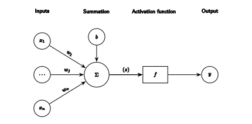
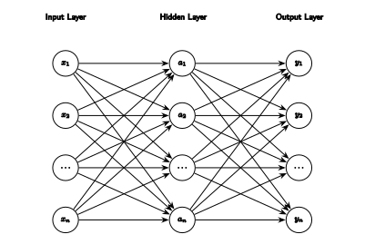
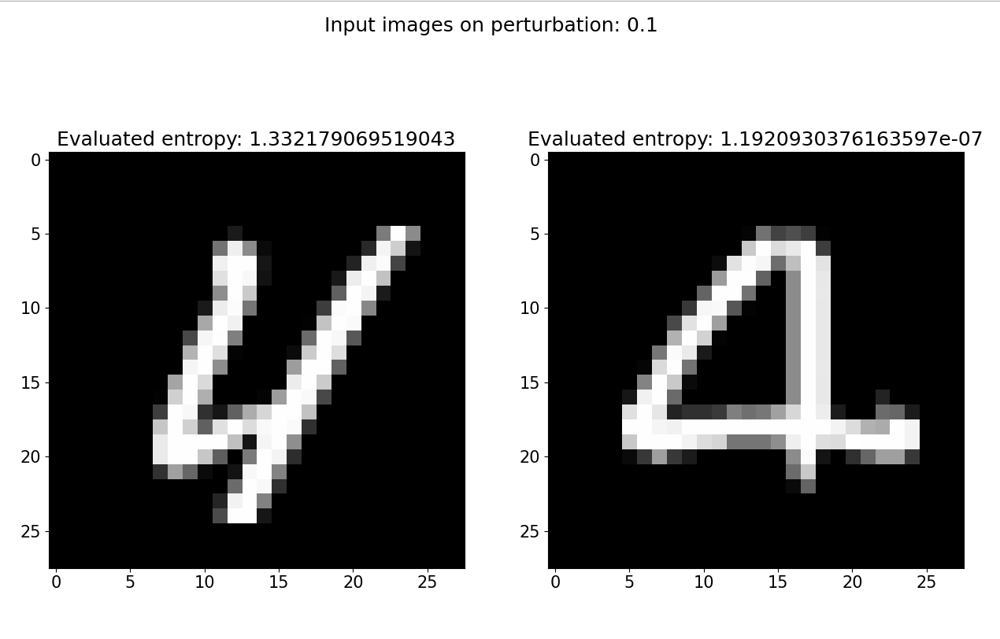

# Introduction
I finally finished my undergrad and would like to make a blog post about what I have been working on these past ~6 months.

The title of our thesis is:
> ClaudesLens: Uncertainty Quantification in Computer Vision Models

Which you can read [here.](https://arxiv.org/abs/2406.13008)

However, before I dive into the project and what we did, let me tell you what we *wanted* to do.

### BayesLens
Originally, we wanted to create "Uncertainty-Aware Attention Mechanisms".
What we specifically had in mind was to create a transformer model that used Bayesian Neural Networks (BNNs) @cite:neal1996bayesian.
Even more ambitiously, apply this to self-driving cars.

Needless to say, this was a bit too ambitious for a BSc thesis, we didn't have the prerequisite knowledge or the compute to do such a task within that time frame.
So we had to scale down our project a bit.

About ~1/3 into the project, our supervisor wanted us to explore the *entropy* of predictions, and we got promising results right from the start.

This was the start of **ClaudesLens**.

### ClaudesLens
From the results of using entropy as a measure of uncertainty &mdash; which in itself is nothing new &mdash; we decided to explore this further.

I will explain what we did and the framework we proposed.

Let us start with what lies at the heart of this project: **neural networks**.

# Neural Networks
There are many ways to explain neural networks, in this post I will use a mathematical approach which will let us view the entire network as a single function.

### The Neuron
At the core of a neural network lies the neuron, which is inspired by the biological neuron @cite:rosenblatt1958perceptron.

Each neuron takes in one or more scalars $x_j$ as input and outputs a single scalar $y$.
Each input $x_j$ is scaled by an associated weight denoted as $w_j$. The neuron also has a special input called the bias,
$b$.

The neuron has two stages it goes through, **summation** and **activation**, visualized in @fig:neuron.

The summation stage is where the neuron calculates the **weighted sum** of the inputs and the bias:
$$
z = \sum_{j=1}^{n} w_j x_j + b
$$

The activation function, denoted as $f$, calculates the neuron’s output $y = f(z)$ based on the weighted summation.

Activation functions introduce **non-linearity**, enabling neural networks to approximate complex, non-linear functions.

::::exercise[Why does the neuron have a bias input?]
:::answer
The bias input allows the neuron to shift the activation function to the left or right, this can be useful in certain cases.
:::
::::

### The Network
Let's write the equation for a single neuron in a more compact form.

We can represent the inputs of a neuron as a vector,
$$
\mathbf{x} = \left[x_1, x_2, \ldots, x_n\right],
$$

where each element corresponds to an input to the neuron.

Similarly, we can represent the associated weights as a vector,
$$
\mathbf{w} = \left[w_1, w_2, \ldots, w_n\right],
$$

with this the summation can be simplified to a dot product,
$$
z = \mathbf{w} \cdot \mathbf{x} + b.
$$

One neuron will only get us so far. By using **multiple neurons** and loosely **mimicking the structure of the brain**, we obtain something more powerful.

A *layer* is a collection of neurons, **stacked on top of each other**.
When we refer to a layer here, we mean a *fully connected layer*, in which every neuron is connected to all neurons in the previous layer.

In the case of a network, we can now talk about the input layer and the output layer.

As we see in @fig:nn, we now have multiple neurons with numerous inter-neuron connections, along with multiple outputs.

The matrix-vector equation,
$$
\mathbf{a} = \mathbf{W_1} \mathbf{x} + \mathbf{b_1} = [a_1, a_2, \ldots, a_m],
$$

yields each output of each neuron in the *hidden layer* (intermediate layers between the input and output layers).

**Note:** I am **explicitly omitting** the required transpose operations from these equations. In practice, the matrix and vector dimensions must agree, but the theory and intuition below are unchanged.

$\mathbf{W_1}$ is the *weight matrix* with rows $\mathbf{w_i} = [w_{i, 1}, w_{i, 2}, \ldots, w_{i, n}]$ corresponding to the weights of the $i$-th neuron in the hidden layer.

The bias values are represented by $\mathbf{b_1} = [b_1, b_2, \ldots, b_m]$.

In the case of several layers, we work with multiple weight matrices and bias vectors, which we index as $\mathbf{W_j}$ and $\mathbf{b_j}$, respectively.

So, given an input $\mathbf{x}$, the output of the hidden layer (i.e., @fig:nn) is given by,
$$
\mathbf{a} = f.(\mathbf{W_1} \mathbf{x} + \mathbf{b_1}),
$$

where the dot indicates that the activation function $f$ is applied element-wise.

So the final output is therefore,

$$
\begin{align*}
\mathbf{y} & = f.(\mathbf{W_2} \mathbf{a} + \mathbf{b_2}) \newline
& = f.(\mathbf{W_2} f.(\mathbf{W_1} \mathbf{x} + \mathbf{b_1}) + \mathbf{b_2}).
\end{align*}
$$

::::exercise[Is it necessary to apply the same activation function to all layers in a neural network?]
:::answer
No, it is not necessary to apply the same activation function to all layers.
Different activation functions can be used in different layers, depending on the problem at hand.
:::
::::

This is the basic structure of a neural network, I will not go into more detail about the *training process*, but I will mention that these weights and biases are *learned* (from the data) through an optimization process called *backpropagation* @cite:rumelhart1986learning.

There are a ton of resources to understand these concepts, even we tried to explain these concepts in our thesis.
I highly encourage you to read about it, it is one of the most important concepts of modern deep learning [^4].

# Computer Vision
Now that we have a basic understanding of neural networks, we can move on to computer vision.

Computer vision is a field of computer science that focuses on **replicating** parts of the complexity of the **human vision system** and enabling computers to **identify and process objects in images and videos** in the same way that humans do.

The most important thing that we will cover here is how we represent images numerically, so we can feed them into as input to neural networks.

### Images

The RGB channel illustration is from Wikimedia Commons [^rgb-channels].

Images are represented as a grid of pixels, where each pixel needs to be represented in a numerical way.

For most images, we represent each pixel as a 3-dimensional vector, where each element corresponds to the intensity of the color channels red, green, and blue (RGB). This is called a *channel*.

So, a single pixel in an image is represented as a vector, therefore a whole image can be represented as a 3-dimensional **tensor**.
We will just think of a tensor as a **matrix of matrices**, as long as the input has the numerical properties for matrix and vector operations.

# Entropy
Now that we have covered the basics of neural networks and computer vision (in our use case that is), we can move on to the main topic of this thesis, **entropy**.

### Uncertainty in Information Theory
Now, when we are talking about entropy, we are talking about the **information kind** of entropy.
Thanks to the great work of Claude Shannon, we have a way to quantify the *uncertainty* of a random variable @cite:shannon1948mathematical.

The entropy of a random variable $X$ is defined as,
$$
H(X) = -\sum_{x \in \chi} p(x) \log p(x),
$$
where $p(x) = P(X = x)$.

If I were to explain Shannon-Entropy in an intuitive way.

Imagine if we have no uncertainty or very little, i.e., imagine an unfair coin with 99% probability of landing on heads. You **won't be surprised** if it lands on heads.

However, if we have a fair coin, if I flip it 100 times and 99 of them are heads, you would be **very surprised**.

This is what Shannon-Entropy captures, how *surprised* you are about the outcome of a random variable.

There is a more elegant way it is presented (and especially used!) in classical information theory. But I will leave that for yourself to read and discover :).

:::::exercise[Does Shannon-Entropy have a lower and upper bound?]
::::answer
Yes, the lower bound of entropy is 0 and the upper bound is $\log |\chi|$.
Where $|\chi|$ is the cardinality or the number of elements in the set $\chi$.
:::solution[Proof]
$$
\begin{align*}
& \textbf{We want to show } 0 \leq H(X) \leq \log |\chi|. \newline
& \textbf{Lower Bound (}H(X) \ge 0\textbf): \newline
& \quad H(X) = -\sum_{x \in \chi} p(x)\,\log p(x). \newline
& \quad \text{Note that for any } 0 < p(x) \le 1,\, -\log p(x) \ge 0,\text{ hence each term } p(x)\,\bigl(-\log p(x)\bigr) \ge 0. \newline
& \quad \text{Thus } H(X) \;=\; -\sum_{x \in \chi} p(x)\,\log p(x) \;\ge\; 0. \newline
& \textbf{Upper Bound (}H(X) \le \log |\chi|\textbf): \newline
& \quad \text{Using the concavity of the } \log \text{ function and by Jensen's inequality, we have} \newline
& \quad -\sum_{x \in \chi} p(x)\,\log p(x) \;\le\; \log\Bigl(\lvert \chi \rvert \Bigr). \newline \newline
& \quad \text{Alternatively, we can argue that for fixed } \lvert \chi \rvert, \newline
& \quad \text{the uniform distribution } p(x) = \frac{1}{|\chi|} \text{ maximizes the entropy,} \newline
& \quad \text{yielding } H(X) = -\sum_{x \in \chi} \frac{1}{|\chi|}\,\log \Bigl(\tfrac{1}{|\chi|}\Bigr) = \log\Bigl(\lvert \chi \rvert\Bigr). \newline \newline
& \quad \text{Note, one could also solve this using Lagrange multipliers to find this maximum.} \newline \newline
& \text{Hence, combining both bounds, we have } 0 \le H(X) \le \log |\chi|. \newline
\end{align*}
$$
:::
::::
:::::

# Entropy-based Uncertainty Quantification Framework
From what we have seen, we can view a neural network as a **function**.

In our case &mdash; since we're dealing with classification &mdash; our function spits out a **probability vector** where each element corresponds to the probability of the input belonging to a specific class (refer back to @fig:nn if you think this is unclear).

Therefore, the best prediction is,
$$
\hat{y} = \arg\max(\mathcal{F}(\mathbf{x}, \mathbf{W})),
$$

where the $\arg\max$ function returns the **index** of the **maximum element** in the vector.

$\mathcal{F}$ is our neural network that takes the inputs $\mathbf{x}$ (image) and $\mathbf{W}$ (**final learned** weights).

But this is deterministic, there is no uncertainty (no surprise), given the same input we will **always** get the same output.

So, let us introduce some uncertainty, let's make our network **stochastic**.

To make the network stochastic, we need to introduce some **randomness somewhere** in the network.

I want to emphasize that you can do this in a lot of different ways and "inject" the randomness at different stages in a neural network.
We chose the most straightforward and primitive ways, **adding random noise to the input image or all weights**.

So, the **perturbed weight matrix** is given by,

$$
\mathbf{W}_{\sigma} = \mathbf{W} + \sigma \mathbf{N},
$$

where $N \sim \mathcal{N}(0, 1)$ is a matrix &mdash; with the same shape of $\mathbf{W}$ &mdash; of random numbers drawn from a normal distribution.
$\sigma$ is a hyperparameter scalar that weights the amount of noise added to the weights.

Now, the output becomes stochastic,

$$
\hat{y_{\sigma}} = \arg\max(\mathcal{F}(\mathbf{x}; \mathbf{W}_{\sigma})),
$$

note the difference from our original equation, we no longer treat $\mathbf{W}$ as an input, but rather a parameter of the function $\mathcal{F}$.

By perturbing the weights and creating a single prediction **constitues a random experiment**.
It is therefore meaningful to examine the **probability distribution** of the random variable $\mathcal{F}(\mathbf{x}; \mathbf{W}_{\sigma})$ for a fixed input.

By repeating the experiment for a fixed input $\mathbf{x}$ and creating samples of $\mathcal{F}(\mathbf{x}; \mathbf{W_{\sigma}})$ but drawing different samples of $\mathbf{W_{\sigma}}^{(i)}, i = 1, \ldots, N$ we can empirically calculate the **entropy** $H_{\sigma}(\mathbf{x})$ **entropy distribution**.

With this framework, we want to search for the **underlying distribution of the model** and the **properties of the distribution**.

::::exercise[What is the difference between the entropy of the model and the entropy of the prediction?]
:::answer
The entropy of the model is the entropy of **multiple predictions** given the same fixed input $\mathbf{x}$, whereas the entropy of the prediction is the **entropy of the probability vector** for a **single prediction**.
:::
::::

::::exercise[Is there a difference if you add noise to the input image instead of the weights?]
:::answer
Yes and no.

Adding noise to the input image will perturb the image itself, which is different from perturbing the weights.
However, conceptually, the idea is the same.

We can view the noise to the input image as corresponding weights in the first layer of the network.
Meaning that the first layer of the network is now stochastic, instead of all the weights in the network.
:::
::::

### Proposed Metrics
With this entropy-based uncertainty quantification framework, we propose two metrics to quantify the uncertainty of a neural network model.

#### PI: Perturbation Index
In image classification &mdash; one of the most common and fundamental tasks in computer vision &mdash; **accuracy** is a common metric to evaluate the performance of a model.

Accuracy is defined as,

$$
\text{Acc}(f) = \frac{1}{N} \sum_{i=1}^{N} \mathbb{I}[y^{(i)} = f(\mathbf{x}^{(i)})],
$$

where $y^{(i)}$ is the true label of the $i$-th image, $f(\mathbf{x}^{(i)})$ is the predicted label of the $i$-th image and $\mathbb{I}[\cdot]$ is the indicator function defined as,

$$
\mathbb{I}[A] = \begin{cases}
1 & \text{if } A \text{ is true}, \newline
0 & \text{otherwise}.
\end{cases}
$$

Simply, accuracy is the **fraction of correct predictions** over the total number of predictions.

It is therefore natural to imagine that **perturbing the weights** of a model **will affect the accuracy** of the model.
However, a **robust** model should be able to handle these (small) perturbations and **still perform well**.
This is the idea behind the Perturbation Index (PI).

The Perturbation Index (PI) is therefore defined as,

$$
\pi_{\sigma} = \text{Acc}(\mathcal{F}(\mathbf{x}; \mathbf{W}_{\sigma})) - \text{Acc}(\mathcal{F}(\mathbf{x}, \mathbf{W})).
$$

$\pi_{\sigma}$ is the difference in accuracy between the perturbed and the original model.

::::exercise[Should you calculate the PI for a single image, a batch of images, or the entire dataset?]
:::answer
The most meaningful way to calculate the PI is to calculate it for the entire dataset.
You can of course calculate it for a single image or a batch of images, but the most meaningful interpretation is when you calculate it for the entire dataset.
:::
::::

#### PSI: Perturbation Stability Index
But PI doesn't tell us anything about the *inherent uncertainty* of the model.

As we discussed, we can empirically calculate the entropy, in mathematical terms,

$$
H_{\sigma}(\mathbf{x}) = \lim_{n \to \infty} - \sum_{c \in \mathcal{C}} p_c^{(n)} \log p_c^{(n)},
$$

where $p_c^{(n)}$ is the proportion of predictions $\hat{y_{\sigma}}$ equal to the class index $c$ out of all $C$ classes in the $n$ samples of $\hat{y}_{\sigma}$ for a given input $\mathbf{x}$.

If the model generates varying predictions under perturbation, this might suggest uncertainty in the classification.
In simpler terms, there **should be a negative correlation** between **prediction stability** and the **Shannon-Entropy** of the model.

$$
\psi_{\sigma} = \text{Acc}(\mathcal{F}(\mathbf{x}; \mathbf{W_{\sigma}})) - \text{Corr}(\mathbb{I}[\hat{y_{\sigma}} = Y], H_{\sigma}(\mathbf{x})).
$$

Now, this might look confusing at a first glance, but let me break it down.

Across the dataset, do samples with **higher entropy** also have **more errors**?
We hypothesize that this should be the case, this is why we calculate the sample-level (over our $N$ samples/random draws) correlation between them.

Note, that by doing this, we,

* Penalizes the model if higher entropy &rarr; more correct predictions.
* Penalizes the model **less** if higher entropy &rarr; more errors.

Essentially, if the model **"knows when it is uncertain"** (this is very handwavey), it gets a higher PSI.

We also include the accuracy in the calculation, as we want to penalize the model if it is affected by the perturbation.

### Mapping entropy categorically
A very important part of this framework is that the input $\mathbf{x}$ is **fixed**.
Do images (given same perturbation level) with the **same entropy** yield similar predictions?

$$
p_{\sigma} = P(\hat{y_{\sigma}} = Y | H_{\sigma}(\mathbf{x}) = h), \quad \text{ where } h = H(\mathbf{x}).
$$

The function mapping $\mathbf{x} \mapsto h$ can be understood as the probability of making a correct prediction within all draws from the data, which have **the same entropy as $\mathbf{x}$**.
This means we can **categorize images based on their entropy** and gain insight into the model's predictions without seeing the ground truth label.

# Results
Now, during the majority of the project and the results section in our report, we adopted our framework to three different models to investigate **whether our hypothesis held**.

**In short, yes**, so I won't bore you with those results and graphs.
I instead want to focus on the *potential* applications.

Near the end of our thesis, our supervisor wanted us to check the different entropies of the images in our dataset (MNIST in our case).
From our framework, the **higher entropy** digits should have **higher classification errors**, on average.

So we tested this!

From @fig:entropy-extremes, we can see that, if that specific model is presented with a digit four that resemble the one on the right (lowest entropy) **will most likely be classified correctly**.
Compared to the four on the left (highest entropy), which **will most likely be classified incorrectly**.

**Note**, we are talking about the **inherent uncertainty of the model** here, not the entropy of the input itself.
This just means that this specific models **prefers** digit fours that have the characteristics of the one on the right, to the one on the left.

::::exercise[Why do you think the model prefers the digit four on the right?]
:::answer
While there is no right answer (i.e., we haven't proved this), we hypothesize two things.
1. There are more digit fours that resemble the one on the right in the dataset.
2. The right digit four has a more unique shape (i.e., characteristic crossover lines for drawing a four), which the model has learned to classify and indicate fours.
:::
::::

# Conclusion
I hope you've understood this framework of quantifying uncertainty in neural networks and enjoyed this post :).

I've started to see a lot more people talk about uncertainty quantification [^6] this year.
Which makes me happy, it is an interesting field with a lot of potential applications.

My closing statement is that, don't forget that statistics is an exact science making sense of an uncertain and inexact world [^7].

# Acknowledgements
I want to thank my supervisor, my group members, and the people that proofread this blog post.

[^4]: [Andrej Karpathy, "Yes you should understand backprop."](https://karpathy.medium.com/yes-you-should-understand-backprop-e2f06eab496b)
[^6]: [Entropix](https://github.com/xjdr-alt/entropix)
[^7]: [Original Tweet](https://x.com/MoritzSchauer/status/1778091483226128700)
[^rgb-channels]: [RGB channels separation](https://commons.wikimedia.org/wiki/File:RGB_channels_separation.png), Wikimedia Commons.
